# OLEDA

 Exploratory Data Analysis with python.
 
- Automatic report generation from a pandas DataFrame.
- Datasets comparision.
- Insights from data.


Installation
------------------
to install oleda:
```bash
 sudo python3 setup.py install
```
Examples/Usage
--------

1. to explore single dataset and create report just type:
```python
import oleda
oleda.report(df)
```
report contains:
- missing values statistics
- information on each feature relevant for the feature type
- pearson correlation heatmap
- [Cramers V staticstics](https://stackoverflow.com/a/46498792/5863503)
- pair plot for most correlated features
- if dataframe index is valid datetime index, time series plots are added to the report

see  [Titanic dataset report example](README_files/Titanic_report.md)

2. dataset can be tested against an target variable (binary (0,1) or continues):  

```python
oleda.report(df,target,ignore=[],nbrmax=20)
```
in this case plots that show correlation with targed are added for each feature
features are sorterted according to their impotantce by [shap](https://github.com/slundberg/shap)
nbrmax number of most important features selected by shap to be explored
features need to be ignored can be added in ignore list 

see  [Titanic dataset report example with 'Survived' target](README_files/Titanic_report_tg.md)

3. two datasets can be compared:
```python   
oleda.pairwise_report(df1,df2,ignore=[],nbrmax=20)
```

first oleda find by shap most significant features that distinguish these datasets
then prints their statistics side by side to show the difference

see  [Titanic dataset pairwise report example](README_files/Titanic_report_pairwise.md)


All examples can be found in [jupiter notebook ](https://github.com/Banuba/oleda/blob/1ea82833d355a1cd45f52ea9376973600488629e/example/Titanic-oleda.ipynb)


plots description:

1. number and persent of missed values per feature:

<h2 align="center">Missed values</h2>
      
              Missing Values  % of Total Values
    Cabin                687               77.1
    Age                  177               19.9
    Embarked               2                0.2

2. plots for categorical features:
- histogram , representation of the distribution of feature
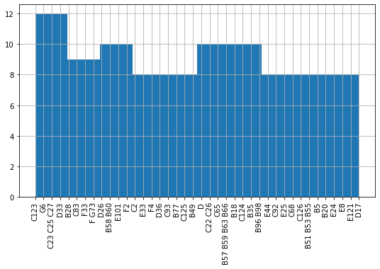
- pair plot of 10 most correlated features, which significantly varies ( ANOVA ) on values of this categorecal feature, colored according to features values:
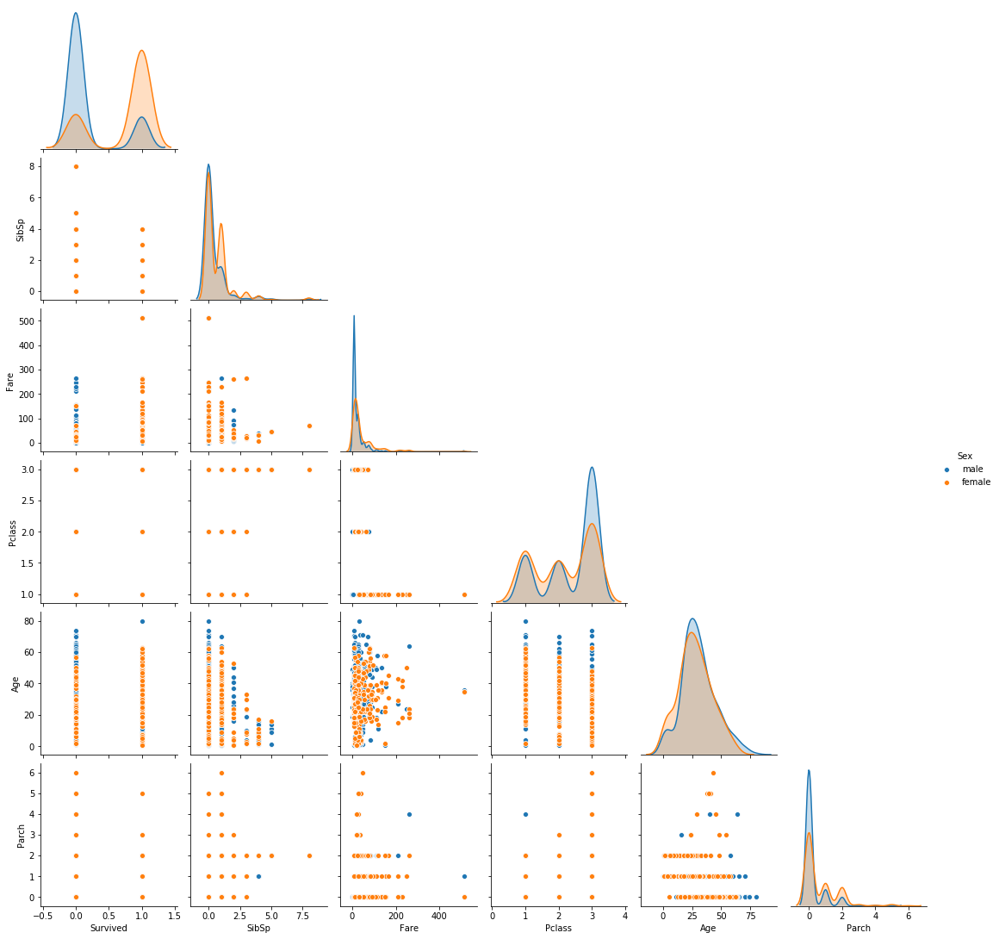
- if target feature is set (for example 'Survived' ) then barplot with target mean on feature values is displayed side by side with feature histogram

etc

3. plots for numerical features:
- distribution plot and box plot are displayed:
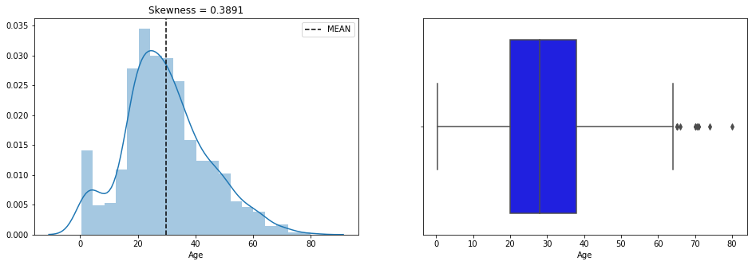
- if target feature is set , scatter plot and violine (if target is binary ) or catplot are added (depends on target type):

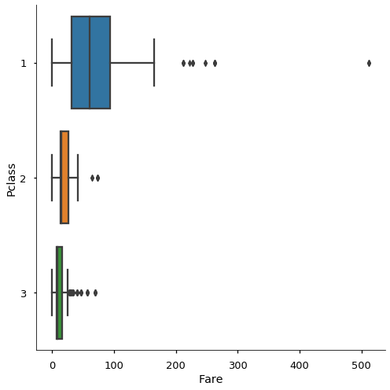
- variables also are splited on bins based on quantiles and plotted against target:
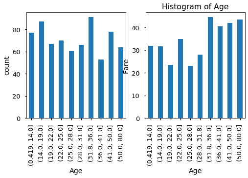

 
4. feature correllation heatmap


5. Cramers V staticstics


to compare survived not survived subsets of Titanic dataset one can run:

```python   
oleda.pairwise_report(df[df['Survived']==0],df[df['Survived']==1],ignore=['Survived'])
```
result will contain plots like:
- [shap importance information](https://github.com/slundberg/shap)


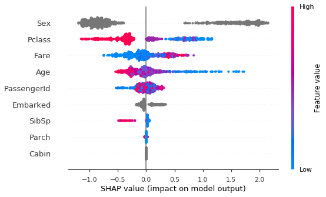
- features plots from both dasets side by side:
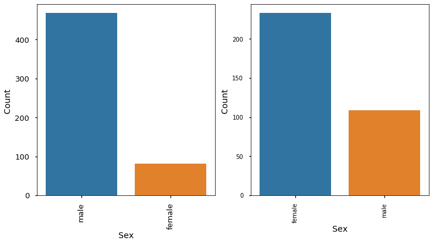

and more...

to create 2nd order interactions plots:
```python 
eda.interactions2x(df,maxnbr=6)
```
oleda will check categorical varibles and binned numerical against the numerical varibles by ANOVA
and in case if diffrence in means is significant, display plots and Tukey's HSD (honestly significant difference) test results

<h3 align="center">Ticket - Parch</h3>

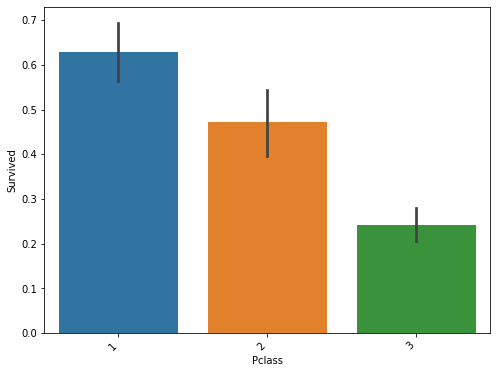


    turkeyHSD
              group2  meandiff   p-adj   lower   upper  reject
    group1                                                    
    1601      347082    2.8571  0.0010  1.2786  4.4356    True
    1601    CA. 2343    2.0000  0.0095  0.4215  3.5785    True
    1601     3101295    1.6667  0.0459  0.0237  3.3096    True
    
    
and pairplots of 10 most correlated features colored by maxnbr most common categorical varible values
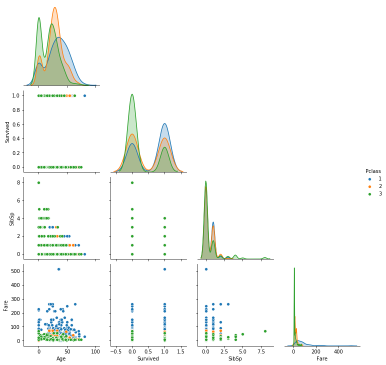

maxnbr - max feature values to test and plot (affects speed)

to create 3nd order interactions plots:
```python 
oleda.interactions3x(df,maxnbr=6)
```

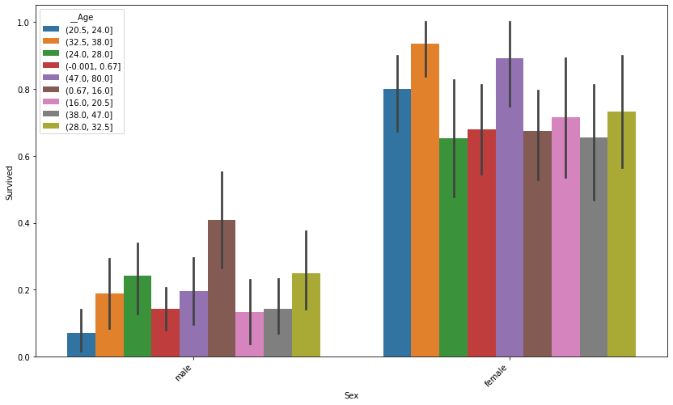

etc

or to check specific features only:

```python 
oleda.interactions3x(df,feature=['Sex','Pclass'],target=['Survived','Age','Fare'],maxnbr=10)
```


         Sex - Pclass
   
      
    relation  3  :  2
    
    
     Survived
    Anova passed


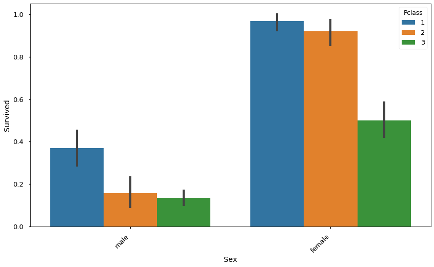


    turkeyHSD
              group2  meandiff  p-adj   lower   upper  reject
    group1                                                   
    male1      male2   -0.2114  0.001 -0.3548 -0.0681    True
    male1      male3   -0.2334  0.001 -0.3476 -0.1192    True
    female3    male2   -0.3426  0.001 -0.4807 -0.2044    True
    female3    male3   -0.3646  0.001 -0.4721 -0.2570    True
    female2  female3   -0.4211  0.001 -0.5749 -0.2672    True
    female1  female3   -0.4681  0.001 -0.6120 -0.3242    True
    female2    male1   -0.5522  0.001 -0.7108 -0.3936    True
    female1    male1   -0.5992  0.001 -0.7482 -0.4503    True
    female2    male2   -0.7636  0.001 -0.9261 -0.6012    True
    female2    male3   -0.7856  0.001 -0.9230 -0.6482    True
    female1    male2   -0.8107  0.001 -0.9638 -0.6576    True
    female1    male3   -0.8326  0.001 -0.9588 -0.7065    True
    
    
     Age
    Anova faled to reject => no difference 
    
    
     Fare
    Anova passed


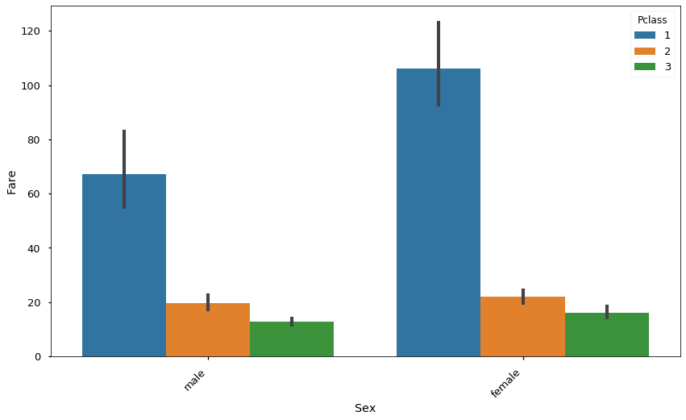


    turkeyHSD
              group2  meandiff  p-adj     lower    upper  reject
    group1                                                      
    female3    male1   51.1073  0.001   37.4329  64.7817    True
    female2    male1   45.2560  0.001   29.0164  61.4956    True
    female1    male1  -38.8997  0.001  -54.1512 -23.6482    True
    male1      male2  -47.4843  0.001  -62.1669 -32.8018    True
    male1      male3  -54.5645  0.001  -66.2614 -42.8676    True
    female1  female2  -84.1557  0.001 -101.2985 -67.0128    True
    female1    male2  -86.3840  0.001 -102.0598 -70.7082    True
    female1  female3  -90.0070  0.001 -104.7427 -75.2712    True
    female1    male3  -93.4642  0.001 -106.3859 -80.5425    True
    ['Survived', 'Fare']

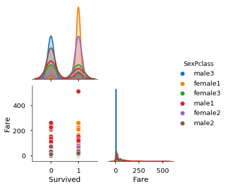

    Sex*Pclass=Survived

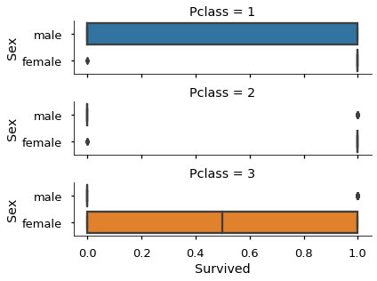

    Sex*Pclass=Fare


