```python
import oleda
import pandas as pd
df=pd.read_csv('titanic.csv')
oleda.eda.interactions2x(df,maxnbr=6)
```

<hr>


    Warning: dataframe contains nan or inf , please fix or drop them to obtain better results. 
    
    
     
    


<hr>


<h3 align="center">cuts__Fare - Survived</h3>


    
      


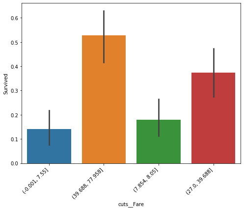


    turkeyHSD
                                group2  meandiff   p-adj   lower   upper  reject
    group1                                                                      
    (-0.001, 7.55]    (39.688, 77.958]    0.3868  0.0010  0.2205  0.5531    True
    (-0.001, 7.55]      (27.0, 39.688]    0.2323  0.0019  0.0670  0.3977    True
    (27.0, 39.688]       (7.854, 8.05]   -0.1944  0.0099 -0.3542 -0.0346    True
    (39.688, 77.958]     (7.854, 8.05]   -0.3488  0.0010 -0.5096 -0.1881    True
    
    
    
     
    


<hr>


<h3 align="center">cuts__Fare - Age</h3>


    
      


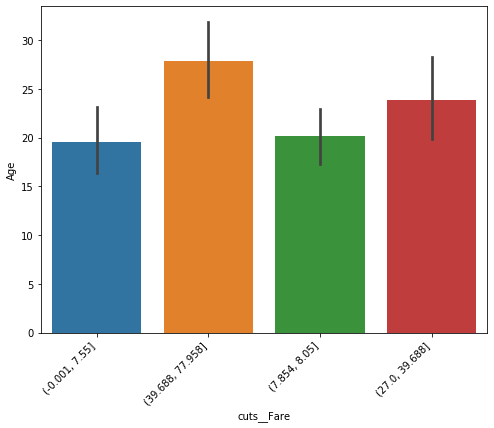


    turkeyHSD
                                group2  meandiff   p-adj    lower    upper  reject
    group1                                                                        
    (-0.001, 7.55]    (39.688, 77.958]    8.2619  0.0109   1.3985  15.1253    True
    (39.688, 77.958]     (7.854, 8.05]   -7.7189  0.0151 -14.3558  -1.0821    True
    
    
    
     
    


<hr>


<h3 align="center">cuts__Fare - SibSp</h3>


    
      


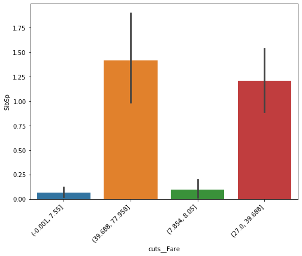


    turkeyHSD
                                group2  meandiff  p-adj   lower   upper  reject
    group1                                                                     
    (-0.001, 7.55]    (39.688, 77.958]    1.3505  0.001  0.8288  1.8722    True
    (-0.001, 7.55]      (27.0, 39.688]    1.1436  0.001  0.6248  1.6623    True
    (27.0, 39.688]       (7.854, 8.05]   -1.1145  0.001 -1.6159 -0.6130    True
    (39.688, 77.958]     (7.854, 8.05]   -1.3214  0.001 -1.8258 -0.8170    True
    
    
    
     
    


<hr>


<h3 align="center">cuts__Fare - Parch</h3>


    
      


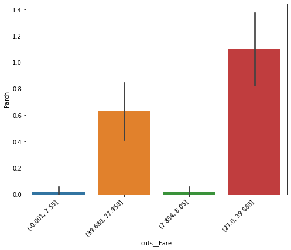


    turkeyHSD
                                group2  meandiff  p-adj   lower   upper  reject
    group1                                                                     
    (-0.001, 7.55]      (27.0, 39.688]    1.0772  0.001  0.7598  1.3945    True
    (-0.001, 7.55]    (39.688, 77.958]    0.6075  0.001  0.2883  0.9266    True
    (27.0, 39.688]    (39.688, 77.958]   -0.4697  0.001 -0.7897 -0.1497    True
    (39.688, 77.958]     (7.854, 8.05]   -0.6103  0.001 -0.9190 -0.3017    True
    (27.0, 39.688]       (7.854, 8.05]   -1.0800  0.001 -1.3868 -0.7732    True
    
    
    
     
    


<hr>


<h3 align="center">cuts__Fare - Pclass</h3>


    
      


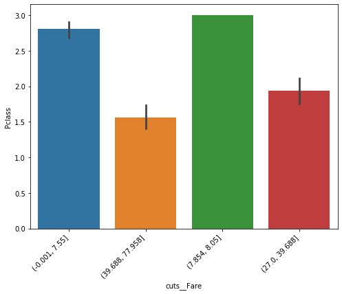


    turkeyHSD
                                group2  meandiff  p-adj   lower   upper  reject
    group1                                                                     
    (39.688, 77.958]     (7.854, 8.05]    1.4382  0.001  1.1971  1.6794    True
    (27.0, 39.688]       (7.854, 8.05]    1.0659  0.001  0.8262  1.3056    True
    (27.0, 39.688]    (39.688, 77.958]   -0.3723  0.001 -0.6223 -0.1222    True
    (-0.001, 7.55]      (27.0, 39.688]   -0.8703  0.001 -1.1183 -0.6223    True
    (-0.001, 7.55]    (39.688, 77.958]   -1.2426  0.001 -1.4919 -0.9932    True
    
    
    cuts__Fare  -  ['Survived', 'Age', 'SibSp', 'Parch', 'Pclass'] 
    
    
    


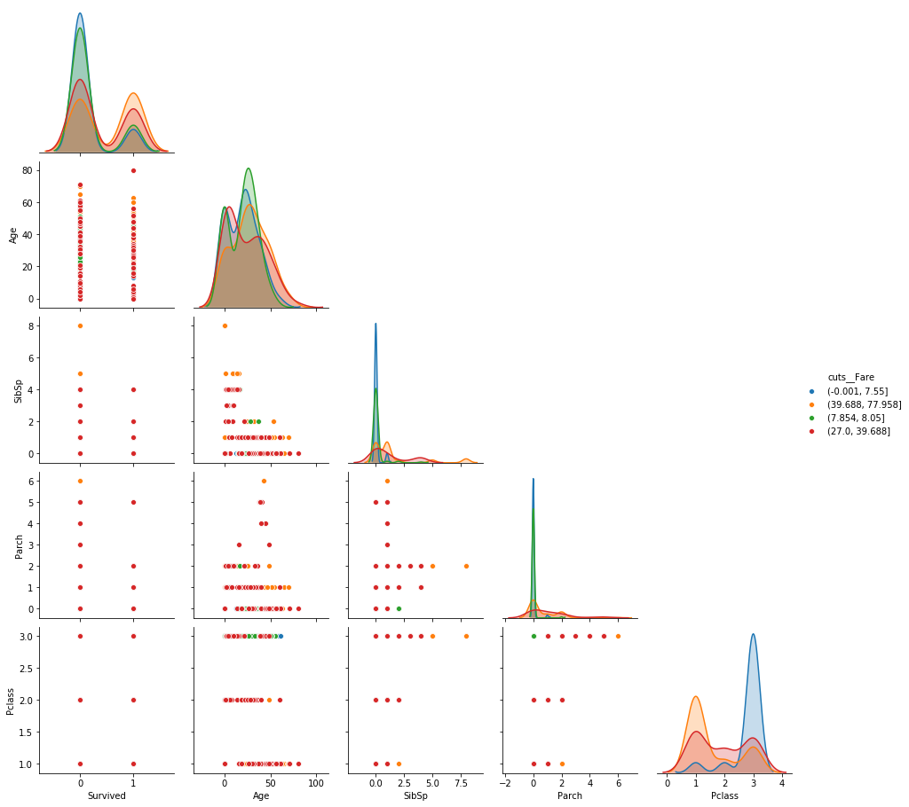


    
     
    


<hr>


<h3 align="center">Survived - Fare</h3>


    
      


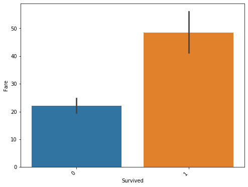


    turkeyHSD
            group2  meandiff  p-adj    lower    upper  reject
    group1                                                   
    0            1   26.2775  0.001  19.7815  32.7735    True
    
    
    
     
    


<hr>


<h3 align="center">Survived - Parch</h3>


    
      


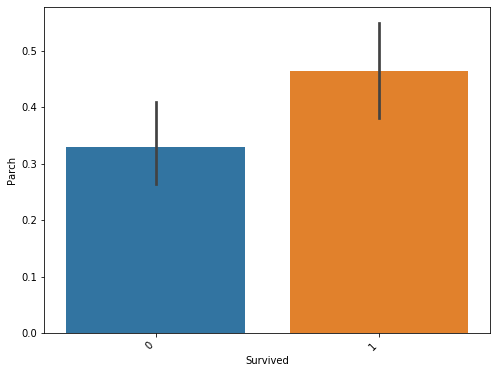


    turkeyHSD
            group2  meandiff   p-adj   lower   upper  reject
    group1                                                  
    0            1    0.1352  0.0148  0.0265  0.2439    True
    
    
    
     
    


<hr>


<h3 align="center">Survived - Pclass</h3>


    
      


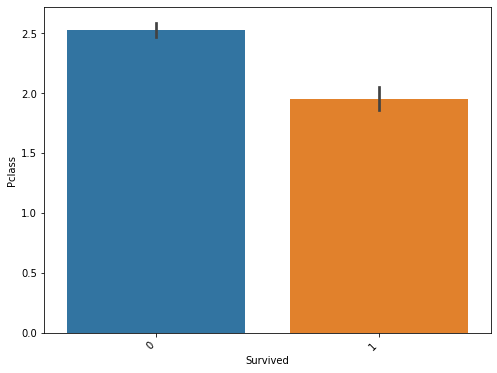


    turkeyHSD
            group2  meandiff  p-adj  lower   upper  reject
    group1                                                
    0            1   -0.5816  0.001 -0.688 -0.4752    True
    
    
    Survived  -  ['Fare', 'Parch', 'Pclass'] 
    
    
    


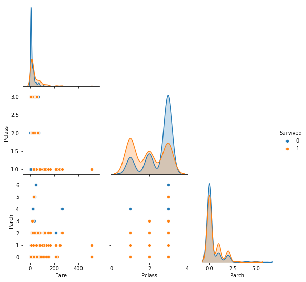


    
     
    


<hr>


<h3 align="center">cuts__Age - Fare</h3>


    
      


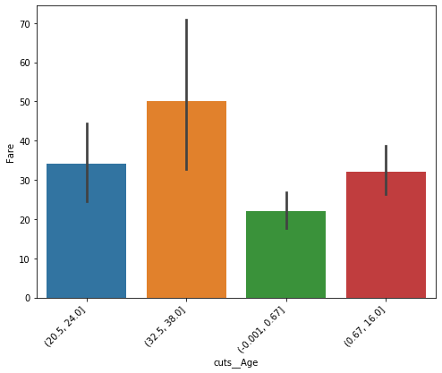


    turkeyHSD
                          group2  meandiff  p-adj  lower    upper  reject
    group1                                                               
    (-0.001, 0.67]  (32.5, 38.0]   28.1329  0.001  9.836  46.4299    True
    
    
    
     
    


<hr>


<h3 align="center">cuts__Age - Survived</h3>


    
      


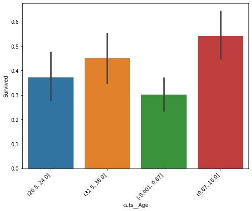


    turkeyHSD
                          group2  meandiff  p-adj   lower   upper  reject
    group1                                                               
    (-0.001, 0.67]  (0.67, 16.0]    0.2391  0.001  0.0829  0.3954    True
    
    
    
     
    


<hr>


<h3 align="center">cuts__Age - SibSp</h3>


    
      


    turkeyHSD
                          group2  meandiff  p-adj   lower   upper  reject
    group1                                                               
    (-0.001, 0.67]  (0.67, 16.0]    1.0276  0.001  0.5966  1.4586    True
    (0.67, 16.0]    (32.5, 38.0]   -1.2211  0.001 -1.7233 -0.7188    True
    (0.67, 16.0]    (20.5, 24.0]   -1.2516  0.001 -1.7429 -0.7604    True
    
    
    
     
    


<hr>


<h3 align="center">cuts__Age - Parch</h3>


    
      


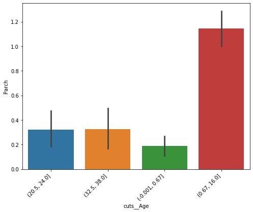


    turkeyHSD
                          group2  meandiff  p-adj   lower   upper  reject
    group1                                                               
    (-0.001, 0.67]  (0.67, 16.0]    0.9529  0.001  0.7316  1.1743    True
    (0.67, 16.0]    (32.5, 38.0]   -0.8170  0.001 -1.0749 -0.5591    True
    (0.67, 16.0]    (20.5, 24.0]   -0.8233  0.001 -1.0755 -0.5710    True
    
    
    
     
    


<hr>


<h3 align="center">cuts__Age - Pclass</h3>


    
      


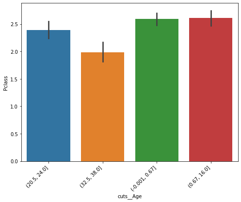


    turkeyHSD
                          group2  meandiff  p-adj   lower   upper  reject
    group1                                                               
    (20.5, 24.0]    (32.5, 38.0]   -0.4030  0.002 -0.6913 -0.1146    True
    (-0.001, 0.67]  (32.5, 38.0]   -0.6090  0.001 -0.8638 -0.3542    True
    (0.67, 16.0]    (32.5, 38.0]   -0.6235  0.001 -0.9111 -0.3358    True
    
    
    cuts__Age  -  ['Fare', 'Survived', 'SibSp', 'Parch', 'Pclass'] 
    
    
    


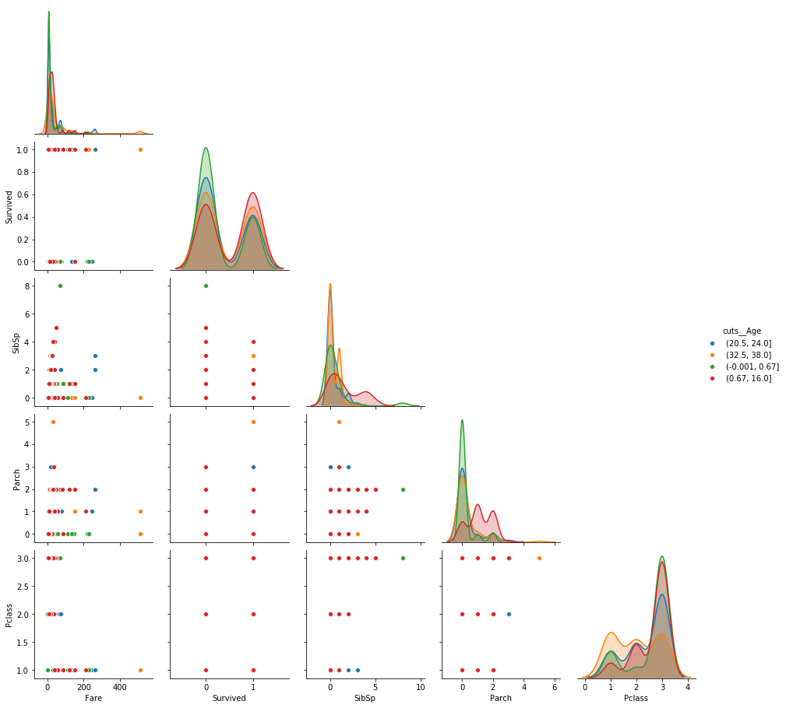


    
     
    


<hr>


<h3 align="center">SibSp - Fare</h3>


    
      


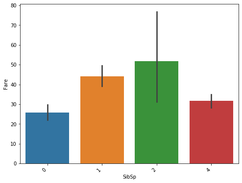


    turkeyHSD
            group2  meandiff   p-adj   lower    upper  reject
    group1                                                   
    0            2   26.0617  0.0251  2.2968  49.8266    True
    0            1   18.4553  0.0010  8.5965  28.3141    True
    
    
    
     
    


<hr>


<h3 align="center">SibSp - Survived</h3>


    
      


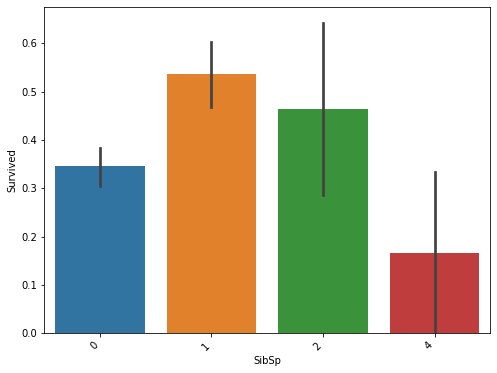


    turkeyHSD
            group2  meandiff  p-adj   lower   upper  reject
    group1                                                 
    0            1    0.1905  0.001  0.0912  0.2898    True
    1            4   -0.3692  0.010 -0.6735 -0.0649    True
    
    
    
     
    


<hr>


<h3 align="center">SibSp - Age</h3>


    
      


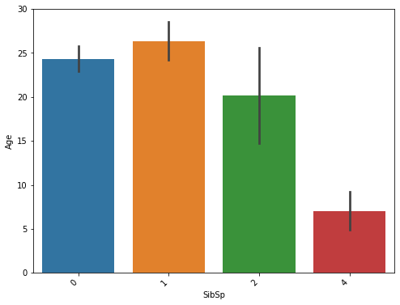


    turkeyHSD
            group2  meandiff  p-adj    lower   upper  reject
    group1                                                  
    0            4  -17.2672  0.001 -27.9523 -6.5822    True
    1            4  -19.2910  0.001 -30.2653 -8.3166    True
    
    
    
     
    


<hr>


<h3 align="center">SibSp - Parch</h3>


    
      


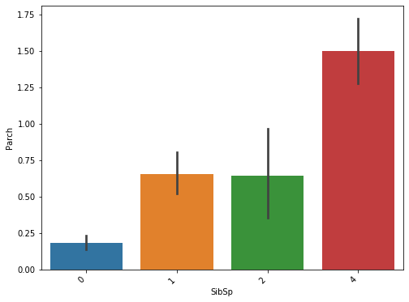


    turkeyHSD
            group2  meandiff   p-adj   lower   upper  reject
    group1                                                  
    0            4    1.3141  0.0010  0.8626  1.7657    True
    2            4    0.8571  0.0010  0.2868  1.4275    True
    1            4    0.8445  0.0010  0.3807  1.3083    True
    0            1    0.4696  0.0010  0.3183  0.6210    True
    0            2    0.4570  0.0072  0.0921  0.8219    True
    
    
    
     
    


<hr>


<h3 align="center">SibSp - Pclass</h3>


    
      


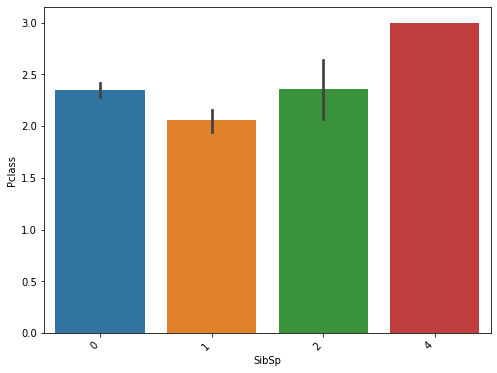


    turkeyHSD
            group2  meandiff   p-adj   lower   upper  reject
    group1                                                  
    1            4    0.9426  0.0010  0.4219  1.4632    True
    0            4    0.6480  0.0057  0.1411  1.1550    True
    2            4    0.6429  0.0487  0.0025  1.2832    True
    0            1   -0.2946  0.0010 -0.4645 -0.1246    True
    
    
    SibSp  -  ['Fare', 'Survived', 'Age', 'Parch', 'Pclass'] 
    
    
    


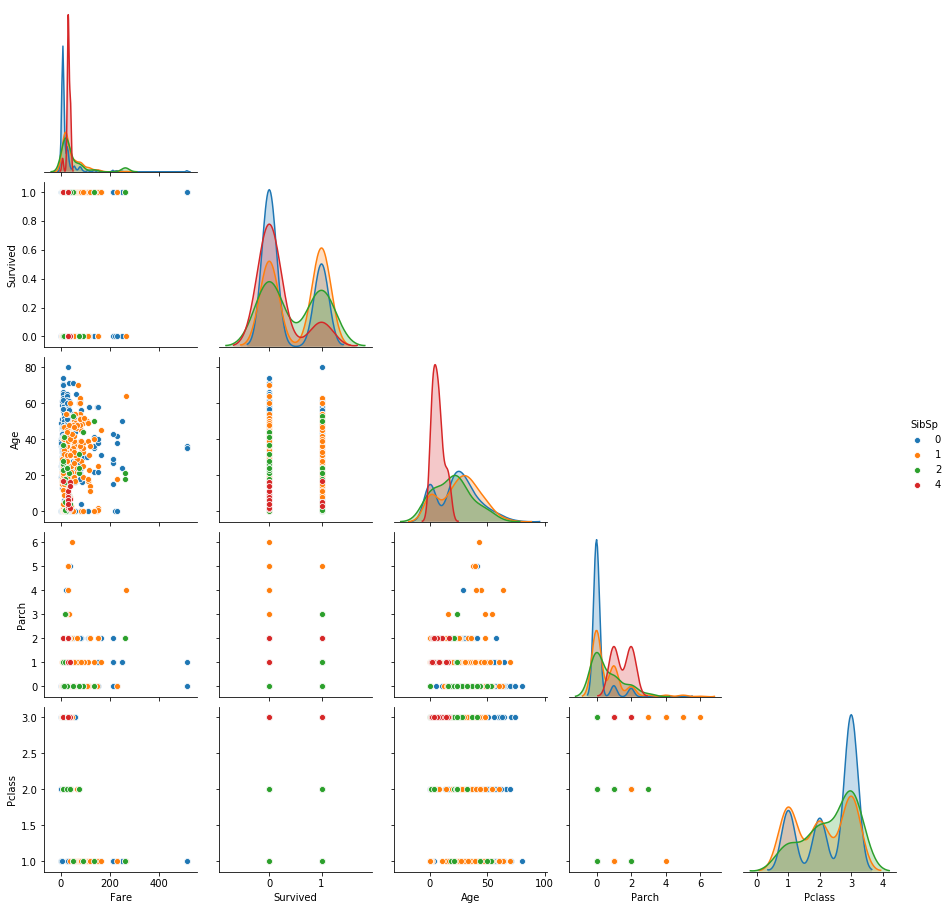


    
     
    


<hr>


<h3 align="center">Ticket - Fare</h3>


    
      


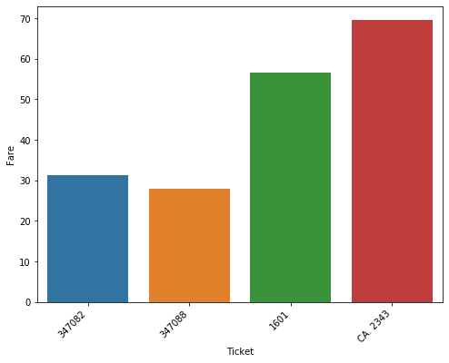


    turkeyHSD
              group2  meandiff  p-adj    lower    upper  reject
    group1                                                     
    347088  CA. 2343   41.6500  0.001  41.6500  41.6500    True
    347082  CA. 2343   38.2750  0.001  38.2750  38.2750    True
    1601    CA. 2343   13.0542  0.001  13.0542  13.0542    True
    347082    347088   -3.3750  0.001  -3.3750  -3.3750    True
    1601      347082  -25.2208  0.001 -25.2208 -25.2208    True
    1601      347088  -28.5958  0.001 -28.5958 -28.5958    True
    
    
    
     
    


<hr>


<h3 align="center">Ticket - Survived</h3>


    
      


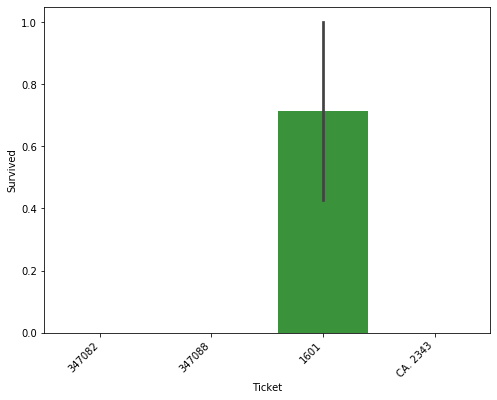


    turkeyHSD
              group2  meandiff  p-adj   lower   upper  reject
    group1                                                   
    1601      347082   -0.7143  0.001 -1.0829 -0.3456    True
    1601      347088   -0.7143  0.001 -1.0980 -0.3306    True
    1601    CA. 2343   -0.7143  0.001 -1.0829 -0.3456    True
    
    
    
     
    


<hr>


<h3 align="center">Ticket - SibSp</h3>


    
      


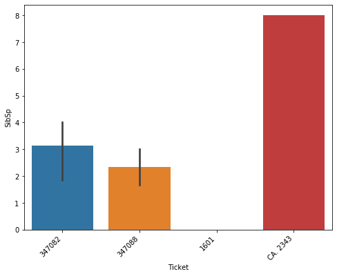


    turkeyHSD
              group2  meandiff  p-adj   lower   upper  reject
    group1                                                   
    1601    CA. 2343    8.0000  0.001  6.6845  9.3155    True
    347088  CA. 2343    5.6667  0.001  4.2974  7.0359    True
    347082  CA. 2343    4.8571  0.001  3.5416  6.1727    True
    1601      347082    3.1429  0.001  1.8273  4.4584    True
    1601      347088    2.3333  0.001  0.9641  3.7026    True
    
    
    
     
    


<hr>


<h3 align="center">Ticket - Parch</h3>


    
      


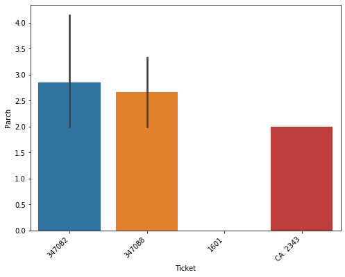


    turkeyHSD
              group2  meandiff   p-adj   lower   upper  reject
    group1                                                    
    1601      347082    2.8571  0.0010  1.5416  4.1727    True
    1601      347088    2.6667  0.0010  1.2974  4.0359    True
    1601    CA. 2343    2.0000  0.0018  0.6845  3.3155    True
    
    
    
     
    


<hr>


<h3 align="center">Ticket - Pclass</h3>


    
      


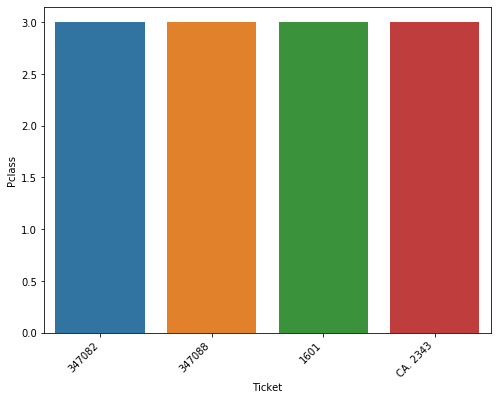


    
    NaN result encountered.
    
    NaN result encountered.
    
    NaN result encountered.
    
    NaN result encountered.
    
    NaN result encountered.
    
    NaN result encountered.
    
    NaN result encountered.
    turkeyHSD
              group2  meandiff   p-adj  lower  upper  reject
    group1                                                  
    1601      347082       0.0  0.5566    0.0    0.0   False
    1601      347088       0.0  0.5566    0.0    0.0   False
    1601    CA. 2343       0.0  0.5566    0.0    0.0   False
    347082    347088       0.0  0.5566    0.0    0.0   False
    347082  CA. 2343       0.0  0.5566    0.0    0.0   False
    347088  CA. 2343       0.0  0.5566    0.0    0.0   False
    
    
    Ticket  -  ['Fare', 'Survived', 'SibSp', 'Parch', 'Pclass'] 
    
    
    


    
     
    


<hr>


<h3 align="center">Embarked - Fare</h3>


    
      


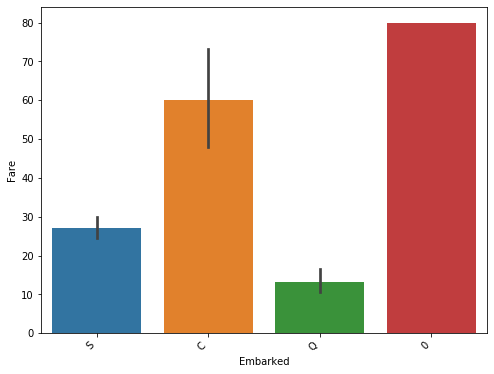


    
     
    


<hr>


<h3 align="center">Embarked - Survived</h3>


    
      


    
     
    


<hr>


<h3 align="center">Embarked - Age</h3>


    
      


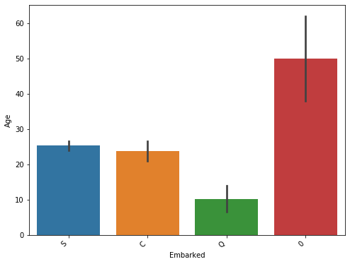


    
     
    


<hr>


<h3 align="center">Embarked - Pclass</h3>


    
      


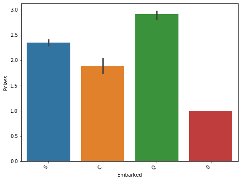


    Embarked  -  ['Fare', 'Survived', 'Age', 'Pclass'] 
    
    
    


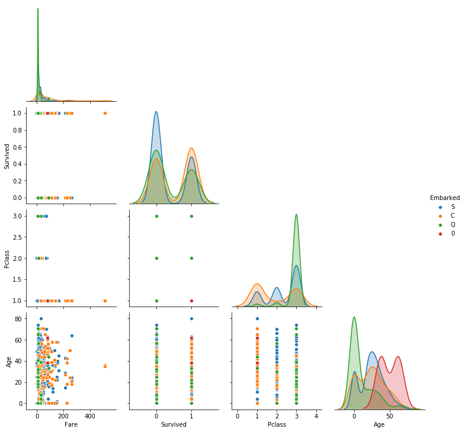


    
     
    


<hr>


<h3 align="center">Parch - Fare</h3>


    
      


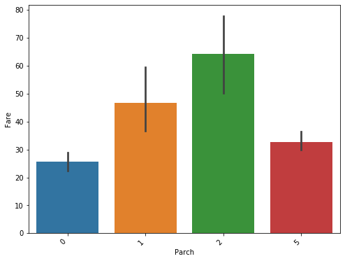


    turkeyHSD
            group2  meandiff  p-adj    lower    upper  reject
    group1                                                   
    0            2   38.7508  0.001  24.1967  53.3049    True
    0            1   21.1914  0.001   8.9110  33.4718    True
    
    
    
     
    


<hr>


<h3 align="center">Parch - Survived</h3>


    
      


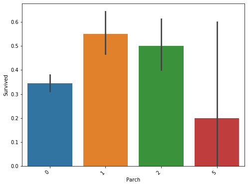


    turkeyHSD
            group2  meandiff  p-adj   lower   upper  reject
    group1                                                 
    0            1    0.2072  0.001  0.0837  0.3307    True
    0            2    0.1563  0.031  0.0100  0.3027    True
    
    
    
     
    


<hr>


<h3 align="center">Parch - Age</h3>


    
      


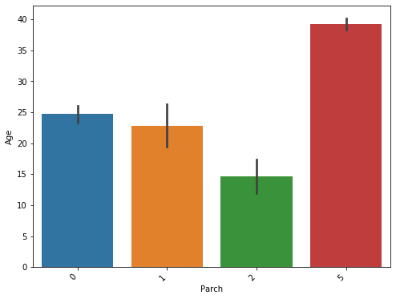


    turkeyHSD
            group2  meandiff   p-adj    lower    upper  reject
    group1                                                    
    2            5   24.5656  0.0115   4.0309  45.1003    True
    1            2   -8.1319  0.0067 -14.5833  -1.6805    True
    0            2  -10.0928  0.0010 -15.3588  -4.8267    True
    
    
    
     
    


<hr>


<h3 align="center">Parch - SibSp</h3>


    
      


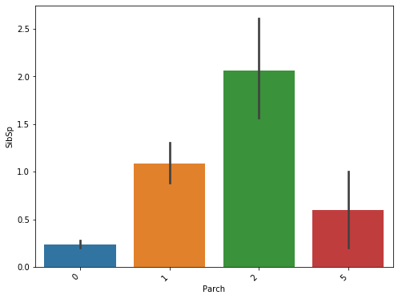


    turkeyHSD
            group2  meandiff  p-adj   lower   upper  reject
    group1                                                 
    0            2    1.8250  0.001  1.5352  2.1149    True
    1            2    0.9778  0.001  0.6226  1.3329    True
    0            1    0.8473  0.001  0.6027  1.0919    True
    2            5   -1.4625  0.005 -2.5928 -0.3322    True
    
    
    Parch  -  ['Fare', 'Survived', 'Age', 'SibSp'] 
    
    
    


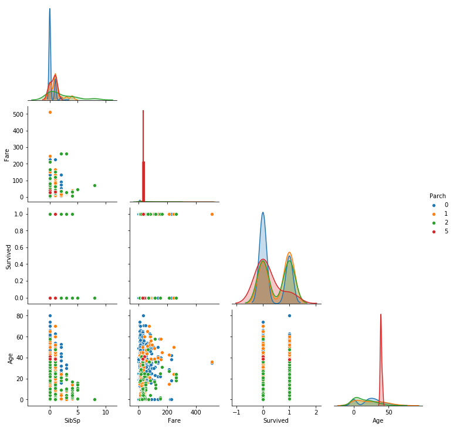


    
     
    


<hr>


<h3 align="center">Cabin - Fare</h3>


    
      


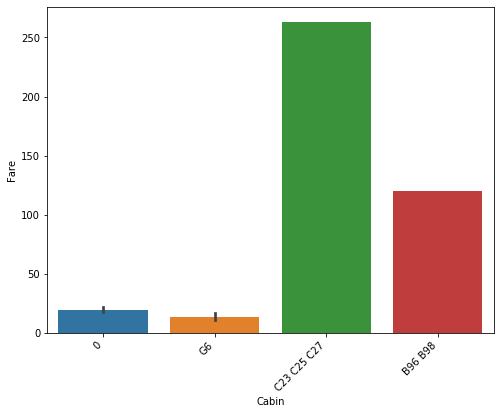


    
     
    


<hr>


<h3 align="center">Cabin - Survived</h3>


    
      


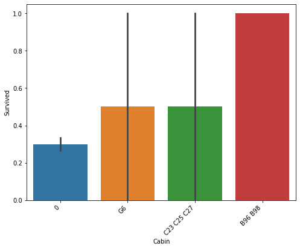


    
     
    


<hr>


<h3 align="center">Cabin - SibSp</h3>


    
      


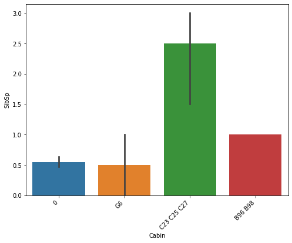


    
     
    


<hr>


<h3 align="center">Cabin - Parch</h3>


    
      


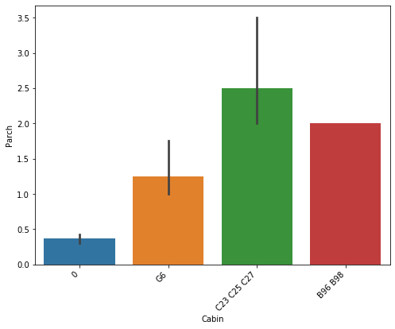


    
     
    


<hr>


<h3 align="center">Cabin - Pclass</h3>


    
      


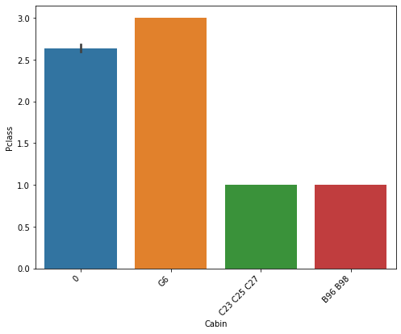


    Cabin  -  ['Fare', 'Survived', 'SibSp', 'Parch', 'Pclass'] 
    
    
    


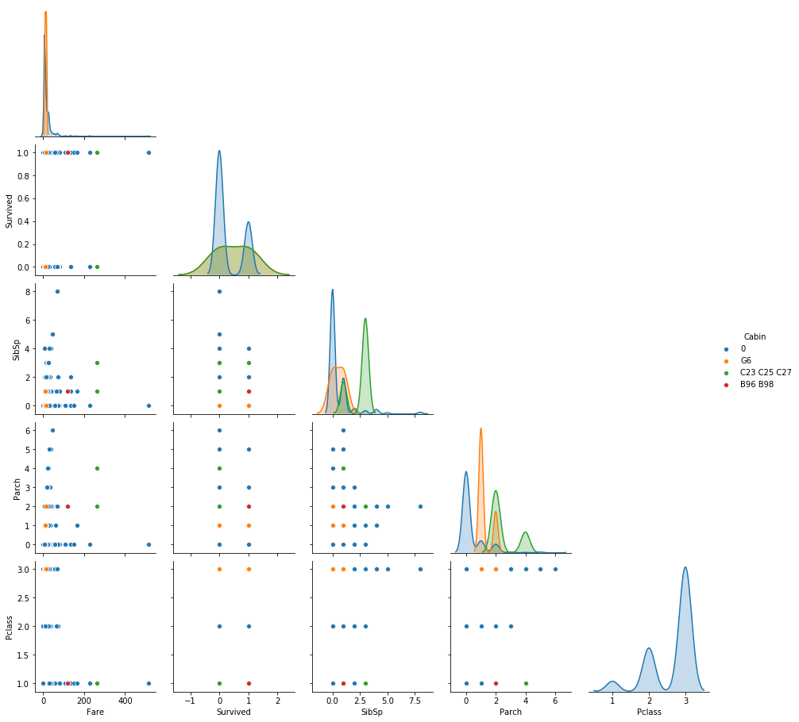


    
     
    


<hr>


<h3 align="center">Sex - Fare</h3>


    
      


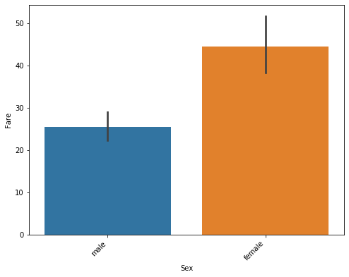


    turkeyHSD
           group2  meandiff  p-adj    lower    upper  reject
    group1                                                  
    female   male  -18.9559  0.001 -25.6846 -12.2273    True
    
    
    
     
    


<hr>


<h3 align="center">Sex - Survived</h3>


    
      


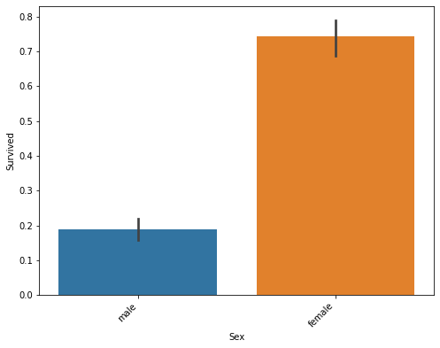


    turkeyHSD
           group2  meandiff  p-adj   lower   upper  reject
    group1                                                
    female   male   -0.5531  0.001 -0.6094 -0.4969    True
    
    
    
     
    


<hr>


<h3 align="center">Sex - SibSp</h3>


    
      


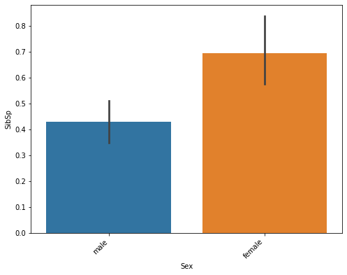


    turkeyHSD
           group2  meandiff  p-adj   lower   upper  reject
    group1                                                
    female   male   -0.2645  0.001 -0.4153 -0.1136    True
    
    
    
     
    


<hr>


<h3 align="center">Sex - Parch</h3>


    
      


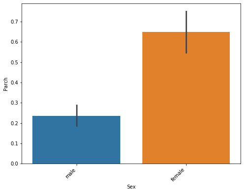


    turkeyHSD
           group2  meandiff  p-adj   lower   upper  reject
    group1                                                
    female   male    -0.414  0.001 -0.5216 -0.3064    True
    
    
    
     
    


<hr>


<h3 align="center">Sex - Pclass</h3>


    
      


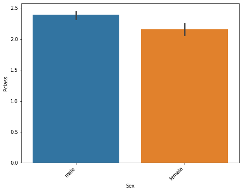


    turkeyHSD
           group2  meandiff  p-adj   lower   upper  reject
    group1                                                
    female   male    0.2307  0.001  0.1166  0.3448    True
    
    
    Sex  -  ['Fare', 'Survived', 'SibSp', 'Parch', 'Pclass'] 
    
    
    


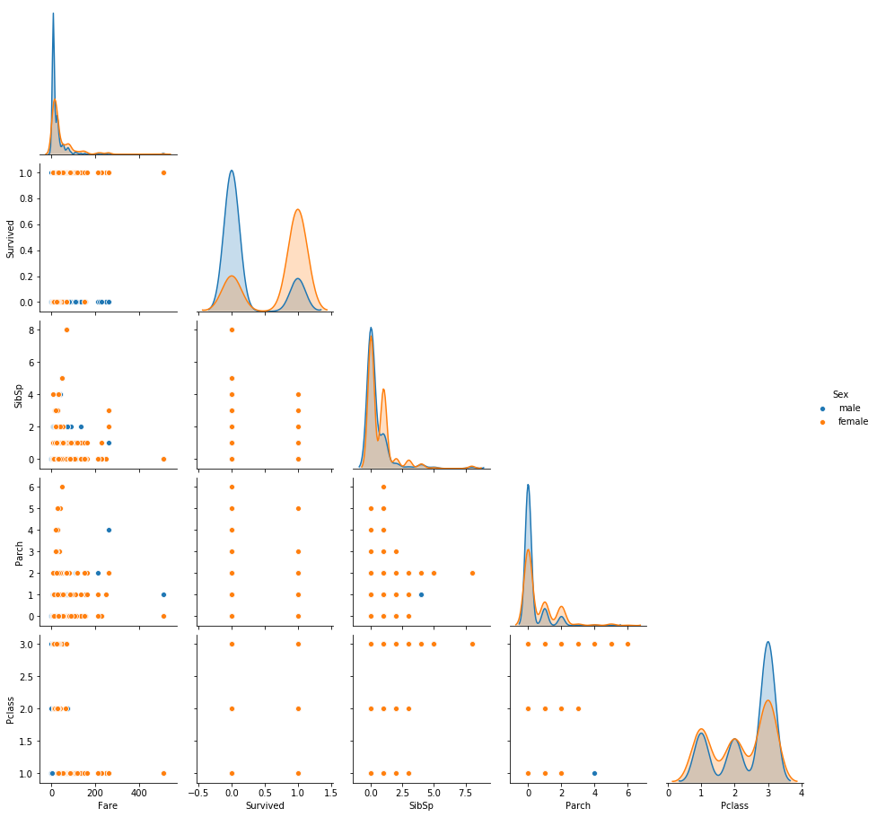


    
     
    


<hr>


<h3 align="center">Pclass - Fare</h3>


    
      


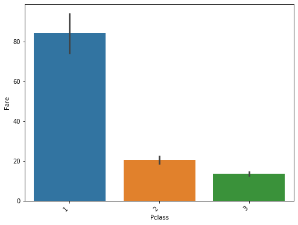


    turkeyHSD
            group2  meandiff  p-adj    lower    upper  reject
    group1                                                   
    1            2  -63.4925  0.001 -72.9167 -54.0683    True
    1            3  -70.4791  0.001 -78.1491 -62.8092    True
    
    
    
     
    


<hr>


<h3 align="center">Pclass - Survived</h3>


    
      


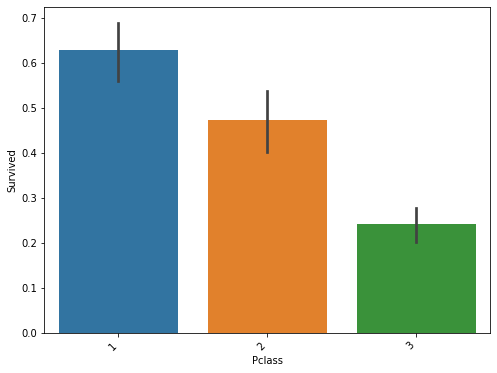


    turkeyHSD
            group2  meandiff   p-adj   lower   upper  reject
    group1                                                  
    1            2   -0.1568  0.0019 -0.2647 -0.0489    True
    2            3   -0.2305  0.0010 -0.3234 -0.1375    True
    1            3   -0.3873  0.0010 -0.4751 -0.2994    True
    
    
    
     
    


<hr>


<h3 align="center">Pclass - Age</h3>


    
      


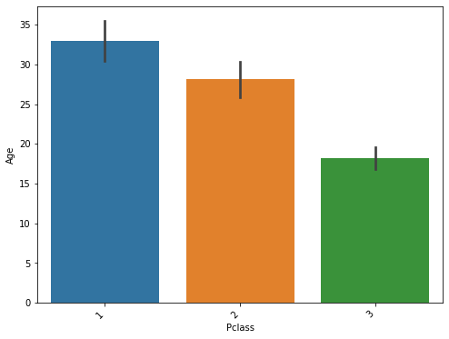


    turkeyHSD
            group2  meandiff   p-adj    lower    upper  reject
    group1                                                    
    1            2   -4.8318  0.0095  -8.6930  -0.9705    True
    2            3   -9.9144  0.0010 -13.2413  -6.5876    True
    1            3  -14.7462  0.0010 -17.8887 -11.6037    True
    
    
    
     
    


<hr>


<h3 align="center">Pclass - SibSp</h3>


    
      


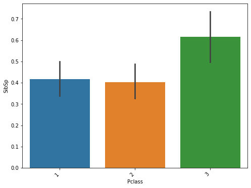


    turkeyHSD
            group2  meandiff   p-adj   lower   upper  reject
    group1                                                  
    1            2   -0.0145  0.9000 -0.2734  0.2444   False
    1            3    0.1984  0.0700 -0.0123  0.4091   False
    2            3    0.2129  0.0651 -0.0102  0.4360   False
    
    
    Pclass  -  ['Fare', 'Survived', 'Age', 'SibSp'] 
    
    
    


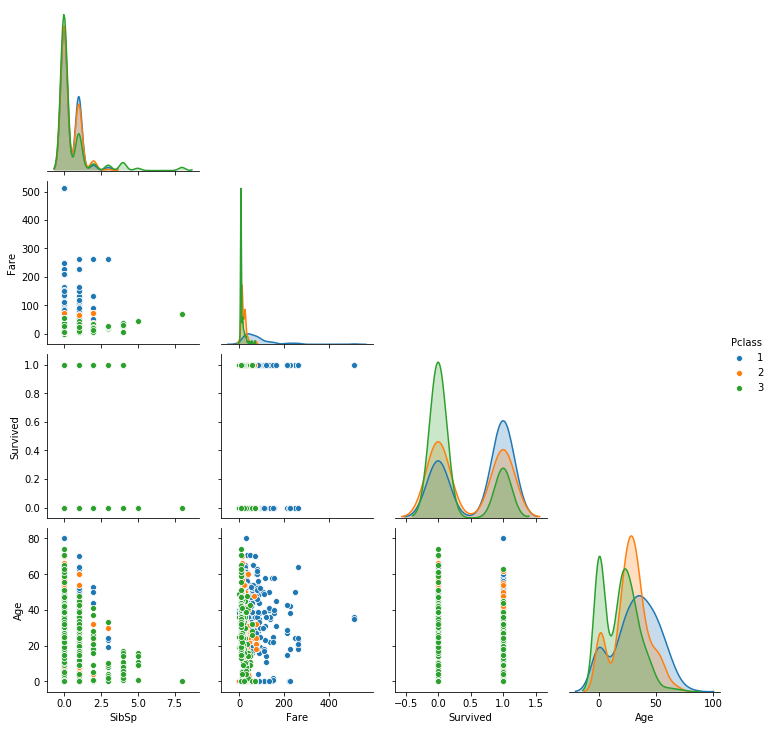


    {'cuts__Fare': ['Survived', 'Age', 'SibSp', 'Parch', 'Pclass'],
     'Survived': ['Fare', 'Parch', 'Pclass'],
     'cuts__Age': ['Fare', 'Survived', 'SibSp', 'Parch', 'Pclass'],
     'SibSp': ['Fare', 'Survived', 'Age', 'Parch', 'Pclass'],
     'Ticket': ['Fare', 'Survived', 'SibSp', 'Parch', 'Pclass'],
     'Embarked': ['Fare', 'Survived', 'Age', 'Pclass'],
     'Parch': ['Fare', 'Survived', 'Age', 'SibSp'],
     'Cabin': ['Fare', 'Survived', 'SibSp', 'Parch', 'Pclass'],
     'Sex': ['Fare', 'Survived', 'SibSp', 'Parch', 'Pclass'],
     'Pclass': ['Fare', 'Survived', 'Age', 'SibSp']}

