```python
import oleda
import pandas as pd
df=pd.read_csv('titanic.csv')
oleda.eda.interactions3x(df,maxnbr=6)
```

<hr>


<h3 align="center">__PassengerId - __Fare</h3>


    
      
    relation  10  :  10
    
    
     PassengerId
    
    
     Fare
    
    
     Survived
    Anova faled to reject => no difference 
    
    
     Age
    Anova passed


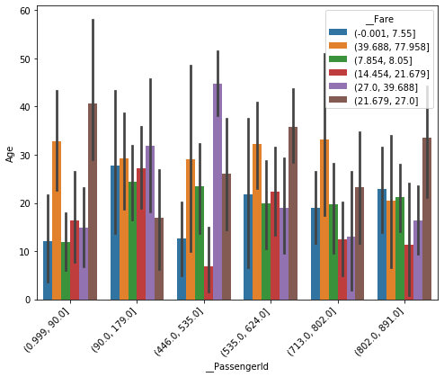


    turkeyHSD
                                                          group2  meandiff  \
    group1                                                                   
    (446.0, 535.0](14.454, 21.679]  (446.0, 535.0](27.0, 39.688]   37.8889   
    (0.999, 90.0](7.854, 8.05]      (446.0, 535.0](27.0, 39.688]   32.9500   
    (446.0, 535.0](-0.001, 7.55]    (446.0, 535.0](27.0, 39.688]   32.1667   
    (446.0, 535.0](14.454, 21.679]  (535.0, 624.0](21.679, 27.0]   28.9960   
    
                                     p-adj   lower    upper  reject  
    group1                                                           
    (446.0, 535.0](14.454, 21.679]  0.0043  5.4567  70.3211    True  
    (0.999, 90.0](7.854, 8.05]      0.0082  3.7292  62.1708    True  
    (446.0, 535.0](-0.001, 7.55]    0.0236  1.7019  62.6314    True  
    (446.0, 535.0](14.454, 21.679]  0.0403  0.4795  57.5126    True  
    
    
     SibSp
    Anova faled to reject => no difference 
    
    
     Parch
    Anova faled to reject => no difference 
    
    
     Pclass
    Anova faled to reject => no difference 
    ['Age']
    __PassengerId*__Fare=Age


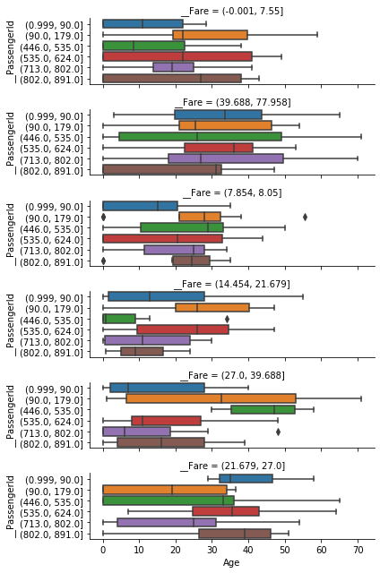


    
     
    


<hr>


<h3 align="center">__PassengerId - Survived</h3>


    
      
    relation  2  :  10
    
    
     PassengerId
    
    
     Fare
    Anova passed


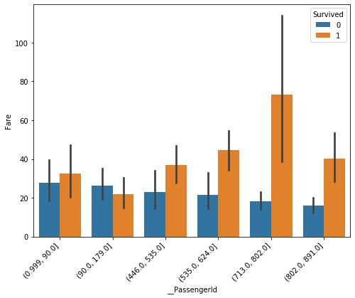


    turkeyHSD
                              group2  meandiff   p-adj    lower    upper  reject
    group1                                                                      
    (713.0, 802.0]0  (713.0, 802.0]1   54.9983  0.0010  24.7649  85.2316    True
    (535.0, 624.0]0  (713.0, 802.0]1   51.7811  0.0010  20.6441  82.9182    True
    (446.0, 535.0]0  (713.0, 802.0]1   50.3473  0.0010  19.9357  80.7589    True
    (0.999, 90.0]0   (713.0, 802.0]1   45.4057  0.0010  14.3833  76.4280    True
    (0.999, 90.0]1   (713.0, 802.0]1   40.5619  0.0032   7.8196  73.3042    True
    (446.0, 535.0]1  (713.0, 802.0]1   36.4824  0.0255   2.2184  70.7463    True
    (535.0, 624.0]1  (802.0, 891.0]0  -28.4430  0.0446 -56.5629  -0.3232    True
    (713.0, 802.0]1   (90.0, 179.0]0  -47.0064  0.0010 -76.4920 -17.5208    True
    (713.0, 802.0]1   (90.0, 179.0]1  -51.2108  0.0011 -90.1321 -12.2895    True
    (713.0, 802.0]1  (802.0, 891.0]0  -57.1987  0.0010 -87.7038 -26.6937    True
    
    
     Survived
    
    
     Age
    Anova faled to reject => no difference 
    
    
     SibSp
    Anova faled to reject => no difference 
    
    
     Parch
    Anova faled to reject => no difference 
    
    
     Pclass
    Anova passed


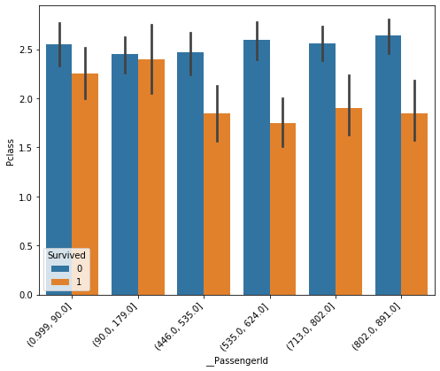


    turkeyHSD
                              group2  meandiff   p-adj   lower   upper  reject
    group1                                                                    
    (535.0, 624.0]1  (802.0, 891.0]0    0.8993  0.0010  0.3636  1.4350    True
    (535.0, 624.0]1  (713.0, 802.0]0    0.8157  0.0010  0.2856  1.3458    True
    (446.0, 535.0]1  (802.0, 891.0]0    0.7991  0.0010  0.2299  1.3683    True
    (446.0, 535.0]1  (535.0, 624.0]0    0.7563  0.0014  0.1748  1.3377    True
    (713.0, 802.0]1  (802.0, 891.0]0    0.7429  0.0019  0.1617  1.3240    True
    (446.0, 535.0]1  (713.0, 802.0]0    0.7156  0.0021  0.1517  1.2795    True
    (535.0, 624.0]1   (90.0, 179.0]0    0.7057  0.0010  0.1911  1.2203    True
    (446.0, 535.0]1   (90.0, 179.0]0    0.6055  0.0168  0.0562  1.1549    True
    (802.0, 891.0]1   (90.0, 179.0]0    0.6008  0.0163  0.0571  1.1444    True
    (446.0, 535.0]0  (802.0, 891.0]1   -0.6252  0.0149 -1.1871 -0.0633    True
    (446.0, 535.0]0  (446.0, 535.0]1   -0.6299  0.0154 -1.1973 -0.0625    True
    (0.999, 90.0]0   (713.0, 802.0]1   -0.6490  0.0176 -1.2400 -0.0580    True
    (713.0, 802.0]0  (713.0, 802.0]1   -0.6593  0.0103 -1.2353 -0.0833    True
    (535.0, 624.0]0  (713.0, 802.0]1   -0.7000  0.0067 -1.2932 -0.1068    True
    (0.999, 90.0]0   (802.0, 891.0]1   -0.7005  0.0040 -1.2744 -0.1267    True
    (0.999, 90.0]0   (446.0, 535.0]1   -0.7053  0.0042 -1.2845 -0.1260    True
    (713.0, 802.0]0  (802.0, 891.0]1   -0.7108  0.0020 -1.2692 -0.1525    True
    (446.0, 535.0]0  (535.0, 624.0]1   -0.7301  0.0010 -1.2639 -0.1963    True
    (535.0, 624.0]0  (802.0, 891.0]1   -0.7515  0.0013 -1.3276 -0.1754    True
    (802.0, 891.0]0  (802.0, 891.0]1   -0.7944  0.0010 -1.3581 -0.2307    True
    (0.999, 90.0]0   (535.0, 624.0]1   -0.8054  0.0010 -1.3518 -0.2590    True
    (535.0, 624.0]0  (535.0, 624.0]1   -0.8564  0.0010 -1.4052 -0.3077    True
    ['Fare', 'Pclass']


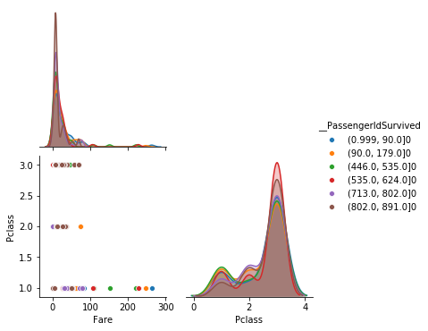


    __PassengerId*Survived=Fare


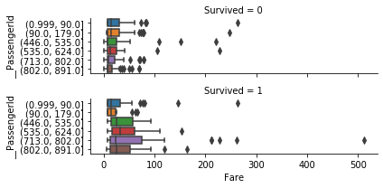


    __PassengerId*Survived=Pclass


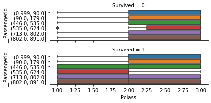


    
     
    


<hr>


<h3 align="center">__PassengerId - __Age</h3>


    
      
    relation  9  :  10
    
    
     PassengerId
    
    
     Fare
    Anova passed


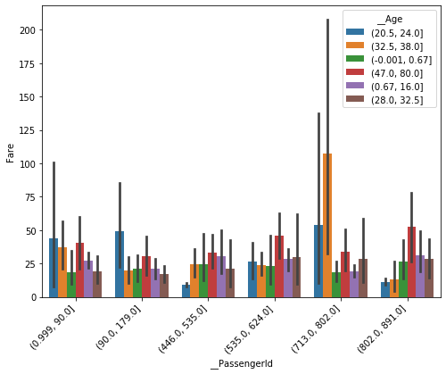


    turkeyHSD
                                                        group2  meandiff   p-adj  \
    group1                                                                         
    (446.0, 535.0](20.5, 24.0]      (713.0, 802.0](32.5, 38.0]   98.7642  0.0010   
    (0.999, 90.0](-0.001, 0.67]     (713.0, 802.0](32.5, 38.0]   89.3525  0.0010   
    (713.0, 802.0](-0.001, 0.67]    (713.0, 802.0](32.5, 38.0]   89.0684  0.0010   
    (0.999, 90.0](28.0, 32.5]       (713.0, 802.0](32.5, 38.0]   88.8154  0.0079   
    (713.0, 802.0](0.67, 16.0]      (713.0, 802.0](32.5, 38.0]   88.4991  0.0017   
    (446.0, 535.0](28.0, 32.5]      (713.0, 802.0](32.5, 38.0]   86.5842  0.0121   
    (535.0, 624.0](-0.001, 0.67]    (713.0, 802.0](32.5, 38.0]   84.5360  0.0010   
    (535.0, 624.0](32.5, 38.0]      (713.0, 802.0](32.5, 38.0]   83.7866  0.0024   
    (446.0, 535.0](32.5, 38.0]      (713.0, 802.0](32.5, 38.0]   83.4077  0.0027   
    (446.0, 535.0](-0.001, 0.67]    (713.0, 802.0](32.5, 38.0]   82.8770  0.0010   
    (535.0, 624.0](20.5, 24.0]      (713.0, 802.0](32.5, 38.0]   81.1937  0.0203   
    (0.999, 90.0](0.67, 16.0]       (713.0, 802.0](32.5, 38.0]   80.1990  0.0025   
    (713.0, 802.0](28.0, 32.5]      (713.0, 802.0](32.5, 38.0]   79.1514  0.0054   
    (446.0, 535.0](47.0, 80.0]      (713.0, 802.0](32.5, 38.0]   74.4354  0.0124   
    (713.0, 802.0](32.5, 38.0]      (802.0, 891.0](0.67, 16.0]  -76.5875  0.0126   
    (713.0, 802.0](32.5, 38.0]       (90.0, 179.0](47.0, 80.0]  -77.4725  0.0273   
    (713.0, 802.0](32.5, 38.0]    (802.0, 891.0](-0.001, 0.67]  -80.9215  0.0027   
    (713.0, 802.0](32.5, 38.0]     (90.0, 179.0](-0.001, 0.67]  -86.7107  0.0010   
    (713.0, 802.0](32.5, 38.0]       (90.0, 179.0](0.67, 16.0]  -86.7762  0.0041   
    (713.0, 802.0](32.5, 38.0]       (90.0, 179.0](32.5, 38.0]  -87.5941  0.0100   
    (713.0, 802.0](32.5, 38.0]       (90.0, 179.0](28.0, 32.5]  -90.6285  0.0107   
    (713.0, 802.0](32.5, 38.0]      (802.0, 891.0](32.5, 38.0]  -94.6773  0.0049   
    (713.0, 802.0](32.5, 38.0]      (802.0, 891.0](20.5, 24.0]  -96.4077  0.0035   
    
                                     lower     upper  reject  
    group1                                                    
    (446.0, 535.0](20.5, 24.0]     24.6470  172.8814    True  
    (0.999, 90.0](-0.001, 0.67]    25.6766  153.0284    True  
    (713.0, 802.0](-0.001, 0.67]   23.0201  155.1166    True  
    (0.999, 90.0](28.0, 32.5]      10.2023  167.4286    True  
    (713.0, 802.0](0.67, 16.0]     16.0860  160.9122    True  
    (446.0, 535.0](28.0, 32.5]      7.9710  165.1973    True  
    (535.0, 624.0](-0.001, 0.67]   20.3487  148.7234    True  
    (535.0, 624.0](32.5, 38.0]     14.0764  153.4967    True  
    (446.0, 535.0](32.5, 38.0]     13.6976  153.1179    True  
    (446.0, 535.0](-0.001, 0.67]   20.1005  145.6535    True  
    (535.0, 624.0](20.5, 24.0]      5.0455  157.3418    True  
    (0.999, 90.0](0.67, 16.0]      13.3907  147.0073    True  
    (713.0, 802.0](28.0, 32.5]     10.5323  147.7706    True  
    (446.0, 535.0](47.0, 80.0]      6.7760  142.0948    True  
    (713.0, 802.0](32.5, 38.0]   -146.2977   -6.8774    True  
    (713.0, 802.0](32.5, 38.0]   -151.5897   -3.3553    True  
    (713.0, 802.0](32.5, 38.0]   -148.5809  -13.2621    True  
    (713.0, 802.0](32.5, 38.0]   -155.3298  -18.0915    True  
    (713.0, 802.0](32.5, 38.0]   -160.8934  -12.6591    True  
    (713.0, 802.0](32.5, 38.0]   -166.2072   -8.9809    True  
    (713.0, 802.0](32.5, 38.0]   -172.3017   -8.9554    True  
    (713.0, 802.0](32.5, 38.0]   -176.3505  -13.0042    True  
    (713.0, 802.0](32.5, 38.0]   -178.0808  -14.7345    True  
    
    
     Survived
    Anova passed


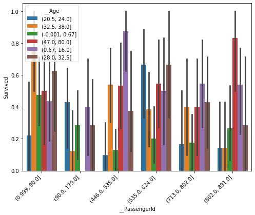


    turkeyHSD
                                                      group2  meandiff   p-adj  \
    group1                                                                       
    (446.0, 535.0](-0.001, 0.67]  (446.0, 535.0](0.67, 16.0]    0.7446  0.0461   
    (446.0, 535.0](0.67, 16.0]     (90.0, 179.0](47.0, 80.0]   -0.8750  0.0368   
    
                                   lower   upper  reject  
    group1                                                
    (446.0, 535.0](-0.001, 0.67]  0.0048  1.4843    True  
    (446.0, 535.0](0.67, 16.0]   -1.7299 -0.0201    True  
    
    
     Age
    
    
     SibSp
    Anova faled to reject => no difference 
    
    
     Parch
    Anova faled to reject => no difference 
    
    
     Pclass
    Anova faled to reject => no difference 
    ['Fare', 'Survived']


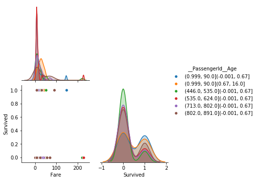


    __PassengerId*__Age=Fare


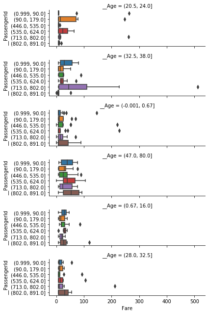


    __PassengerId*__Age=Survived


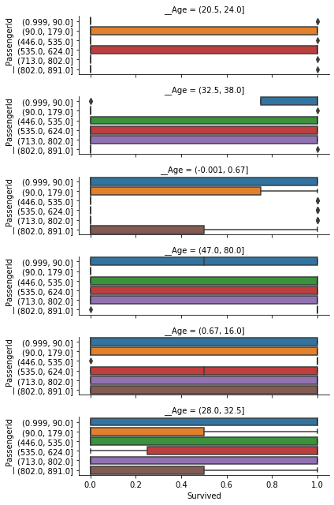


    
     
    


<hr>


<h3 align="center">__PassengerId - SibSp</h3>


    
      
    relation  6  :  10
    
    
     PassengerId
    
    
     Fare
    Anova passed


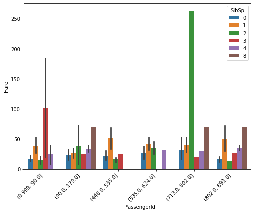


    turkeyHSD
                              group2  meandiff   p-adj     lower     upper  reject
    group1                                                                        
    (0.999, 90.0]2   (713.0, 802.0]2  246.2611  0.0010   67.6367  424.8855    True
    (446.0, 535.0]2  (713.0, 802.0]2  245.7028  0.0010   67.0784  424.3272    True
    (0.999, 90.0]0   (713.0, 802.0]2  244.5551  0.0010   88.3815  400.7287    True
    (446.0, 535.0]0  (713.0, 802.0]2  240.5902  0.0010   84.7294  396.4509    True
    (446.0, 535.0]3  (713.0, 802.0]2  236.9083  0.0164   18.1390  455.6776    True
    (0.999, 90.0]4   (713.0, 802.0]2  236.7958  0.0010   58.1715  415.4202    True
    (535.0, 624.0]0  (713.0, 802.0]2  235.7467  0.0010   79.6784  391.8150    True
    (535.0, 624.0]4  (713.0, 802.0]2  231.1000  0.0020   41.6403  420.5597    True
    (713.0, 802.0]0  (713.0, 802.0]2  230.2726  0.0010   74.3565  386.1887    True
    (535.0, 624.0]2  (713.0, 802.0]2  226.9677  0.0010   54.0154  399.9200    True
    (0.999, 90.0]1   (713.0, 802.0]2  223.4424  0.0010   65.5592  381.3255    True
    (713.0, 802.0]1  (713.0, 802.0]2  222.9756  0.0010   64.8056  381.1455    True
    (535.0, 624.0]1  (713.0, 802.0]2  221.2531  0.0010   63.7212  378.7850    True
    (446.0, 535.0]1  (713.0, 802.0]2  211.3322  0.0010   52.4000  370.2644    True
    (0.999, 90.0]0    (0.999, 90.0]3   84.1635  0.0010   17.4662  150.8607    True
    (0.999, 90.0]3   (713.0, 802.0]0  -69.8810  0.0235 -135.9731   -3.7888    True
    (0.999, 90.0]3   (535.0, 624.0]0  -75.3551  0.0077 -141.8054   -8.9047    True
    (0.999, 90.0]3    (90.0, 179.0]1  -75.6393  0.0281 -148.0810   -3.1975    True
    (0.999, 90.0]3    (90.0, 179.0]0  -78.8045  0.0031 -144.9430  -12.6660    True
    (0.999, 90.0]3   (446.0, 535.0]0  -80.1985  0.0021 -146.1599  -14.2371    True
    (0.999, 90.0]3   (802.0, 891.0]0  -85.2319  0.0010 -151.2355  -19.2282    True
    (713.0, 802.0]2  (802.0, 891.0]8 -192.8250  0.0400 -382.2847   -3.3653    True
    (713.0, 802.0]2  (802.0, 891.0]1 -212.2762  0.0010 -371.4542  -53.0982    True
    (713.0, 802.0]2   (90.0, 179.0]2 -223.7750  0.0011 -402.3994  -45.1506    True
    (713.0, 802.0]2  (802.0, 891.0]4 -228.2958  0.0010 -406.9202  -49.6715    True
    (713.0, 802.0]2   (90.0, 179.0]4 -229.0125  0.0010 -407.6369  -50.3881    True
    (713.0, 802.0]2  (713.0, 802.0]4 -233.2500  0.0208 -452.0193  -14.4807    True
    (713.0, 802.0]2  (802.0, 891.0]3 -234.4750  0.0192 -453.2443  -15.7057    True
    (713.0, 802.0]2   (90.0, 179.0]1 -236.0309  0.0010 -394.7428  -77.3190    True
    (713.0, 802.0]2   (90.0, 179.0]3 -236.9083  0.0164 -455.6776  -18.1390    True
    (713.0, 802.0]2   (90.0, 179.0]0 -239.1962  0.0010 -395.1319  -83.2604    True
    (713.0, 802.0]2  (713.0, 802.0]3 -241.3750  0.0122 -460.1443  -22.6057    True
    (713.0, 802.0]2  (802.0, 891.0]0 -245.6235  0.0010 -401.5022  -89.7449    True
    (713.0, 802.0]2  (802.0, 891.0]2 -248.2667  0.0076 -467.0360  -29.4974    True
    
    
     Survived
    Anova faled to reject => no difference 
    
    
     Age
    Anova faled to reject => no difference 
    
    
     SibSp
    
    
     Parch
    Anova passed


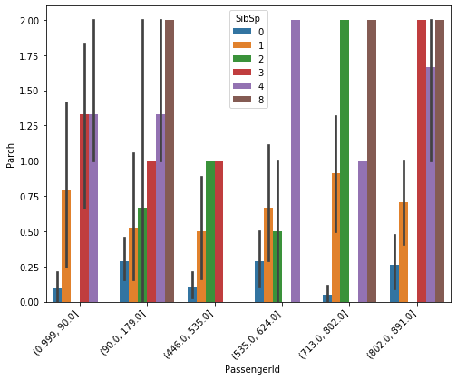


    turkeyHSD
                              group2  meandiff   p-adj   lower   upper  reject
    group1                                                                    
    (0.999, 90.0]0    (0.999, 90.0]3    1.2372  0.0348  0.0341  2.4402    True
    (713.0, 802.0]0  (713.0, 802.0]1    0.8615  0.0012  0.1705  1.5525    True
    (0.999, 90.0]0   (713.0, 802.0]1    0.8129  0.0065  0.1033  1.5226    True
    (446.0, 535.0]0  (713.0, 802.0]1    0.8030  0.0045  0.1161  1.4900    True
    (0.999, 90.0]0    (0.999, 90.0]1    0.6955  0.0441  0.0069  1.3841    True
    (0.999, 90.0]1   (446.0, 535.0]0   -0.6856  0.0337 -1.3507 -0.0205    True
    (0.999, 90.0]1   (713.0, 802.0]0   -0.7440  0.0108 -1.4134 -0.0747    True
    (0.999, 90.0]3   (446.0, 535.0]0   -1.2273  0.0334 -2.4171 -0.0375    True
    (0.999, 90.0]3   (713.0, 802.0]0   -1.2857  0.0175 -2.4779 -0.0936    True
    
    
     Pclass
    Anova faled to reject => no difference 
    ['Fare', 'Parch']


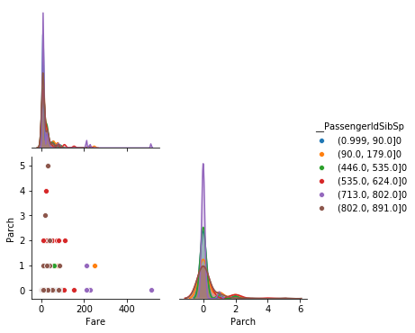


    __PassengerId*SibSp=Fare


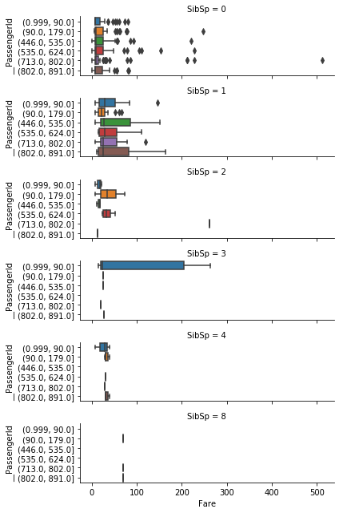


    __PassengerId*SibSp=Parch


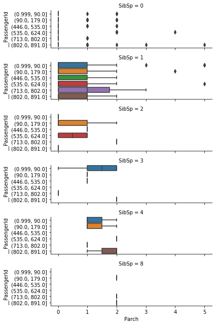


    
     
    


<hr>


<h3 align="center">__PassengerId - Embarked</h3>


    
      
    relation  4  :  10
    
    
     PassengerId
    
    
     Fare
    Anova passed


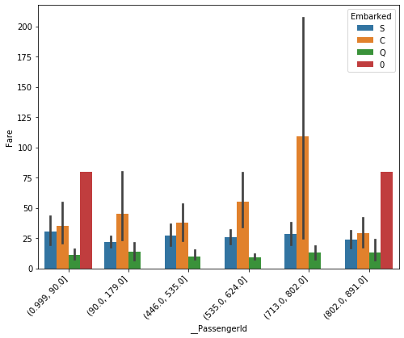


    turkeyHSD
                              group2  meandiff   p-adj     lower     upper  reject
    group1                                                                        
    (535.0, 624.0]Q  (713.0, 802.0]C   99.9838  0.0010   25.9131  174.0544    True
    (446.0, 535.0]Q  (713.0, 802.0]C   98.9666  0.0010   28.4024  169.5309    True
    (0.999, 90.0]Q   (713.0, 802.0]C   97.9099  0.0010   32.3118  163.5080    True
    (535.0, 624.0]S  (713.0, 802.0]C   83.4173  0.0010   35.6684  131.1661    True
    (446.0, 535.0]S  (713.0, 802.0]C   82.2000  0.0010   34.5083  129.8917    True
    (0.999, 90.0]S   (713.0, 802.0]C   78.8877  0.0010   31.0799  126.6955    True
    (0.999, 90.0]C   (713.0, 802.0]C   73.6476  0.0010   18.3532  128.9420    True
    (446.0, 535.0]C  (713.0, 802.0]C   71.2693  0.0010   15.9749  126.5638    True
    (713.0, 802.0]C   (90.0, 179.0]C  -63.9525  0.0140 -121.8872   -6.0179    True
    (713.0, 802.0]C  (802.0, 891.0]C  -80.0134  0.0010 -135.3078  -24.7190    True
    (713.0, 802.0]C  (713.0, 802.0]S  -80.6819  0.0010 -128.0644  -33.2995    True
    (713.0, 802.0]C  (802.0, 891.0]S  -85.3338  0.0010 -132.9163  -37.7512    True
    (713.0, 802.0]C   (90.0, 179.0]S  -87.1419  0.0010 -134.5723  -39.7115    True
    (713.0, 802.0]C   (90.0, 179.0]Q  -95.1623  0.0010 -169.2329  -21.0916    True
    (713.0, 802.0]C  (802.0, 891.0]Q  -96.1449  0.0101 -181.3593  -10.9305    True
    (713.0, 802.0]C  (713.0, 802.0]Q  -96.2331  0.0010 -161.8312  -30.6350    True
    
    
     Survived
    Anova faled to reject => no difference 
    
    
     Age
    Anova faled to reject => no difference 
    
    
     SibSp
    Anova faled to reject => no difference 
    
    
     Parch
    Anova faled to reject => no difference 
    
    
     Pclass
    Anova faled to reject => no difference 
    ['Fare']
    __PassengerId*Embarked=Fare


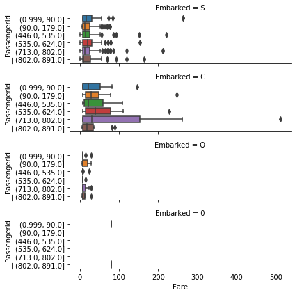


    
     
    


<hr>


<h3 align="center">__PassengerId - Parch</h3>


    
      
    relation  5  :  10
    
    
     PassengerId
    
    
     Fare
    Anova faled to reject => no difference 
    
    
     Survived
    Anova faled to reject => no difference 
    
    
     Age
    Anova faled to reject => no difference 
    
    
     SibSp
    Anova passed


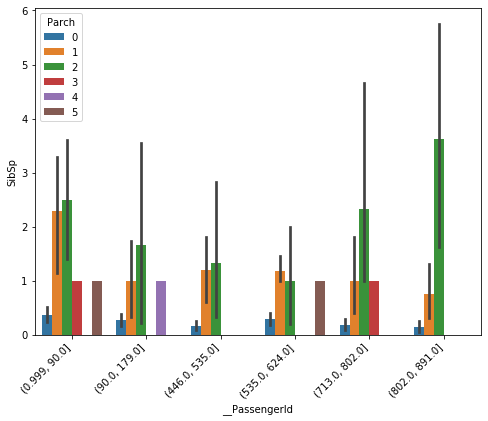


    turkeyHSD
                              group2  meandiff   p-adj   lower   upper  reject
    group1                                                                    
    (535.0, 624.0]4  (802.0, 891.0]2    3.6250  0.0415  0.0554  7.1946    True
    (802.0, 891.0]0  (802.0, 891.0]2    3.4821  0.0010  2.2190  4.7453    True
    (446.0, 535.0]0  (802.0, 891.0]2    3.4606  0.0010  2.2072  4.7140    True
    (713.0, 802.0]0  (802.0, 891.0]2    3.4419  0.0010  2.1868  4.6970    True
    (535.0, 624.0]0  (802.0, 891.0]2    3.3371  0.0010  2.0772  4.5970    True
    (0.999, 90.0]0   (802.0, 891.0]2    3.2536  0.0010  1.9976  4.5096    True
    (802.0, 891.0]1  (802.0, 891.0]2    2.8750  0.0010  1.4177  4.3323    True
    (713.0, 802.0]1  (802.0, 891.0]2    2.6250  0.0010  1.0286  4.2214    True
    (535.0, 624.0]2  (802.0, 891.0]2    2.6250  0.0010  1.0286  4.2214    True
    (535.0, 624.0]1  (802.0, 891.0]2    2.4432  0.0010  0.8794  4.0070    True
    (446.0, 535.0]1  (802.0, 891.0]2    2.4250  0.0010  0.8286  4.0214    True
    (446.0, 535.0]2  (802.0, 891.0]2    2.2917  0.0011  0.4741  4.1092    True
    (446.0, 535.0]0  (713.0, 802.0]2    2.1689  0.0010  0.7397  3.5982    True
    (713.0, 802.0]0  (713.0, 802.0]2    2.1502  0.0010  0.7194  3.5810    True
    (0.999, 90.0]0    (0.999, 90.0]2    2.1286  0.0010  0.9908  3.2663    True
    (535.0, 624.0]0  (713.0, 802.0]2    2.0455  0.0010  0.6104  3.4805    True
    (0.999, 90.0]0   (713.0, 802.0]2    1.9619  0.0010  0.5303  3.3935    True
    (0.999, 90.0]0    (0.999, 90.0]1    1.9143  0.0010  0.5802  3.2484    True
    (802.0, 891.0]0   (90.0, 179.0]2    1.5238  0.0010  0.3245  2.7231    True
    (446.0, 535.0]0   (90.0, 179.0]2    1.5023  0.0011  0.3133  2.6912    True
    (713.0, 802.0]0   (90.0, 179.0]2    1.4836  0.0015  0.2928  2.6744    True
    (90.0, 179.0]0    (90.0, 179.0]2    1.4010  0.0049  0.2029  2.5991    True
    (535.0, 624.0]0   (90.0, 179.0]2    1.3788  0.0063  0.1829  2.5746    True
    (0.999, 90.0]0    (90.0, 179.0]2    1.2952  0.0163  0.1035  2.4870    True
    (0.999, 90.0]2    (90.0, 179.0]1   -1.5000  0.0152 -2.8739 -0.1261    True
    (0.999, 90.0]1   (802.0, 891.0]1   -1.5357  0.0460 -3.0608 -0.0106    True
    (0.999, 90.0]2   (802.0, 891.0]1   -1.7500  0.0010 -3.1067 -0.3933    True
    (802.0, 891.0]2   (90.0, 179.0]2   -1.9583  0.0032 -3.5936 -0.3230    True
    (0.999, 90.0]1   (535.0, 624.0]0   -1.9978  0.0010 -3.3356 -0.6601    True
    (0.999, 90.0]1    (90.0, 179.0]0   -2.0201  0.0010 -3.3599 -0.6803    True
    (713.0, 802.0]2   (90.0, 179.0]0   -2.0677  0.0010 -3.5046 -0.6308    True
    (0.999, 90.0]1   (713.0, 802.0]0   -2.1026  0.0010 -3.4359 -0.7694    True
    (0.999, 90.0]1   (446.0, 535.0]0   -2.1213  0.0010 -3.4529 -0.7897    True
    (0.999, 90.0]1   (802.0, 891.0]0   -2.1429  0.0010 -3.4837 -0.8020    True
    (713.0, 802.0]2  (802.0, 891.0]0   -2.1905  0.0010 -3.6284 -0.7526    True
    (0.999, 90.0]2   (535.0, 624.0]0   -2.2121  0.0010 -3.3542 -1.0701    True
    (0.999, 90.0]2    (90.0, 179.0]0   -2.2344  0.0010 -3.3787 -1.0900    True
    (0.999, 90.0]2   (713.0, 802.0]0   -2.3169  0.0010 -3.4536 -1.1802    True
    (0.999, 90.0]2   (446.0, 535.0]0   -2.3356  0.0010 -3.4704 -1.2008    True
    (0.999, 90.0]2   (802.0, 891.0]0   -2.3571  0.0010 -3.5027 -1.2115    True
    (802.0, 891.0]2   (90.0, 179.0]1   -2.6250  0.0010 -4.0984 -1.1516    True
    (802.0, 891.0]2   (90.0, 179.0]0   -3.3594  0.0010 -4.6214 -2.0973    True
    (802.0, 891.0]2  (802.0, 891.0]3   -3.6250  0.0415 -7.1946 -0.0554    True
    (802.0, 891.0]2  (802.0, 891.0]5   -3.6250  0.0415 -7.1946 -0.0554    True
    
    
     Parch
    
    
     Pclass
    Anova faled to reject => no difference 
    ['SibSp']
    __PassengerId*Parch=SibSp


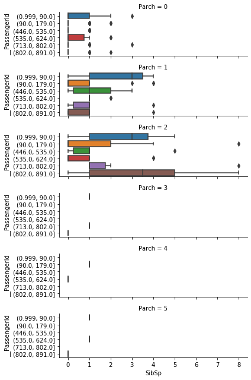


    
     
    


<hr>


<h3 align="center">__PassengerId - Cabin</h3>


    
      
    relation  30  :  10
    
    
     PassengerId
    
    
     Fare
    Anova passed


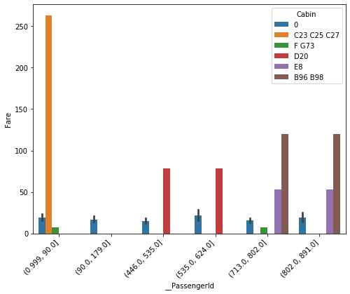


    turkeyHSD
                                                group2  meandiff   p-adj  \
    group1                                                                 
    (0.999, 90.0]0            (0.999, 90.0]C23 C25 C27  243.8843  0.0010   
    (713.0, 802.0]F G73          (802.0, 891.0]B96 B98  112.3500  0.0033   
    (0.999, 90.0]F G73           (802.0, 891.0]B96 B98  112.3500  0.0033   
    (0.999, 90.0]F G73           (713.0, 802.0]B96 B98  112.3500  0.0033   
    (446.0, 535.0]0              (802.0, 891.0]B96 B98  104.6700  0.0010   
    (446.0, 535.0]0              (713.0, 802.0]B96 B98  104.6700  0.0010   
    (713.0, 802.0]0              (802.0, 891.0]B96 B98  104.5542  0.0010   
    (713.0, 802.0]0              (713.0, 802.0]B96 B98  104.5542  0.0010   
    (802.0, 891.0]0              (802.0, 891.0]B96 B98  101.1465  0.0010   
    (0.999, 90.0]0               (713.0, 802.0]B96 B98  100.8843  0.0010   
    (0.999, 90.0]0               (802.0, 891.0]B96 B98  100.8843  0.0010   
    (535.0, 624.0]0              (802.0, 891.0]B96 B98   98.5970  0.0010   
    (535.0, 624.0]0              (713.0, 802.0]B96 B98   98.5970  0.0010   
    (713.0, 802.0]B96 B98              (802.0, 891.0]0 -101.1465  0.0010   
    (713.0, 802.0]B96 B98               (90.0, 179.0]0 -103.0874  0.0010   
    (802.0, 891.0]B96 B98               (90.0, 179.0]0 -103.0874  0.0010   
    (713.0, 802.0]B96 B98          (713.0, 802.0]F G73 -112.3500  0.0033   
    (0.999, 90.0]C23 C25 C27     (802.0, 891.0]B96 B98 -143.0000  0.0010   
    (0.999, 90.0]C23 C25 C27     (713.0, 802.0]B96 B98 -143.0000  0.0010   
    (0.999, 90.0]C23 C25 C27         (535.0, 624.0]D20 -184.7333  0.0010   
    (0.999, 90.0]C23 C25 C27         (446.0, 535.0]D20 -184.7333  0.0010   
    (0.999, 90.0]C23 C25 C27          (802.0, 891.0]E8 -209.9000  0.0010   
    (0.999, 90.0]C23 C25 C27          (713.0, 802.0]E8 -209.9000  0.0010   
    (0.999, 90.0]C23 C25 C27           (535.0, 624.0]0 -241.5970  0.0010   
    (0.999, 90.0]C23 C25 C27           (802.0, 891.0]0 -244.1465  0.0010   
    (0.999, 90.0]C23 C25 C27            (90.0, 179.0]0 -246.0874  0.0010   
    (0.999, 90.0]C23 C25 C27           (713.0, 802.0]0 -247.5542  0.0010   
    (0.999, 90.0]C23 C25 C27           (446.0, 535.0]0 -247.6700  0.0010   
    (0.999, 90.0]C23 C25 C27       (713.0, 802.0]F G73 -255.3500  0.0010   
    (0.999, 90.0]C23 C25 C27        (0.999, 90.0]F G73 -255.3500  0.0010   
    
                                 lower     upper  reject  
    group1                                                
    (0.999, 90.0]0            197.3264  290.4422    True  
    (713.0, 802.0]F G73        20.4841  204.2159    True  
    (0.999, 90.0]F G73         20.4841  204.2159    True  
    (0.999, 90.0]F G73         20.4841  204.2159    True  
    (446.0, 535.0]0            39.2207  170.1192    True  
    (446.0, 535.0]0            39.2207  170.1192    True  
    (713.0, 802.0]0            39.1122  169.9961    True  
    (713.0, 802.0]0            39.1122  169.9961    True  
    (802.0, 891.0]0            35.7252  166.5678    True  
    (0.999, 90.0]0             35.4819  166.2867    True  
    (0.999, 90.0]0             35.4819  166.2867    True  
    (535.0, 624.0]0            33.1757  164.0183    True  
    (535.0, 624.0]0            33.1757  164.0183    True  
    (713.0, 802.0]B96 B98    -166.5678  -35.7252    True  
    (713.0, 802.0]B96 B98    -168.5022  -37.6726    True  
    (802.0, 891.0]B96 B98    -168.5022  -37.6726    True  
    (713.0, 802.0]B96 B98    -204.2159  -20.4841    True  
    (0.999, 90.0]C23 C25 C27 -222.5582  -63.4418    True  
    (0.999, 90.0]C23 C25 C27 -222.5582  -63.4418    True  
    (0.999, 90.0]C23 C25 C27 -264.2915 -105.1751    True  
    (0.999, 90.0]C23 C25 C27 -264.2915 -105.1751    True  
    (0.999, 90.0]C23 C25 C27 -289.4582 -130.3418    True  
    (0.999, 90.0]C23 C25 C27 -289.4582 -130.3418    True  
    (0.999, 90.0]C23 C25 C27 -288.1815 -195.0125    True  
    (0.999, 90.0]C23 C25 C27 -290.7310 -197.5620    True  
    (0.999, 90.0]C23 C25 C27 -292.6628 -199.5120    True  
    (0.999, 90.0]C23 C25 C27 -294.1676 -200.9407    True  
    (0.999, 90.0]C23 C25 C27 -294.2936 -201.0463    True  
    (0.999, 90.0]C23 C25 C27 -334.9082 -175.7918    True  
    (0.999, 90.0]C23 C25 C27 -334.9082 -175.7918    True  
    
    
     Survived
    Anova passed


    turkeyHSD
                                             group2  meandiff  p-adj   lower  \
    group1                                                                     
    (0.999, 90.0]0         (0.999, 90.0]C23 C25 C27    0.1301    0.9 -0.9694   
    (0.999, 90.0]0               (0.999, 90.0]F G73   -0.3699    0.9 -1.9144   
    (0.999, 90.0]0                  (446.0, 535.0]0   -0.0820    0.9 -0.3426   
    (0.999, 90.0]0                (446.0, 535.0]D20    0.6301    0.9 -0.9144   
    (0.999, 90.0]0                  (535.0, 624.0]0   -0.0413    0.9 -0.2979   
    ...                                         ...       ...    ...     ...   
    (802.0, 891.0]0                (802.0, 891.0]E8    0.7429    0.9 -0.8022   
    (802.0, 891.0]0                  (90.0, 179.0]0   -0.0600    0.9 -0.3184   
    (802.0, 891.0]B96 B98          (802.0, 891.0]E8    0.0000    0.9 -2.1696   
    (802.0, 891.0]B96 B98            (90.0, 179.0]0   -0.8028    0.9 -2.3477   
    (802.0, 891.0]E8                 (90.0, 179.0]0   -0.8028    0.9 -2.3477   
    
                            upper  reject  
    group1                                 
    (0.999, 90.0]0         1.2297   False  
    (0.999, 90.0]0         1.1747   False  
    (0.999, 90.0]0         0.1786   False  
    (0.999, 90.0]0         2.1747   False  
    (0.999, 90.0]0         0.2153   False  
    ...                       ...     ...  
    (802.0, 891.0]0        2.2879   False  
    (802.0, 891.0]0        0.1984   False  
    (802.0, 891.0]B96 B98  2.1696   False  
    (802.0, 891.0]B96 B98  0.7421   False  
    (802.0, 891.0]E8       0.7421   False  
    
    [105 rows x 6 columns]
    
    
     Age
    Anova faled to reject => no difference 
    
    
     SibSp
    Anova faled to reject => no difference 
    
    
     Parch
    Anova faled to reject => no difference 
    
    
     Pclass
    Anova passed


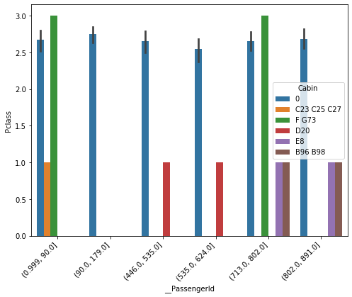


    turkeyHSD
                                                group2  meandiff   p-adj   lower  \
    group1                                                                         
    (0.999, 90.0]C23 C25 C27            (90.0, 179.0]0    1.7465  0.0033  0.3198   
    (0.999, 90.0]C23 C25 C27           (802.0, 891.0]0    1.6857  0.0058  0.2588   
    (0.999, 90.0]C23 C25 C27           (713.0, 802.0]0    1.6567  0.0076  0.2289   
    (0.999, 90.0]C23 C25 C27           (446.0, 535.0]0    1.6515  0.0080  0.2234   
    (0.999, 90.0]C23 C25 C27           (535.0, 624.0]0    1.5429  0.0202  0.1159   
    (0.999, 90.0]0            (0.999, 90.0]C23 C25 C27   -1.6712  0.0066 -3.0974   
    
                               upper  reject  
    group1                                    
    (0.999, 90.0]C23 C25 C27  3.1731    True  
    (0.999, 90.0]C23 C25 C27  3.1127    True  
    (0.999, 90.0]C23 C25 C27  3.0845    True  
    (0.999, 90.0]C23 C25 C27  3.0797    True  
    (0.999, 90.0]C23 C25 C27  2.9698    True  
    (0.999, 90.0]0           -0.2451    True  
    ['Fare', 'Survived', 'Pclass']


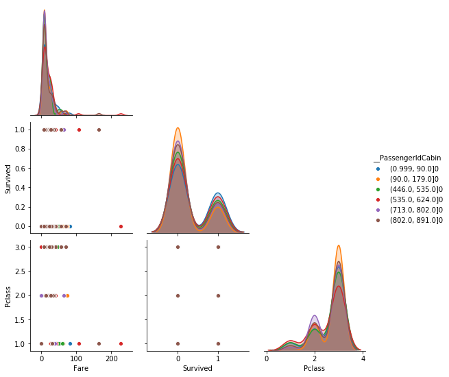


    __PassengerId*Cabin=Fare


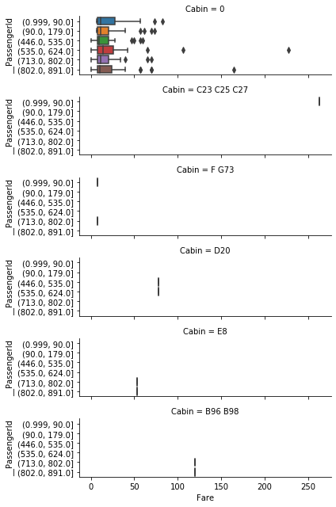


    __PassengerId*Cabin=Survived


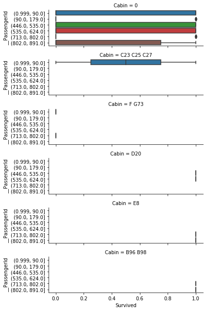


    __PassengerId*Cabin=Pclass


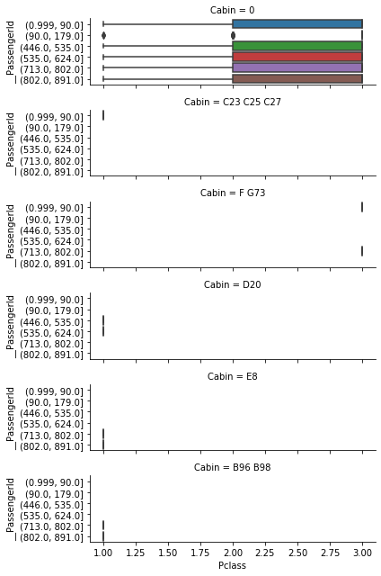


    
     
    


<hr>


<h3 align="center">__PassengerId - Sex</h3>


    
      
    relation  2  :  10
    
    
     PassengerId
    
    
     Fare
    Anova faled to reject => no difference 
    
    
     Survived
    Anova faled to reject => no difference 
    
    
     Age
    Anova faled to reject => no difference 
    
    
     SibSp
    Anova faled to reject => no difference 
    
    
     Parch
    Anova faled to reject => no difference 
    
    
     Pclass
    Anova faled to reject => no difference 
    
     
    


<hr>


<h3 align="center">__PassengerId - Pclass</h3>


    
      
    relation  3  :  10
    
    
     PassengerId
    
    
     Fare
    Anova passed


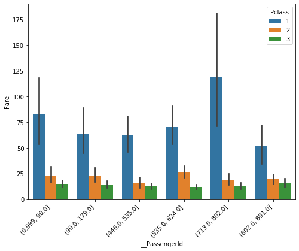


    turkeyHSD
                              group2  meandiff  p-adj     lower     upper  reject
    group1                                                                       
    (535.0, 624.0]3  (713.0, 802.0]1  106.6932  0.001   74.1788  139.2075    True
    (446.0, 535.0]3  (713.0, 802.0]1  106.2559  0.001   74.0446  138.4672    True
    (0.999, 90.0]3   (713.0, 802.0]1  103.8838  0.001   72.3318  135.4359    True
    (446.0, 535.0]2  (713.0, 802.0]1  102.5808  0.001   61.5334  143.6281    True
    (0.999, 90.0]2   (713.0, 802.0]1   95.7461  0.001   55.4219  136.0702    True
    ...                          ...       ...    ...       ...       ...     ...
    (713.0, 802.0]1  (802.0, 891.0]2  -99.4200  0.001 -139.7442  -59.0958    True
    (713.0, 802.0]1  (713.0, 802.0]2 -100.0597  0.001 -137.6878  -62.4317    True
    (713.0, 802.0]1  (802.0, 891.0]3 -102.9540  0.001 -134.8120  -71.0960    True
    (713.0, 802.0]1   (90.0, 179.0]3 -104.4459  0.001 -135.9980  -72.8938    True
    (713.0, 802.0]1  (713.0, 802.0]3 -106.1968  0.001 -138.3148  -74.0789    True
    
    [67 rows x 6 columns]
    
    
     Survived
    Anova passed


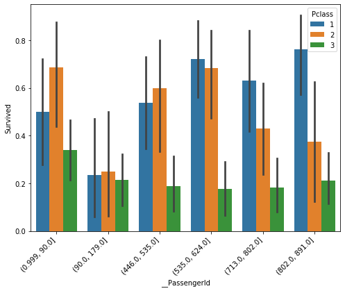


    turkeyHSD
                              group2  meandiff   p-adj   lower   upper  reject
    group1                                                                    
    (535.0, 624.0]3  (802.0, 891.0]1    0.5841  0.0010  0.1720  0.9962    True
    (713.0, 802.0]3  (802.0, 891.0]1    0.5782  0.0010  0.1715  0.9849    True
    (446.0, 535.0]3  (802.0, 891.0]1    0.5744  0.0010  0.1664  0.9824    True
    (446.0, 535.0]3  (535.0, 624.0]1    0.5325  0.0010  0.1479  0.9171    True
    (446.0, 535.0]3  (535.0, 624.0]2    0.4967  0.0056  0.0741  0.9194    True
    (535.0, 624.0]3  (713.0, 802.0]1    0.4538  0.0238  0.0272  0.8804    True
    (446.0, 535.0]3  (713.0, 802.0]1    0.4441  0.0279  0.0214  0.8667    True
    (0.999, 90.0]3   (802.0, 891.0]1    0.4226  0.0252  0.0236  0.8216    True
    (0.999, 90.0]3   (535.0, 624.0]1    0.3807  0.0423  0.0056  0.7558    True
    (713.0, 802.0]1   (90.0, 179.0]3   -0.4173  0.0458 -0.8313 -0.0033    True
    (713.0, 802.0]1  (802.0, 891.0]3   -0.4200  0.0474 -0.8380 -0.0020    True
    (713.0, 802.0]1  (713.0, 802.0]3   -0.4479  0.0241 -0.8693 -0.0265    True
    (535.0, 624.0]2   (90.0, 179.0]3   -0.4699  0.0096 -0.8839 -0.0559    True
    (535.0, 624.0]2  (802.0, 891.0]3   -0.4727  0.0102 -0.8907 -0.0547    True
    (0.999, 90.0]2    (90.0, 179.0]3   -0.4732  0.0219 -0.9152 -0.0312    True
    (0.999, 90.0]2   (802.0, 891.0]3   -0.4760  0.0227 -0.9217 -0.0302    True
    (0.999, 90.0]2   (446.0, 535.0]3   -0.5000  0.0132 -0.9501 -0.0499    True
    (535.0, 624.0]2  (713.0, 802.0]3   -0.5005  0.0047 -0.9220 -0.0791    True
    (0.999, 90.0]2   (713.0, 802.0]3   -0.5038  0.0114 -0.9528 -0.0548    True
    (535.0, 624.0]1   (90.0, 179.0]3   -0.5057  0.0010 -0.8808 -0.1306    True
    (535.0, 624.0]2  (535.0, 624.0]3   -0.5064  0.0047 -0.9330 -0.0798    True
    (535.0, 624.0]1  (802.0, 891.0]3   -0.5085  0.0010 -0.8880 -0.1290    True
    (0.999, 90.0]2   (535.0, 624.0]3   -0.5097  0.0113 -0.9636 -0.0559    True
    (802.0, 891.0]1   (90.0, 179.0]1   -0.5266  0.0336 -1.0353 -0.0179    True
    (535.0, 624.0]1  (713.0, 802.0]3   -0.5363  0.0010 -0.9196 -0.1531    True
    (535.0, 624.0]1  (535.0, 624.0]3   -0.5422  0.0010 -0.9312 -0.1533    True
    (802.0, 891.0]1   (90.0, 179.0]3   -0.5476  0.0010 -0.9466 -0.1486    True
    (802.0, 891.0]1  (802.0, 891.0]3   -0.5504  0.0010 -0.9535 -0.1472    True
    
    
     Age
    Anova faled to reject => no difference 
    
    
     SibSp
    Anova faled to reject => no difference 
    
    
     Parch
    Anova faled to reject => no difference 
    
    
     Pclass
    ['Fare', 'Survived']


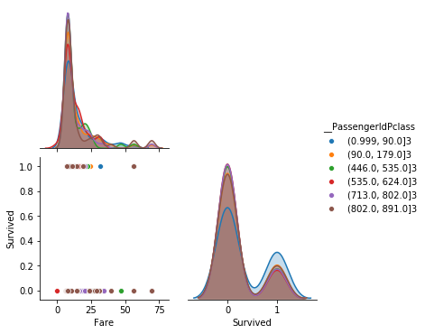


    __PassengerId*Pclass=Fare


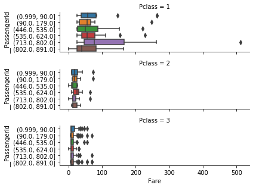


    __PassengerId*Pclass=Survived


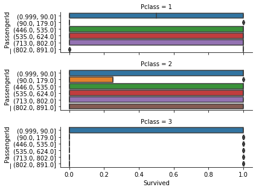


    
     
    


<hr>


<h3 align="center">__Fare - Survived</h3>


    
      
    relation  2  :  10
    
    
     PassengerId
    Anova faled to reject => no difference 
    
    
     Fare
    
    
     Survived
    
    
     Age
    Anova faled to reject => no difference 
    
    
     SibSp
    Anova passed


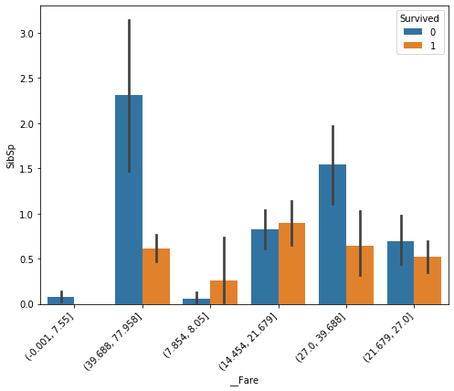


    turkeyHSD
                                  group2  meandiff   p-adj   lower   upper  reject
    group1                                                                        
    (-0.001, 7.55]1    (39.688, 77.958]0    2.3095  0.0010  1.1120  3.5071    True
    (-0.001, 7.55]0    (39.688, 77.958]0    2.2336  0.0010  1.5130  2.9541    True
    (21.679, 27.0]1    (39.688, 77.958]0    1.7878  0.0010  0.9825  2.5930    True
    (27.0, 39.688]1    (39.688, 77.958]0    1.6625  0.0010  0.7920  2.5329    True
    (21.679, 27.0]0    (39.688, 77.958]0    1.6118  0.0010  0.7933  2.4304    True
    (-0.001, 7.55]1      (27.0, 39.688]0    1.5439  0.0010  0.3842  2.7035    True
    (14.454, 21.679]0  (39.688, 77.958]0    1.4860  0.0010  0.6998  2.2722    True
    (-0.001, 7.55]0      (27.0, 39.688]0    1.4679  0.0010  0.8122  2.1236    True
    (14.454, 21.679]1  (39.688, 77.958]0    1.4176  0.0010  0.5669  2.2684    True
    (21.679, 27.0]1      (27.0, 39.688]0    1.0221  0.0010  0.2743  1.7699    True
    (21.679, 27.0]0      (27.0, 39.688]0    0.8462  0.0153  0.0841  1.6083    True
    (-0.001, 7.55]0    (14.454, 21.679]1    0.8159  0.0203  0.0643  1.5676    True
    (-0.001, 7.55]0    (14.454, 21.679]0    0.7476  0.0167  0.0698  1.4253    True
    (14.454, 21.679]0     (7.854, 8.05]0   -0.7661  0.0095 -1.4315 -0.1006    True
    (14.454, 21.679]1     (7.854, 8.05]0   -0.8344  0.0127 -1.5750 -0.0939    True
    (27.0, 39.688]0      (27.0, 39.688]1   -0.8968  0.0179 -1.7144 -0.0792    True
    (27.0, 39.688]0    (39.688, 77.958]1   -0.9268  0.0028 -1.6703 -0.1834    True
    (27.0, 39.688]0       (7.854, 8.05]1   -1.2807  0.0018 -2.2802 -0.2812    True
    (27.0, 39.688]0       (7.854, 8.05]0   -1.4864  0.0010 -2.1293 -0.8434    True
    (39.688, 77.958]0  (39.688, 77.958]1   -1.6925  0.0010 -2.4937 -0.8913    True
    (39.688, 77.958]0     (7.854, 8.05]1   -2.0464  0.0010 -3.0896 -1.0032    True
    (39.688, 77.958]0     (7.854, 8.05]0   -2.2521  0.0010 -2.9610 -1.5431    True
    
    
     Parch
    Anova passed


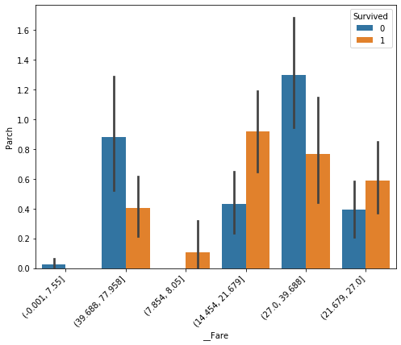


    turkeyHSD
                                  group2  meandiff   p-adj   lower   upper  reject
    group1                                                                        
    (-0.001, 7.55]1      (27.0, 39.688]0    1.2982  0.0010  0.4834  2.1131    True
    (-0.001, 7.55]0      (27.0, 39.688]0    1.2729  0.0010  0.8122  1.7337    True
    (-0.001, 7.55]1    (14.454, 21.679]1    0.9189  0.0228  0.0642  1.7737    True
    (21.679, 27.0]0      (27.0, 39.688]0    0.9029  0.0010  0.3674  1.4384    True
    (-0.001, 7.55]0    (14.454, 21.679]1    0.8936  0.0010  0.3655  1.4217    True
    (-0.001, 7.55]1    (39.688, 77.958]0    0.8810  0.0309  0.0395  1.7224    True
    (14.454, 21.679]0    (27.0, 39.688]0    0.8669  0.0010  0.3559  1.3779    True
    (-0.001, 7.55]0    (39.688, 77.958]0    0.8556  0.0010  0.3494  1.3619    True
    (-0.001, 7.55]0      (27.0, 39.688]1    0.7394  0.0010  0.1956  1.2832    True
    (21.679, 27.0]1      (27.0, 39.688]0    0.7113  0.0010  0.1858  1.2367    True
    (-0.001, 7.55]0      (21.679, 27.0]1    0.5616  0.0106  0.0699  1.0533    True
    (21.679, 27.0]1       (7.854, 8.05]0   -0.5870  0.0043 -1.0703 -0.1037    True
    (27.0, 39.688]1       (7.854, 8.05]0   -0.7647  0.0010 -1.3009 -0.2285    True
    (39.688, 77.958]0     (7.854, 8.05]1   -0.7757  0.0273 -1.5087 -0.0427    True
    (14.454, 21.679]1     (7.854, 8.05]1   -0.8137  0.0199 -1.5619 -0.0654    True
    (39.688, 77.958]0     (7.854, 8.05]0   -0.8810  0.0010 -1.3791 -0.3828    True
    (27.0, 39.688]0    (39.688, 77.958]1   -0.8940  0.0010 -1.4163 -0.3716    True
    (14.454, 21.679]1     (7.854, 8.05]0   -0.9189  0.0010 -1.4393 -0.3986    True
    (27.0, 39.688]0       (7.854, 8.05]1   -1.1930  0.0010 -1.8953 -0.4907    True
    (27.0, 39.688]0       (7.854, 8.05]0   -1.2982  0.0010 -1.7500 -0.8465    True
    
    
     Pclass
    Anova passed


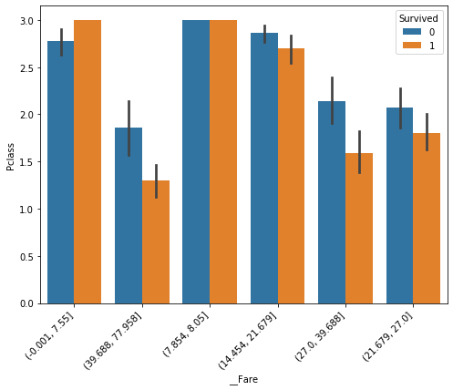


    turkeyHSD
                                  group2  meandiff   p-adj   lower   upper  reject
    group1                                                                        
    (39.688, 77.958]1     (7.854, 8.05]1    1.7021  0.0010  1.1581  2.2461    True
    (39.688, 77.958]1     (7.854, 8.05]0    1.7021  0.0010  1.3399  2.0644    True
    (27.0, 39.688]1       (7.854, 8.05]1    1.4118  0.0010  0.8386  1.9849    True
    (27.0, 39.688]1       (7.854, 8.05]0    1.4118  0.0010  1.0071  1.8165    True
    (21.679, 27.0]1       (7.854, 8.05]1    1.1957  0.0010  0.6500  1.7413    True
    (21.679, 27.0]1       (7.854, 8.05]0    1.1957  0.0010  0.8309  1.5604    True
    (39.688, 77.958]0     (7.854, 8.05]1    1.1429  0.0010  0.5896  1.6961    True
    (39.688, 77.958]0     (7.854, 8.05]0    1.1429  0.0010  0.7669  1.5188    True
    (21.679, 27.0]0       (7.854, 8.05]0    0.9302  0.0010  0.5572  1.3032    True
    (21.679, 27.0]0       (7.854, 8.05]1    0.9302  0.0010  0.3790  1.4815    True
    (27.0, 39.688]0       (7.854, 8.05]1    0.8596  0.0010  0.3296  1.3897    True
    (27.0, 39.688]0       (7.854, 8.05]0    0.8596  0.0010  0.5187  1.2006    True
    (21.679, 27.0]0      (27.0, 39.688]1   -0.4815  0.0303 -0.9407 -0.0223    True
    (21.679, 27.0]1    (39.688, 77.958]1   -0.5065  0.0040 -0.9215 -0.0915    True
    (27.0, 39.688]0      (27.0, 39.688]1   -0.5521  0.0020 -0.9857 -0.1185    True
    (39.688, 77.958]0  (39.688, 77.958]1   -0.5593  0.0011 -0.9841 -0.1344    True
    (14.454, 21.679]1    (27.0, 39.688]0   -0.5624  0.0010 -0.9848 -0.1399    True
    (-0.001, 7.55]0      (27.0, 39.688]0   -0.6318  0.0010 -0.9795 -0.2841    True
    (14.454, 21.679]1    (21.679, 27.0]0   -0.6329  0.0010 -1.0816 -0.1842    True
    (-0.001, 7.55]0      (21.679, 27.0]0   -0.7024  0.0010 -1.0816 -0.3232    True
    (14.454, 21.679]0    (27.0, 39.688]0   -0.7224  0.0010 -1.1081 -0.3367    True
    (21.679, 27.0]0    (39.688, 77.958]1   -0.7719  0.0010 -1.1942 -0.3496    True
    (14.454, 21.679]0    (21.679, 27.0]0   -0.7930  0.0010 -1.2073 -0.3787    True
    (27.0, 39.688]0    (39.688, 77.958]1   -0.8425  0.0010 -1.2367 -0.4482    True
    (14.454, 21.679]1  (39.688, 77.958]0   -0.8456  0.0010 -1.2967 -0.3944    True
    (-0.001, 7.55]1      (27.0, 39.688]0   -0.8596  0.0010 -1.4747 -0.2446    True
    (14.454, 21.679]1    (21.679, 27.0]1   -0.8984  0.0010 -1.3402 -0.4565    True
    (-0.001, 7.55]0    (39.688, 77.958]0   -0.9150  0.0010 -1.2971 -0.5329    True
    (-0.001, 7.55]1      (21.679, 27.0]0   -0.9302  0.0010 -1.5636 -0.2969    True
    (-0.001, 7.55]0      (21.679, 27.0]1   -0.9678  0.0010 -1.3389 -0.5967    True
    (14.454, 21.679]0  (39.688, 77.958]0   -1.0056  0.0010 -1.4225 -0.5887    True
    (14.454, 21.679]0    (21.679, 27.0]1   -1.0584  0.0010 -1.4653 -0.6515    True
    (14.454, 21.679]1    (27.0, 39.688]1   -1.1145  0.0010 -1.5898 -0.6391    True
    (-0.001, 7.55]1    (39.688, 77.958]0   -1.1429  0.0010 -1.7779 -0.5078    True
    (-0.001, 7.55]0      (27.0, 39.688]1   -1.1839  0.0010 -1.5943 -0.7735    True
    (-0.001, 7.55]1      (21.679, 27.0]1   -1.1957  0.0010 -1.8242 -0.5671    True
    (14.454, 21.679]0    (27.0, 39.688]1   -1.2745  0.0010 -1.7175 -0.8315    True
    (14.454, 21.679]1  (39.688, 77.958]1   -1.4048  0.0010 -1.8446 -0.9651    True
    (-0.001, 7.55]1      (27.0, 39.688]1   -1.4118  0.0010 -2.0643 -0.7593    True
    (-0.001, 7.55]0    (39.688, 77.958]1   -1.4743  0.0010 -1.8429 -1.1057    True
    (14.454, 21.679]0  (39.688, 77.958]1   -1.5649  0.0010 -1.9695 -1.1603    True
    (-0.001, 7.55]1    (39.688, 77.958]1   -1.7021  0.0010 -2.3292 -1.0751    True
    ['SibSp', 'Parch', 'Pclass']


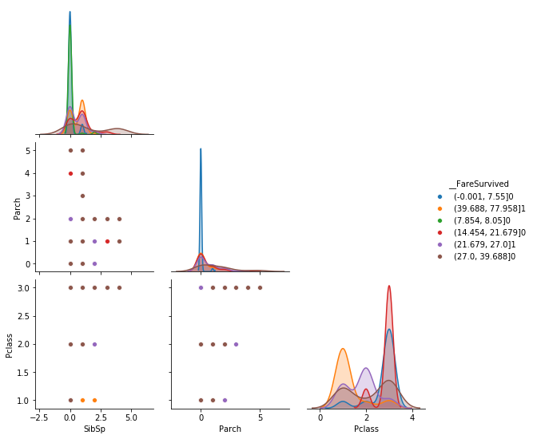


    __Fare*Survived=SibSp


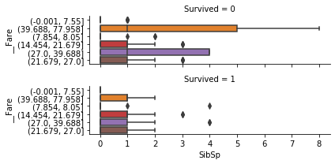


    __Fare*Survived=Parch


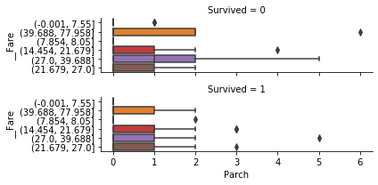


    __Fare*Survived=Pclass


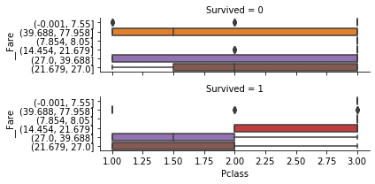


    
     
    


<hr>


<h3 align="center">__Fare - __Age</h3>


    
      
    relation  9  :  10
    
    
     PassengerId
    Anova faled to reject => no difference 
    
    
     Fare
    
    
     Survived
    Anova faled to reject => no difference 
    
    
     Age
    
    
     SibSp
    Anova passed


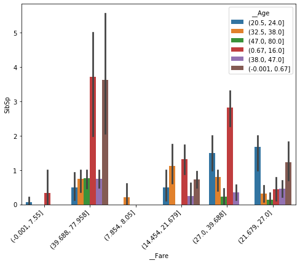


    turkeyHSD
                                                        group2  meandiff  p-adj  \
    group1                                                                        
    (27.0, 39.688](-0.001, 0.67]  (39.688, 77.958](0.67, 16.0]    3.7143  0.001   
    (-0.001, 7.55](-0.001, 0.67]  (39.688, 77.958](0.67, 16.0]    3.7143  0.001   
    (-0.001, 7.55](32.5, 38.0]    (39.688, 77.958](0.67, 16.0]    3.7143  0.001   
    (-0.001, 7.55](47.0, 80.0]    (39.688, 77.958](0.67, 16.0]    3.7143  0.001   
    (-0.001, 7.55](38.0, 47.0]    (39.688, 77.958](0.67, 16.0]    3.7143  0.001   
    ...                                                    ...       ...    ...   
    (39.688, 77.958](0.67, 16.0]   (7.854, 8.05](-0.001, 0.67]   -3.7143  0.001   
    (39.688, 77.958](0.67, 16.0]     (7.854, 8.05](0.67, 16.0]   -3.7143  0.001   
    (39.688, 77.958](0.67, 16.0]     (7.854, 8.05](20.5, 24.0]   -3.7143  0.001   
    (39.688, 77.958](0.67, 16.0]     (7.854, 8.05](38.0, 47.0]   -3.7143  0.001   
    (39.688, 77.958](0.67, 16.0]     (7.854, 8.05](47.0, 80.0]   -3.7143  0.001   
    
                                   lower   upper  reject  
    group1                                                
    (27.0, 39.688](-0.001, 0.67]  1.7210  5.7076    True  
    (-0.001, 7.55](-0.001, 0.67]  1.9838  5.4448    True  
    (-0.001, 7.55](32.5, 38.0]    1.6367  5.7919    True  
    (-0.001, 7.55](47.0, 80.0]    1.1303  6.2983    True  
    (-0.001, 7.55](38.0, 47.0]    1.6367  5.7919    True  
    ...                              ...     ...     ...  
    (39.688, 77.958](0.67, 16.0] -5.4345 -1.9941    True  
    (39.688, 77.958](0.67, 16.0] -6.5592 -0.8694    True  
    (39.688, 77.958](0.67, 16.0] -5.6750 -1.7536    True  
    (39.688, 77.958](0.67, 16.0] -5.8480 -1.5806    True  
    (39.688, 77.958](0.67, 16.0] -6.5592 -0.8694    True  
    
    [91 rows x 6 columns]
    
    
     Parch
    Anova passed


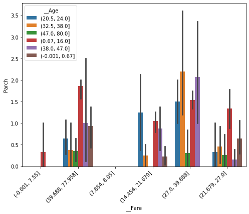


    turkeyHSD
                                                       group2  meandiff   p-adj  \
    group1                                                                        
    (-0.001, 7.55](32.5, 38.0]     (27.0, 39.688](32.5, 38.0]    2.2000  0.0010   
    (-0.001, 7.55](-0.001, 0.67]   (27.0, 39.688](32.5, 38.0]    2.2000  0.0010   
    (27.0, 39.688](-0.001, 0.67]   (27.0, 39.688](32.5, 38.0]    2.2000  0.0010   
    (-0.001, 7.55](47.0, 80.0]     (27.0, 39.688](32.5, 38.0]    2.2000  0.0149   
    (-0.001, 7.55](38.0, 47.0]     (27.0, 39.688](32.5, 38.0]    2.2000  0.0010   
    ...                                                   ...       ...     ...   
    (27.0, 39.688](38.0, 47.0]    (7.854, 8.05](-0.001, 0.67]   -2.0714  0.0010   
    (27.0, 39.688](32.5, 38.0]      (7.854, 8.05](32.5, 38.0]   -2.2000  0.0010   
    (27.0, 39.688](32.5, 38.0]    (7.854, 8.05](-0.001, 0.67]   -2.2000  0.0010   
    (27.0, 39.688](32.5, 38.0]      (7.854, 8.05](20.5, 24.0]   -2.2000  0.0010   
    (27.0, 39.688](32.5, 38.0]      (7.854, 8.05](38.0, 47.0]   -2.2000  0.0010   
    
                                   lower   upper  reject  
    group1                                                
    (-0.001, 7.55](32.5, 38.0]    0.5175  3.8825    True  
    (-0.001, 7.55](-0.001, 0.67]  0.7429  3.6571    True  
    (27.0, 39.688](-0.001, 0.67]  0.5731  3.8269    True  
    (-0.001, 7.55](47.0, 80.0]    0.1765  4.2235    True  
    (-0.001, 7.55](38.0, 47.0]    0.5175  3.8825    True  
    ...                              ...     ...     ...  
    (27.0, 39.688](38.0, 47.0]   -3.0380 -1.1049    True  
    (27.0, 39.688](32.5, 38.0]   -3.8522 -0.5478    True  
    (27.0, 39.688](32.5, 38.0]   -3.6506 -0.7494    True  
    (27.0, 39.688](32.5, 38.0]   -3.8056 -0.5944    True  
    (27.0, 39.688](32.5, 38.0]   -3.9196 -0.4804    True  
    
    [83 rows x 6 columns]
    
    
     Pclass
    Anova passed


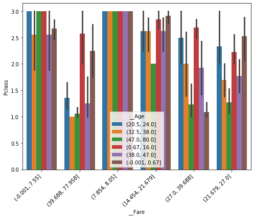


    turkeyHSD
                                                        group2  meandiff  p-adj  \
    group1                                                                        
    (39.688, 77.958](32.5, 38.0]     (7.854, 8.05](47.0, 80.0]    2.0000  0.001   
    (39.688, 77.958](32.5, 38.0]   (7.854, 8.05](-0.001, 0.67]    2.0000  0.001   
    (39.688, 77.958](32.5, 38.0]     (7.854, 8.05](0.67, 16.0]    2.0000  0.001   
    (39.688, 77.958](32.5, 38.0]     (7.854, 8.05](20.5, 24.0]    2.0000  0.001   
    (39.688, 77.958](32.5, 38.0]     (7.854, 8.05](32.5, 38.0]    2.0000  0.001   
    ...                                                    ...       ...    ...   
    (-0.001, 7.55](0.67, 16.0]    (39.688, 77.958](47.0, 80.0]   -1.9412  0.001   
    (-0.001, 7.55](47.0, 80.0]    (39.688, 77.958](47.0, 80.0]   -1.9412  0.001   
    (-0.001, 7.55](0.67, 16.0]    (39.688, 77.958](32.5, 38.0]   -2.0000  0.001   
    (-0.001, 7.55](47.0, 80.0]    (39.688, 77.958](32.5, 38.0]   -2.0000  0.001   
    (-0.001, 7.55](20.5, 24.0]    (39.688, 77.958](32.5, 38.0]   -2.0000  0.001   
    
                                   lower   upper  reject  
    group1                                                
    (39.688, 77.958](32.5, 38.0]  0.5641  3.4359    True  
    (39.688, 77.958](32.5, 38.0]  1.1616  2.8384    True  
    (39.688, 77.958](32.5, 38.0]  0.5641  3.4359    True  
    (39.688, 77.958](32.5, 38.0]  1.0319  2.9681    True  
    (39.688, 77.958](32.5, 38.0]  0.9939  3.0061    True  
    ...                              ...     ...     ...  
    (-0.001, 7.55](0.67, 16.0]   -3.2694 -0.6130    True  
    (-0.001, 7.55](47.0, 80.0]   -3.1198 -0.7625    True  
    (-0.001, 7.55](0.67, 16.0]   -3.4359 -0.5641    True  
    (-0.001, 7.55](47.0, 80.0]   -3.2988 -0.7012    True  
    (-0.001, 7.55](20.5, 24.0]   -2.9400 -1.0600    True  
    
    [184 rows x 6 columns]
    ['SibSp', 'Parch', 'Pclass']


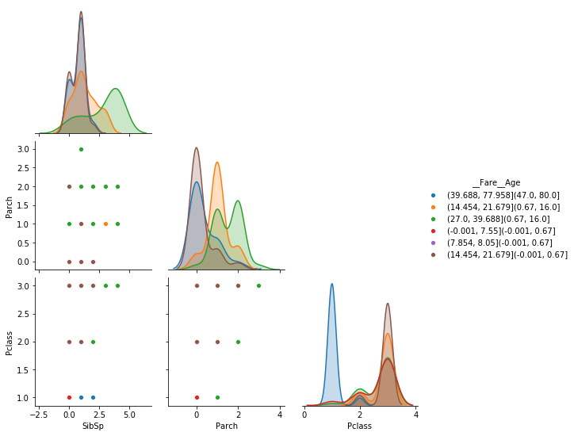


    __Fare*__Age=SibSp


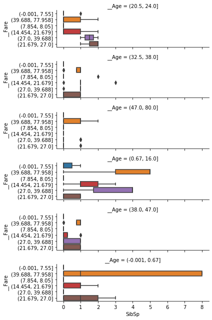


    __Fare*__Age=Parch


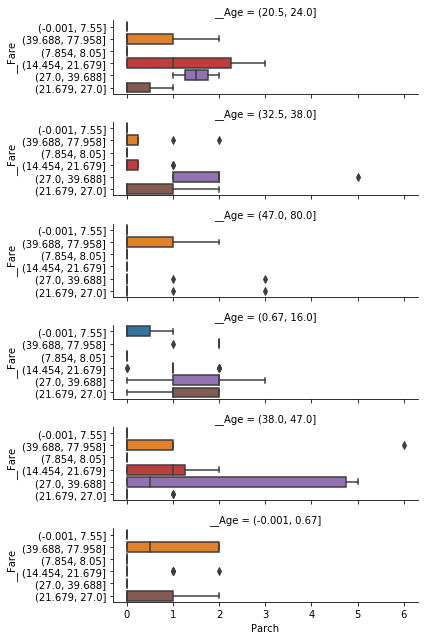


    __Fare*__Age=Pclass


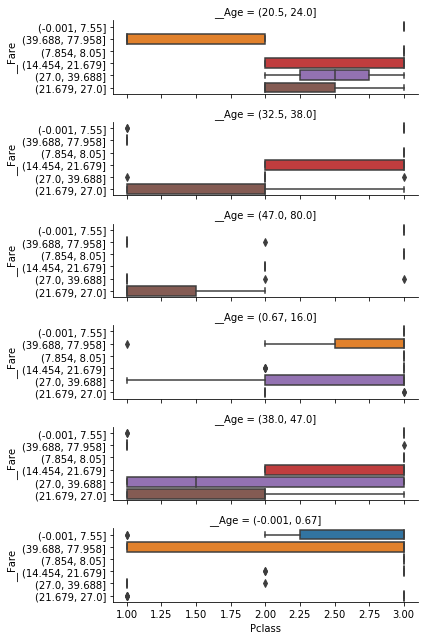


    
     
    


<hr>


<h3 align="center">__Fare - SibSp</h3>


    
      
    relation  5  :  10
    
    
     PassengerId
    Anova faled to reject => no difference 
    
    
     Fare
    
    
     Survived
    Anova passed


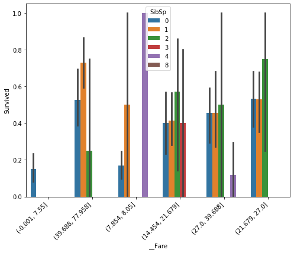


    turkeyHSD
                                  group2  meandiff   p-adj   lower   upper  reject
    group1                                                                        
    (-0.001, 7.55]1    (39.688, 77.958]1    0.7297  0.0364  0.0190  1.4405    True
    (27.0, 39.688]4    (39.688, 77.958]1    0.6121  0.0010  0.1389  1.0853    True
    (-0.001, 7.55]0    (39.688, 77.958]1    0.5786  0.0010  0.2611  0.8961    True
    (-0.001, 7.55]0      (21.679, 27.0]0    0.3808  0.0010  0.0878  0.6737    True
    (-0.001, 7.55]0      (21.679, 27.0]1    0.3782  0.0064  0.0511  0.7054    True
    (-0.001, 7.55]0    (39.688, 77.958]0    0.3766  0.0048  0.0560  0.6972    True
    (-0.001, 7.55]0      (27.0, 39.688]0    0.3034  0.0427  0.0041  0.6027    True
    (39.688, 77.958]0     (7.854, 8.05]0   -0.3595  0.0073 -0.6729 -0.0460    True
    (21.679, 27.0]1       (7.854, 8.05]0   -0.3611  0.0096 -0.6813 -0.0409    True
    (21.679, 27.0]0       (7.854, 8.05]0   -0.3636  0.0010 -0.6487 -0.0784    True
    (39.688, 77.958]1     (7.854, 8.05]0   -0.5614  0.0010 -0.8717 -0.2511    True
    (39.688, 77.958]1  (39.688, 77.958]8   -0.7297  0.0148 -1.3954 -0.0641    True
    
    
     Age
    Anova passed


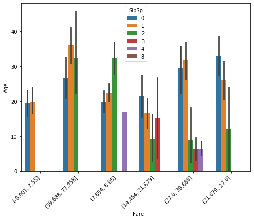


    turkeyHSD
                                  group2  meandiff   p-adj    lower    upper  \
    group1                                                                     
    (21.679, 27.0]3    (39.688, 77.958]1   36.1892  0.0093   4.1496  68.2288   
    (27.0, 39.688]4    (39.688, 77.958]1   29.7186  0.0010  11.8826  47.5546   
    (14.454, 21.679]2  (39.688, 77.958]1   26.9749  0.0196   1.8848  52.0650   
    (27.0, 39.688]4    (39.688, 77.958]0   20.1961  0.0096   2.2823  38.1099   
    (14.454, 21.679]1  (39.688, 77.958]1   19.6131  0.0010   6.1704  33.0558   
    (-0.001, 7.55]0    (39.688, 77.958]1   16.5904  0.0010   4.6222  28.5585   
    (14.454, 21.679]1    (21.679, 27.0]0   16.4771  0.0010   3.8519  29.1023   
    (-0.001, 7.55]0      (21.679, 27.0]0   13.4544  0.0025   2.4122  24.4965   
    (14.454, 21.679]1    (27.0, 39.688]0   12.9314  0.0459   0.0950  25.7678   
    (21.679, 27.0]0       (7.854, 8.05]0  -13.1671  0.0023 -23.9155  -2.4186   
    (39.688, 77.958]1     (7.854, 8.05]0  -16.3031  0.0010 -28.0008  -4.6053   
    (21.679, 27.0]1      (27.0, 39.688]4  -19.5294  0.0184 -37.6114  -1.4474   
    (27.0, 39.688]0      (27.0, 39.688]4  -23.0369  0.0010 -40.4205  -5.6533   
    (27.0, 39.688]1      (27.0, 39.688]4  -25.4158  0.0010 -45.0730  -5.7585   
    (21.679, 27.0]1    (39.688, 77.958]8  -26.0000  0.0353 -51.2656  -0.7344   
    (21.679, 27.0]0      (27.0, 39.688]4  -26.5826  0.0010 -43.8109  -9.3543   
    (39.688, 77.958]0  (39.688, 77.958]8  -26.6667  0.0237 -51.8121  -1.5212   
    (27.0, 39.688]0    (39.688, 77.958]8  -29.5075  0.0038 -54.2781  -4.7369   
    (27.0, 39.688]1    (39.688, 77.958]8  -31.8864  0.0030 -58.3022  -5.4705   
    (21.679, 27.0]0    (39.688, 77.958]8  -33.0532  0.0010 -57.7150  -8.3914   
    (21.679, 27.0]0      (21.679, 27.0]3  -33.0532  0.0298 -64.7585  -1.3479   
    (39.688, 77.958]1  (39.688, 77.958]8  -36.1892  0.0010 -61.2793 -11.0991   
    
                       reject  
    group1                     
    (21.679, 27.0]3      True  
    (27.0, 39.688]4      True  
    (14.454, 21.679]2    True  
    (27.0, 39.688]4      True  
    (14.454, 21.679]1    True  
    (-0.001, 7.55]0      True  
    (14.454, 21.679]1    True  
    (-0.001, 7.55]0      True  
    (14.454, 21.679]1    True  
    (21.679, 27.0]0      True  
    (39.688, 77.958]1    True  
    (21.679, 27.0]1      True  
    (27.0, 39.688]0      True  
    (27.0, 39.688]1      True  
    (21.679, 27.0]1      True  
    (21.679, 27.0]0      True  
    (39.688, 77.958]0    True  
    (27.0, 39.688]0      True  
    (27.0, 39.688]1      True  
    (21.679, 27.0]0      True  
    (21.679, 27.0]0      True  
    (39.688, 77.958]1    True  
    
    
     SibSp
    
    
     Parch
    Anova passed


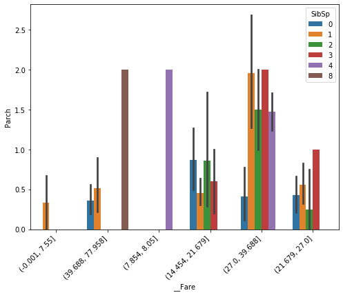


    turkeyHSD
                                  group2  meandiff   p-adj   lower   upper  reject
    group1                                                                        
    (39.688, 77.958]2  (39.688, 77.958]8    2.0000  0.0044  0.3061  3.6939    True
    (-0.001, 7.55]0      (27.0, 39.688]3    2.0000  0.0010  0.6177  3.3823    True
    (-0.001, 7.55]0    (39.688, 77.958]8    2.0000  0.0010  0.9378  3.0622    True
    (-0.001, 7.55]0      (27.0, 39.688]1    1.9545  0.0010  1.3089  2.6002    True
    (21.679, 27.0]2    (39.688, 77.958]8    1.7500  0.0336  0.0561  3.4439    True
    (21.679, 27.0]2      (27.0, 39.688]1    1.7045  0.0060  0.2356  3.1735    True
    (-0.001, 7.55]1    (39.688, 77.958]8    1.6667  0.0125  0.1631  3.1702    True
    (39.688, 77.958]0  (39.688, 77.958]8    1.6389  0.0010  0.5226  2.7552    True
    (-0.001, 7.55]1      (27.0, 39.688]1    1.6212  0.0010  0.3765  2.8659    True
    (27.0, 39.688]0    (39.688, 77.958]8    1.5909  0.0010  0.4912  2.6906    True
    (27.0, 39.688]0      (27.0, 39.688]3    1.5909  0.0096  0.1796  3.0022    True
    (21.679, 27.0]0    (39.688, 77.958]8    1.5745  0.0010  0.4796  2.6693    True
    (21.679, 27.0]0      (27.0, 39.688]3    1.5745  0.0109  0.1669  2.9820    True
    (27.0, 39.688]0      (27.0, 39.688]1    1.5455  0.0010  0.8398  2.2511    True
    (14.454, 21.679]1  (39.688, 77.958]8    1.5435  0.0010  0.4471  2.6399    True
    (14.454, 21.679]1    (27.0, 39.688]3    1.5435  0.0149  0.1347  2.9522    True
    (21.679, 27.0]0      (27.0, 39.688]1    1.5290  0.0010  0.8309  2.2271    True
    (-0.001, 7.55]0      (27.0, 39.688]2    1.5000  0.0172  0.1177  2.8823    True
    (14.454, 21.679]1    (27.0, 39.688]1    1.4980  0.0010  0.7975  2.1986    True
    (39.688, 77.958]1  (39.688, 77.958]8    1.4865  0.0010  0.3726  2.6004    True
    (-0.001, 7.55]0      (27.0, 39.688]4    1.4706  0.0010  0.7533  2.1879    True
    (21.679, 27.0]1      (27.0, 39.688]3    1.4412  0.0451  0.0127  2.8697    True
    (21.679, 27.0]1    (39.688, 77.958]8    1.4412  0.0010  0.3195  2.5628    True
    (21.679, 27.0]1      (27.0, 39.688]1    1.3957  0.0010  0.6563  2.1352    True
    (14.454, 21.679]3    (27.0, 39.688]1    1.3545  0.0436  0.0156  2.6934    True
    (14.454, 21.679]0    (27.0, 39.688]1    1.0879  0.0010  0.3293  1.8464    True
    (27.0, 39.688]0      (27.0, 39.688]4    1.0615  0.0010  0.2897  1.8332    True
    (21.679, 27.0]0      (27.0, 39.688]4    1.0451  0.0010  0.2802  1.8099    True
    (14.454, 21.679]1    (27.0, 39.688]4    1.0141  0.0010  0.2470  1.7811    True
    (21.679, 27.0]1      (27.0, 39.688]4    0.9118  0.0085  0.1090  1.7145    True
    (-0.001, 7.55]0    (14.454, 21.679]0    0.8667  0.0010  0.2936  1.4397    True
    (-0.001, 7.55]0      (21.679, 27.0]1    0.5588  0.0391  0.0113  1.1063    True
    (21.679, 27.0]1       (7.854, 8.05]0   -0.5588  0.0297 -1.0947 -0.0230    True
    (14.454, 21.679]0     (7.854, 8.05]0   -0.8667  0.0010 -1.4286 -0.3047    True
    (27.0, 39.688]4    (39.688, 77.958]1   -0.9571  0.0029 -1.7489 -0.1652    True
    (27.0, 39.688]4    (39.688, 77.958]0   -1.1095  0.0010 -1.9048 -0.3142    True
    (27.0, 39.688]1    (39.688, 77.958]1   -1.4410  0.0010 -2.1686 -0.7135    True
    (27.0, 39.688]4       (7.854, 8.05]0   -1.4706  0.0010 -2.1791 -0.7621    True
    (27.0, 39.688]3    (39.688, 77.958]1   -1.4865  0.0289 -2.9089 -0.0641    True
    (27.0, 39.688]2       (7.854, 8.05]0   -1.5000  0.0164 -2.8777 -0.1223    True
    (27.0, 39.688]1    (39.688, 77.958]0   -1.5934  0.0010 -2.3248 -0.8621    True
    (27.0, 39.688]3    (39.688, 77.958]0   -1.6389  0.0069 -3.0632 -0.2146    True
    (27.0, 39.688]1    (39.688, 77.958]2   -1.9545  0.0010 -3.4235 -0.4856    True
    (27.0, 39.688]1       (7.854, 8.05]0   -1.9545  0.0010 -2.5904 -1.3187    True
    (27.0, 39.688]3    (39.688, 77.958]2   -2.0000  0.0283 -3.9109 -0.0891    True
    (27.0, 39.688]3       (7.854, 8.05]0   -2.0000  0.0010 -3.3777 -0.6223    True
    (39.688, 77.958]8     (7.854, 8.05]0   -2.0000  0.0010 -3.0562 -0.9438    True
    
    
     Pclass
    Anova passed


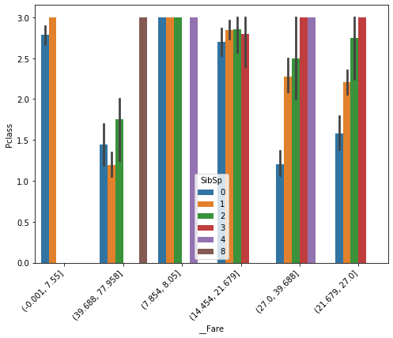


    turkeyHSD
                                  group2  meandiff   p-adj   lower   upper  reject
    group1                                                                        
    (39.688, 77.958]1     (7.854, 8.05]4    1.8108  0.0344  0.0547  3.5670    True
    (39.688, 77.958]1     (7.854, 8.05]2    1.8108  0.0010  0.5528  3.0688    True
    (39.688, 77.958]1     (7.854, 8.05]1    1.8108  0.0010  0.5528  3.0688    True
    (39.688, 77.958]1     (7.854, 8.05]0    1.8108  0.0010  1.4778  2.1438    True
    (39.688, 77.958]1  (39.688, 77.958]8    1.8108  0.0010  1.0966  2.5251    True
    ...                              ...       ...     ...     ...     ...     ...
    (21.679, 27.0]3      (27.0, 39.688]0   -1.7955  0.0010 -2.7004 -0.8905    True
    (-0.001, 7.55]1    (39.688, 77.958]1   -1.8108  0.0010 -2.5735 -1.0482    True
    (27.0, 39.688]4    (39.688, 77.958]1   -1.8108  0.0010 -2.3186 -1.3031    True
    (27.0, 39.688]3    (39.688, 77.958]1   -1.8108  0.0010 -2.7229 -0.8987    True
    (21.679, 27.0]3    (39.688, 77.958]1   -1.8108  0.0010 -2.7229 -0.8987    True
    
    [93 rows x 6 columns]
    ['Survived', 'Age', 'Parch', 'Pclass']


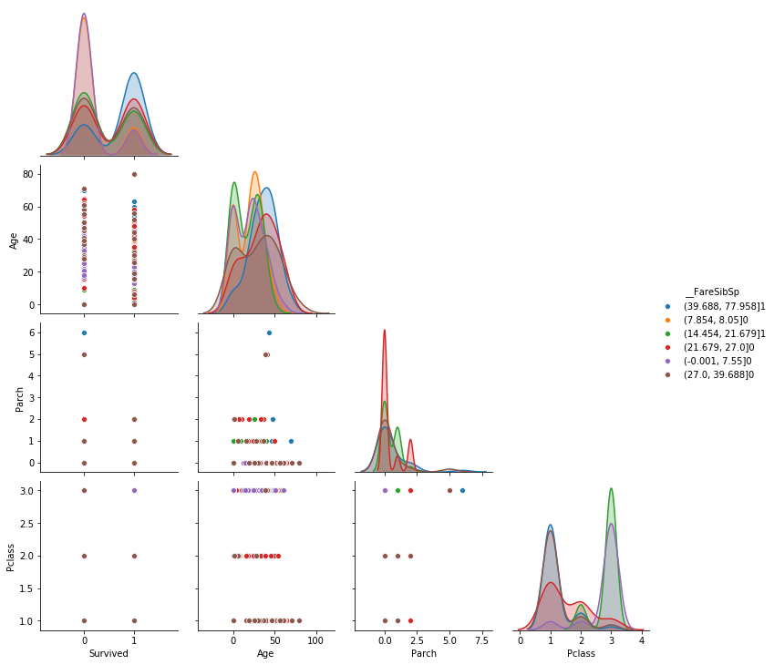


    __Fare*SibSp=Survived


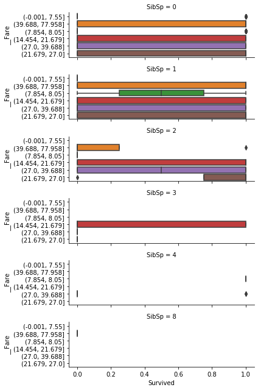


    __Fare*SibSp=Age


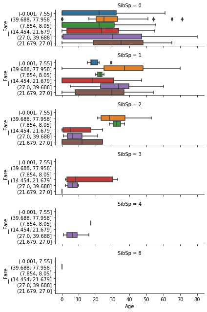


    __Fare*SibSp=Parch


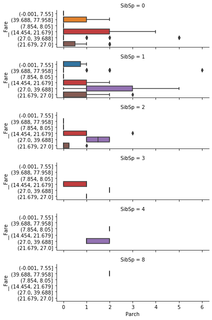


    __Fare*SibSp=Pclass


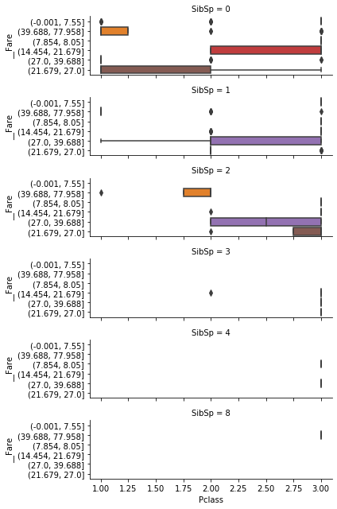


    
     
    


<hr>


<h3 align="center">__Fare - Embarked</h3>


    
      
    relation  4  :  10
    
    
     PassengerId
    Anova faled to reject => no difference 
    
    
     Fare
    
    
     Survived
    Anova passed


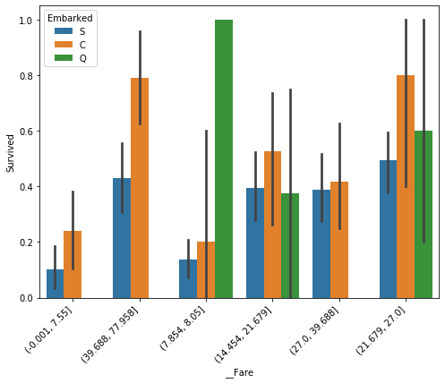


    turkeyHSD
                                  group2  meandiff   p-adj   lower   upper  reject
    group1                                                                        
    (27.0, 39.688]Q       (7.854, 8.05]Q    1.0000  0.0382  0.0239  1.9761    True
    (-0.001, 7.55]S       (7.854, 8.05]Q    0.8983  0.0020  0.1794  1.6172    True
    (27.0, 39.688]Q    (39.688, 77.958]C    0.7917  0.0307  0.0330  1.5504    True
    (-0.001, 7.55]C       (7.854, 8.05]Q    0.7586  0.0424  0.0113  1.5060    True
    (-0.001, 7.55]S    (39.688, 77.958]C    0.6900  0.0010  0.3163  1.0636    True
    (-0.001, 7.55]C    (39.688, 77.958]C    0.5503  0.0011  0.1244  0.9762    True
    (-0.001, 7.55]S    (14.454, 21.679]C    0.4246  0.0308  0.0175  0.8317    True
    (27.0, 39.688]S    (39.688, 77.958]C    0.4046  0.0174  0.0335  0.7756    True
    (14.454, 21.679]S  (39.688, 77.958]C    0.3982  0.0221  0.0263  0.7701    True
    (-0.001, 7.55]S      (21.679, 27.0]S    0.3920  0.0010  0.1264  0.6575    True
    (-0.001, 7.55]S    (39.688, 77.958]S    0.3291  0.0050  0.0516  0.6066    True
    (-0.001, 7.55]S    (14.454, 21.679]S    0.2917  0.0337  0.0099  0.5736    True
    (-0.001, 7.55]S      (27.0, 39.688]S    0.2854  0.0416  0.0047  0.5661    True
    (27.0, 39.688]S       (7.854, 8.05]S   -0.2517  0.0495 -0.5031 -0.0002    True
    (14.454, 21.679]S     (7.854, 8.05]S   -0.2580  0.0397 -0.5107 -0.0053    True
    (39.688, 77.958]S     (7.854, 8.05]S   -0.2954  0.0046 -0.5433 -0.0474    True
    (21.679, 27.0]S       (7.854, 8.05]S   -0.3583  0.0010 -0.5927 -0.1238    True
    (14.454, 21.679]C     (7.854, 8.05]S   -0.3909  0.0455 -0.7784 -0.0034    True
    (39.688, 77.958]C     (7.854, 8.05]S   -0.6562  0.0010 -1.0085 -0.3040    True
    (7.854, 8.05]Q        (7.854, 8.05]S   -0.8646  0.0030 -1.5725 -0.1566    True
    
    
     Age
    Anova passed


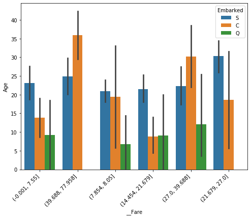


    turkeyHSD
                                  group2  meandiff   p-adj    lower    upper  \
    group1                                                                     
    (21.679, 27.0]Q    (39.688, 77.958]C   35.9167  0.0031   6.4726  65.3607   
    (21.679, 27.0]Q      (21.679, 27.0]S   30.2848  0.0162   2.6644  57.9052   
    (21.679, 27.0]Q      (27.0, 39.688]C   30.2292  0.0372   0.7851  59.6732   
    (14.454, 21.679]C  (39.688, 77.958]C   27.1535  0.0010   8.7610  45.5460   
    (14.454, 21.679]Q  (39.688, 77.958]C   26.9167  0.0153   2.4647  51.3686   
    (-0.001, 7.55]C    (39.688, 77.958]C   22.0891  0.0010   5.5610  38.6171   
    (14.454, 21.679]C    (21.679, 27.0]S   21.5217  0.0010   6.2174  36.8259   
    (14.454, 21.679]C    (27.0, 39.688]C   21.4660  0.0064   3.0735  39.8585   
    (-0.001, 7.55]C      (21.679, 27.0]S   16.4572  0.0016   3.4529  29.4616   
    (14.454, 21.679]C  (39.688, 77.958]S   16.1291  0.0348   0.5087  31.7496   
    (14.454, 21.679]S  (39.688, 77.958]C   14.4986  0.0476   0.0666  28.9307   
    (21.679, 27.0]S       (7.854, 8.05]S   -9.4046  0.0344 -18.5029  -0.3063   
    (39.688, 77.958]C     (7.854, 8.05]S  -15.0365  0.0154 -28.7055  -1.3674   
    
                       reject  
    group1                     
    (21.679, 27.0]Q      True  
    (21.679, 27.0]Q      True  
    (21.679, 27.0]Q      True  
    (14.454, 21.679]C    True  
    (14.454, 21.679]Q    True  
    (-0.001, 7.55]C      True  
    (14.454, 21.679]C    True  
    (14.454, 21.679]C    True  
    (-0.001, 7.55]C      True  
    (14.454, 21.679]C    True  
    (14.454, 21.679]S    True  
    (21.679, 27.0]S      True  
    (39.688, 77.958]C    True  
    
    
     SibSp
    Anova passed


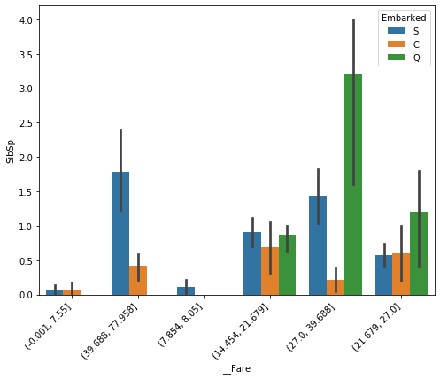


    turkeyHSD
                                  group2  meandiff   p-adj   lower   upper  reject
    group1                                                                        
    (-0.001, 7.55]Q      (27.0, 39.688]Q    3.2000  0.0048  0.5083  5.8917    True
    (-0.001, 7.55]S      (27.0, 39.688]Q    3.1322  0.0010  1.2633  5.0011    True
    (-0.001, 7.55]C      (27.0, 39.688]Q    3.1310  0.0010  1.1880  5.0740    True
    (27.0, 39.688]C      (27.0, 39.688]Q    2.9917  0.0010  1.0191  4.9642    True
    (21.679, 27.0]S      (27.0, 39.688]Q    2.6304  0.0010  0.7800  4.4807    True
    (21.679, 27.0]C      (27.0, 39.688]Q    2.6000  0.0381  0.0623  5.1377    True
    (14.454, 21.679]C    (27.0, 39.688]Q    2.5158  0.0021  0.4990  4.5326    True
    (14.454, 21.679]Q    (27.0, 39.688]Q    2.3250  0.0418  0.0375  4.6125    True
    (14.454, 21.679]S    (27.0, 39.688]Q    2.2984  0.0026  0.4318  4.1649    True
    (-0.001, 7.55]S    (39.688, 77.958]S    1.7168  0.0010  0.9953  2.4383    True
    (-0.001, 7.55]C    (39.688, 77.958]S    1.7156  0.0010  0.8196  2.6117    True
    (27.0, 39.688]C    (39.688, 77.958]S    1.5763  0.0010  0.6179  2.5347    True
    (39.688, 77.958]C  (39.688, 77.958]S    1.3679  0.0010  0.4095  2.3264    True
    (-0.001, 7.55]S      (27.0, 39.688]S    1.3677  0.0010  0.6379  2.0975    True
    (-0.001, 7.55]C      (27.0, 39.688]S    1.3665  0.0010  0.4638  2.2692    True
    (27.0, 39.688]C      (27.0, 39.688]S    1.2272  0.0014  0.2625  2.1918    True
    (21.679, 27.0]S    (39.688, 77.958]S    1.2150  0.0010  0.5431  1.8869    True
    (14.454, 21.679]C  (39.688, 77.958]S    1.1004  0.0279  0.0539  2.1469    True
    (14.454, 21.679]S  (39.688, 77.958]S    0.8830  0.0025  0.1677  1.5983    True
    (21.679, 27.0]S      (27.0, 39.688]S    0.8659  0.0014  0.1851  1.5467    True
    (-0.001, 7.55]S    (14.454, 21.679]S    0.8338  0.0095  0.1012  1.5665    True
    (14.454, 21.679]S     (7.854, 8.05]S   -0.7975  0.0034 -1.4545 -0.1405    True
    (27.0, 39.688]S    (39.688, 77.958]C   -1.0188  0.0264 -1.9835 -0.0542    True
    (27.0, 39.688]S       (7.854, 8.05]S   -1.3313  0.0010 -1.9851 -0.6776    True
    (39.688, 77.958]S     (7.854, 8.05]S   -1.6804  0.0010 -2.3250 -1.0359    True
    (27.0, 39.688]Q    (39.688, 77.958]C   -2.7833  0.0010 -4.7559 -0.8108    True
    (27.0, 39.688]Q       (7.854, 8.05]S   -3.0958  0.0010 -4.9364 -1.2553    True
    (27.0, 39.688]Q       (7.854, 8.05]C   -3.2000  0.0017 -5.7377 -0.6623    True
    (27.0, 39.688]Q       (7.854, 8.05]Q   -3.2000  0.0017 -5.7377 -0.6623    True
    
    
     Parch
    Anova passed


    turkeyHSD
                                  group2  meandiff   p-adj   lower   upper  reject
    group1                                                                        
    (21.679, 27.0]Q      (27.0, 39.688]Q    1.8000  0.0350  0.0561  3.5439    True
    (-0.001, 7.55]S      (27.0, 39.688]Q    1.8000  0.0010  0.5157  3.0843    True
    (-0.001, 7.55]C      (27.0, 39.688]Q    1.7310  0.0010  0.3958  3.0663    True
    (27.0, 39.688]C      (27.0, 39.688]Q    1.6333  0.0038  0.2778  2.9889    True
    (21.679, 27.0]Q      (27.0, 39.688]S    1.4032  0.0165  0.1213  2.6851    True
    (-0.001, 7.55]S      (27.0, 39.688]S    1.4032  0.0010  0.9017  1.9047    True
    (-0.001, 7.55]C      (27.0, 39.688]S    1.3343  0.0010  0.7139  1.9546    True
    (21.679, 27.0]S      (27.0, 39.688]Q    1.2810  0.0462  0.0094  2.5526    True
    (27.0, 39.688]C      (27.0, 39.688]S    1.2366  0.0010  0.5737  1.8995    True
    (14.454, 21.679]Q    (27.0, 39.688]S    1.1532  0.0131  0.1173  2.1891    True
    (21.679, 27.0]S      (27.0, 39.688]S    0.8842  0.0010  0.4164  1.3521    True
    (-0.001, 7.55]S    (14.454, 21.679]C    0.8421  0.0073  0.1148  1.5695    True
    (14.454, 21.679]S    (27.0, 39.688]S    0.7803  0.0010  0.2830  1.2775    True
    (-0.001, 7.55]S    (39.688, 77.958]S    0.6615  0.0010  0.1657  1.1574    True
    (-0.001, 7.55]S    (14.454, 21.679]S    0.6230  0.0024  0.1195  1.1265    True
    (-0.001, 7.55]S      (21.679, 27.0]S    0.5190  0.0167  0.0445  0.9934    True
    (21.679, 27.0]S       (7.854, 8.05]S   -0.4982  0.0047 -0.9170 -0.0793    True
    (14.454, 21.679]S     (7.854, 8.05]S   -0.6021  0.0010 -1.0536 -0.1506    True
    (39.688, 77.958]S     (7.854, 8.05]S   -0.6407  0.0010 -1.0836 -0.1978    True
    (27.0, 39.688]S    (39.688, 77.958]S   -0.7417  0.0010 -1.2312 -0.2522    True
    (14.454, 21.679]C     (7.854, 8.05]S   -0.8213  0.0050 -1.5136 -0.1289    True
    (27.0, 39.688]S    (39.688, 77.958]C   -0.8616  0.0010 -1.5245 -0.1987    True
    (27.0, 39.688]S       (7.854, 8.05]S   -1.3824  0.0010 -1.8317 -0.9331    True
    (27.0, 39.688]S       (7.854, 8.05]C   -1.4032  0.0165 -2.6851 -0.1213    True
    (27.0, 39.688]S       (7.854, 8.05]Q   -1.4032  0.0165 -2.6851 -0.1213    True
    (27.0, 39.688]Q       (7.854, 8.05]S   -1.7792  0.0010 -3.0440 -0.5143    True
    (27.0, 39.688]Q       (7.854, 8.05]C   -1.8000  0.0350 -3.5439 -0.0561    True
    (27.0, 39.688]Q       (7.854, 8.05]Q   -1.8000  0.0350 -3.5439 -0.0561    True
    
    
     Pclass
    Anova passed


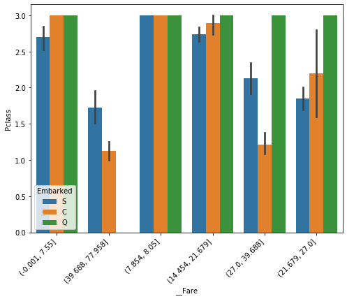


    turkeyHSD
                                  group2  meandiff   p-adj   lower   upper  reject
    group1                                                                        
    (39.688, 77.958]C     (7.854, 8.05]S    1.8750  0.0010  1.4141  2.3359    True
    (39.688, 77.958]C     (7.854, 8.05]Q    1.8750  0.0010  0.8823  2.8677    True
    (39.688, 77.958]C     (7.854, 8.05]C    1.8750  0.0010  0.8823  2.8677    True
    (27.0, 39.688]C       (7.854, 8.05]S    1.7917  0.0010  1.3308  2.2525    True
    (27.0, 39.688]C      (27.0, 39.688]Q    1.7917  0.0010  0.7989  2.7844    True
    (27.0, 39.688]C       (7.854, 8.05]C    1.7917  0.0010  0.7989  2.7844    True
    (27.0, 39.688]C       (7.854, 8.05]Q    1.7917  0.0010  0.7989  2.7844    True
    (39.688, 77.958]S     (7.854, 8.05]S    1.2769  0.0010  0.9525  1.6013    True
    (39.688, 77.958]S     (7.854, 8.05]Q    1.2769  0.0010  0.3397  2.2141    True
    (39.688, 77.958]S     (7.854, 8.05]C    1.2769  0.0010  0.3397  2.2141    True
    (21.679, 27.0]S       (7.854, 8.05]C    1.1519  0.0024  0.2206  2.0832    True
    (21.679, 27.0]S       (7.854, 8.05]Q    1.1519  0.0024  0.2206  2.0832    True
    (21.679, 27.0]S       (7.854, 8.05]S    1.1519  0.0010  0.8451  1.4587    True
    (21.679, 27.0]S      (27.0, 39.688]Q    1.1519  0.0024  0.2206  2.0832    True
    (27.0, 39.688]C      (27.0, 39.688]S    0.9207  0.0010  0.4352  1.4062    True
    (27.0, 39.688]S       (7.854, 8.05]S    0.8710  0.0010  0.5419  1.2000    True
    (39.688, 77.958]C  (39.688, 77.958]S    0.5981  0.0023  0.1157  1.0804    True
    (27.0, 39.688]C    (39.688, 77.958]S    0.5147  0.0231  0.0324  0.9971    True
    (27.0, 39.688]S    (39.688, 77.958]S   -0.4060  0.0102 -0.7644 -0.0475    True
    (-0.001, 7.55]S      (27.0, 39.688]S   -0.5659  0.0010 -0.9332 -0.1986    True
    (14.454, 21.679]S    (27.0, 39.688]S   -0.6087  0.0010 -0.9729 -0.2445    True
    (21.679, 27.0]S      (27.0, 39.688]C   -0.6398  0.0010 -1.1105 -0.1691    True
    (21.679, 27.0]S    (39.688, 77.958]C   -0.7231  0.0010 -1.1938 -0.2524    True
    (14.454, 21.679]C    (27.0, 39.688]S   -0.7657  0.0010 -1.2952 -0.2362    True
    (-0.001, 7.55]S      (21.679, 27.0]S   -0.8468  0.0010 -1.1943 -0.4993    True
    (14.454, 21.679]Q    (27.0, 39.688]S   -0.8710  0.0083 -1.6296 -0.1123    True
    (-0.001, 7.55]C      (27.0, 39.688]S   -0.8710  0.0010 -1.3253 -0.4167    True
    (14.454, 21.679]S    (21.679, 27.0]S   -0.8896  0.0010 -1.2338 -0.5454    True
    (-0.001, 7.55]S    (39.688, 77.958]S   -0.9718  0.0010 -1.3350 -0.6087    True
    (27.0, 39.688]S    (39.688, 77.958]C   -1.0040  0.0010 -1.4895 -0.5185    True
    (14.454, 21.679]S  (39.688, 77.958]S   -1.0146  0.0010 -1.3746 -0.6546    True
    (14.454, 21.679]C    (21.679, 27.0]S   -1.0466  0.0010 -1.5626 -0.5306    True
    (21.679, 27.0]C    (39.688, 77.958]C   -1.0750  0.0191 -2.0677 -0.0823    True
    (-0.001, 7.55]C      (21.679, 27.0]S   -1.1519  0.0010 -1.5904 -0.7134    True
    (14.454, 21.679]Q    (21.679, 27.0]S   -1.1519  0.0010 -1.9012 -0.4026    True
    (21.679, 27.0]Q      (21.679, 27.0]S   -1.1519  0.0024 -2.0832 -0.2206    True
    (-0.001, 7.55]Q      (21.679, 27.0]S   -1.1519  0.0131 -2.1869 -0.1169    True
    (14.454, 21.679]C  (39.688, 77.958]S   -1.1717  0.0010 -1.6983 -0.6450    True
    (-0.001, 7.55]C    (39.688, 77.958]S   -1.2769  0.0010 -1.7279 -0.8260    True
    (-0.001, 7.55]Q    (39.688, 77.958]S   -1.2769  0.0028 -2.3172 -0.2366    True
    (27.0, 39.688]Q    (39.688, 77.958]S   -1.2769  0.0010 -2.2141 -0.3397    True
    (21.679, 27.0]Q    (39.688, 77.958]S   -1.2769  0.0010 -2.2141 -0.3397    True
    (14.454, 21.679]Q  (39.688, 77.958]S   -1.2769  0.0010 -2.0336 -0.5203    True
    (-0.001, 7.55]S      (27.0, 39.688]C   -1.4866  0.0010 -1.9755 -0.9977    True
    (14.454, 21.679]S    (27.0, 39.688]C   -1.5294  0.0010 -2.0160 -1.0428    True
    (-0.001, 7.55]S    (39.688, 77.958]C   -1.5699  0.0010 -2.0588 -1.0810    True
    (14.454, 21.679]S  (39.688, 77.958]C   -1.6127  0.0010 -2.0993 -1.1261    True
    (14.454, 21.679]C    (27.0, 39.688]C   -1.6864  0.0010 -2.3065 -1.0663    True
    (14.454, 21.679]C  (39.688, 77.958]C   -1.7697  0.0010 -2.3899 -1.1496    True
    (14.454, 21.679]Q    (27.0, 39.688]C   -1.7917  0.0010 -2.6161 -0.9672    True
    (-0.001, 7.55]Q      (27.0, 39.688]C   -1.7917  0.0010 -2.8823 -0.7010    True
    (-0.001, 7.55]C      (27.0, 39.688]C   -1.7917  0.0010 -2.3489 -1.2344    True
    (21.679, 27.0]Q      (27.0, 39.688]C   -1.7917  0.0010 -2.7844 -0.7989    True
    (14.454, 21.679]Q  (39.688, 77.958]C   -1.8750  0.0010 -2.6994 -1.0506    True
    (21.679, 27.0]Q    (39.688, 77.958]C   -1.8750  0.0010 -2.8677 -0.8823    True
    (27.0, 39.688]Q    (39.688, 77.958]C   -1.8750  0.0010 -2.8677 -0.8823    True
    (-0.001, 7.55]Q    (39.688, 77.958]C   -1.8750  0.0010 -2.9656 -0.7844    True
    (-0.001, 7.55]C    (39.688, 77.958]C   -1.8750  0.0010 -2.4323 -1.3177    True
    ['Survived', 'Age', 'SibSp', 'Parch', 'Pclass']


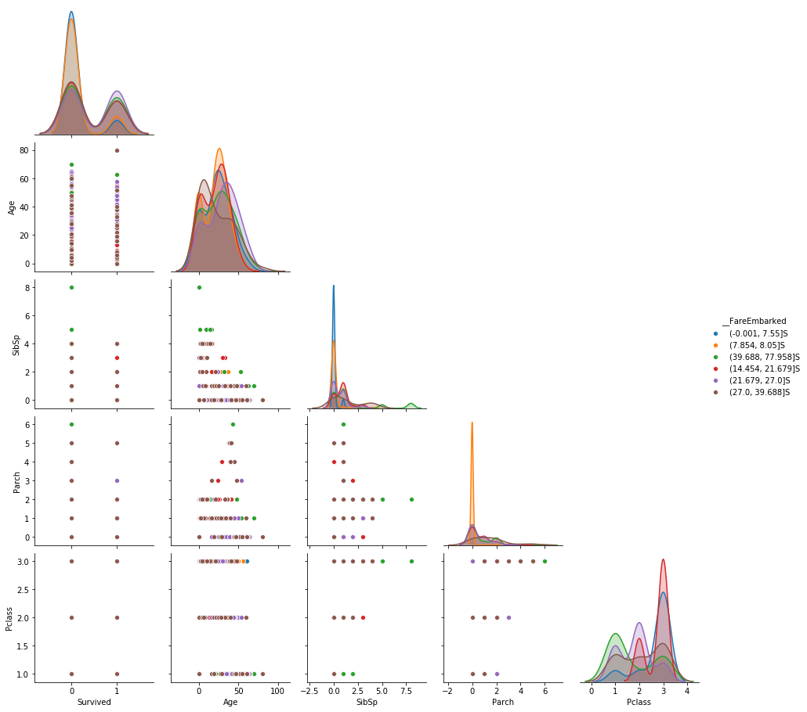


    __Fare*Embarked=Survived


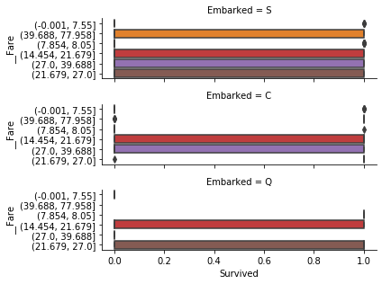


    __Fare*Embarked=Age


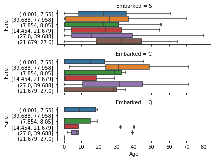


    __Fare*Embarked=SibSp


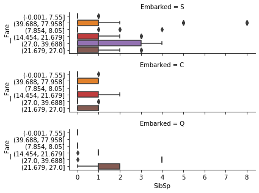


    __Fare*Embarked=Parch


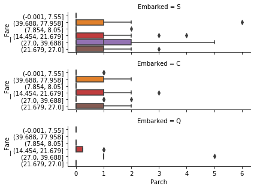


    __Fare*Embarked=Pclass


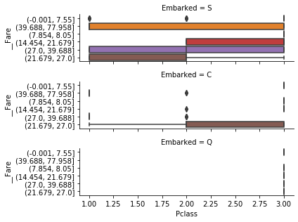


    
     
    


<hr>


<h3 align="center">__Fare - Parch</h3>


    
      
    relation  6  :  10
    
    
     PassengerId
    Anova faled to reject => no difference 
    
    
     Fare
    
    
     Survived
    Anova passed


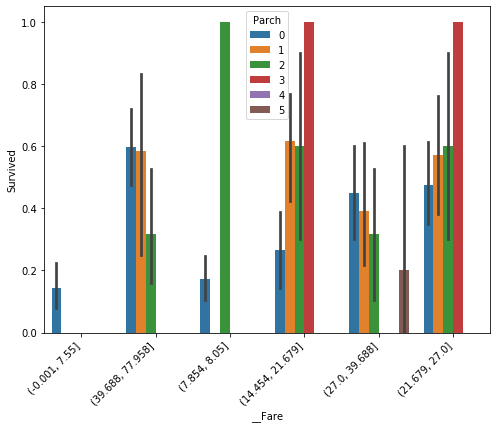


    turkeyHSD
                                  group2  meandiff   p-adj   lower   upper  reject
    group1                                                                        
    (-0.001, 7.55]0    (14.454, 21.679]1    0.4709  0.0010  0.1104  0.8315    True
    (-0.001, 7.55]0    (39.688, 77.958]0    0.4520  0.0010  0.1779  0.7262    True
    (-0.001, 7.55]0      (21.679, 27.0]1    0.4270  0.0167  0.0346  0.8194    True
    (14.454, 21.679]0  (39.688, 77.958]0    0.3312  0.0273  0.0157  0.6466    True
    (-0.001, 7.55]0      (21.679, 27.0]0    0.3292  0.0034  0.0551  0.6033    True
    (21.679, 27.0]0       (7.854, 8.05]0   -0.3023  0.0089 -0.5687 -0.0359    True
    (21.679, 27.0]1       (7.854, 8.05]0   -0.4000  0.0336 -0.7871 -0.0129    True
    (39.688, 77.958]0     (7.854, 8.05]0   -0.4251  0.0010 -0.6915 -0.1587    True
    (14.454, 21.679]1     (7.854, 8.05]0   -0.4440  0.0015 -0.7987 -0.0892    True
    
    
     Age
    Anova passed


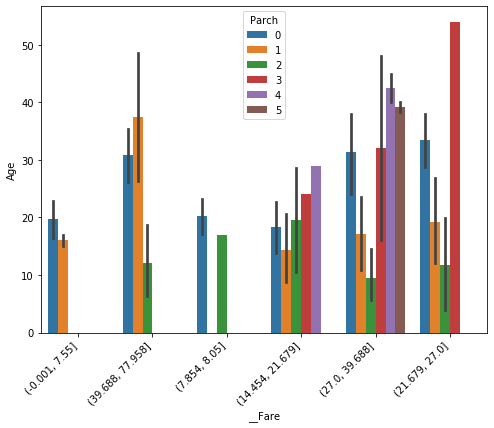


    turkeyHSD
                                  group2  meandiff   p-adj    lower    upper  \
    group1                                                                     
    (27.0, 39.688]2    (39.688, 77.958]1   28.0353  0.0017   5.5570  50.5136   
    (14.454, 21.679]1  (39.688, 77.958]1   23.1923  0.0163   1.9176  44.4671   
    (27.0, 39.688]2    (39.688, 77.958]0   21.3423  0.0010   5.1934  37.4912   
    (14.454, 21.679]1    (21.679, 27.0]0   19.2011  0.0010   4.7744  33.6277   
    (14.454, 21.679]1    (27.0, 39.688]0   17.0173  0.0128   1.6603  32.3743   
    (14.454, 21.679]1  (39.688, 77.958]0   16.4993  0.0078   2.0727  30.9260   
    (14.454, 21.679]0    (21.679, 27.0]0   15.1312  0.0011   3.2553  27.0071   
    (-0.001, 7.55]0      (21.679, 27.0]0   13.8254  0.0010   3.5061  24.1447   
    (14.454, 21.679]0  (39.688, 77.958]0   12.4295  0.0285   0.5535  24.3054   
    (-0.001, 7.55]0      (27.0, 39.688]0   11.6417  0.0472   0.0573  23.2260   
    (-0.001, 7.55]0    (39.688, 77.958]0   11.1237  0.0191   0.8044  21.4430   
    (39.688, 77.958]0     (7.854, 8.05]0  -10.6308  0.0241 -20.6602  -0.6014   
    (21.679, 27.0]0       (7.854, 8.05]0  -13.3326  0.0010 -23.3620  -3.3032   
    (21.679, 27.0]0      (27.0, 39.688]1  -16.4653  0.0156 -31.5242  -1.4064   
    (39.688, 77.958]0  (39.688, 77.958]2  -18.6491  0.0066 -34.7980  -2.5002   
    (27.0, 39.688]0    (39.688, 77.958]2  -19.1671  0.0096 -36.1523  -2.1820   
    (21.679, 27.0]0    (39.688, 77.958]2  -21.3509  0.0010 -37.4998  -5.2020   
    (21.679, 27.0]0      (21.679, 27.0]2  -21.7588  0.0305 -42.6590  -0.8586   
    (27.0, 39.688]0      (27.0, 39.688]2  -21.8603  0.0010 -38.8454  -4.8751   
    (21.679, 27.0]0      (27.0, 39.688]2  -24.0440  0.0010 -40.1929  -7.8951   
    (39.688, 77.958]1  (39.688, 77.958]2  -25.3421  0.0098 -47.8204  -2.8638   
    
                       reject  
    group1                     
    (27.0, 39.688]2      True  
    (14.454, 21.679]1    True  
    (27.0, 39.688]2      True  
    (14.454, 21.679]1    True  
    (14.454, 21.679]1    True  
    (14.454, 21.679]1    True  
    (14.454, 21.679]0    True  
    (-0.001, 7.55]0      True  
    (14.454, 21.679]0    True  
    (-0.001, 7.55]0      True  
    (-0.001, 7.55]0      True  
    (39.688, 77.958]0    True  
    (21.679, 27.0]0      True  
    (21.679, 27.0]0      True  
    (39.688, 77.958]0    True  
    (27.0, 39.688]0      True  
    (21.679, 27.0]0      True  
    (21.679, 27.0]0      True  
    (27.0, 39.688]0      True  
    (21.679, 27.0]0      True  
    (39.688, 77.958]1    True  
    
    
     SibSp
    Anova passed


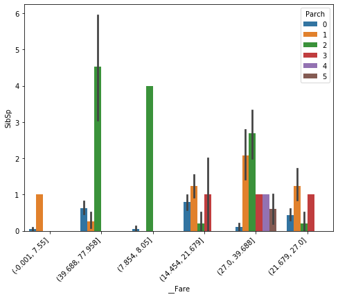


    turkeyHSD
                                  group2  meandiff  p-adj   lower   upper  reject
    group1                                                                       
    (14.454, 21.679]4  (39.688, 77.958]2    4.5263  0.001  1.2490  7.8036    True
    (-0.001, 7.55]0    (39.688, 77.958]2    4.4819  0.001  3.6754  5.2883    True
    (27.0, 39.688]0    (39.688, 77.958]2    4.4263  0.001  3.5363  5.3163    True
    (14.454, 21.679]2  (39.688, 77.958]2    4.3263  0.001  3.0784  5.5743    True
    (21.679, 27.0]2    (39.688, 77.958]2    4.3263  0.001  3.0784  5.5743    True
    ...                              ...       ...    ...     ...     ...     ...
    (27.0, 39.688]2    (39.688, 77.958]0   -2.0526  0.001 -2.8988 -1.2064    True
    (27.0, 39.688]2      (27.0, 39.688]5   -2.0842  0.001 -3.6897 -0.4787    True
    (27.0, 39.688]2    (39.688, 77.958]1   -2.4342  0.001 -3.6121 -1.2564    True
    (27.0, 39.688]2       (7.854, 8.05]0   -2.6271  0.001 -3.4234 -1.8307    True
    (39.688, 77.958]2     (7.854, 8.05]0   -4.4692  0.001 -5.2655 -3.6728    True
    
    [61 rows x 6 columns]
    
    
     Parch
    
    
     Pclass
    Anova passed


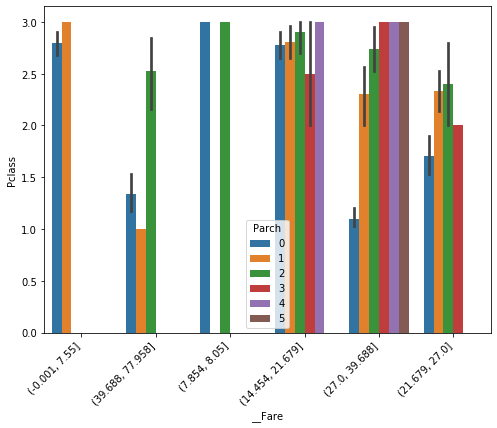


    turkeyHSD
                                  group2  meandiff   p-adj   lower   upper  reject
    group1                                                                        
    (39.688, 77.958]1     (7.854, 8.05]2       2.0  0.0184  0.1493  3.8507    True
    (39.688, 77.958]1     (7.854, 8.05]0       2.0  0.0010  1.4582  2.5418    True
    (27.0, 39.688]0      (27.0, 39.688]3       1.9  0.0010  0.6117  3.1883    True
    (27.0, 39.688]0       (7.854, 8.05]0       1.9  0.0010  1.5696  2.2304    True
    (27.0, 39.688]0      (27.0, 39.688]4       1.9  0.0010  0.6117  3.1883    True
    ...                              ...       ...     ...     ...     ...     ...
    (-0.001, 7.55]1    (39.688, 77.958]1      -2.0  0.0010 -3.3580 -0.6420    True
    (27.0, 39.688]3    (39.688, 77.958]1      -2.0  0.0010 -3.3580 -0.6420    True
    (27.0, 39.688]4    (39.688, 77.958]1      -2.0  0.0010 -3.3580 -0.6420    True
    (27.0, 39.688]5    (39.688, 77.958]1      -2.0  0.0010 -2.9465 -1.0535    True
    (14.454, 21.679]4  (39.688, 77.958]1      -2.0  0.0184 -3.8507 -0.1493    True
    
    [72 rows x 6 columns]
    ['Survived', 'Age', 'SibSp', 'Pclass']


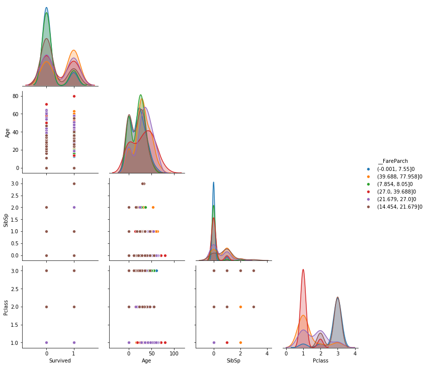


    __Fare*Parch=Survived


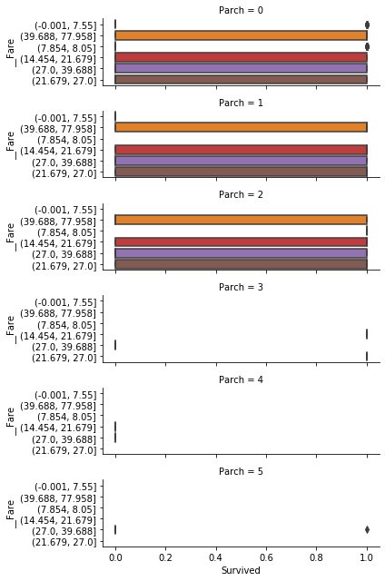


    __Fare*Parch=Age


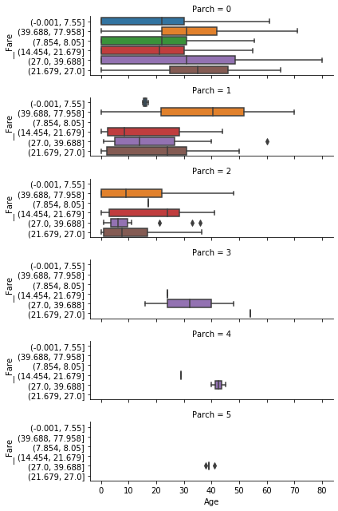


    __Fare*Parch=SibSp


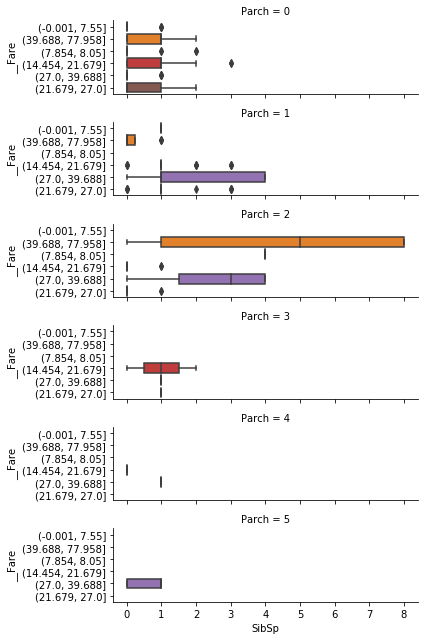


    __Fare*Parch=Pclass


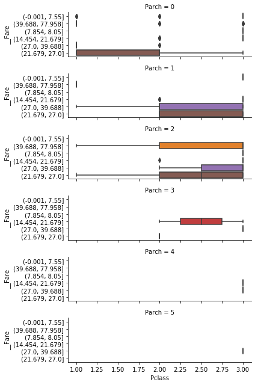


    
     
    


<hr>


<h3 align="center">__Fare - Cabin</h3>


    
      
    relation  50  :  10
    
    
     PassengerId
    Anova faled to reject => no difference 
    
    
     Fare
    
    
     Survived
    Anova passed


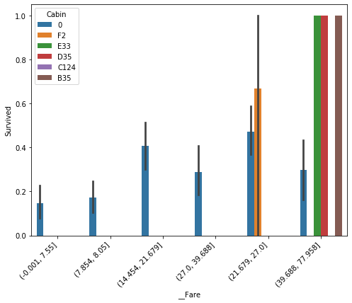


    turkeyHSD
                                  group2  meandiff   p-adj   lower   upper  reject
    group1                                                                        
    (-0.001, 7.55]0      (21.679, 27.0]0    0.3229  0.0010  0.0913  0.5544    True
    (-0.001, 7.55]0    (14.454, 21.679]0    0.2592  0.0058  0.0418  0.4767    True
    (14.454, 21.679]0     (7.854, 8.05]0   -0.2355  0.0123 -0.4441 -0.0270    True
    (21.679, 27.0]0       (7.854, 8.05]0   -0.2992  0.0010 -0.5224 -0.0759    True
    
    
     Age
    Anova faled to reject => no difference 
    
    
     SibSp
    Anova passed


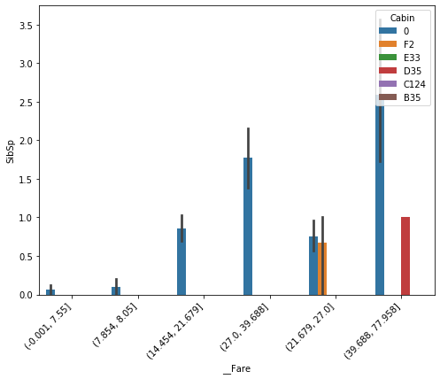


    turkeyHSD
                                  group2  meandiff   p-adj   lower   upper  reject
    group1                                                                        
    (-0.001, 7.55]0    (39.688, 77.958]0    2.5264  0.0010  1.7606  3.2922    True
    (21.679, 27.0]0    (39.688, 77.958]0    1.8446  0.0010  1.0461  2.6431    True
    (14.454, 21.679]0  (39.688, 77.958]0    1.7341  0.0010  0.9657  2.5026    True
    (-0.001, 7.55]0      (27.0, 39.688]0    1.7115  0.0010  1.0538  2.3692    True
    (21.679, 27.0]0      (27.0, 39.688]0    1.0297  0.0010  0.3343  1.7251    True
    (14.454, 21.679]0    (27.0, 39.688]0    0.9192  0.0010  0.2585  1.5799    True
    (-0.001, 7.55]0    (14.454, 21.679]0    0.7923  0.0010  0.1996  1.3849    True
    (-0.001, 7.55]0      (21.679, 27.0]0    0.6818  0.0215  0.0507  1.3129    True
    (21.679, 27.0]0       (7.854, 8.05]0   -0.6548  0.0226 -1.2632 -0.0464    True
    (14.454, 21.679]0     (7.854, 8.05]0   -0.7652  0.0010 -1.3337 -0.1968    True
    (27.0, 39.688]0       (7.854, 8.05]0   -1.6844  0.0010 -2.3204 -1.0485    True
    (39.688, 77.958]0     (7.854, 8.05]0   -2.4994  0.0010 -3.2466 -1.7521    True
    
    
     Parch
    Anova faled to reject => no difference 
    
    
     Pclass
    Anova passed


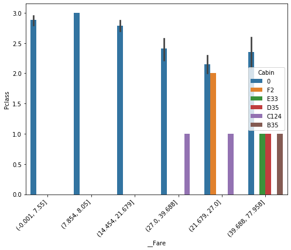


    turkeyHSD
                                      group2  meandiff   p-adj   lower   upper  \
    group1                                                                       
    (39.688, 77.958]E33       (7.854, 8.05]0    2.0000  0.0010  0.8498  3.1502   
    (39.688, 77.958]D35       (7.854, 8.05]0    2.0000  0.0010  0.8498  3.1502   
    (39.688, 77.958]B35       (7.854, 8.05]0    2.0000  0.0010  0.8498  3.1502   
    (27.0, 39.688]C124        (7.854, 8.05]0    2.0000  0.0033  0.3810  3.6190   
    (21.679, 27.0]C124        (7.854, 8.05]0    2.0000  0.0033  0.3810  3.6190   
    (21.679, 27.0]F2          (7.854, 8.05]0    1.0000  0.0269  0.0565  1.9435   
    (21.679, 27.0]0           (7.854, 8.05]0    0.8529  0.0010  0.6021  1.1038   
    (39.688, 77.958]0         (7.854, 8.05]0    0.6486  0.0010  0.3406  0.9567   
    (27.0, 39.688]0           (7.854, 8.05]0    0.5932  0.0010  0.3310  0.8554   
    (14.454, 21.679]0        (27.0, 39.688]0   -0.3839  0.0010 -0.6563 -0.1115   
    (14.454, 21.679]0      (39.688, 77.958]0   -0.4393  0.0010 -0.7561 -0.1225   
    (-0.001, 7.55]0          (27.0, 39.688]0   -0.4796  0.0010 -0.7507 -0.2085   
    (-0.001, 7.55]0        (39.688, 77.958]0   -0.5350  0.0010 -0.8507 -0.2193   
    (14.454, 21.679]0        (21.679, 27.0]0   -0.6436  0.0010 -0.9051 -0.3822   
    (-0.001, 7.55]0          (21.679, 27.0]0   -0.7393  0.0010 -0.9995 -0.4791   
    (39.688, 77.958]0    (39.688, 77.958]B35   -1.3514  0.0091 -2.5211 -0.1816   
    (39.688, 77.958]0    (39.688, 77.958]D35   -1.3514  0.0091 -2.5211 -0.1816   
    (39.688, 77.958]0    (39.688, 77.958]E33   -1.3514  0.0091 -2.5211 -0.1816   
    (27.0, 39.688]0      (39.688, 77.958]B35   -1.4068  0.0044 -2.5653 -0.2482   
    (27.0, 39.688]0      (39.688, 77.958]D35   -1.4068  0.0044 -2.5653 -0.2482   
    (27.0, 39.688]0      (39.688, 77.958]E33   -1.4068  0.0044 -2.5653 -0.2482   
    (14.454, 21.679]0    (39.688, 77.958]D35   -1.7907  0.0010 -2.9433 -0.6381   
    (14.454, 21.679]0    (39.688, 77.958]B35   -1.7907  0.0010 -2.9433 -0.6381   
    (14.454, 21.679]0     (27.0, 39.688]C124   -1.7907  0.0164 -3.4114 -0.1700   
    (14.454, 21.679]0     (21.679, 27.0]C124   -1.7907  0.0164 -3.4114 -0.1700   
    (14.454, 21.679]0    (39.688, 77.958]E33   -1.7907  0.0010 -2.9433 -0.6381   
    (-0.001, 7.55]0       (21.679, 27.0]C124   -1.8864  0.0082 -3.5068 -0.2659   
    (-0.001, 7.55]0      (39.688, 77.958]E33   -1.8864  0.0010 -3.0386 -0.7341   
    (-0.001, 7.55]0      (39.688, 77.958]D35   -1.8864  0.0010 -3.0386 -0.7341   
    (-0.001, 7.55]0      (39.688, 77.958]B35   -1.8864  0.0010 -3.0386 -0.7341   
    (-0.001, 7.55]0       (27.0, 39.688]C124   -1.8864  0.0082 -3.5068 -0.2659   
    
                         reject  
    group1                       
    (39.688, 77.958]E33    True  
    (39.688, 77.958]D35    True  
    (39.688, 77.958]B35    True  
    (27.0, 39.688]C124     True  
    (21.679, 27.0]C124     True  
    (21.679, 27.0]F2       True  
    (21.679, 27.0]0        True  
    (39.688, 77.958]0      True  
    (27.0, 39.688]0        True  
    (14.454, 21.679]0      True  
    (14.454, 21.679]0      True  
    (-0.001, 7.55]0        True  
    (-0.001, 7.55]0        True  
    (14.454, 21.679]0      True  
    (-0.001, 7.55]0        True  
    (39.688, 77.958]0      True  
    (39.688, 77.958]0      True  
    (39.688, 77.958]0      True  
    (27.0, 39.688]0        True  
    (27.0, 39.688]0        True  
    (27.0, 39.688]0        True  
    (14.454, 21.679]0      True  
    (14.454, 21.679]0      True  
    (14.454, 21.679]0      True  
    (14.454, 21.679]0      True  
    (14.454, 21.679]0      True  
    (-0.001, 7.55]0        True  
    (-0.001, 7.55]0        True  
    (-0.001, 7.55]0        True  
    (-0.001, 7.55]0        True  
    (-0.001, 7.55]0        True  
    ['Survived', 'SibSp', 'Pclass']


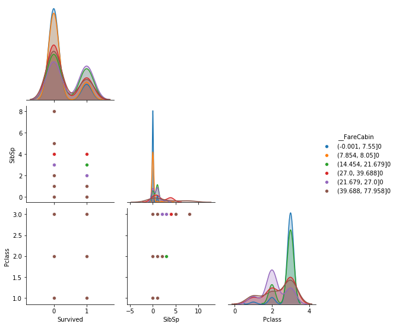


    __Fare*Cabin=Survived


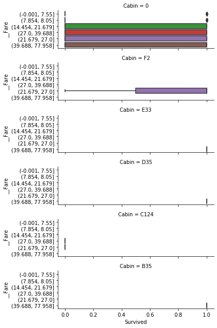


    __Fare*Cabin=SibSp


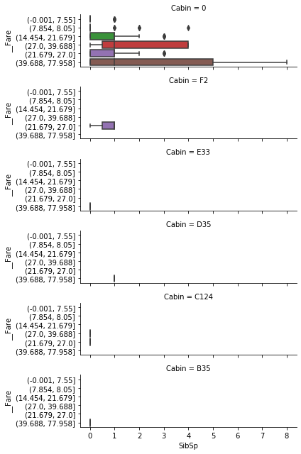


    __Fare*Cabin=Pclass


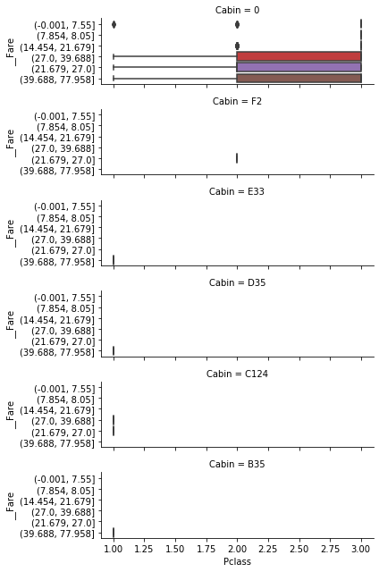


    
     
    


<hr>


<h3 align="center">__Fare - Sex</h3>


    
      
    relation  2  :  10
    
    
     PassengerId
    Anova faled to reject => no difference 
    
    
     Fare
    
    
     Survived
    Anova faled to reject => no difference 
    
    
     Age
    Anova faled to reject => no difference 
    
    
     SibSp
    Anova faled to reject => no difference 
    
    
     Parch
    Anova passed


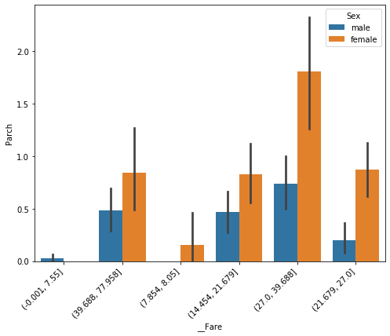


    turkeyHSD
                                            group2  meandiff   p-adj   lower  \
    group1                                                                     
    (-0.001, 7.55]female      (27.0, 39.688]female    1.8065  0.0010  0.8345   
    (-0.001, 7.55]male        (27.0, 39.688]female    1.7824  0.0010  1.2420   
    (21.679, 27.0]male        (27.0, 39.688]female    1.6065  0.0010  1.0196   
    (14.454, 21.679]male      (27.0, 39.688]female    1.3384  0.0010  0.7444   
    (14.454, 21.679]female    (27.0, 39.688]female    0.9772  0.0010  0.3662   
    (21.679, 27.0]female      (27.0, 39.688]female    0.9347  0.0010  0.3170   
    (-0.001, 7.55]male        (21.679, 27.0]female    0.8477  0.0010  0.3493   
    (-0.001, 7.55]male      (39.688, 77.958]female    0.8137  0.0010  0.3063   
    (-0.001, 7.55]male      (14.454, 21.679]female    0.8052  0.0010  0.3152   
    (-0.001, 7.55]male          (27.0, 39.688]male    0.7092  0.0010  0.2742   
    (21.679, 27.0]male      (39.688, 77.958]female    0.6378  0.0101  0.0812   
    (21.679, 27.0]male          (27.0, 39.688]male    0.5333  0.0204  0.0418   
    (-0.001, 7.55]male        (39.688, 77.958]male    0.4567  0.0472  0.0027   
    (14.454, 21.679]male         (7.854, 8.05]male   -0.4681  0.0414 -0.9275   
    (39.688, 77.958]male         (7.854, 8.05]male   -0.4808  0.0212 -0.9253   
    (14.454, 21.679]female      (21.679, 27.0]male   -0.6293  0.0082 -1.1701   
    (21.679, 27.0]female        (21.679, 27.0]male   -0.6718  0.0038 -1.2202   
    (27.0, 39.688]male           (7.854, 8.05]male   -0.7333  0.0010 -1.1584   
    (14.454, 21.679]female       (7.854, 8.05]male   -0.8293  0.0010 -1.3105   
    (39.688, 77.958]female       (7.854, 8.05]male   -0.8378  0.0010 -1.3368   
    (21.679, 27.0]female         (7.854, 8.05]male   -0.8718  0.0010 -1.3615   
    (27.0, 39.688]female    (39.688, 77.958]female   -0.9686  0.0010 -1.5936   
    (27.0, 39.688]female        (27.0, 39.688]male   -1.0731  0.0010 -1.6409   
    (27.0, 39.688]female      (39.688, 77.958]male   -1.3257  0.0010 -1.9082   
    (27.0, 39.688]female       (7.854, 8.05]female   -1.6526  0.0010 -2.5008   
    (27.0, 39.688]female         (7.854, 8.05]male   -1.8065  0.0010 -2.3388   
    
                             upper  reject  
    group1                                  
    (-0.001, 7.55]female    2.7784    True  
    (-0.001, 7.55]male      2.3227    True  
    (21.679, 27.0]male      2.1933    True  
    (14.454, 21.679]male    1.9323    True  
    (14.454, 21.679]female  1.5882    True  
    (21.679, 27.0]female    1.5523    True  
    (-0.001, 7.55]male      1.3461    True  
    (-0.001, 7.55]male      1.3212    True  
    (-0.001, 7.55]male      1.2952    True  
    (-0.001, 7.55]male      1.1442    True  
    (21.679, 27.0]male      1.1945    True  
    (21.679, 27.0]male      1.0249    True  
    (-0.001, 7.55]male      0.9107    True  
    (14.454, 21.679]male   -0.0087    True  
    (39.688, 77.958]male   -0.0363    True  
    (14.454, 21.679]female -0.0884    True  
    (21.679, 27.0]female   -0.1234    True  
    (27.0, 39.688]male     -0.3083    True  
    (14.454, 21.679]female -0.3480    True  
    (39.688, 77.958]female -0.3389    True  
    (21.679, 27.0]female   -0.3821    True  
    (27.0, 39.688]female   -0.3436    True  
    (27.0, 39.688]female   -0.5053    True  
    (27.0, 39.688]female   -0.7432    True  
    (27.0, 39.688]female   -0.8044    True  
    (27.0, 39.688]female   -1.2741    True  
    
    
     Pclass
    Anova passed


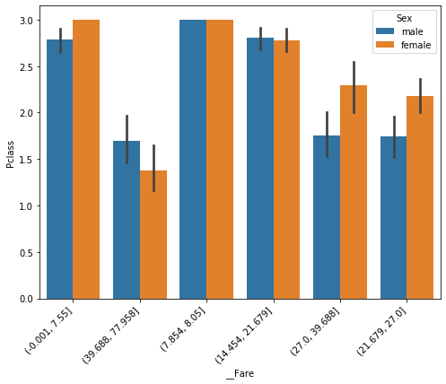


    turkeyHSD
                                            group2  meandiff   p-adj   lower  \
    group1                                                                     
    (39.688, 77.958]female       (7.854, 8.05]male    1.6216  0.0010  1.2294   
    (39.688, 77.958]female     (7.854, 8.05]female    1.6216  0.0010  0.9711   
    (39.688, 77.958]male         (7.854, 8.05]male    1.3077  0.0010  0.9583   
    (39.688, 77.958]male       (7.854, 8.05]female    1.3077  0.0010  0.6820   
    (21.679, 27.0]male           (7.854, 8.05]male    1.2600  0.0010  0.9062   
    (21.679, 27.0]male         (7.854, 8.05]female    1.2600  0.0010  0.6318   
    (27.0, 39.688]male           (7.854, 8.05]male    1.2500  0.0010  0.9159   
    (27.0, 39.688]male         (7.854, 8.05]female    1.2500  0.0010  0.6327   
    (21.679, 27.0]female       (7.854, 8.05]female    0.8205  0.0021  0.1743   
    (21.679, 27.0]female         (7.854, 8.05]male    0.8205  0.0010  0.4356   
    (27.0, 39.688]female         (7.854, 8.05]male    0.7097  0.0010  0.2912   
    (27.0, 39.688]female       (7.854, 8.05]female    0.7097  0.0256  0.0430   
    (21.679, 27.0]male        (27.0, 39.688]female    0.5503  0.0057  0.0891   
    (21.679, 27.0]female        (27.0, 39.688]male   -0.4295  0.0351 -0.8445   
    (21.679, 27.0]female        (21.679, 27.0]male   -0.4395  0.0411 -0.8706   
    (21.679, 27.0]female      (39.688, 77.958]male   -0.4872  0.0109 -0.9146   
    (14.454, 21.679]female    (27.0, 39.688]female   -0.4902  0.0407 -0.9704   
    (-0.001, 7.55]male        (27.0, 39.688]female   -0.4928  0.0085 -0.9175   
    (14.454, 21.679]male      (27.0, 39.688]female   -0.5182  0.0154 -0.9850   
    (27.0, 39.688]female        (27.0, 39.688]male   -0.5403  0.0045 -0.9866   
    (27.0, 39.688]female      (39.688, 77.958]male   -0.5980  0.0013 -1.0559   
    (14.454, 21.679]female    (21.679, 27.0]female   -0.6010  0.0010 -1.0523   
    (-0.001, 7.55]male        (21.679, 27.0]female   -0.6036  0.0010 -0.9954   
    (14.454, 21.679]male      (21.679, 27.0]female   -0.6290  0.0010 -1.0661   
    (21.679, 27.0]female    (39.688, 77.958]female   -0.8011  0.0010 -1.2642   
    (-0.001, 7.55]female      (21.679, 27.0]female   -0.8205  0.0173 -1.5667   
    (27.0, 39.688]female    (39.688, 77.958]female   -0.9119  0.0010 -1.4032   
    (14.454, 21.679]female      (27.0, 39.688]male   -1.0305  0.0010 -1.4393   
    (-0.001, 7.55]male          (27.0, 39.688]male   -1.0331  0.0010 -1.3750   
    (14.454, 21.679]female      (21.679, 27.0]male   -1.0405  0.0010 -1.4656   
    (-0.001, 7.55]male          (21.679, 27.0]male   -1.0431  0.0010 -1.4044   
    (14.454, 21.679]male        (27.0, 39.688]male   -1.0585  0.0010 -1.4515   
    (14.454, 21.679]male        (21.679, 27.0]male   -1.0685  0.0010 -1.4784   
    (14.454, 21.679]female    (39.688, 77.958]male   -1.0882  0.0010 -1.5096   
    (-0.001, 7.55]male        (39.688, 77.958]male   -1.0908  0.0010 -1.4477   
    (14.454, 21.679]male      (39.688, 77.958]male   -1.1162  0.0010 -1.5223   
    (-0.001, 7.55]female        (27.0, 39.688]male   -1.2500  0.0010 -1.9713   
    (-0.001, 7.55]female        (21.679, 27.0]male   -1.2600  0.0010 -1.9906   
    (-0.001, 7.55]female      (39.688, 77.958]male   -1.3077  0.0010 -2.0362   
    (14.454, 21.679]female  (39.688, 77.958]female   -1.4021  0.0010 -1.8596   
    (-0.001, 7.55]male      (39.688, 77.958]female   -1.4048  0.0010 -1.8036   
    (14.454, 21.679]male    (39.688, 77.958]female   -1.4301  0.0010 -1.8736   
    (-0.001, 7.55]female    (39.688, 77.958]female   -1.6216  0.0010 -2.3716   
    
                             upper  reject  
    group1                                  
    (39.688, 77.958]female  2.0138    True  
    (39.688, 77.958]female  2.2722    True  
    (39.688, 77.958]male    1.6571    True  
    (39.688, 77.958]male    1.9334    True  
    (21.679, 27.0]male      1.6138    True  
    (21.679, 27.0]male      1.8882    True  
    (27.0, 39.688]male      1.5841    True  
    (27.0, 39.688]male      1.8673    True  
    (21.679, 27.0]female    1.4667    True  
    (21.679, 27.0]female    1.2054    True  
    (27.0, 39.688]female    1.1281    True  
    (27.0, 39.688]female    1.3764    True  
    (21.679, 27.0]male      1.0116    True  
    (21.679, 27.0]female   -0.0145    True  
    (21.679, 27.0]female   -0.0084    True  
    (21.679, 27.0]female   -0.0598    True  
    (14.454, 21.679]female -0.0099    True  
    (-0.001, 7.55]male     -0.0681    True  
    (14.454, 21.679]male   -0.0513    True  
    (27.0, 39.688]female   -0.0940    True  
    (27.0, 39.688]female   -0.1402    True  
    (14.454, 21.679]female -0.1497    True  
    (-0.001, 7.55]male     -0.2119    True  
    (14.454, 21.679]male   -0.1920    True  
    (21.679, 27.0]female   -0.3380    True  
    (-0.001, 7.55]female   -0.0743    True  
    (27.0, 39.688]female   -0.4207    True  
    (14.454, 21.679]female -0.6216    True  
    (-0.001, 7.55]male     -0.6912    True  
    (14.454, 21.679]female -0.6154    True  
    (-0.001, 7.55]male     -0.6819    True  
    (14.454, 21.679]male   -0.6655    True  
    (14.454, 21.679]male   -0.6586    True  
    (14.454, 21.679]female -0.6668    True  
    (-0.001, 7.55]male     -0.7340    True  
    (14.454, 21.679]male   -0.7101    True  
    (-0.001, 7.55]female   -0.5287    True  
    (-0.001, 7.55]female   -0.5294    True  
    (-0.001, 7.55]female   -0.5792    True  
    (14.454, 21.679]female -0.9446    True  
    (-0.001, 7.55]male     -1.0059    True  
    (14.454, 21.679]male   -0.9867    True  
    (-0.001, 7.55]female   -0.8717    True  
    ['Parch', 'Pclass']


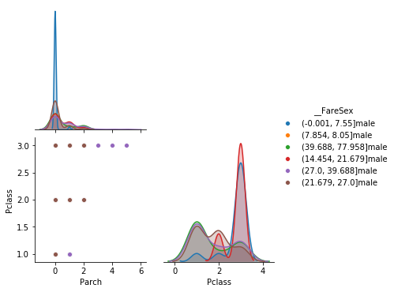


    __Fare*Sex=Parch


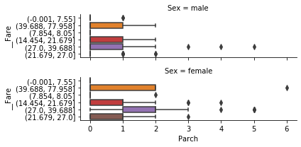


    __Fare*Sex=Pclass


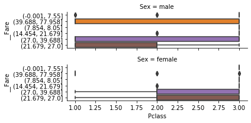


    
     
    


<hr>


<h3 align="center">__Fare - Pclass</h3>


    
      
    relation  3  :  9
    
    
     PassengerId
    Anova faled to reject => no difference 
    
    
     Fare
    
    
     Survived
    Anova passed


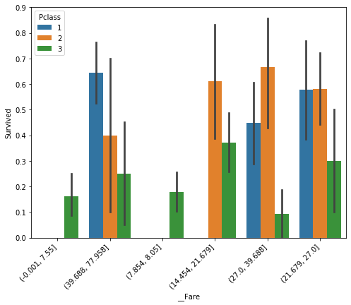


    turkeyHSD
                                  group2  meandiff   p-adj   lower   upper  reject
    group1                                                                        
    (-0.001, 7.55]1    (39.688, 77.958]1    0.6441  0.0487  0.0016  1.2866    True
    (-0.001, 7.55]2    (39.688, 77.958]1    0.6441  0.0487  0.0016  1.2866    True
    (27.0, 39.688]3    (39.688, 77.958]1    0.5503  0.0010  0.2211  0.8795    True
    (-0.001, 7.55]3      (27.0, 39.688]2    0.5042  0.0010  0.1365  0.8718    True
    (-0.001, 7.55]3    (39.688, 77.958]1    0.4816  0.0010  0.2243  0.7389    True
    (-0.001, 7.55]3    (14.454, 21.679]2    0.4486  0.0090  0.0575  0.8398    True
    (-0.001, 7.55]3      (21.679, 27.0]2    0.4189  0.0010  0.1354  0.7024    True
    (-0.001, 7.55]3      (21.679, 27.0]1    0.4144  0.0032  0.0759  0.7529    True
    (14.454, 21.679]3  (39.688, 77.958]1    0.2726  0.0367  0.0076  0.5376    True
    (39.688, 77.958]1  (39.688, 77.958]3   -0.3941  0.0423 -0.7820 -0.0061    True
    (21.679, 27.0]1       (7.854, 8.05]3   -0.3977  0.0038 -0.7258 -0.0695    True
    (21.679, 27.0]2       (7.854, 8.05]3   -0.4022  0.0010 -0.6732 -0.1311    True
    (14.454, 21.679]2     (7.854, 8.05]3   -0.4319  0.0111 -0.8141 -0.0496    True
    (39.688, 77.958]1     (7.854, 8.05]3   -0.4648  0.0010 -0.7084 -0.2213    True
    (21.679, 27.0]1      (27.0, 39.688]3   -0.4832  0.0034 -0.8791 -0.0873    True
    (27.0, 39.688]2       (7.854, 8.05]3   -0.4874  0.0010 -0.8456 -0.1293    True
    (21.679, 27.0]2      (27.0, 39.688]3   -0.4876  0.0010 -0.8377 -0.1376    True
    (14.454, 21.679]2    (27.0, 39.688]3   -0.5174  0.0065 -0.9591 -0.0756    True
    (27.0, 39.688]2      (27.0, 39.688]3   -0.5729  0.0010 -0.9940 -0.1518    True
    
    
     Age
    Anova passed


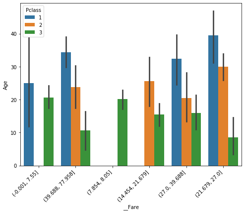


    turkeyHSD
                                  group2  meandiff   p-adj    lower    upper  \
    group1                                                                     
    (-0.001, 7.55]2      (21.679, 27.0]1   39.4231  0.0010  14.0711  64.7751   
    (-0.001, 7.55]2    (39.688, 77.958]1   34.4068  0.0010  10.4209  58.3926   
    (-0.001, 7.55]2      (27.0, 39.688]1   32.3816  0.0010   7.7916  56.9716   
    (-0.001, 7.55]2      (21.679, 27.0]2   29.9884  0.0030   5.5941  54.3826   
    (21.679, 27.0]3    (39.688, 77.958]1   25.8568  0.0010  11.3733  40.3402   
    (14.454, 21.679]3    (21.679, 27.0]1   23.9302  0.0010  11.0744  36.7860   
    (21.679, 27.0]3      (27.0, 39.688]1   23.8316  0.0010   8.3681  39.2950   
    (14.454, 21.679]3  (39.688, 77.958]1   18.9139  0.0010   9.0211  28.8067   
    (-0.001, 7.55]3      (21.679, 27.0]1   18.7543  0.0010   6.1180  31.3907   
    (27.0, 39.688]3    (39.688, 77.958]1   18.4693  0.0010   6.1802  30.7584   
    (14.454, 21.679]3    (27.0, 39.688]1   16.8887  0.0010   5.6097  28.1677   
    (14.454, 21.679]3    (21.679, 27.0]2   14.4955  0.0010   3.6499  25.3412   
    (-0.001, 7.55]3    (39.688, 77.958]1   13.7380  0.0010   4.1322  23.3439   
    (-0.001, 7.55]3      (27.0, 39.688]1   11.7128  0.0251   0.6846  22.7410   
    (27.0, 39.688]1       (7.854, 8.05]3  -12.2354  0.0080 -22.8190  -1.6517   
    (21.679, 27.0]2      (27.0, 39.688]3  -14.0509  0.0216 -27.1192  -0.9825   
    (39.688, 77.958]1     (7.854, 8.05]3  -14.2606  0.0010 -23.3526  -5.1685   
    (27.0, 39.688]1      (27.0, 39.688]3  -16.4441  0.0032 -29.8743  -3.0139   
    (21.679, 27.0]1      (27.0, 39.688]2  -18.9788  0.0080 -35.4018  -2.5558   
    (21.679, 27.0]1       (7.854, 8.05]3  -19.2769  0.0010 -31.5272  -7.0265   
    (21.679, 27.0]2    (39.688, 77.958]3  -19.3884  0.0015 -34.5387  -4.2381   
    (21.679, 27.0]2      (21.679, 27.0]3  -21.4384  0.0010 -36.5887  -6.2881   
    (27.0, 39.688]1    (39.688, 77.958]3  -21.7816  0.0010 -37.2450  -6.3181   
    (21.679, 27.0]1      (27.0, 39.688]3  -23.4856  0.0010 -38.2648  -8.7063   
    (39.688, 77.958]1  (39.688, 77.958]3  -23.8068  0.0010 -38.2902  -9.3233   
    (21.679, 27.0]1    (39.688, 77.958]3  -28.8231  0.0010 -45.4716 -12.1745   
    (21.679, 27.0]1      (21.679, 27.0]3  -30.8731  0.0010 -47.5216 -14.2245   
    
                       reject  
    group1                     
    (-0.001, 7.55]2      True  
    (-0.001, 7.55]2      True  
    (-0.001, 7.55]2      True  
    (-0.001, 7.55]2      True  
    (21.679, 27.0]3      True  
    (14.454, 21.679]3    True  
    (21.679, 27.0]3      True  
    (14.454, 21.679]3    True  
    (-0.001, 7.55]3      True  
    (27.0, 39.688]3      True  
    (14.454, 21.679]3    True  
    (14.454, 21.679]3    True  
    (-0.001, 7.55]3      True  
    (-0.001, 7.55]3      True  
    (27.0, 39.688]1      True  
    (21.679, 27.0]2      True  
    (39.688, 77.958]1    True  
    (27.0, 39.688]1      True  
    (21.679, 27.0]1      True  
    (21.679, 27.0]1      True  
    (21.679, 27.0]2      True  
    (21.679, 27.0]2      True  
    (27.0, 39.688]1      True  
    (21.679, 27.0]1      True  
    (39.688, 77.958]1    True  
    (21.679, 27.0]1      True  
    (21.679, 27.0]1      True  
    
    
     SibSp
    Anova passed


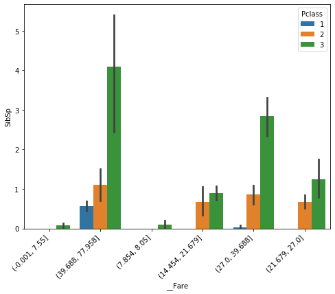


    turkeyHSD
                                  group2  meandiff   p-adj   lower   upper  reject
    group1                                                                        
    (21.679, 27.0]1    (39.688, 77.958]3    4.1000  0.0010  3.1737  5.0263    True
    (-0.001, 7.55]2    (39.688, 77.958]3    4.1000  0.0010  2.6504  5.5496    True
    (-0.001, 7.55]1    (39.688, 77.958]3    4.1000  0.0010  2.6504  5.5496    True
    (27.0, 39.688]1    (39.688, 77.958]3    4.0737  0.0010  3.2134  4.9340    True
    (-0.001, 7.55]3    (39.688, 77.958]3    4.0250  0.0010  3.2464  4.8036    True
    (39.688, 77.958]1  (39.688, 77.958]3    3.5407  0.0010  2.7349  4.3465    True
    (14.454, 21.679]2  (39.688, 77.958]3    3.4333  0.0010  2.4215  4.4451    True
    (21.679, 27.0]2    (39.688, 77.958]3    3.4256  0.0010  2.5827  4.2685    True
    (27.0, 39.688]2    (39.688, 77.958]3    3.2429  0.0010  2.2698  4.2159    True
    (14.454, 21.679]3  (39.688, 77.958]3    3.2000  0.0010  2.4104  3.9896    True
    (39.688, 77.958]2  (39.688, 77.958]3    3.0000  0.0010  1.7939  4.2061    True
    (21.679, 27.0]3    (39.688, 77.958]3    2.8500  0.0010  1.8652  3.8348    True
    (21.679, 27.0]1      (27.0, 39.688]3    2.8438  0.0010  2.0215  3.6660    True
    (-0.001, 7.55]1      (27.0, 39.688]3    2.8438  0.0010  1.4583  4.2292    True
    (-0.001, 7.55]2      (27.0, 39.688]3    2.8438  0.0010  1.4583  4.2292    True
    (27.0, 39.688]1      (27.0, 39.688]3    2.8174  0.0010  2.0702  3.5646    True
    (-0.001, 7.55]3      (27.0, 39.688]3    2.7688  0.0010  2.1174  3.4201    True
    (14.454, 21.679]2    (27.0, 39.688]3    2.1771  0.0010  1.2595  3.0946    True
    (21.679, 27.0]2      (27.0, 39.688]3    2.1693  0.0010  1.4423  2.8964    True
    (27.0, 39.688]2      (27.0, 39.688]3    1.9866  0.0010  1.1120  2.8612    True
    (14.454, 21.679]3    (27.0, 39.688]3    1.9438  0.0010  1.2792  2.6083    True
    (21.679, 27.0]3      (27.0, 39.688]3    1.5938  0.0010  0.7061  2.4814    True
    (27.0, 39.688]3    (39.688, 77.958]3    1.2562  0.0010  0.3686  2.1439    True
    (21.679, 27.0]1      (21.679, 27.0]3    1.2500  0.0010  0.3237  2.1763    True
    (-0.001, 7.55]3      (21.679, 27.0]3    1.1750  0.0010  0.3964  1.9536    True
    (-0.001, 7.55]3    (14.454, 21.679]3    0.8250  0.0010  0.3153  1.3347    True
    (-0.001, 7.55]3      (27.0, 39.688]2    0.7821  0.0386  0.0186  1.5457    True
    (-0.001, 7.55]3      (21.679, 27.0]2    0.5994  0.0414  0.0105  1.1883    True
    (21.679, 27.0]2       (7.854, 8.05]3   -0.5801  0.0361 -1.1431 -0.0170    True
    (27.0, 39.688]2       (7.854, 8.05]3   -0.7628  0.0381 -1.5067 -0.0189    True
    (14.454, 21.679]3     (7.854, 8.05]3   -0.8057  0.0010 -1.2853 -0.3260    True
    (14.454, 21.679]3    (27.0, 39.688]1   -0.8737  0.0010 -1.5012 -0.2462    True
    (14.454, 21.679]3    (21.679, 27.0]1   -0.9000  0.0020 -1.6152 -0.1848    True
    (21.679, 27.0]3       (7.854, 8.05]3   -1.1557  0.0010 -1.9149 -0.3964    True
    (21.679, 27.0]3      (27.0, 39.688]1   -1.2237  0.0010 -2.0840 -0.3634    True
    (27.0, 39.688]3    (39.688, 77.958]2   -1.7438  0.0010 -2.8720 -0.6155    True
    (27.0, 39.688]3    (39.688, 77.958]1   -2.2844  0.0010 -2.9681 -1.6007    True
    (27.0, 39.688]3       (7.854, 8.05]3   -2.7494  0.0010 -3.3776 -2.1213    True
    (39.688, 77.958]3     (7.854, 8.05]3   -4.0057  0.0010 -4.7649 -3.2464    True
    
    
     Parch
    Anova passed


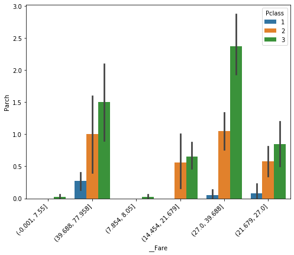


    turkeyHSD
                                  group2  meandiff   p-adj   lower   upper  reject
    group1                                                                        
    (-0.001, 7.55]1      (27.0, 39.688]3    2.3750  0.0010  1.3519  3.3981    True
    (-0.001, 7.55]2      (27.0, 39.688]3    2.3750  0.0010  1.3519  3.3981    True
    (-0.001, 7.55]3      (27.0, 39.688]3    2.3500  0.0010  1.8690  2.8310    True
    (27.0, 39.688]1      (27.0, 39.688]3    2.3224  0.0010  1.7706  2.8741    True
    (21.679, 27.0]1      (27.0, 39.688]3    2.2981  0.0010  1.6909  2.9053    True
    (14.454, 21.679]2    (27.0, 39.688]3    1.8194  0.0010  1.1419  2.4970    True
    (21.679, 27.0]2      (27.0, 39.688]3    1.7936  0.0010  1.2567  2.3305    True
    (14.454, 21.679]3    (27.0, 39.688]3    1.7179  0.0010  1.2271  2.2086    True
    (21.679, 27.0]3      (27.0, 39.688]3    1.5250  0.0010  0.8695  2.1805    True
    (-0.001, 7.55]2    (39.688, 77.958]3    1.5000  0.0010  0.4295  2.5705    True
    (-0.001, 7.55]1    (39.688, 77.958]3    1.5000  0.0010  0.4295  2.5705    True
    (-0.001, 7.55]3    (39.688, 77.958]3    1.4750  0.0010  0.9001  2.0499    True
    (27.0, 39.688]1    (39.688, 77.958]3    1.4474  0.0010  0.8121  2.0827    True
    (21.679, 27.0]1    (39.688, 77.958]3    1.4231  0.0010  0.7391  2.1071    True
    (27.0, 39.688]2      (27.0, 39.688]3    1.3274  0.0010  0.6815  1.9732    True
    (39.688, 77.958]1  (39.688, 77.958]3    1.2288  0.0010  0.6338  1.8239    True
    (-0.001, 7.55]3      (27.0, 39.688]2    1.0226  0.0010  0.4587  1.5865    True
    (27.0, 39.688]1      (27.0, 39.688]2    0.9950  0.0010  0.3697  1.6203    True
    (-0.001, 7.55]3    (39.688, 77.958]2    0.9750  0.0018  0.2036  1.7464    True
    (21.679, 27.0]1      (27.0, 39.688]2    0.9707  0.0010  0.2960  1.6454    True
    (27.0, 39.688]1    (39.688, 77.958]2    0.9474  0.0077  0.1300  1.7647    True
    (14.454, 21.679]2  (39.688, 77.958]3    0.9444  0.0018  0.1973  1.6916    True
    (21.679, 27.0]1    (39.688, 77.958]2    0.9231  0.0207  0.0673  1.7788    True
    (21.679, 27.0]2    (39.688, 77.958]3    0.9186  0.0010  0.2962  1.5411    True
    (14.454, 21.679]3  (39.688, 77.958]3    0.8429  0.0010  0.2598  1.4259    True
    (-0.001, 7.55]3      (21.679, 27.0]3    0.8250  0.0010  0.2501  1.3999    True
    (21.679, 27.0]1      (21.679, 27.0]3    0.7731  0.0111  0.0891  1.4571    True
    (-0.001, 7.55]3    (14.454, 21.679]3    0.6321  0.0010  0.2558  1.0085    True
    (-0.001, 7.55]3      (21.679, 27.0]2    0.5564  0.0015  0.1215  0.9913    True
    (21.679, 27.0]2      (27.0, 39.688]1   -0.5288  0.0352 -1.0408 -0.0167    True
    (21.679, 27.0]2       (7.854, 8.05]3   -0.5625  0.0010 -0.9783 -0.1467    True
    (14.454, 21.679]3    (21.679, 27.0]1   -0.5802  0.0164 -1.1084 -0.0520    True
    (14.454, 21.679]3    (27.0, 39.688]1   -0.6045  0.0010 -1.0679 -0.1411    True
    (14.454, 21.679]3     (7.854, 8.05]3   -0.6383  0.0010 -0.9925 -0.2841    True
    (27.0, 39.688]2    (39.688, 77.958]1   -0.7764  0.0010 -1.3608 -0.1921    True
    (21.679, 27.0]3      (27.0, 39.688]1   -0.7974  0.0021 -1.4327 -0.1621    True
    (21.679, 27.0]3       (7.854, 8.05]3   -0.8311  0.0010 -1.3918 -0.2705    True
    (27.0, 39.688]3    (39.688, 77.958]3   -0.8750  0.0010 -1.5305 -0.2195    True
    (39.688, 77.958]2     (7.854, 8.05]3   -0.9811  0.0013 -1.7419 -0.2204    True
    (27.0, 39.688]2       (7.854, 8.05]3   -1.0288  0.0010 -1.5781 -0.4794    True
    (27.0, 39.688]3    (39.688, 77.958]2   -1.3750  0.0010 -2.2082 -0.5418    True
    (39.688, 77.958]3     (7.854, 8.05]3   -1.4811  0.0010 -2.0418 -0.9205    True
    (27.0, 39.688]3    (39.688, 77.958]1   -2.1038  0.0010 -2.6087 -1.5989    True
    (27.0, 39.688]3       (7.854, 8.05]3   -2.3561  0.0010 -2.8200 -1.8923    True
    
    
     Pclass
    ['Survived', 'Age', 'SibSp', 'Parch']


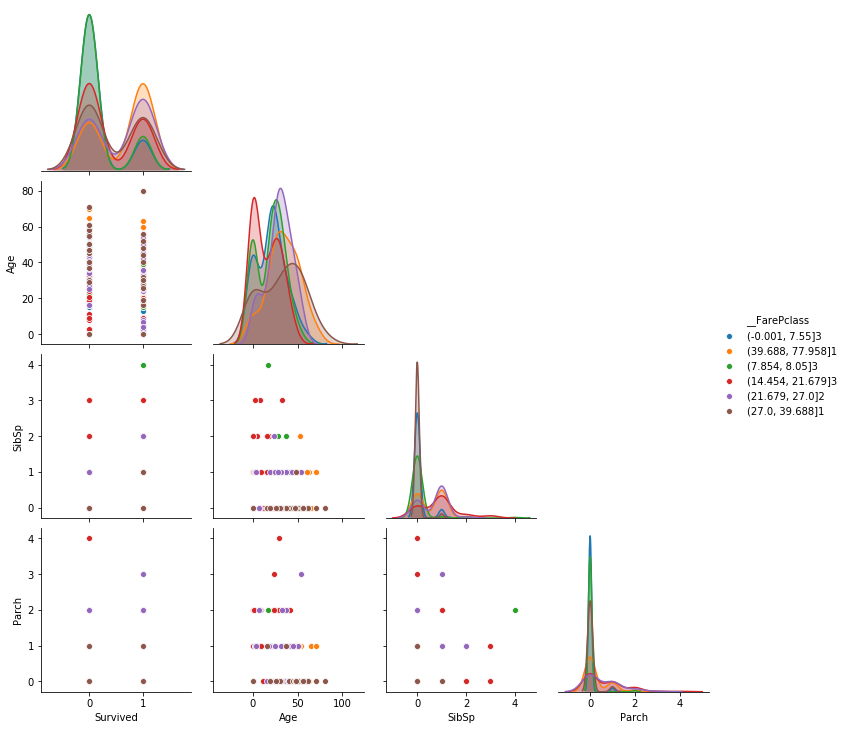


    __Fare*Pclass=Survived


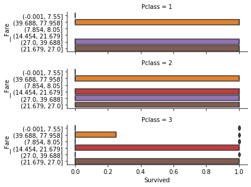


    __Fare*Pclass=Age


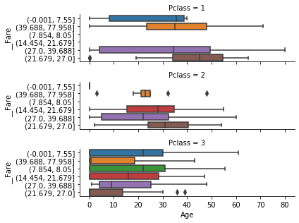


    __Fare*Pclass=SibSp


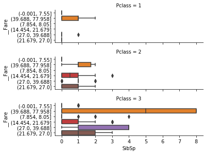


    __Fare*Pclass=Parch


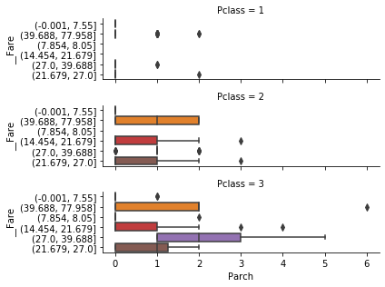


    
     
    


<hr>


<h3 align="center">Survived - __Age</h3>


    
      
    relation  9  :  2
    
    
     PassengerId
    Anova faled to reject => no difference 
    
    
     Fare
    Anova passed


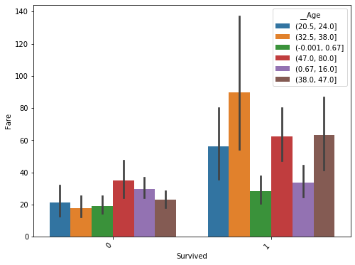


    turkeyHSD
                            group2  meandiff   p-adj    lower     upper  reject
    group1                                                                     
    0(32.5, 38.0]    1(32.5, 38.0]   71.6355  0.0010  36.9952  106.2759    True
    0(-0.001, 0.67]  1(32.5, 38.0]   70.3694  0.0010  40.8388   99.9000    True
    0(20.5, 24.0]    1(32.5, 38.0]   68.3217  0.0010  35.2481  101.3952    True
    0(38.0, 47.0]    1(32.5, 38.0]   66.5355  0.0010  33.2407   99.8304    True
    1(-0.001, 0.67]  1(32.5, 38.0]   61.0990  0.0010  27.1871   95.0109    True
    0(0.67, 16.0]    1(32.5, 38.0]   59.8390  0.0010  24.5134   95.1645    True
    1(0.67, 16.0]    1(32.5, 38.0]   55.7242  0.0010  21.6764   89.7720    True
    0(47.0, 80.0]    1(32.5, 38.0]   54.4911  0.0010  20.3028   88.6794    True
    0(32.5, 38.0]    1(38.0, 47.0]   45.2415  0.0060   7.1554   83.3275    True
    0(32.5, 38.0]    1(47.0, 80.0]   44.3281  0.0026   8.9230   79.7332    True
    0(-0.001, 0.67]  1(38.0, 47.0]   43.9753  0.0012  10.4694   77.4813    True
    0(-0.001, 0.67]  1(47.0, 80.0]   43.0619  0.0010  12.6379   73.4860    True
    0(20.5, 24.0]    1(38.0, 47.0]   41.9276  0.0104   5.2608   78.5944    True
    0(20.5, 24.0]    1(47.0, 80.0]   41.0142  0.0045   7.1405   74.8879    True
    0(38.0, 47.0]    1(38.0, 47.0]   40.1415  0.0195   3.2750   77.0080    True
    0(38.0, 47.0]    1(47.0, 80.0]   39.2281  0.0095   5.1383   73.3179    True
    0(32.5, 38.0]    1(20.5, 24.0]   38.0148  0.0253   2.3306   73.6989    True
    0(-0.001, 0.67]  1(20.5, 24.0]   36.7486  0.0055   6.0003   67.4970    True
    0(20.5, 24.0]    1(20.5, 24.0]   34.7009  0.0428   0.5356   68.8662    True
    
    
     Survived
    
    
     Age
    
    
     SibSp
    Anova passed


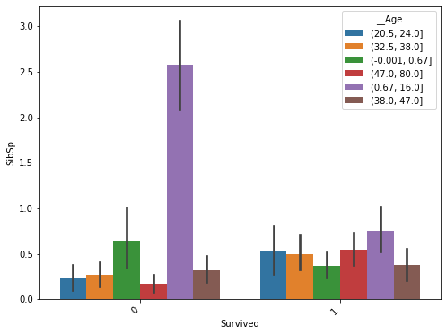


    turkeyHSD
                              group2  meandiff  p-adj   lower   upper  reject
    group1                                                                   
    0(-0.001, 0.67]    0(0.67, 16.0]    1.9298  0.001  1.2985  2.5611    True
    0(0.67, 16.0]      1(0.67, 16.0]   -1.8231  0.001 -2.5592 -1.0869    True
    0(0.67, 16.0]      1(47.0, 80.0]   -2.0372  0.001 -2.8431 -1.2313    True
    0(0.67, 16.0]      1(20.5, 24.0]   -2.0500  0.001 -2.8620 -1.2380    True
    0(0.67, 16.0]      1(32.5, 38.0]   -2.0778  0.001 -2.8669 -1.2886    True
    0(0.67, 16.0]      1(38.0, 47.0]   -2.1985  0.001 -3.0632 -1.3337    True
    0(0.67, 16.0]    1(-0.001, 0.67]   -2.2074  0.001 -2.9404 -1.4744    True
    0(0.67, 16.0]      0(38.0, 47.0]   -2.2557  0.001 -2.9745 -1.5370    True
    0(0.67, 16.0]      0(32.5, 38.0]   -2.3125  0.001 -3.0623 -1.5627    True
    0(0.67, 16.0]      0(20.5, 24.0]   -2.3483  0.001 -3.0619 -1.6347    True
    0(0.67, 16.0]      0(47.0, 80.0]   -2.4047  0.001 -3.1441 -1.6653    True
    
    
     Parch
    Anova passed


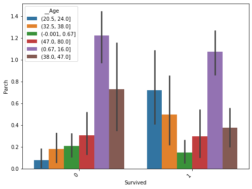


    turkeyHSD
                              group2  meandiff   p-adj   lower   upper  reject
    group1                                                                    
    0(-0.001, 0.67]    0(0.67, 16.0]    1.0142  0.0010  0.5560  1.4724    True
    0(20.5, 24.0]      1(0.67, 16.0]    0.9935  0.0010  0.4986  1.4884    True
    1(-0.001, 0.67]    1(0.67, 16.0]    0.9273  0.0010  0.4177  1.4369    True
    0(32.5, 38.0]      1(0.67, 16.0]    0.8918  0.0010  0.3695  1.4141    True
    0(-0.001, 0.67]    1(0.67, 16.0]    0.8675  0.0010  0.4355  1.2995    True
    0(47.0, 80.0]      1(0.67, 16.0]    0.7678  0.0010  0.2533  1.2822    True
    0(20.5, 24.0]      0(38.0, 47.0]    0.6468  0.0010  0.1656  1.1281    True
    0(20.5, 24.0]      1(20.5, 24.0]    0.6403  0.0089  0.0863  1.1942    True
    1(-0.001, 0.67]    1(20.5, 24.0]    0.5741  0.0442  0.0070  1.1412    True
    0(32.5, 38.0]      0(38.0, 47.0]    0.5451  0.0240  0.0357  1.0545    True
    0(-0.001, 0.67]    0(38.0, 47.0]    0.5208  0.0027  0.1045  0.9371    True
    0(-0.001, 0.67]    1(20.5, 24.0]    0.5142  0.0363  0.0157  1.0127    True
    1(0.67, 16.0]      1(32.5, 38.0]   -0.5755  0.0324 -1.1275 -0.0235    True
    0(38.0, 47.0]    1(-0.001, 0.67]   -0.5807  0.0075 -1.0770 -0.0843    True
    1(0.67, 16.0]      1(38.0, 47.0]   -0.6962  0.0104 -1.3049 -0.0874    True
    0(0.67, 16.0]      1(32.5, 38.0]   -0.7222  0.0023 -1.2949 -0.1495    True
    1(0.67, 16.0]      1(47.0, 80.0]   -0.7782  0.0010 -1.3428 -0.2136    True
    0(0.67, 16.0]      1(38.0, 47.0]   -0.8429  0.0010 -1.4705 -0.2153    True
    0(0.67, 16.0]      0(47.0, 80.0]   -0.9145  0.0010 -1.4511 -0.3779    True
    0(0.67, 16.0]      1(47.0, 80.0]   -0.9249  0.0010 -1.5098 -0.3400    True
    0(0.67, 16.0]      0(32.5, 38.0]   -1.0385  0.0010 -1.5827 -0.4944    True
    0(0.67, 16.0]    1(-0.001, 0.67]   -1.0741  0.0010 -1.6060 -0.5421    True
    0(0.67, 16.0]      0(20.5, 24.0]   -1.1403  0.0010 -1.6582 -0.6223    True
    
    
     Pclass
    Anova passed


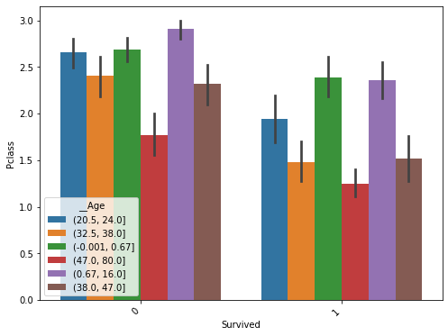


    turkeyHSD
                              group2  meandiff   p-adj   lower   upper  reject
    group1                                                                    
    0(47.0, 80.0]    1(-0.001, 0.67]    0.6197  0.0010  0.1610  1.0783    True
    0(47.0, 80.0]      1(0.67, 16.0]    0.5893  0.0018  0.1285  1.0500    True
    0(0.67, 16.0]      0(32.5, 38.0]   -0.5029  0.0362 -0.9903 -0.0156    True
    0(0.67, 16.0]    1(-0.001, 0.67]   -0.5222  0.0180 -0.9987 -0.0458    True
    0(47.0, 80.0]      1(47.0, 80.0]   -0.5260  0.0346 -1.0337 -0.0183    True
    0(0.67, 16.0]      1(0.67, 16.0]   -0.5526  0.0090 -1.0311 -0.0741    True
    0(38.0, 47.0]      0(47.0, 80.0]   -0.5528  0.0035 -1.0018 -0.1038    True
    0(0.67, 16.0]      0(38.0, 47.0]   -0.5891  0.0023 -1.0563 -0.1219    True
    0(32.5, 38.0]      0(47.0, 80.0]   -0.6389  0.0010 -1.1089 -0.1690    True
    1(20.5, 24.0]      1(47.0, 80.0]   -0.7012  0.0021 -1.2538 -0.1486    True
    0(20.5, 24.0]      1(20.5, 24.0]   -0.7113  0.0010 -1.2074 -0.2152    True
    0(-0.001, 0.67]    1(20.5, 24.0]   -0.7436  0.0010 -1.1900 -0.2971    True
    0(38.0, 47.0]      1(38.0, 47.0]   -0.8048  0.0010 -1.3401 -0.2695    True
    1(0.67, 16.0]      1(38.0, 47.0]   -0.8412  0.0010 -1.3865 -0.2960    True
    0(38.0, 47.0]      1(32.5, 38.0]   -0.8470  0.0010 -1.3305 -0.3636    True
    1(-0.001, 0.67]    1(38.0, 47.0]   -0.8716  0.0010 -1.4151 -0.3282    True
    1(0.67, 16.0]      1(32.5, 38.0]   -0.8835  0.0010 -1.3779 -0.3891    True
    0(20.5, 24.0]      0(47.0, 80.0]   -0.8865  0.0010 -1.3320 -0.4410    True
    0(32.5, 38.0]      1(38.0, 47.0]   -0.8909  0.0010 -1.4439 -0.3379    True
    1(-0.001, 0.67]    1(32.5, 38.0]   -0.9139  0.0010 -1.4063 -0.4215    True
    0(-0.001, 0.67]    0(47.0, 80.0]   -0.9188  0.0010 -1.3083 -0.5293    True
    0(32.5, 38.0]      1(32.5, 38.0]   -0.9332  0.0010 -1.4362 -0.4302    True
    0(0.67, 16.0]      1(20.5, 24.0]   -0.9667  0.0010 -1.4945 -0.4389    True
    0(38.0, 47.0]      1(47.0, 80.0]   -1.0788  0.0010 -1.5738 -0.5838    True
    1(0.67, 16.0]      1(47.0, 80.0]   -1.1152  0.0010 -1.6209 -0.6096    True
    0(20.5, 24.0]      1(38.0, 47.0]   -1.1385  0.0010 -1.6709 -0.6061    True
    0(0.67, 16.0]      0(47.0, 80.0]   -1.1419  0.0010 -1.6225 -0.6613    True
    1(-0.001, 0.67]    1(47.0, 80.0]   -1.1456  0.0010 -1.6494 -0.6419    True
    0(32.5, 38.0]      1(47.0, 80.0]   -1.1649  0.0010 -1.6790 -0.6508    True
    0(-0.001, 0.67]    1(38.0, 47.0]   -1.1708  0.0010 -1.6573 -0.6842    True
    0(20.5, 24.0]      1(32.5, 38.0]   -1.1807  0.0010 -1.6610 -0.7005    True
    0(-0.001, 0.67]    1(32.5, 38.0]   -1.2130  0.0010 -1.6418 -0.7842    True
    0(0.67, 16.0]      1(38.0, 47.0]   -1.3939  0.0010 -1.9560 -0.8318    True
    0(20.5, 24.0]      1(47.0, 80.0]   -1.4125  0.0010 -1.9044 -0.9206    True
    0(0.67, 16.0]      1(32.5, 38.0]   -1.4361  0.0010 -1.9491 -0.9232    True
    0(-0.001, 0.67]    1(47.0, 80.0]   -1.4448  0.0010 -1.8865 -1.0030    True
    0(0.67, 16.0]      1(47.0, 80.0]   -1.6679  0.0010 -2.1917 -1.1440    True
    ['Fare', 'SibSp', 'Parch', 'Pclass']


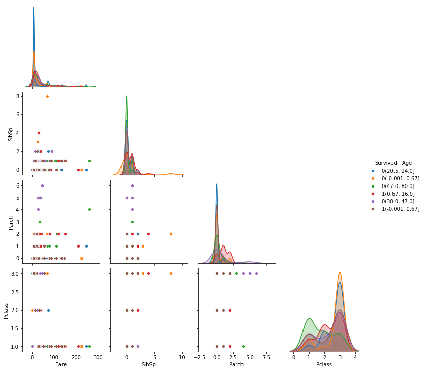


    Survived*__Age=Fare


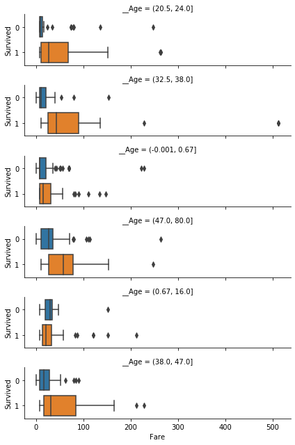


    Survived*__Age=SibSp


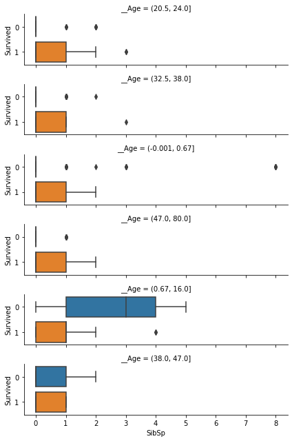


    Survived*__Age=Parch


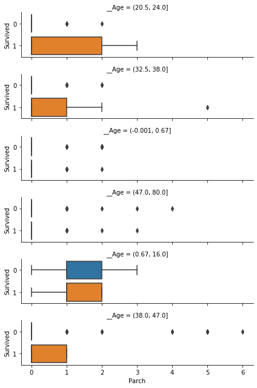


    Survived*__Age=Pclass


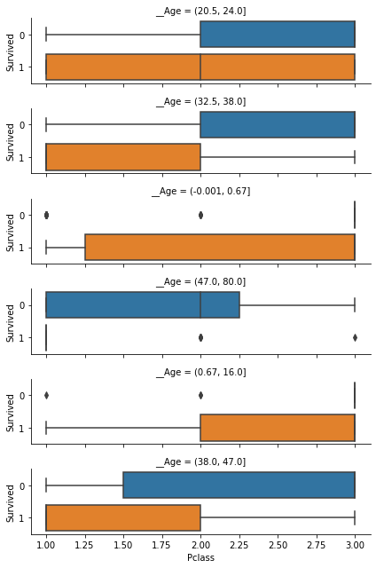


    
     
    


<hr>


<h3 align="center">Survived - SibSp</h3>


    
      
    relation  7  :  2
    
    
     PassengerId
    Anova faled to reject => no difference 
    
    
     Fare
    Anova faled to reject => no difference 
    
    
     Survived
    
    
     Age
    Anova faled to reject => no difference 
    
    
     SibSp
    
    
     Parch
    Anova passed


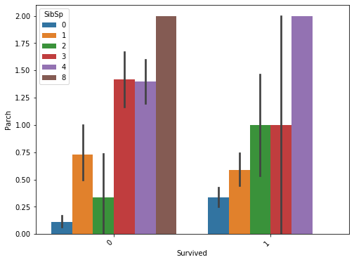


    turkeyHSD
            group2  meandiff   p-adj   lower   upper  reject
    group1                                                  
    0            8    1.8920  0.0010  1.0027  2.7812    True
    0           14    1.8920  0.0010  0.5403  3.2436    True
    10          14    1.6667  0.0038  0.3105  3.0228    True
    2           14    1.6667  0.0126  0.1915  3.1418    True
    2            8    1.6667  0.0010  0.5991  2.7343    True
    11          14    1.4107  0.0357  0.0462  2.7752    True
    0            3    1.3086  0.0010  0.6253  1.9920    True
    0            4    1.2920  0.0010  0.6785  1.9054    True
    1            8    1.2680  0.0010  0.3552  2.1808    True
    2            3    1.0833  0.0055  0.1800  1.9867    True
    2            4    1.0667  0.0028  0.2150  1.9183    True
    0           12    0.8920  0.0010  0.2346  1.5493    True
    1            4    0.6680  0.0363  0.0209  1.3151    True
    10          12    0.6667  0.0500  0.0001  1.3333    True
    0            1    0.6239  0.0010  0.3598  0.8880    True
    0           11    0.4812  0.0010  0.2318  0.7307    True
    0           10    0.2253  0.0122  0.0264  0.4242    True
    1           10   -0.3986  0.0010 -0.6850 -0.1123    True
    4           11   -0.8107  0.0024 -1.4520 -0.1694    True
    3           11   -0.8274  0.0081 -1.5358 -0.1189    True
    4           10   -1.0667  0.0010 -1.6900 -0.4433    True
    3           10   -1.0833  0.0010 -1.7756 -0.3911    True
    8           11   -1.4107  0.0010 -2.3194 -0.5020    True
    8           10   -1.6667  0.0010 -2.5628 -0.7705    True
    
    
     Pclass
    Anova faled to reject => no difference 
    ['Parch']
    Survived*SibSp=Parch


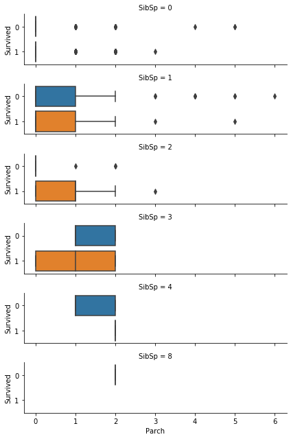


    
     
    


<hr>


<h3 align="center">Survived - Embarked</h3>


    
      
    relation  4  :  2
    
    
     PassengerId
    Anova passed


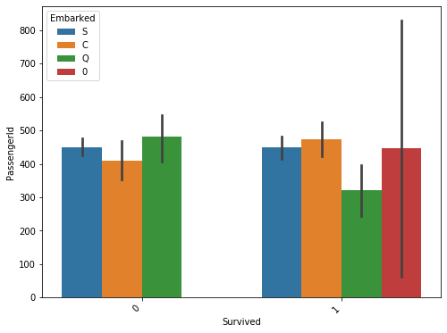


    turkeyHSD
           group2  meandiff   p-adj     lower     upper  reject
    group1                                                     
    0C         0Q   70.5509  0.7306  -70.5523  211.6542   False
    0C         0S   40.0155  0.8669  -54.9452  134.9762   False
    0C         10   36.1467  0.9000 -507.2744  579.5677   False
    0C         1C   64.1359  0.6528  -53.5757  181.8475   False
    0C         1Q  -89.8867  0.6463 -253.7343   73.9609   False
    0C         1S   39.0038  0.9000  -62.5901  140.5977   False
    0Q         0S  -30.5354  0.9000 -147.0990   86.0282   False
    0Q         10  -34.4043  0.9000 -582.0136  513.2050   False
    0Q         1C   -6.4150  0.9000 -142.1558  129.3258   False
    0Q         1Q -160.4376  0.1059 -337.6820   16.8068   False
    0Q         1S  -31.5471  0.9000 -153.5752   90.4810   False
    0S         10   -3.8689  0.9000 -541.4406  533.7029   False
    0S         1C   24.1204  0.9000  -62.6723  110.9130   False
    0S         1Q -129.9022  0.1047 -273.1606   13.3563   False
    0S         1S   -1.0117  0.9000  -64.2436   62.2201   False
    10         1C   27.9892  0.9000 -514.0641  570.0426   False
    10         1Q -126.0333  0.9000 -679.9393  427.8727   False
    10         1S    2.8571  0.9000 -535.9259  541.6402   False
    1C         1Q -154.0226  0.0658 -313.2754    5.2302   False
    1C         1S  -25.1321  0.9000 -119.1361   68.8719   False
    1Q         1S  128.8905  0.1336  -18.8484  276.6293   False
    
    
     Fare
    Anova passed


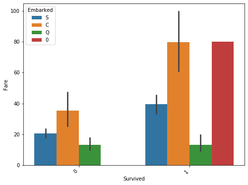


    turkeyHSD
           group2  meandiff  p-adj    lower    upper  reject
    group1                                                  
    0Q         1C   66.3850  0.001  41.9497  90.8203    True
    0S         1C   58.9769  0.001  43.3530  74.6009    True
    0C         1C   44.2776  0.001  23.0878  65.4674    True
    0Q         1S   26.2112  0.008   4.2444  48.1780    True
    0S         1S   18.8031  0.001   7.4205  30.1857    True
    1C         1S  -40.1738  0.001 -57.0959 -23.2518    True
    1C         1Q  -66.5387  0.001 -95.2065 -37.8709    True
    
    
     Survived
    
    
     Age
    Anova passed


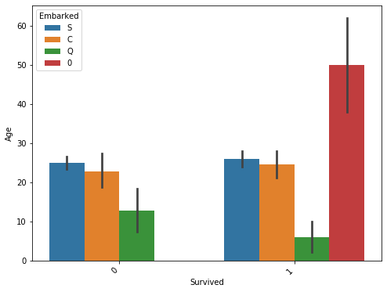


    turkeyHSD
           group2  meandiff   p-adj    lower    upper  reject
    group1                                                   
    0Q         10   37.0957  0.0425   0.6951  73.4964    True
    1Q         1S   20.0403  0.0010  10.2198  29.8608    True
    0Q         1S   13.1361  0.0010   5.0246  21.2475    True
    0Q         0S   12.0653  0.0010   4.3171  19.8135    True
    0Q         1C   11.7078  0.0026   2.6848  20.7307    True
    0C         0Q   -9.9891  0.0282 -19.3685  -0.6097    True
    0C         1Q  -16.8933  0.0010 -27.7846  -6.0021    True
    1C         1Q  -18.6120  0.0010 -29.1979  -8.0262    True
    0S         1Q  -18.9696  0.0010 -28.4922  -9.4469    True
    10         1Q  -44.0000  0.0079 -80.8192  -7.1808    True
    
    
     SibSp
    Anova faled to reject => no difference 
    
    
     Parch
    Anova faled to reject => no difference 
    
    
     Pclass
    Anova passed


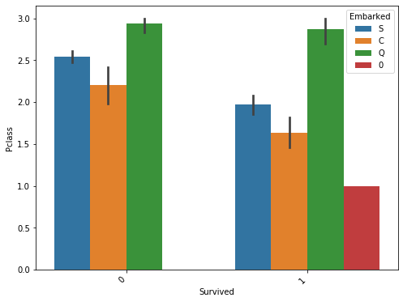


    turkeyHSD
           group2  meandiff   p-adj   lower   upper  reject
    group1                                                 
    10         1Q    1.8667  0.0123  0.2461  3.4872    True
    1C         1Q    1.2323  0.0010  0.7663  1.6982    True
    0C         0Q    0.7362  0.0010  0.3233  1.1490    True
    0C         1Q    0.6667  0.0010  0.1873  1.1460    True
    0C         0S    0.3457  0.0047  0.0678  0.6235    True
    1C         1S    0.3333  0.0066  0.0583  0.6084    True
    0Q         0S   -0.3905  0.0131 -0.7315 -0.0495    True
    0C         1C   -0.5656  0.0010 -0.9100 -0.2212    True
    0S         1S   -0.5779  0.0010 -0.7629 -0.3929    True
    1Q         1S   -0.8989  0.0010 -1.3312 -0.4667    True
    0S         1C   -0.9113  0.0010 -1.1652 -0.6573    True
    0Q         1S   -0.9684  0.0010 -1.3254 -0.6114    True
    0Q         1C   -1.3018  0.0010 -1.6989 -0.9046    True
    0Q         10   -1.9362  0.0069 -3.5383 -0.3340    True
    ['PassengerId', 'Fare', 'Age', 'Pclass']


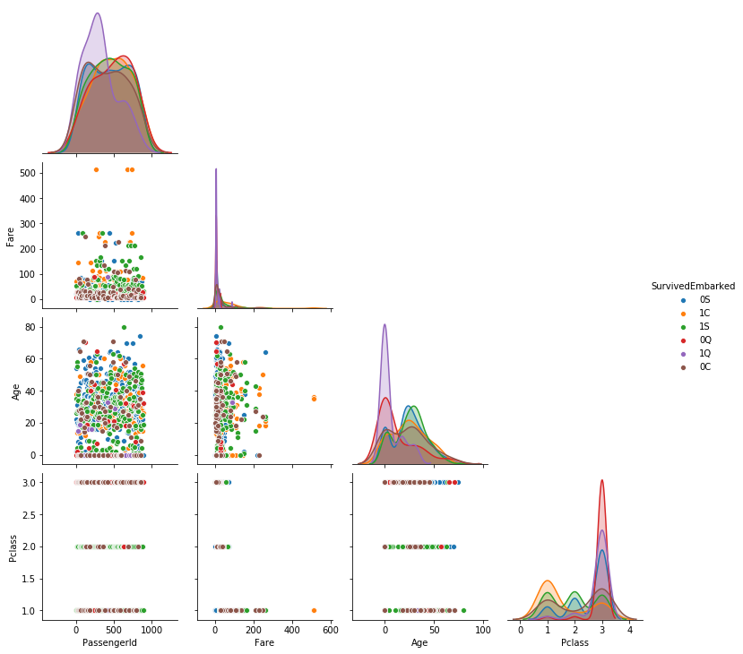


    Survived*Embarked=PassengerId


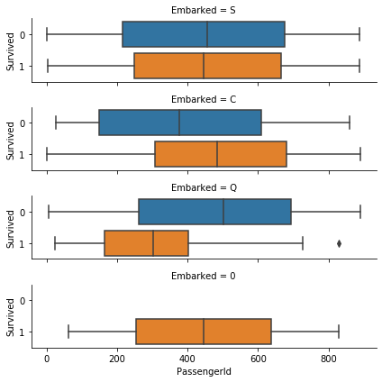


    Survived*Embarked=Fare


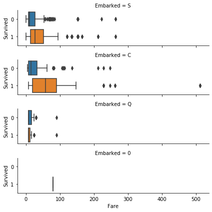


    Survived*Embarked=Age


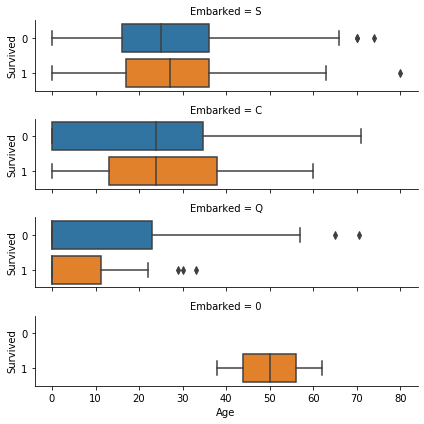


    Survived*Embarked=Pclass


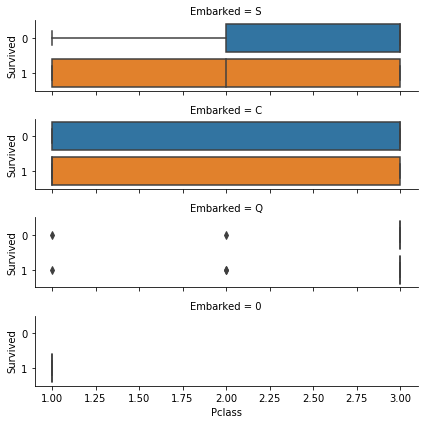


    
     
    


<hr>


<h3 align="center">Survived - Parch</h3>


    
      
    relation  7  :  2
    
    
     PassengerId
    Anova passed


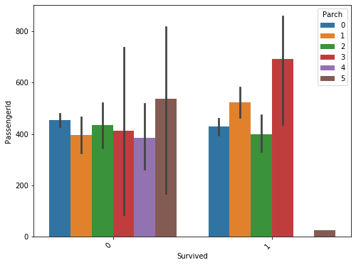


    turkeyHSD
            group2  meandiff   p-adj      lower      upper  reject
    group1                                                        
    0            1  -58.8881  0.8884  -179.1219    61.3457   False
    0            2  -20.4315  0.9000  -157.0126   116.1497   False
    0            3  -41.8315  0.9000  -628.2242   544.5613   False
    0            4  -69.8315  0.9000  -485.4003   345.7374   False
    0            5   83.6685  0.9000  -331.9003   499.2374   False
    0           10  -24.9559  0.9000   -91.8653    41.9534   False
    0           11   68.4916  0.6212   -41.3782   178.3614   False
    0           12  -53.9065  0.9000  -190.4876    82.6747   False
    0           13  236.8352  0.8797  -242.4877   716.1581   False
    0           15 -427.8315  0.8350 -1256.1879   400.5250   False
    1            2   38.4566  0.9000  -134.8453   211.7585   False
    1            3   17.0566  0.9000  -578.9599   613.0731   False
    1            4  -10.9434  0.9000  -439.9849   418.0981   False
    1            5  142.5566  0.9000  -286.4849   571.5981   False
    1           10   33.9321  0.9000   -91.9885   159.8528   False
    1           11  127.3797  0.2086   -25.7559   280.5153   False
    1           12    4.9816  0.9000  -168.3203   178.2835   False
    1           13  295.7233  0.6635  -195.3262   786.7728   False
    1           15 -368.9434  0.9000 -1204.1401   466.2533   False
    2            3  -21.4000  0.9000  -620.9280   578.1280   False
    2            4  -49.4000  0.9000  -483.3065   384.5065   False
    2            5  104.1000  0.9000  -329.8065   538.0065   False
    2           10   -4.5245  0.9000  -146.1375   137.0886   False
    2           11   88.9231  0.7984   -77.3561   255.2022   False
    2           12  -33.4750  0.9000  -218.4934   151.5434   False
    2           13  257.2667  0.8291  -238.0392   752.5725   False
    2           15 -407.4000  0.8953 -1245.1063   430.3063   False
    3            4  -28.0000  0.9000  -744.5731   688.5731   False
    3            5  125.5000  0.9000  -591.0731   842.0731   False
    3           10   16.8755  0.9000  -570.7096   604.4607   False
    3           11  110.3231  0.9000  -483.6894   704.3356   False
    3           12  -12.0750  0.9000  -611.6030   587.4530   False
    3           13  278.6667  0.9000  -476.6677  1034.0010   False
    3           15 -386.0000  0.9000 -1399.3873   627.3873   False
    4            5  153.5000  0.9000  -431.5794   738.5794   False
    4           10   44.8755  0.9000  -372.3742   462.1253   False
    4           11  138.3231  0.9000  -287.9302   564.5763   False
    4           12   15.9250  0.9000  -417.9815   449.8315   False
    4           13  306.6667  0.8974  -325.2914   938.6247   False
    4           15 -358.0000  0.9000 -1283.0918   567.0918   False
    5           10 -108.6245  0.9000  -525.8742   308.6253   False
    5           11  -15.1769  0.9000  -441.4302   411.0763   False
    5           12 -137.5750  0.9000  -571.4815   296.3315   False
    5           13  153.1667  0.9000  -478.7914   785.1247   False
    5           15 -511.5000  0.7621 -1436.5918   413.5918   False
    10          11   93.4475  0.2510   -22.6180   209.5131   False
    10          12  -28.9505  0.9000  -170.5636   112.6625   False
    10          13  261.7911  0.7789  -218.9898   742.5721   False
    10          15 -402.8755  0.8962 -1232.0765   426.3254   False
    11          12 -122.3981  0.3862  -288.6772    43.8811   False
    11          13  168.3436  0.9000  -320.2716   656.9588   False
    11          15 -496.3231  0.6774 -1330.0909   337.4447   False
    12          13  290.7417  0.6940  -204.5642   786.0475   False
    12          15 -373.9250  0.9000 -1211.6313   463.7813   False
    13          15 -664.6667  0.4755 -1620.0974   290.7641   False
    
    
     Fare
    Anova faled to reject => no difference 
    
    
     Survived
    
    
     Age
    Anova faled to reject => no difference 
    
    
     SibSp
    Anova passed


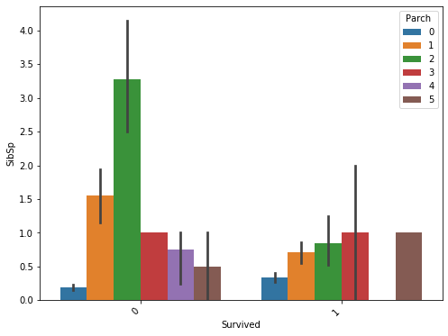


    turkeyHSD
            group2  meandiff   p-adj   lower   upper  reject
    group1                                                  
    0            2    3.0885  0.0010  2.6280  3.5490    True
    1            2    1.7278  0.0010  1.1435  2.3121    True
    0            1    1.3607  0.0010  0.9553  1.7660    True
    0           12    0.6635  0.0010  0.2030  1.1240    True
    0           11    0.5212  0.0010  0.1507  0.8916    True
    10          12    0.5152  0.0222  0.0378  0.9927    True
    1           12   -0.6972  0.0059 -1.2815 -0.1129    True
    1           11   -0.8395  0.0010 -1.3558 -0.3232    True
    1           10   -1.2124  0.0010 -1.6370 -0.7879    True
    2            3   -2.2750  0.0132 -4.2963 -0.2537    True
    2           13   -2.2750  0.0010 -3.9449 -0.6051    True
    2           12   -2.4250  0.0010 -3.0488 -1.8012    True
    2            4   -2.5250  0.0010 -3.9879 -1.0621    True
    2           11   -2.5673  0.0010 -3.1279 -2.0067    True
    2            5   -2.7750  0.0010 -4.2379 -1.3121    True
    2           10   -2.9402  0.0010 -3.4177 -2.4628    True
    
    
     Parch
    
    
     Pclass
    Anova faled to reject => no difference 
    ['PassengerId', 'SibSp']


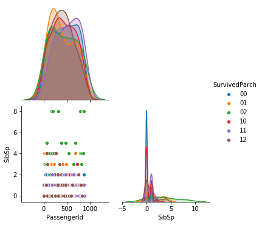


    Survived*Parch=PassengerId


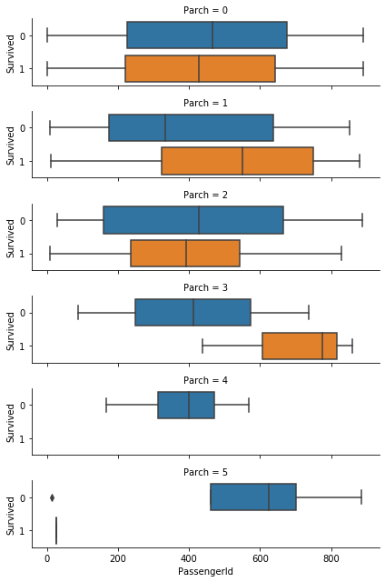


    Survived*Parch=SibSp


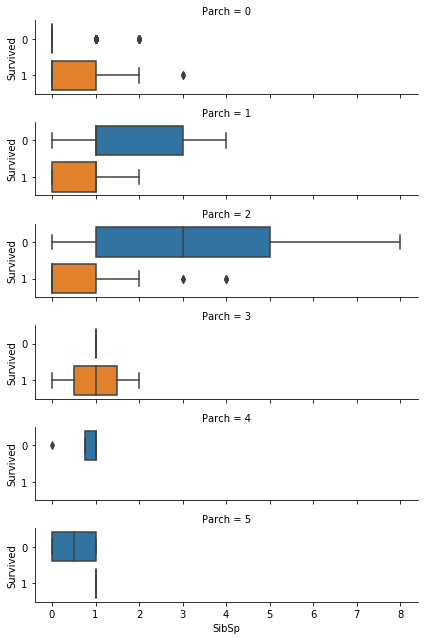


    
     
    


<hr>


<h3 align="center">Survived - Cabin</h3>


    
      
    relation  102  :  2
    
    
     PassengerId
    Anova faled to reject => no difference 
    
    
     Fare
    Anova passed


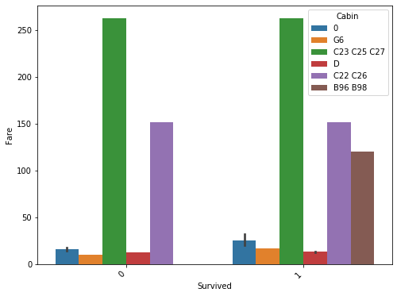


    turkeyHSD
                        group2  meandiff   p-adj     lower     upper  reject
    group1                                                                  
    0G6           1C23 C25 C27  252.5375  0.0010  161.5160  343.5590    True
    0D            1C23 C25 C27  250.1250  0.0010  138.6469  361.6031    True
    00            0C23 C25 C27  246.6159  0.0010  182.1204  311.1115    True
    00            1C23 C25 C27  246.6159  0.0010  182.1204  311.1115    True
    10            1C23 C25 C27  237.3673  0.0010  172.6937  302.0409    True
    1B96 B98      1C23 C25 C27  143.0000  0.0010   64.1731  221.8269    True
    0G6               1C22 C26  141.0875  0.0024   29.6094  252.5656    True
    0D                1C22 C26  138.6750  0.0226    9.9512  267.3988    True
    00                0C22 C26  135.1659  0.0010   70.6704  199.6615    True
    00                1C22 C26  135.1659  0.0010   44.0499  226.2819    True
    10                1C22 C26  125.9173  0.0010   34.6752  217.1594    True
    0C22 C26      0C23 C25 C27  111.4500  0.0040   20.4285  202.4715    True
    0C22 C26      1C23 C25 C27  111.4500  0.0040   20.4285  202.4715    True
    0G6               1B96 B98  109.5375  0.0010   30.7106  188.3644    True
    0D                1B96 B98  107.1250  0.0294    5.3599  208.8901    True
    00                1B96 B98  103.6159  0.0010   57.9163  149.3155    True
    10                1B96 B98   94.3673  0.0010   48.4168  140.3177    True
    00                      10    9.2486  0.0043    1.6696   16.8277    True
    1B96 B98               1G6 -103.3000  0.0013 -182.1269  -24.4731    True
    1B96 B98                1D -106.6042  0.0010 -185.4310  -27.7773    True
    0C22 C26                10 -125.9173  0.0010 -190.5909  -61.2437    True
    1C22 C26               1G6 -134.8500  0.0049 -246.3281  -23.3719    True
    0C22 C26               1G6 -134.8500  0.0010 -225.8715  -43.8285    True
    0C22 C26                1D -138.1542  0.0010 -229.1756  -47.1327    True
    1C22 C26                1D -138.1542  0.0034 -249.6322  -26.6761    True
    0C22 C26                0D -138.6750  0.0032 -250.1531  -27.1969    True
    0C22 C26               0G6 -141.0875  0.0010 -232.1090  -50.0660    True
    0C23 C25 C27      1B96 B98 -143.0000  0.0010 -221.8269  -64.1731    True
    0C23 C25 C27            10 -237.3673  0.0010 -302.0409 -172.6937    True
    1C23 C25 C27           1G6 -246.3000  0.0010 -337.3215 -155.2785    True
    0C23 C25 C27           1G6 -246.3000  0.0010 -337.3215 -155.2785    True
    1C23 C25 C27            1D -249.6042  0.0010 -340.6256 -158.5827    True
    0C23 C25 C27            1D -249.6042  0.0010 -340.6256 -158.5827    True
    0C23 C25 C27            0D -250.1250  0.0010 -361.6031 -138.6469    True
    0C23 C25 C27           0G6 -252.5375  0.0010 -343.5590 -161.5160    True
    
    
     Survived
    
    
     Age
    Anova faled to reject => no difference 
    
    
     SibSp
    Anova faled to reject => no difference 
    
    
     Parch
    Anova passed


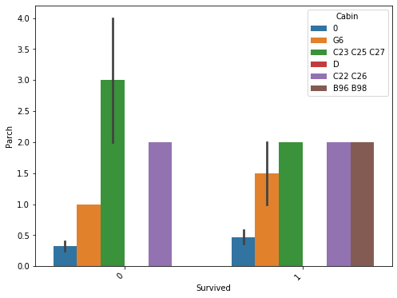


    turkeyHSD
                        group2  meandiff   p-adj   lower   upper  reject
    group1                                                              
    00            0C23 C25 C27    2.6798  0.0010  0.7996  4.5601    True
    00                1B96 B98    1.6798  0.0025  0.3476  3.0121    True
    10                1B96 B98    1.5291  0.0110  0.1895  2.8687    True
    0C23 C25 C27            10   -2.5291  0.0010 -4.4145 -0.6437    True
    0C23 C25 C27            1D   -3.0000  0.0125 -5.6535 -0.3465    True
    
    
     Pclass
    Anova passed


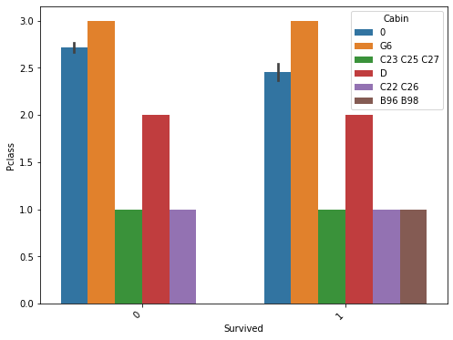


    turkeyHSD
                        group2  meandiff   p-adj   lower   upper  reject
    group1                                                              
    0C23 C25 C27           0G6    2.0000  0.0223  0.1463  3.8537    True
    0C22 C26               0G6    2.0000  0.0223  0.1463  3.8537    True
    1B96 B98               1G6    2.0000  0.0031  0.3946  3.6054    True
    0C23 C25 C27           1G6    2.0000  0.0223  0.1463  3.8537    True
    0C22 C26               1G6    2.0000  0.0223  0.1463  3.8537    True
    1C23 C25 C27           1G6    2.0000  0.0223  0.1463  3.8537    True
    0C22 C26                10    1.4563  0.0166  0.1392  2.7735    True
    0C23 C25 C27            10    1.4563  0.0166  0.1392  2.7735    True
    00                      10   -0.2609  0.0010 -0.4153 -0.1066    True
    10                1B96 B98   -1.4563  0.0010 -2.3921 -0.5205    True
    10            1C23 C25 C27   -1.4563  0.0166 -2.7735 -0.1392    True
    00            1C23 C25 C27   -1.7173  0.0014 -3.0308 -0.4037    True
    00            0C23 C25 C27   -1.7173  0.0014 -3.0308 -0.4037    True
    00                1B96 B98   -1.7173  0.0010 -2.6480 -0.7865    True
    00                0C22 C26   -1.7173  0.0014 -3.0308 -0.4037    True
    0G6               1B96 B98   -2.0000  0.0031 -3.6054 -0.3946    True
    0G6           1C23 C25 C27   -2.0000  0.0223 -3.8537 -0.1463    True
    ['Fare', 'Parch', 'Pclass']


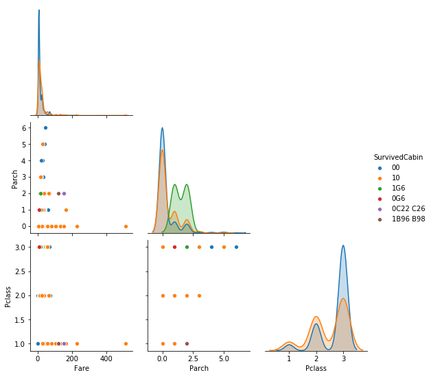


    Survived*Cabin=Fare


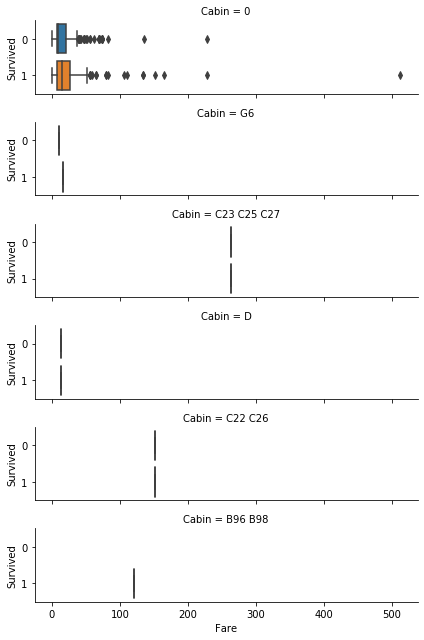


    Survived*Cabin=Parch


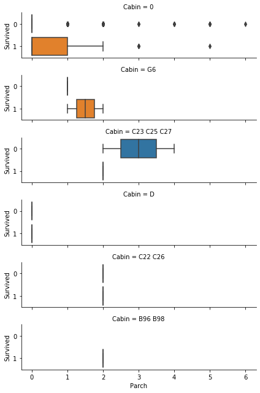


    Survived*Cabin=Pclass


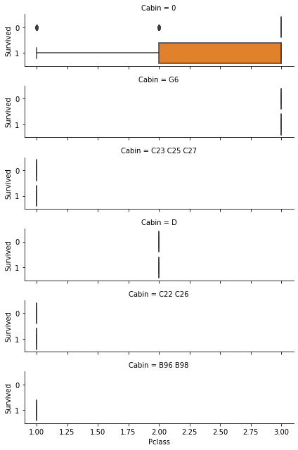


    
     
    


<hr>


<h3 align="center">Survived - Sex</h3>


    
      
    relation  2  :  2
    
    
     PassengerId
    Anova faled to reject => no difference 
    
    
     Fare
    Anova faled to reject => no difference 
    
    
     Survived
    
    
     Age
    Anova faled to reject => no difference 
    
    
     SibSp
    Anova passed


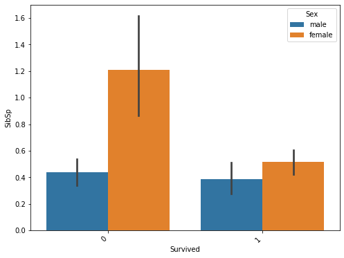


    turkeyHSD
              group2  meandiff  p-adj   lower   upper  reject
    group1                                                   
    0female  1female   -0.6949  0.001 -1.0541 -0.3356    True
    0female    0male   -0.7697  0.001 -1.1049 -0.4345    True
    0female    1male   -0.8246  0.001 -1.2332 -0.4159    True
    
    
     Parch
    Anova passed


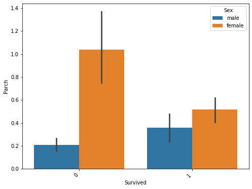


    turkeyHSD
              group2  meandiff  p-adj   lower   upper  reject
    group1                                                   
    0male    1female    0.3078  0.001  0.1490  0.4665    True
    0female  1female   -0.5220  0.001 -0.7774 -0.2666    True
    0female    1male   -0.6792  0.001 -0.9697 -0.3887    True
    0female    0male   -0.8298  0.001 -1.0681 -0.5915    True
    
    
     Pclass
    Anova passed


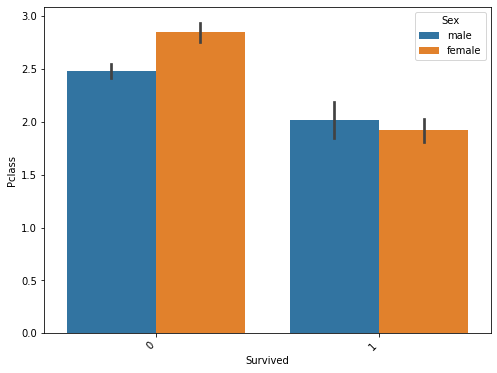


    turkeyHSD
              group2  meandiff  p-adj   lower   upper  reject
    group1                                                   
    0female    0male   -0.3754  0.001 -0.6171 -0.1336    True
    0male      1male   -0.4581  0.001 -0.6718 -0.2445    True
    0male    1female   -0.5580  0.001 -0.7191 -0.3970    True
    0female    1male   -0.8335  0.001 -1.1282 -0.5388    True
    0female  1female   -0.9334  0.001 -1.1925 -0.6743    True
    ['SibSp', 'Parch', 'Pclass']


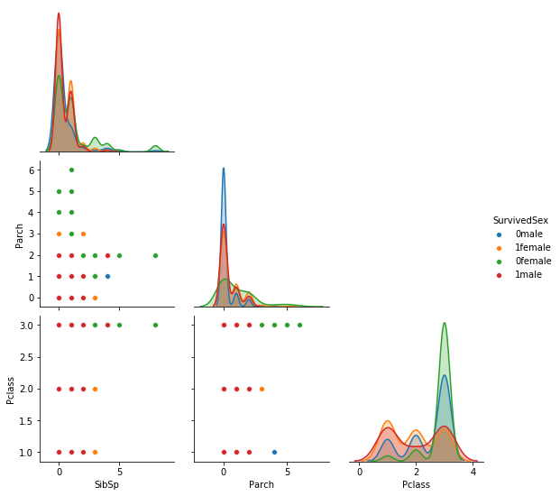


    Survived*Sex=SibSp


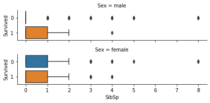


    Survived*Sex=Parch


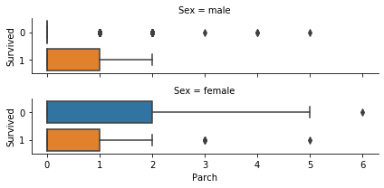


    Survived*Sex=Pclass


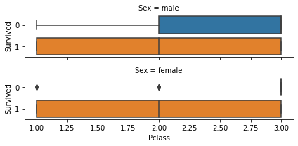


    
     
    


<hr>


<h3 align="center">Survived - Pclass</h3>


    
      
    relation  3  :  2
    
    
     PassengerId
    Anova passed


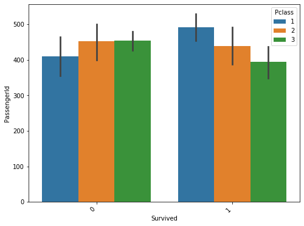


    turkeyHSD
            group2  meandiff   p-adj     lower   upper  reject
    group1                                                    
    11          13  -97.7132  0.0297 -189.6519 -5.7745    True
    
    
     Fare
    Anova passed


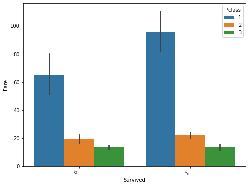


    turkeyHSD
            group2  meandiff  p-adj    lower    upper  reject
    group1                                                   
    3           11   81.9387  0.001  70.6654  93.2119    True
    2           11   76.1957  0.001  61.2444  91.1470    True
    1           11   30.9240  0.001  15.0725  46.7755    True
    1           12  -42.6283  0.001 -60.0548 -25.2018    True
    1            2  -45.2717  0.001 -62.2625 -28.2809    True
    1           13  -50.9891  0.001 -67.2546 -34.7237    True
    1            3  -51.0146  0.001 -64.8793 -37.1500    True
    11          12  -73.5523  0.001 -88.9971 -58.1076    True
    11          13  -81.9131  0.001 -96.0348 -67.7915    True
    
    
     Survived
    
    
     Age
    Anova faled to reject => no difference 
    
    
     SibSp
    Anova passed


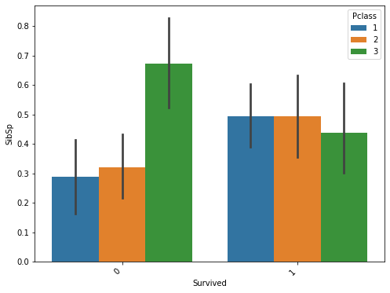


    turkeyHSD
            group2  meandiff   p-adj   lower   upper  reject
    group1                                                  
    1            2    0.0321  0.9000 -0.4410  0.5051   False
    1            3    0.3845  0.0516 -0.0015  0.7706   False
    1           11    0.2051  0.7422 -0.2362  0.6465   False
    1           12    0.2068  0.8059 -0.2784  0.6919   False
    1           13    0.1495  0.9000 -0.3034  0.6023   False
    2            3    0.3525  0.0555 -0.0046  0.7095   False
    2           11    0.1731  0.8230 -0.2432  0.5893   False
    2           12    0.1747  0.8857 -0.2878  0.6372   False
    2           13    0.1174  0.9000 -0.3111  0.5459   False
    3           11   -0.1794  0.5664 -0.4933  0.1345   False
    3           12   -0.1778  0.7228 -0.5508  0.1952   False
    3           13   -0.2351  0.3230 -0.5649  0.0948   False
    11          12    0.0016  0.9000 -0.4284  0.4316   False
    11          13   -0.0557  0.9000 -0.4488  0.3375   False
    12          13   -0.0573  0.9000 -0.4991  0.3845   False
    
    
     Parch
    Anova passed


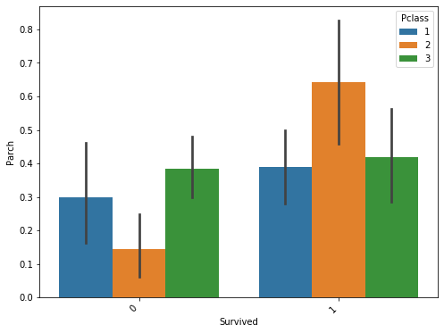


    turkeyHSD
            group2  meandiff  p-adj   lower   upper  reject
    group1                                                 
    2           12    0.4993  0.001  0.1621  0.8366    True
    
    
     Pclass
    ['PassengerId', 'Fare', 'SibSp', 'Parch']


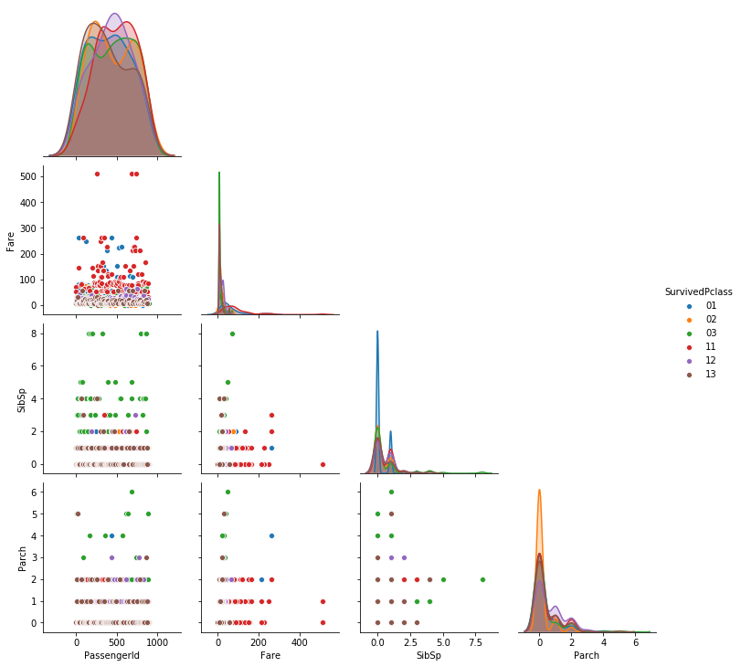


    Survived*Pclass=PassengerId


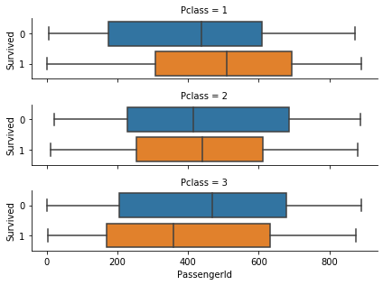


    Survived*Pclass=Fare


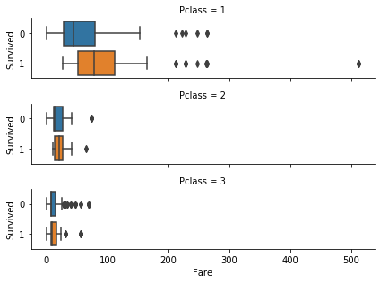


    Survived*Pclass=SibSp


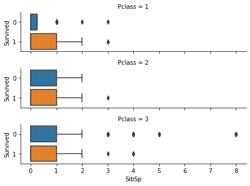


    Survived*Pclass=Parch


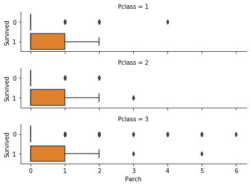


    
     
    


<hr>


<h3 align="center">__Age - SibSp</h3>


    
      
    relation  6  :  9
    
    
     PassengerId
    Anova faled to reject => no difference 
    
    
     Fare
    Anova passed


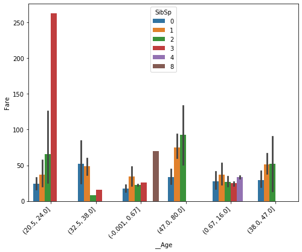


    turkeyHSD
                            group2  meandiff   p-adj     lower     upper  reject
    group1                                                                      
    (-0.001, 0.67]0  (20.5, 24.0]3  245.8411  0.0010  115.2269  376.4552    True
    (-0.001, 0.67]2  (20.5, 24.0]3  240.2736  0.0010   72.8602  407.6870    True
    (20.5, 24.0]0    (20.5, 24.0]3  238.5093  0.0010  107.1362  369.8823    True
    (0.67, 16.0]3    (20.5, 24.0]3  238.0250  0.0010   90.9841  385.0659    True
    (-0.001, 0.67]3  (20.5, 24.0]3  237.5333  0.0010   78.7110  396.3556    True
    (0.67, 16.0]2    (20.5, 24.0]3  236.1214  0.0010   89.0806  383.1623    True
    (0.67, 16.0]0    (20.5, 24.0]3  235.4901  0.0010  102.0526  368.9275    True
    (0.67, 16.0]4    (20.5, 24.0]3  229.7368  0.0010   92.6428  366.8307    True
    (-0.001, 0.67]1  (20.5, 24.0]3  228.9165  0.0010   94.5216  363.3115    True
    (20.5, 24.0]1    (20.5, 24.0]3  226.4564  0.0010   85.4817  367.4311    True
    (0.67, 16.0]1    (20.5, 24.0]3  225.9434  0.0010   91.7141  360.1728    True
    (20.5, 24.0]2    (20.5, 24.0]3  197.3562  0.0010   52.3720  342.3405    True
    (-0.001, 0.67]8  (20.5, 24.0]3  193.4500  0.0010   46.4091  340.4909    True
    (-0.001, 0.67]0  (47.0, 80.0]1   58.2461  0.0010   18.3835   98.1086    True
    (20.5, 24.0]0    (47.0, 80.0]1   50.9143  0.0030    8.6314   93.1972    True
    (38.0, 47.0]0    (47.0, 80.0]1   46.0915  0.0249    2.4355   89.7476    True
    (-0.001, 0.67]0  (32.5, 38.0]0   35.0860  0.0020    6.5596   63.6125    True
    (20.5, 24.0]3    (47.0, 80.0]1 -187.5950  0.0010 -322.3602  -52.8298    True
    (20.5, 24.0]3    (32.5, 38.0]0 -210.7550  0.0010 -342.6125  -78.8975    True
    (20.5, 24.0]3    (38.0, 47.0]2 -210.9458  0.0068 -394.3381  -27.5536    True
    (20.5, 24.0]3    (38.0, 47.0]1 -211.7715  0.0010 -346.3446  -77.1984    True
    (20.5, 24.0]3    (32.5, 38.0]1 -214.4598  0.0010 -348.6892  -80.2305    True
    (20.5, 24.0]3    (47.0, 80.0]0 -229.7528  0.0010 -361.5057  -98.0000    True
    (20.5, 24.0]3    (38.0, 47.0]0 -233.6865  0.0010 -365.5080 -101.8651    True
    (20.5, 24.0]3    (32.5, 38.0]3 -247.1500  0.0137 -471.7587  -22.5413    True
    (20.5, 24.0]3    (32.5, 38.0]2 -255.0750  0.0084 -479.6837  -30.4663    True
    
    
     Survived
    Anova passed


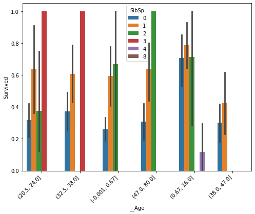


    turkeyHSD
                            group2  meandiff   p-adj   lower   upper  reject
    group1                                                                  
    (-0.001, 0.67]8  (0.67, 16.0]1    0.7857  0.0117  0.0790  1.4924    True
    (-0.001, 0.67]8  (0.67, 16.0]0    0.7059  0.0409  0.0118  1.4000    True
    (-0.001, 0.67]0  (0.67, 16.0]1    0.5248  0.0010  0.1782  0.8715    True
    (-0.001, 0.67]0  (0.67, 16.0]0    0.4450  0.0010  0.1248  0.7652    True
    (-0.001, 0.67]0  (47.0, 80.0]1    0.3791  0.0295  0.0156  0.7426    True
    (0.67, 16.0]0    (20.5, 24.0]0   -0.3901  0.0090 -0.7351 -0.0450    True
    (0.67, 16.0]0    (47.0, 80.0]0   -0.3994  0.0106 -0.7563 -0.0425    True
    (0.67, 16.0]0    (38.0, 47.0]0   -0.4059  0.0090 -0.7649 -0.0469    True
    (0.67, 16.0]1    (32.5, 38.0]0   -0.4128  0.0192 -0.7966 -0.0291    True
    (0.67, 16.0]1    (20.5, 24.0]0   -0.4699  0.0010 -0.8396 -0.1002    True
    (0.67, 16.0]1    (47.0, 80.0]0   -0.4793  0.0013 -0.8600 -0.0985    True
    (0.67, 16.0]1    (38.0, 47.0]0   -0.4857  0.0011 -0.8685 -0.1030    True
    (0.67, 16.0]0    (0.67, 16.0]4   -0.5882  0.0041 -1.0850 -0.0915    True
    (0.67, 16.0]1    (0.67, 16.0]4   -0.6681  0.0010 -1.1823 -0.1539    True
    (0.67, 16.0]0    (0.67, 16.0]3   -0.7059  0.0409 -1.4000 -0.0118    True
    (0.67, 16.0]1    (0.67, 16.0]3   -0.7857  0.0117 -1.4924 -0.0790    True
    
    
     Age
    
    
     SibSp
    
    
     Parch
    Anova passed


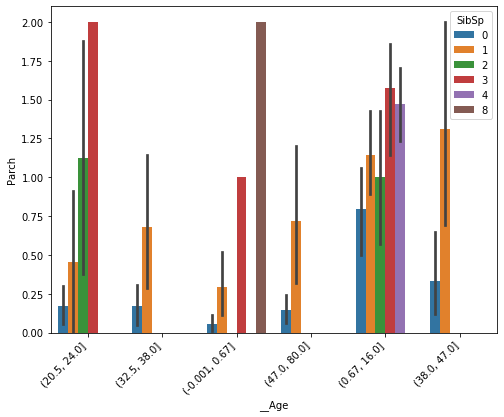


    turkeyHSD
                              group2  meandiff   p-adj   lower   upper  reject
    group1                                                                    
    (-0.001, 0.67]2  (-0.001, 0.67]8    2.0000  0.0220  0.1230  3.8770    True
    (-0.001, 0.67]0  (-0.001, 0.67]8    1.9420  0.0010  0.8882  2.9958    True
    (-0.001, 0.67]0    (20.5, 24.0]3    1.9420  0.0486  0.0048  3.8792    True
    (-0.001, 0.67]1  (-0.001, 0.67]8    1.7037  0.0010  0.5500  2.8574    True
    (-0.001, 0.67]0    (0.67, 16.0]3    1.5135  0.0010  0.4596  2.5673    True
    (-0.001, 0.67]0    (0.67, 16.0]4    1.4126  0.0010  0.7135  2.1118    True
    (-0.001, 0.67]1    (0.67, 16.0]3    1.2751  0.0128  0.1215  2.4288    True
    (-0.001, 0.67]0    (38.0, 47.0]1    1.2497  0.0010  0.6682  1.8312    True
    (-0.001, 0.67]1    (0.67, 16.0]4    1.1743  0.0010  0.3321  2.0164    True
    (32.5, 38.0]0      (38.0, 47.0]1    1.1382  0.0010  0.4979  1.7785    True
    (20.5, 24.0]0      (38.0, 47.0]1    1.1366  0.0010  0.5187  1.7546    True
    (-0.001, 0.67]0    (0.67, 16.0]1    1.0849  0.0010  0.5211  1.6487    True
    (-0.001, 0.67]0    (20.5, 24.0]2    1.0670  0.0185  0.0779  2.0562    True
    (-0.001, 0.67]1    (38.0, 47.0]1    1.0114  0.0010  0.2640  1.7588    True
    (38.0, 47.0]0      (38.0, 47.0]1    0.9744  0.0010  0.3357  1.6130    True
    (-0.001, 0.67]1    (0.67, 16.0]1    0.8466  0.0064  0.1129  1.5802    True
    (-0.001, 0.67]0    (0.67, 16.0]0    0.7361  0.0010  0.2154  1.2569    True
    (-0.001, 0.67]0    (47.0, 80.0]1    0.6620  0.0105  0.0708  1.2533    True
    (-0.001, 0.67]0    (32.5, 38.0]1    0.6206  0.0137  0.0568  1.1844    True
    (0.67, 16.0]0      (20.5, 24.0]0   -0.6231  0.0120 -1.1843 -0.0619    True
    (0.67, 16.0]0      (32.5, 38.0]0   -0.6246  0.0217 -1.2103 -0.0390    True
    (0.67, 16.0]0      (47.0, 80.0]0   -0.6490  0.0107 -1.2294 -0.0685    True
    (0.67, 16.0]1      (38.0, 47.0]0   -0.8095  0.0010 -1.4320 -0.1870    True
    (0.67, 16.0]1      (20.5, 24.0]0   -0.9718  0.0010 -1.5731 -0.3705    True
    (0.67, 16.0]1      (32.5, 38.0]0   -0.9734  0.0010 -1.5976 -0.3492    True
    (0.67, 16.0]1      (47.0, 80.0]0   -0.9977  0.0010 -1.6170 -0.3784    True
    (0.67, 16.0]4      (38.0, 47.0]0   -1.1373  0.0010 -1.8846 -0.3899    True
    (38.0, 47.0]1      (47.0, 80.0]0   -1.1625  0.0010 -1.7980 -0.5270    True
    (-0.001, 0.67]8    (0.67, 16.0]0   -1.2059  0.0212 -2.3348 -0.0769    True
    (0.67, 16.0]3      (38.0, 47.0]0   -1.2381  0.0079 -2.3245 -0.1517    True
    (-0.001, 0.67]8    (47.0, 80.0]1   -1.2800  0.0137 -2.4431 -0.1169    True
    (0.67, 16.0]4      (20.5, 24.0]0   -1.2995  0.0010 -2.0293 -0.5698    True
    (0.67, 16.0]4      (32.5, 38.0]0   -1.3011  0.0010 -2.0498 -0.5524    True
    (-0.001, 0.67]8    (32.5, 38.0]1   -1.3214  0.0068 -2.4708 -0.1720    True
    (0.67, 16.0]4      (47.0, 80.0]0   -1.3254  0.0010 -2.0701 -0.5808    True
    (0.67, 16.0]3      (20.5, 24.0]0   -1.4004  0.0010 -2.4747 -0.3260    True
    (0.67, 16.0]3      (32.5, 38.0]0   -1.4019  0.0010 -2.4893 -0.3146    True
    (0.67, 16.0]3      (47.0, 80.0]0   -1.4263  0.0010 -2.5108 -0.3417    True
    (-0.001, 0.67]8    (20.5, 24.0]1   -1.5455  0.0047 -2.8606 -0.2304    True
    (-0.001, 0.67]8    (38.0, 47.0]0   -1.6667  0.0010 -2.7530 -0.5803    True
    (-0.001, 0.67]8    (20.5, 24.0]0   -1.8289  0.0010 -2.9033 -0.7546    True
    (-0.001, 0.67]8    (32.5, 38.0]0   -1.8305  0.0010 -2.9178 -0.7432    True
    (-0.001, 0.67]8    (47.0, 80.0]0   -1.8548  0.0010 -2.9394 -0.7703    True
    
    
     Pclass
    Anova faled to reject => no difference 
    ['Fare', 'Survived', 'Parch']


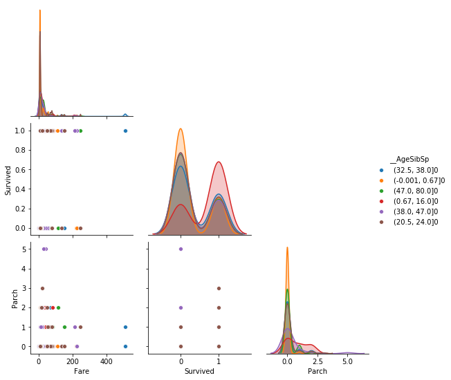


    __Age*SibSp=Fare


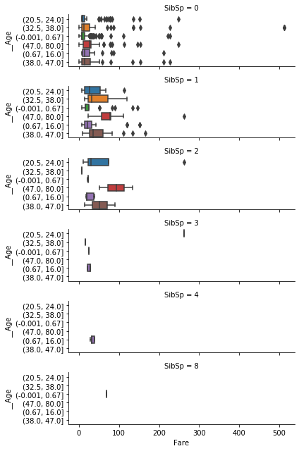


    __Age*SibSp=Survived


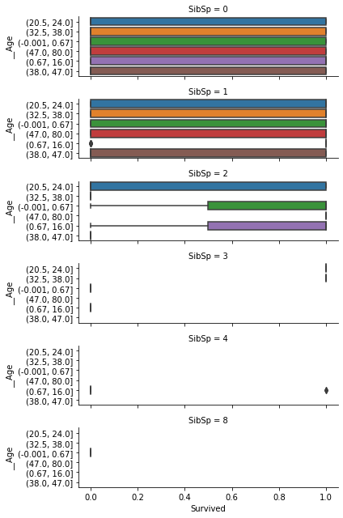


    __Age*SibSp=Parch


    
     
    


<hr>


<h3 align="center">__Age - Embarked</h3>


    
      
    relation  4  :  9
    
    
     PassengerId
    Anova faled to reject => no difference 
    
    
     Fare
    Anova passed


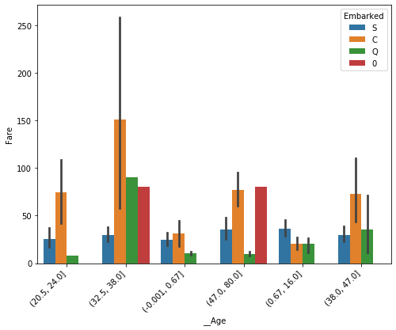


    turkeyHSD
                            group2  meandiff   p-adj     lower     upper  reject
    group1                                                                      
    (20.5, 24.0]Q    (32.5, 38.0]C  143.0821  0.0010   33.4572  252.7069    True
    (-0.001, 0.67]Q  (32.5, 38.0]C  140.4017  0.0010   88.1841  192.6194    True
    (0.67, 16.0]Q    (32.5, 38.0]C  130.8247  0.0010   51.0609  210.5885    True
    (0.67, 16.0]C    (32.5, 38.0]C  130.7890  0.0010   69.3868  192.1912    True
    (-0.001, 0.67]S  (32.5, 38.0]C  126.2986  0.0010   76.8312  175.7660    True
    (20.5, 24.0]S    (32.5, 38.0]C  125.0672  0.0010   74.9531  175.1813    True
    (-0.001, 0.67]C  (32.5, 38.0]C  120.0000  0.0010   66.3152  173.6847    True
    (0.67, 16.0]S    (32.5, 38.0]C  114.7281  0.0010   64.4541  165.0021    True
    (20.5, 24.0]C    (32.5, 38.0]C   76.7441  0.0017   15.3419  138.1463    True
    (-0.001, 0.67]Q  (47.0, 80.0]C   66.6329  0.0010   23.7023  109.5635    True
    (-0.001, 0.67]Q  (20.5, 24.0]C   63.6577  0.0010   16.1665  111.1488    True
    (-0.001, 0.67]Q  (38.0, 47.0]C   62.1208  0.0069    8.3637  115.8778    True
    (0.67, 16.0]C    (47.0, 80.0]C   57.0201  0.0240    3.2932  110.7471    True
    (-0.001, 0.67]S  (47.0, 80.0]C   52.5298  0.0010   12.9902   92.0693    True
    (20.5, 24.0]S    (47.0, 80.0]C   51.2983  0.0012   10.9527   91.6440    True
    (-0.001, 0.67]S  (20.5, 24.0]C   49.5545  0.0120    5.1051   94.0039    True
    (38.0, 47.0]S    (47.0, 80.0]C   47.3479  0.0061    6.6627   88.0331    True
    (32.5, 38.0]S    (47.0, 80.0]C   47.1428  0.0062    6.5987   87.6870    True
    (-0.001, 0.67]C  (47.0, 80.0]C   46.2312  0.0336    1.5276   90.9347    True
    (0.67, 16.0]S    (47.0, 80.0]C   40.9592  0.0445    0.4151   81.5034    True
    (20.5, 24.0]C    (20.5, 24.0]S  -48.3231  0.0216  -93.4910   -3.1552    True
    (32.5, 38.0]C    (47.0, 80.0]C  -73.7688  0.0012 -131.7159  -15.8218    True
    (32.5, 38.0]C    (38.0, 47.0]C  -78.2810  0.0049 -144.6485  -11.9135    True
    (32.5, 38.0]C    (47.0, 80.0]S -115.1815  0.0010 -166.2450  -64.1179    True
    (32.5, 38.0]C    (38.0, 47.0]Q -115.2327  0.0049 -212.9231  -17.5424    True
    (32.5, 38.0]C    (32.5, 38.0]S -120.9116  0.0010 -171.1857  -70.6376    True
    (32.5, 38.0]C    (38.0, 47.0]S -121.1167  0.0010 -171.5046  -70.7289    True
    (32.5, 38.0]C    (47.0, 80.0]Q -141.5432  0.0010 -251.1680  -31.9183    True
    
    
     Survived
    Anova passed


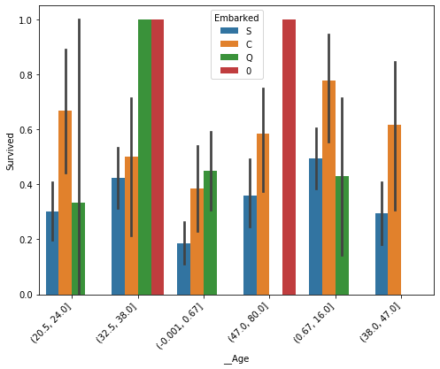


    turkeyHSD
                            group2  meandiff   p-adj   lower   upper  reject
    group1                                                                  
    (-0.001, 0.67]S  (0.67, 16.0]C    0.5910  0.0010  0.1577  1.0243    True
    (-0.001, 0.67]S  (20.5, 24.0]C    0.4799  0.0133  0.0466  0.9131    True
    (-0.001, 0.67]S  (47.0, 80.0]C    0.3965  0.0358  0.0111  0.7820    True
    (-0.001, 0.67]S  (0.67, 16.0]S    0.3063  0.0064  0.0424  0.5703    True
    (0.67, 16.0]C    (20.5, 24.0]S   -0.4751  0.0192 -0.9154 -0.0348    True
    (0.67, 16.0]C    (38.0, 47.0]S   -0.4820  0.0173 -0.9253 -0.0387    True
    
    
     Age
    
    
     SibSp
    Anova passed


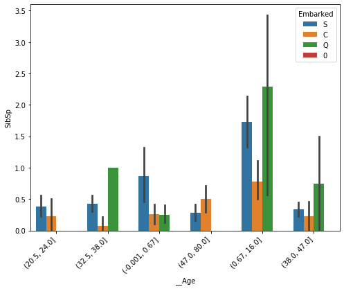


    turkeyHSD
                            group2  meandiff   p-adj   lower   upper  reject
    group1                                                                  
    (-0.001, 0.67]Q  (0.67, 16.0]Q    2.0408  0.0022  0.3857  3.6959    True
    (-0.001, 0.67]C  (0.67, 16.0]Q    2.0293  0.0033  0.3479  3.7107    True
    (-0.001, 0.67]Q  (0.67, 16.0]S    1.4811  0.0010  0.7247  2.2376    True
    (-0.001, 0.67]C  (0.67, 16.0]S    1.4696  0.0010  0.6572  2.2820    True
    (-0.001, 0.67]S  (0.67, 16.0]S    0.8579  0.0010  0.2143  1.5015    True
    (0.67, 16.0]S    (47.0, 80.0]C   -1.2260  0.0012 -2.1898 -0.2622    True
    (0.67, 16.0]S    (32.5, 38.0]S   -1.3014  0.0010 -1.9794 -0.6234    True
    (0.67, 16.0]S    (20.5, 24.0]S   -1.3444  0.0010 -2.0157 -0.6732    True
    (0.67, 16.0]S    (38.0, 47.0]S   -1.3880  0.0010 -2.0707 -0.7053    True
    (0.67, 16.0]S    (47.0, 80.0]S   -1.4473  0.0010 -2.1579 -0.7368    True
    (0.67, 16.0]S    (38.0, 47.0]C   -1.4953  0.0030 -2.7283 -0.2622    True
    (0.67, 16.0]S    (20.5, 24.0]C   -1.5038  0.0010 -2.5817 -0.4259    True
    (0.67, 16.0]S    (32.5, 38.0]C   -1.6546  0.0010 -2.8497 -0.4595    True
    (0.67, 16.0]Q    (47.0, 80.0]C   -1.7857  0.0422 -3.5452 -0.0262    True
    (0.67, 16.0]Q    (32.5, 38.0]S   -1.8611  0.0076 -3.4818 -0.2404    True
    (0.67, 16.0]Q    (20.5, 24.0]S   -1.9041  0.0051 -3.5220 -0.2862    True
    (0.67, 16.0]Q    (38.0, 47.0]S   -1.9477  0.0036 -3.5704 -0.3250    True
    (0.67, 16.0]Q    (47.0, 80.0]S   -2.0070  0.0024 -3.6416 -0.3724    True
    (0.67, 16.0]Q    (38.0, 47.0]C   -2.0549  0.0215 -3.9752 -0.1347    True
    (0.67, 16.0]Q    (20.5, 24.0]C   -2.0635  0.0097 -3.8880 -0.2389    True
    (0.67, 16.0]Q    (32.5, 38.0]C   -2.2143  0.0058 -4.1104 -0.3182    True
    
    
     Parch
    Anova passed


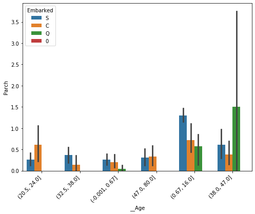


    turkeyHSD
                            group2  meandiff   p-adj   lower   upper  reject
    group1                                                                  
    (-0.001, 0.67]Q  (0.67, 16.0]S    1.2606  0.0010  0.7300  1.7911    True
    (-0.001, 0.67]C  (0.67, 16.0]S    1.0962  0.0010  0.5264  1.6660    True
    (-0.001, 0.67]S  (0.67, 16.0]S    1.0376  0.0010  0.5863  1.4890    True
    (-0.001, 0.67]Q  (38.0, 47.0]S    0.5648  0.0248  0.0313  1.0984    True
    (0.67, 16.0]S    (38.0, 47.0]S   -0.6957  0.0010 -1.1746 -0.2169    True
    (0.67, 16.0]S    (38.0, 47.0]C   -0.9168  0.0244 -1.7816 -0.0519    True
    (0.67, 16.0]S    (32.5, 38.0]S   -0.9315  0.0010 -1.4070 -0.4560    True
    (0.67, 16.0]S    (47.0, 80.0]C   -0.9680  0.0010 -1.6440 -0.2921    True
    (0.67, 16.0]S    (47.0, 80.0]S   -0.9899  0.0010 -1.4882 -0.4916    True
    (0.67, 16.0]S    (20.5, 24.0]S   -1.0382  0.0010 -1.5090 -0.5674    True
    (0.67, 16.0]S    (32.5, 38.0]C   -1.1585  0.0010 -1.9967 -0.3203    True
    
    
     Pclass
    Anova passed


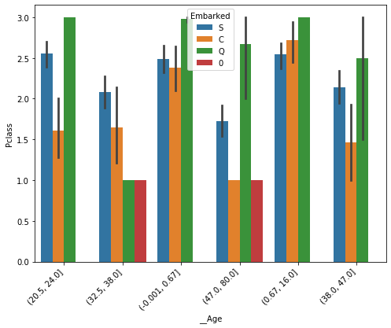


    turkeyHSD
                              group2  meandiff   p-adj   lower   upper  reject
    group1                                                                    
    (47.0, 80.0]C      (47.0, 80.0]Q    1.6667  0.0319  0.0616  3.2717    True
    (20.5, 24.0]C      (20.5, 24.0]S    0.9415  0.0010  0.2545  1.6286    True
    (47.0, 80.0]C      (47.0, 80.0]S    0.7213  0.0083  0.0897  1.3529    True
    (-0.001, 0.67]C  (-0.001, 0.67]Q    0.5950  0.0251  0.0325  1.1574    True
    (0.67, 16.0]S      (32.5, 38.0]S   -0.4658  0.0206 -0.8996 -0.0319    True
    (20.5, 24.0]S      (32.5, 38.0]S   -0.4704  0.0156 -0.9000 -0.0409    True
    (-0.001, 0.67]Q  (-0.001, 0.67]S   -0.4961  0.0221 -0.9605 -0.0316    True
    (-0.001, 0.67]C    (47.0, 80.0]S   -0.6633  0.0022 -1.2007 -0.1259    True
    (-0.001, 0.67]S    (47.0, 80.0]S   -0.7622  0.0010 -1.1959 -0.3285    True
    (-0.001, 0.67]C    (20.5, 24.0]C   -0.7735  0.0330 -1.5204 -0.0266    True
    (0.67, 16.0]S      (47.0, 80.0]S   -0.8266  0.0010 -1.2813 -0.3720    True
    (20.5, 24.0]S      (47.0, 80.0]S   -0.8313  0.0010 -1.2819 -0.3807    True
    (-0.001, 0.67]Q    (38.0, 47.0]S   -0.8387  0.0010 -1.3255 -0.3520    True
    (-0.001, 0.67]S    (32.5, 38.0]C   -0.8407  0.0116 -1.5931 -0.0882    True
    (-0.001, 0.67]S    (20.5, 24.0]C   -0.8724  0.0010 -1.5485 -0.1963    True
    (-0.001, 0.67]Q    (32.5, 38.0]S   -0.8974  0.0010 -1.3815 -0.4133    True
    (0.67, 16.0]S      (32.5, 38.0]C   -0.9051  0.0046 -1.6698 -0.1403    True
    (20.5, 24.0]S      (32.5, 38.0]C   -0.9098  0.0040 -1.6721 -0.1475    True
    (-0.001, 0.67]C    (38.0, 47.0]C   -0.9231  0.0147 -1.7625 -0.0837    True
    (0.67, 16.0]S      (20.5, 24.0]C   -0.9368  0.0010 -1.6266 -0.2471    True
    (0.67, 16.0]C      (47.0, 80.0]S   -1.0009  0.0010 -1.7040 -0.2979    True
    (-0.001, 0.67]S    (38.0, 47.0]C   -1.0220  0.0010 -1.7991 -0.2448    True
    (0.67, 16.0]C      (32.5, 38.0]C   -1.0794  0.0069 -2.0134 -0.1454    True
    (32.5, 38.0]S      (47.0, 80.0]C   -1.0822  0.0010 -1.6989 -0.4655    True
    (0.67, 16.0]S      (38.0, 47.0]C   -1.0864  0.0010 -1.8754 -0.2974    True
    (20.5, 24.0]S      (38.0, 47.0]C   -1.0911  0.0010 -1.8778 -0.3044    True
    (0.67, 16.0]C      (20.5, 24.0]C   -1.1111  0.0012 -1.9848 -0.2374    True
    (38.0, 47.0]S      (47.0, 80.0]C   -1.1408  0.0010 -1.7597 -0.5220    True
    (-0.001, 0.67]Q    (47.0, 80.0]S   -1.2583  0.0010 -1.7611 -0.7555    True
    (0.67, 16.0]C      (38.0, 47.0]C   -1.2607  0.0010 -2.2147 -0.3067    True
    (0.67, 16.0]Q      (47.0, 80.0]S   -1.2787  0.0026 -2.3247 -0.2327    True
    (-0.001, 0.67]Q    (32.5, 38.0]C   -1.3367  0.0010 -2.1310 -0.5424    True
    (0.67, 16.0]Q      (32.5, 38.0]C   -1.3571  0.0114 -2.5705 -0.1438    True
    (-0.001, 0.67]Q    (20.5, 24.0]C   -1.3685  0.0010 -2.0909 -0.6461    True
    (-0.001, 0.67]C    (47.0, 80.0]C   -1.3846  0.0010 -2.0646 -0.7046    True
    (0.67, 16.0]Q      (20.5, 24.0]C   -1.3889  0.0042 -2.5564 -0.2214    True
    (-0.001, 0.67]S    (47.0, 80.0]C   -1.4835  0.0010 -2.0850 -0.8821    True
    (38.0, 47.0]Q      (47.0, 80.0]C   -1.5000  0.0245 -2.9155 -0.0845    True
    (-0.001, 0.67]Q    (38.0, 47.0]C   -1.5181  0.0010 -2.3358 -0.7003    True
    (0.67, 16.0]Q      (38.0, 47.0]C   -1.5385  0.0017 -2.7672 -0.3097    True
    (0.67, 16.0]S      (47.0, 80.0]C   -1.5479  0.0010 -2.1647 -0.9312    True
    (20.5, 24.0]S      (47.0, 80.0]C   -1.5526  0.0010 -2.1663 -0.9389    True
    (0.67, 16.0]C      (47.0, 80.0]C   -1.7222  0.0010 -2.5395 -0.9050    True
    (-0.001, 0.67]Q    (47.0, 80.0]C   -1.9796  0.0010 -2.6326 -1.3266    True
    (20.5, 24.0]Q      (47.0, 80.0]C   -2.0000  0.0018 -3.6051 -0.3949    True
    (0.67, 16.0]Q      (47.0, 80.0]C   -2.0000  0.0010 -3.1259 -0.8741    True
    ['Fare', 'Survived', 'SibSp', 'Parch', 'Pclass']


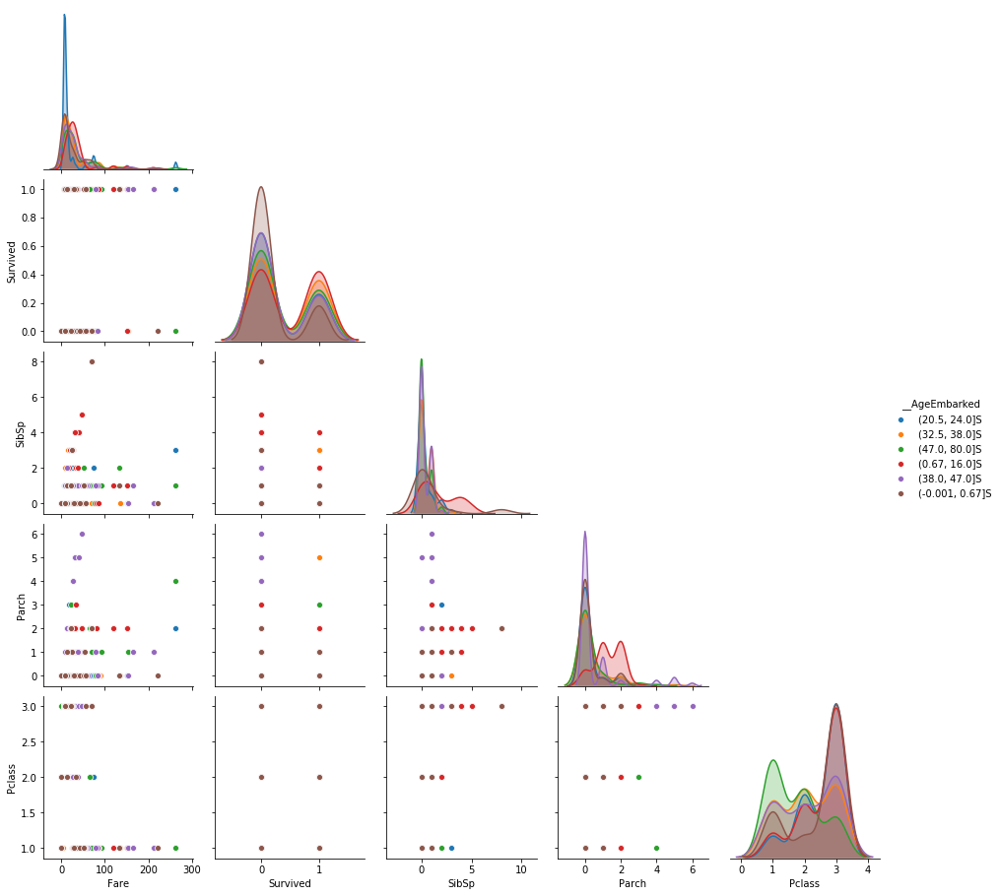


    __Age*Embarked=Fare


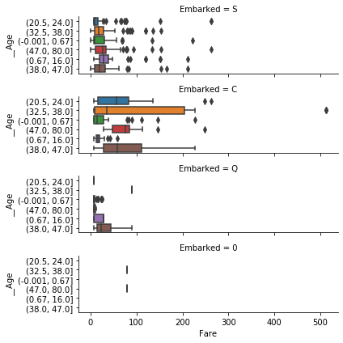


    __Age*Embarked=Survived


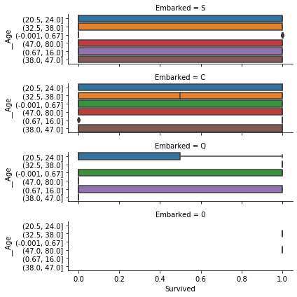


    __Age*Embarked=SibSp


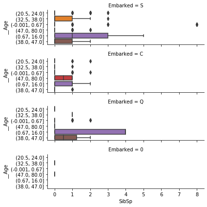


    __Age*Embarked=Parch


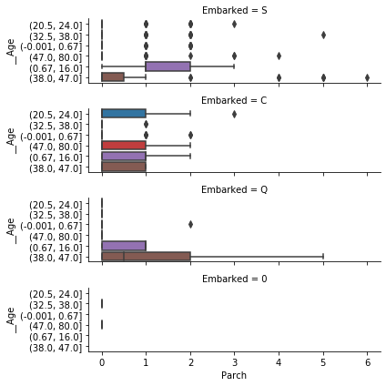


    __Age*Embarked=Pclass


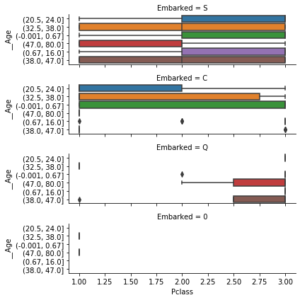


    
     
    


<hr>


<h3 align="center">__Age - Parch</h3>


    
      
    relation  6  :  9
    
    
     PassengerId
    Anova faled to reject => no difference 
    
    
     Fare
    Anova passed


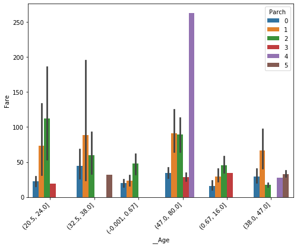


    turkeyHSD
                            group2  meandiff   p-adj     lower     upper  reject
    group1                                                                      
    (0.67, 16.0]0    (47.0, 80.0]4  247.4483  0.0010   61.0184  433.8782    True
    (38.0, 47.0]2    (47.0, 80.0]4  245.6438  0.0136   22.3335  468.9540    True
    (20.5, 24.0]3    (47.0, 80.0]4  243.9958  0.0151   20.6856  467.3061    True
    (-0.001, 0.67]0  (47.0, 80.0]4  243.0430  0.0010   60.1312  425.9548    True
    (20.5, 24.0]0    (47.0, 80.0]4  240.7757  0.0010   57.2933  424.2581    True
    (-0.001, 0.67]1  (47.0, 80.0]4  239.7267  0.0013   48.4952  430.9581    True
    (38.0, 47.0]4    (47.0, 80.0]4  235.1000  0.0258   11.7898  458.4102    True
    (47.0, 80.0]3    (47.0, 80.0]4  234.3125  0.0270   11.0023  457.6227    True
    (0.67, 16.0]1    (47.0, 80.0]4  233.4259  0.0011   48.8837  417.9681    True
    (38.0, 47.0]0    (47.0, 80.0]4  233.3858  0.0010   49.6124  417.1592    True
    (38.0, 47.0]5    (47.0, 80.0]4  230.1594  0.0090   26.3060  434.0128    True
    (47.0, 80.0]0    (47.0, 80.0]4  228.5083  0.0015   44.8968  412.1199    True
    (32.5, 38.0]0    (47.0, 80.0]4  218.8789  0.0035   35.2674  402.4905    True
    (0.67, 16.0]2    (47.0, 80.0]4  217.5053  0.0045   32.5113  402.4992    True
    (-0.001, 0.67]2  (47.0, 80.0]4  214.7413  0.0087   24.9641  404.5185    True
    (32.5, 38.0]2    (47.0, 80.0]4  203.2143  0.0295    8.2931  398.1354    True
    (38.0, 47.0]1    (47.0, 80.0]4  196.7258  0.0279    8.7822  384.6693    True
    (0.67, 16.0]0    (20.5, 24.0]2   96.6738  0.0010   24.5279  168.8196    True
    (-0.001, 0.67]0  (20.5, 24.0]2   92.2685  0.0010   29.7734  154.7636    True
    (20.5, 24.0]0    (20.5, 24.0]2   90.0012  0.0010   25.8552  154.1471    True
    (-0.001, 0.67]1  (20.5, 24.0]2   88.9521  0.0229    5.1763  172.7279    True
    (0.67, 16.0]1    (20.5, 24.0]2   82.6514  0.0019   15.5340  149.7687    True
    (0.67, 16.0]0    (47.0, 80.0]1   75.5268  0.0040   11.7425  139.3111    True
    (0.67, 16.0]0    (32.5, 38.0]1   72.7354  0.0282    3.1967  142.2741    True
    (-0.001, 0.67]0  (47.0, 80.0]1   71.1215  0.0010   18.4997  123.7434    True
    (20.5, 24.0]0    (47.0, 80.0]1   68.8542  0.0012   14.2820  123.4264    True
    (-0.001, 0.67]0  (32.5, 38.0]1   68.3301  0.0067    8.8638  127.7965    True
    (20.5, 24.0]0    (32.5, 38.0]1   66.0628  0.0181    4.8638  127.2618    True
    (0.67, 16.0]1    (47.0, 80.0]1   61.5044  0.0235    3.4686  119.5403    True
    (38.0, 47.0]0    (47.0, 80.0]1   61.4643  0.0124    5.9215  117.0071    True
    (47.0, 80.0]0    (47.0, 80.0]1   56.5869  0.0352    1.5819  111.5918    True
    (20.5, 24.0]2    (32.5, 38.0]0  -68.1044  0.0248 -132.6189   -3.5899    True
    (20.5, 24.0]2    (47.0, 80.0]0  -77.7338  0.0029 -142.2483  -13.2193    True
    (20.5, 24.0]2    (38.0, 47.0]0  -82.6112  0.0010 -147.5850  -17.6375    True
    
    
     Survived
    Anova passed


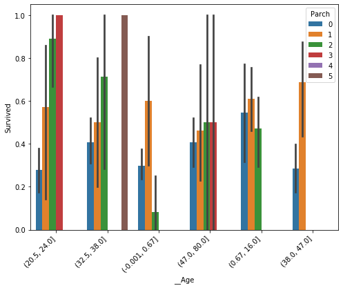


    turkeyHSD
                            group2  meandiff   p-adj   lower   upper  reject
    group1                                                                  
    (-0.001, 0.67]2  (20.5, 24.0]2    0.8056  0.0261  0.0396  1.5715    True
    (-0.001, 0.67]0  (0.67, 16.0]1    0.3104  0.0398  0.0057  0.6150    True
    
    
     Age
    
    
     SibSp
    Anova passed


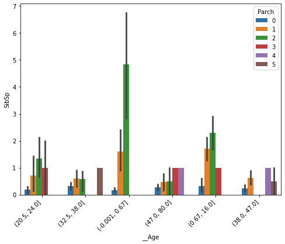


    turkeyHSD
                              group2  meandiff   p-adj   lower   upper  reject
    group1                                                                    
    (-0.001, 0.67]0  (-0.001, 0.67]2    4.6614  0.0010  3.6360  5.6867    True
    (-0.001, 0.67]1  (-0.001, 0.67]2    3.2333  0.0010  1.7675  4.6992    True
    (-0.001, 0.67]0    (0.67, 16.0]2    2.1221  0.0010  1.4746  2.7697    True
    (0.67, 16.0]0      (0.67, 16.0]2    1.9759  0.0010  1.0392  2.9127    True
    (-0.001, 0.67]0    (0.67, 16.0]1    1.5353  0.0010  0.9349  2.1358    True
    (-0.001, 0.67]0  (-0.001, 0.67]1    1.4280  0.0010  0.3115  2.5446    True
    (0.67, 16.0]0      (0.67, 16.0]1    1.3891  0.0010  0.4844  2.2939    True
    (0.67, 16.0]1      (38.0, 47.0]1   -1.0823  0.0199 -2.0915 -0.0732    True
    (0.67, 16.0]1      (47.0, 80.0]1   -1.2458  0.0073 -2.3355 -0.1561    True
    (-0.001, 0.67]1    (32.5, 38.0]0   -1.2901  0.0109 -2.4465 -0.1338    True
    (-0.001, 0.67]1    (47.0, 80.0]0   -1.3324  0.0064 -2.4887 -0.1761    True
    (-0.001, 0.67]1    (38.0, 47.0]0   -1.3619  0.0050 -2.5273 -0.1965    True
    (0.67, 16.0]1      (32.5, 38.0]0   -1.3975  0.0010 -2.0690 -0.7259    True
    (-0.001, 0.67]1    (20.5, 24.0]0   -1.4228  0.0017 -2.5719 -0.2737    True
    (0.67, 16.0]1      (47.0, 80.0]0   -1.4397  0.0010 -2.1112 -0.7682    True
    (0.67, 16.0]1      (38.0, 47.0]0   -1.4692  0.0010 -2.1562 -0.7823    True
    (0.67, 16.0]1      (20.5, 24.0]0   -1.5301  0.0010 -2.1891 -0.8711    True
    (0.67, 16.0]2      (20.5, 24.0]1   -1.5798  0.0115 -3.0008 -0.1589    True
    (0.67, 16.0]2      (38.0, 47.0]1   -1.6691  0.0010 -2.7070 -0.6312    True
    (0.67, 16.0]2      (32.5, 38.0]1   -1.6941  0.0010 -2.9257 -0.4625    True
    (0.67, 16.0]2      (32.5, 38.0]2   -1.7227  0.0026 -3.1436 -0.3017    True
    (0.67, 16.0]2      (47.0, 80.0]1   -1.8326  0.0010 -2.9490 -0.7162    True
    (0.67, 16.0]2      (32.5, 38.0]0   -1.9843  0.0010 -2.6983 -1.2703    True
    (0.67, 16.0]2      (47.0, 80.0]0   -2.0265  0.0010 -2.7405 -1.3125    True
    (0.67, 16.0]2      (38.0, 47.0]0   -2.0560  0.0010 -2.7846 -1.3275    True
    (0.67, 16.0]2      (20.5, 24.0]0   -2.1169  0.0010 -2.8191 -1.4147    True
    (-0.001, 0.67]2    (0.67, 16.0]2   -2.5392  0.0010 -3.6888 -1.3897    True
    (-0.001, 0.67]2    (0.67, 16.0]1   -3.1260  0.0010 -4.2497 -2.0024    True
    (-0.001, 0.67]2    (20.5, 24.0]2   -3.5000  0.0010 -5.0096 -1.9904    True
    (-0.001, 0.67]2    (20.5, 24.0]3   -3.8333  0.0010 -6.4481 -1.2186    True
    (-0.001, 0.67]2    (0.67, 16.0]3   -3.8333  0.0190 -7.3967 -0.2700    True
    (-0.001, 0.67]2    (38.0, 47.0]4   -3.8333  0.0010 -6.4481 -1.2186    True
    (-0.001, 0.67]2    (32.5, 38.0]5   -3.8333  0.0190 -7.3967 -0.2700    True
    (-0.001, 0.67]2    (47.0, 80.0]4   -3.8333  0.0190 -7.3967 -0.2700    True
    (-0.001, 0.67]2    (47.0, 80.0]3   -3.8333  0.0010 -6.4481 -1.2186    True
    (-0.001, 0.67]2    (20.5, 24.0]1   -4.1190  0.0010 -5.7473 -2.4908    True
    (-0.001, 0.67]2    (38.0, 47.0]1   -4.2083  0.0010 -5.5157 -2.9010    True
    (-0.001, 0.67]2    (32.5, 38.0]1   -4.2333  0.0010 -5.6992 -2.7675    True
    (-0.001, 0.67]2    (32.5, 38.0]2   -4.2619  0.0010 -5.8901 -2.6337    True
    (-0.001, 0.67]2    (47.0, 80.0]2   -4.3333  0.0010 -6.9481 -1.7186    True
    (-0.001, 0.67]2    (38.0, 47.0]5   -4.3333  0.0010 -6.3099 -2.3568    True
    (-0.001, 0.67]2    (47.0, 80.0]1   -4.3718  0.0010 -5.7423 -3.0013    True
    (-0.001, 0.67]2    (0.67, 16.0]0   -4.5152  0.0010 -5.7438 -3.2865    True
    (-0.001, 0.67]2    (32.5, 38.0]0   -4.5235  0.0010 -5.5920 -3.4549    True
    (-0.001, 0.67]2    (47.0, 80.0]0   -4.5657  0.0010 -5.6343 -3.4972    True
    (-0.001, 0.67]2    (38.0, 47.0]0   -4.5952  0.0010 -5.6735 -3.5169    True
    (-0.001, 0.67]2    (20.5, 24.0]0   -4.6561  0.0010 -5.7168 -3.5954    True
    (-0.001, 0.67]2    (38.0, 47.0]2   -4.8333  0.0010 -7.4481 -2.2186    True
    
    
     Parch
    
    
     Pclass
    Anova passed


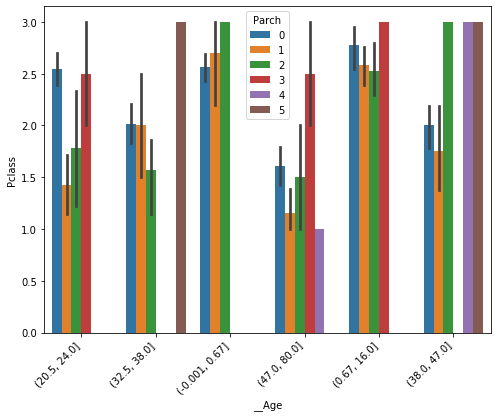


    turkeyHSD
                            group2  meandiff   p-adj   lower   upper  reject
    group1                                                                  
    (20.5, 24.0]0    (32.5, 38.0]0   -0.5302  0.0055 -0.9864 -0.0740    True
    (20.5, 24.0]0    (38.0, 47.0]0   -0.5443  0.0062 -1.0155 -0.0731    True
    (-0.001, 0.67]0  (32.5, 38.0]0   -0.5464  0.0010 -0.9454 -0.1475    True
    (-0.001, 0.67]0  (38.0, 47.0]0   -0.5605  0.0010 -0.9766 -0.1445    True
    (0.67, 16.0]1    (32.5, 38.0]0   -0.5713  0.0289 -1.1185 -0.0241    True
    (0.67, 16.0]1    (38.0, 47.0]0   -0.5854  0.0283 -1.1451 -0.0256    True
    (0.67, 16.0]0    (32.5, 38.0]0   -0.7586  0.0111 -1.4393 -0.0779    True
    (0.67, 16.0]0    (38.0, 47.0]0   -0.7727  0.0105 -1.4636 -0.0819    True
    (20.5, 24.0]0    (38.0, 47.0]1   -0.7943  0.0310 -1.5591 -0.0295    True
    (-0.001, 0.67]0  (38.0, 47.0]1   -0.8105  0.0123 -1.5426 -0.0784    True
    (0.67, 16.0]1    (38.0, 47.0]1   -0.8354  0.0413 -1.6577 -0.0131    True
    (32.5, 38.0]0    (47.0, 80.0]1   -0.8602  0.0382 -1.7018 -0.0187    True
    (0.67, 16.0]2    (47.0, 80.0]0   -0.9238  0.0010 -1.5056 -0.3420    True
    (20.5, 24.0]0    (47.0, 80.0]0   -0.9387  0.0010 -1.3949 -0.4825    True
    (-0.001, 0.67]0  (47.0, 80.0]0   -0.9549  0.0010 -1.3538 -0.5559    True
    (0.67, 16.0]1    (47.0, 80.0]0   -0.9797  0.0010 -1.5269 -0.4325    True
    (-0.001, 0.67]2  (32.5, 38.0]0   -0.9859  0.0086 -1.8566 -0.1152    True
    (-0.001, 0.67]2  (38.0, 47.0]0   -1.0000  0.0079 -1.8787 -0.1213    True
    (0.67, 16.0]0    (38.0, 47.0]1   -1.0227  0.0109 -1.9393 -0.1061    True
    (-0.001, 0.67]1  (47.0, 80.0]0   -1.0944  0.0056 -2.0366 -0.1521    True
    (20.5, 24.0]0    (20.5, 24.0]1   -1.1157  0.0422 -2.2158 -0.0156    True
    (-0.001, 0.67]0  (20.5, 24.0]1   -1.1319  0.0266 -2.2096 -0.0543    True
    (0.67, 16.0]1    (20.5, 24.0]1   -1.1568  0.0423 -2.2976 -0.0159    True
    (0.67, 16.0]0    (47.0, 80.0]0   -1.1671  0.0010 -1.8478 -0.4864    True
    (-0.001, 0.67]2  (38.0, 47.0]1   -1.2500  0.0047 -2.3153 -0.1847    True
    (0.67, 16.0]0    (20.5, 24.0]1   -1.3442  0.0118 -2.5547 -0.1336    True
    (0.67, 16.0]2    (47.0, 80.0]1   -1.3756  0.0010 -2.2852 -0.4659    True
    (20.5, 24.0]0    (47.0, 80.0]1   -1.3905  0.0010 -2.2254 -0.5555    True
    (-0.001, 0.67]2  (47.0, 80.0]0   -1.3944  0.0010 -2.2651 -0.5237    True
    (-0.001, 0.67]0  (47.0, 80.0]1   -1.4067  0.0010 -2.2118 -0.6016    True
    (-0.001, 0.67]2  (32.5, 38.0]2   -1.4286  0.0188 -2.7553 -0.1018    True
    (0.67, 16.0]1    (47.0, 80.0]1   -1.4315  0.0010 -2.3195 -0.5436    True
    (-0.001, 0.67]1  (47.0, 80.0]1   -1.5462  0.0010 -2.7195 -0.3728    True
    (-0.001, 0.67]2  (20.5, 24.0]1   -1.5714  0.0040 -2.8982 -0.2447    True
    (0.67, 16.0]0    (47.0, 80.0]1   -1.6189  0.0010 -2.5948 -0.6430    True
    (-0.001, 0.67]2  (47.0, 80.0]1   -1.8462  0.0010 -2.9629 -0.7294    True
    (38.0, 47.0]5    (47.0, 80.0]1   -1.8462  0.0059 -3.4412 -0.2511    True
    ['Fare', 'Survived', 'SibSp', 'Pclass']


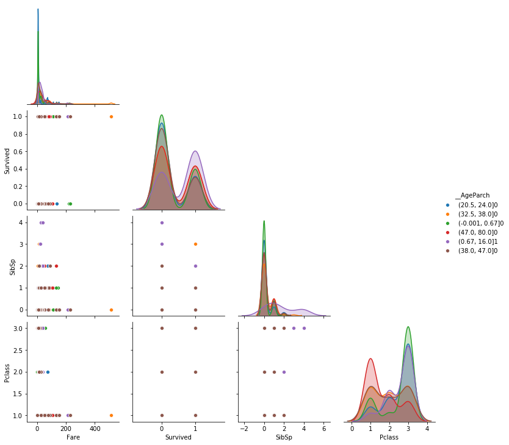


    __Age*Parch=Fare


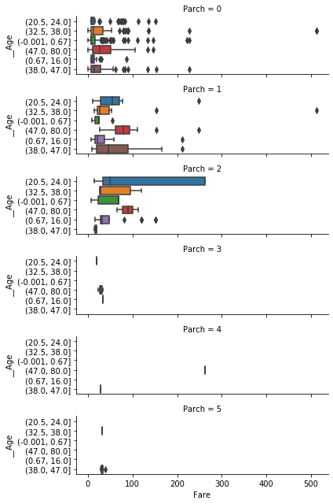


    __Age*Parch=Survived


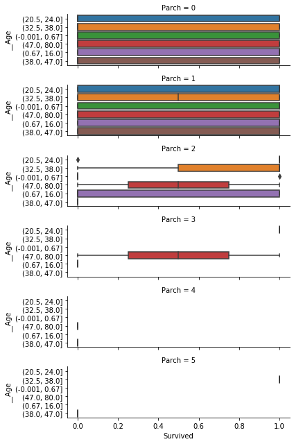


    __Age*Parch=SibSp


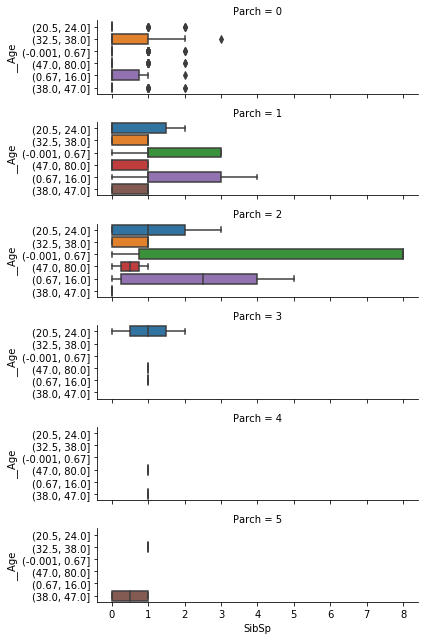


    __Age*Parch=Pclass


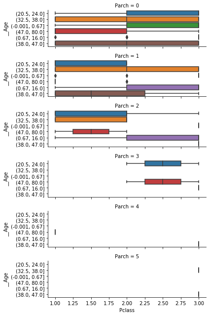


    
     
    


<hr>


<h3 align="center">__Age - Cabin</h3>


    
      
    relation  45  :  9
    
    
     PassengerId
    Anova faled to reject => no difference 
    
    
     Fare
    Anova passed


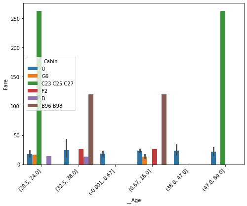


    turkeyHSD
                                              group2  meandiff   p-adj     lower  \
    group1                                                                         
    (32.5, 38.0]D            (47.0, 80.0]C23 C25 C27  250.0625  0.0010  112.0755   
    (0.67, 16.0]G6           (20.5, 24.0]C23 C25 C27  249.4188  0.0010  136.7529   
    (0.67, 16.0]G6           (47.0, 80.0]C23 C25 C27  249.4188  0.0010  111.4318   
    (20.5, 24.0]D            (47.0, 80.0]C23 C25 C27  249.2083  0.0010   89.8747   
    (20.5, 24.0]G6           (47.0, 80.0]C23 C25 C27  246.3000  0.0010   86.9664   
    (20.5, 24.0]0            (47.0, 80.0]C23 C25 C27  245.2872  0.0010  131.9014   
    (20.5, 24.0]0            (20.5, 24.0]C23 C25 C27  245.2872  0.0010  164.6055   
    (-0.001, 0.67]0          (47.0, 80.0]C23 C25 C27  244.4306  0.0010  131.4132   
    (-0.001, 0.67]0          (20.5, 24.0]C23 C25 C27  244.4306  0.0010  164.2674   
    (47.0, 80.0]0            (47.0, 80.0]C23 C25 C27  241.2026  0.0010  127.2033   
    (38.0, 47.0]0            (47.0, 80.0]C23 C25 C27  239.3131  0.0010  125.7122   
    (0.67, 16.0]0            (20.5, 24.0]C23 C25 C27  239.2676  0.0010  158.6351   
    (0.67, 16.0]0            (47.0, 80.0]C23 C25 C27  239.2676  0.0010  125.9168   
    (32.5, 38.0]0            (47.0, 80.0]C23 C25 C27  239.0295  0.0010  125.3797   
    (0.67, 16.0]F2           (20.5, 24.0]C23 C25 C27  237.0000  0.0010  124.3341   
    (0.67, 16.0]F2           (47.0, 80.0]C23 C25 C27  237.0000  0.0010   99.0130   
    (32.5, 38.0]F2           (47.0, 80.0]C23 C25 C27  237.0000  0.0010   77.6664   
    (0.67, 16.0]B96 B98      (47.0, 80.0]C23 C25 C27  143.0000  0.0336    5.0130   
    (0.67, 16.0]B96 B98      (20.5, 24.0]C23 C25 C27  143.0000  0.0016   30.3341   
    (32.5, 38.0]B96 B98      (47.0, 80.0]C23 C25 C27  143.0000  0.0336    5.0130   
    (20.5, 24.0]0                (32.5, 38.0]B96 B98  102.2872  0.0016   21.6055   
    (-0.001, 0.67]0              (0.67, 16.0]B96 B98  101.4306  0.0017   21.2674   
    (-0.001, 0.67]0              (32.5, 38.0]B96 B98  101.4306  0.0017   21.2674   
    (0.67, 16.0]0                (32.5, 38.0]B96 B98   96.2676  0.0047   15.6351   
    (0.67, 16.0]0                (0.67, 16.0]B96 B98   96.2676  0.0047   15.6351   
    (32.5, 38.0]0                (32.5, 38.0]B96 B98   96.0295  0.0053   14.9771   
    (0.67, 16.0]B96 B98                (32.5, 38.0]0  -96.0295  0.0053 -177.0820   
    (0.67, 16.0]B96 B98                (38.0, 47.0]0  -96.3131  0.0050 -177.2968   
    (32.5, 38.0]B96 B98                (38.0, 47.0]0  -96.3131  0.0050 -177.2968   
    (32.5, 38.0]B96 B98                (47.0, 80.0]0  -98.2026  0.0040 -179.7442   
    (0.67, 16.0]B96 B98                (47.0, 80.0]0  -98.2026  0.0040 -179.7442   
    (0.67, 16.0]B96 B98                (20.5, 24.0]0 -102.2872  0.0016 -182.9689   
    (20.5, 24.0]C23 C25 C27      (32.5, 38.0]B96 B98 -143.0000  0.0016 -255.6659   
    (20.5, 24.0]C23 C25 C27           (32.5, 38.0]F2 -237.0000  0.0010 -374.9870   
    (20.5, 24.0]C23 C25 C27            (32.5, 38.0]0 -239.0295  0.0010 -320.0820   
    (20.5, 24.0]C23 C25 C27            (38.0, 47.0]0 -239.3131  0.0010 -320.2968   
    (20.5, 24.0]C23 C25 C27            (47.0, 80.0]0 -241.2026  0.0010 -322.7442   
    (20.5, 24.0]C23 C25 C27           (20.5, 24.0]G6 -246.3000  0.0010 -384.2870   
    (20.5, 24.0]C23 C25 C27            (20.5, 24.0]D -249.2083  0.0010 -387.1953   
    (20.5, 24.0]C23 C25 C27            (32.5, 38.0]D -250.0625  0.0010 -362.7284   
    
                                upper  reject  
    group1                                     
    (32.5, 38.0]D            388.0495    True  
    (0.67, 16.0]G6           362.0846    True  
    (0.67, 16.0]G6           387.4057    True  
    (20.5, 24.0]D            408.5419    True  
    (20.5, 24.0]G6           405.6336    True  
    (20.5, 24.0]0            358.6730    True  
    (20.5, 24.0]0            325.9689    True  
    (-0.001, 0.67]0          357.4480    True  
    (-0.001, 0.67]0          324.5938    True  
    (47.0, 80.0]0            355.2018    True  
    (38.0, 47.0]0            352.9140    True  
    (0.67, 16.0]0            319.9001    True  
    (0.67, 16.0]0            352.6184    True  
    (32.5, 38.0]0            352.6794    True  
    (0.67, 16.0]F2           349.6659    True  
    (0.67, 16.0]F2           374.9870    True  
    (32.5, 38.0]F2           396.3336    True  
    (0.67, 16.0]B96 B98      280.9870    True  
    (0.67, 16.0]B96 B98      255.6659    True  
    (32.5, 38.0]B96 B98      280.9870    True  
    (20.5, 24.0]0            182.9689    True  
    (-0.001, 0.67]0          181.5938    True  
    (-0.001, 0.67]0          181.5938    True  
    (0.67, 16.0]0            176.9001    True  
    (0.67, 16.0]0            176.9001    True  
    (32.5, 38.0]0            177.0820    True  
    (0.67, 16.0]B96 B98      -14.9771    True  
    (0.67, 16.0]B96 B98      -15.3294    True  
    (32.5, 38.0]B96 B98      -15.3294    True  
    (32.5, 38.0]B96 B98      -16.6610    True  
    (0.67, 16.0]B96 B98      -16.6610    True  
    (0.67, 16.0]B96 B98      -21.6055    True  
    (20.5, 24.0]C23 C25 C27  -30.3341    True  
    (20.5, 24.0]C23 C25 C27  -99.0130    True  
    (20.5, 24.0]C23 C25 C27 -157.9771    True  
    (20.5, 24.0]C23 C25 C27 -158.3294    True  
    (20.5, 24.0]C23 C25 C27 -159.6610    True  
    (20.5, 24.0]C23 C25 C27 -108.3130    True  
    (20.5, 24.0]C23 C25 C27 -111.2213    True  
    (20.5, 24.0]C23 C25 C27 -137.3966    True  
    
    
     Survived
    Anova passed


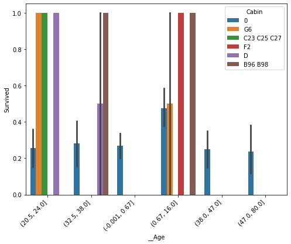


    turkeyHSD
                                      group2  meandiff   p-adj   lower   upper  \
    group1                                                                       
    (-0.001, 0.67]0            (0.67, 16.0]0    0.2069  0.0641 -0.0049  0.4186   
    (-0.001, 0.67]0      (0.67, 16.0]B96 B98    0.7312  0.6247 -0.3782  1.8407   
    (-0.001, 0.67]0           (0.67, 16.0]F2    0.7312  0.6247 -0.3782  1.8407   
    (-0.001, 0.67]0           (0.67, 16.0]G6    0.2312  0.9000 -0.8782  1.3407   
    (-0.001, 0.67]0            (20.5, 24.0]0   -0.0123  0.9000 -0.2277  0.2030   
    ...                                  ...       ...     ...     ...     ...   
    (32.5, 38.0]F2             (47.0, 80.0]0    0.2381  0.9000 -1.3396  1.8158   
    (32.5, 38.0]F2   (47.0, 80.0]C23 C25 C27    0.0000  0.9000 -2.2051  2.2051   
    (38.0, 47.0]0              (47.0, 80.0]0   -0.0119  0.9000 -0.3256  0.3018   
    (38.0, 47.0]0    (47.0, 80.0]C23 C25 C27   -0.2500  0.9000 -1.8222  1.3222   
    (47.0, 80.0]0    (47.0, 80.0]C23 C25 C27   -0.2381  0.9000 -1.8158  1.3396   
    
                     reject  
    group1                   
    (-0.001, 0.67]0   False  
    (-0.001, 0.67]0   False  
    (-0.001, 0.67]0   False  
    (-0.001, 0.67]0   False  
    (-0.001, 0.67]0   False  
    ...                 ...  
    (32.5, 38.0]F2    False  
    (32.5, 38.0]F2    False  
    (38.0, 47.0]0     False  
    (38.0, 47.0]0     False  
    (47.0, 80.0]0     False  
    
    [120 rows x 6 columns]
    
    
     Age
    
    
     SibSp
    Anova faled to reject => no difference 
    
    
     Parch
    Anova passed


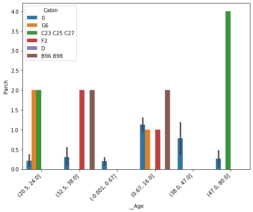


    turkeyHSD
                                      group2  meandiff   p-adj   lower   upper  \
    group1                                                                       
    (32.5, 38.0]D    (47.0, 80.0]C23 C25 C27    4.0000  0.0125  0.4253  7.5747   
    (-0.001, 0.67]0  (47.0, 80.0]C23 C25 C27    3.8000  0.0011  0.8721  6.7279   
    (20.5, 24.0]0    (47.0, 80.0]C23 C25 C27    3.7821  0.0012  0.8446  6.7195   
    (47.0, 80.0]0    (47.0, 80.0]C23 C25 C27    3.7381  0.0017  0.7848  6.6914   
    (32.5, 38.0]0    (47.0, 80.0]C23 C25 C27    3.7018  0.0019  0.7575  6.6460   
    (38.0, 47.0]0    (47.0, 80.0]C23 C25 C27    3.2167  0.0172  0.2737  6.1597   
    (-0.001, 0.67]0            (0.67, 16.0]0    0.9220  0.0010  0.5255  1.3184   
    (-0.001, 0.67]0            (38.0, 47.0]0    0.5833  0.0010  0.1415  1.0252   
    (20.5, 24.0]0              (38.0, 47.0]0    0.5654  0.0111  0.0642  1.0666   
    (0.67, 16.0]0              (32.5, 38.0]0   -0.8237  0.0010 -1.3270 -0.3204   
    (0.67, 16.0]0              (47.0, 80.0]0   -0.8600  0.0010 -1.4139 -0.3062   
    (0.67, 16.0]0              (20.5, 24.0]0   -0.9040  0.0010 -1.3656 -0.4424   
    
                     reject  
    group1                   
    (32.5, 38.0]D      True  
    (-0.001, 0.67]0    True  
    (20.5, 24.0]0      True  
    (47.0, 80.0]0      True  
    (32.5, 38.0]0      True  
    (38.0, 47.0]0      True  
    (-0.001, 0.67]0    True  
    (-0.001, 0.67]0    True  
    (20.5, 24.0]0      True  
    (0.67, 16.0]0      True  
    (0.67, 16.0]0      True  
    (0.67, 16.0]0      True  
    
    
     Pclass
    Anova passed


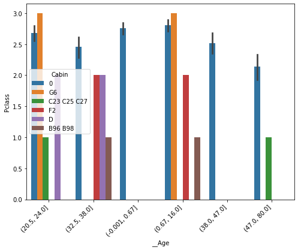


    turkeyHSD
                                              group2  meandiff   p-adj   lower  \
    group1                                                                       
    (0.67, 16.0]B96 B98                (20.5, 24.0]0    1.6795  0.0063  0.2466   
    (0.67, 16.0]B96 B98                (38.0, 47.0]0    1.5167  0.0272  0.0784   
    (20.5, 24.0]C23 C25 C27            (38.0, 47.0]0    1.5167  0.0272  0.0784   
    (32.5, 38.0]B96 B98                (38.0, 47.0]0    1.5167  0.0272  0.0784   
    (0.67, 16.0]B96 B98                (32.5, 38.0]0    1.4561  0.0442  0.0167   
    (20.5, 24.0]C23 C25 C27            (32.5, 38.0]0    1.4561  0.0442  0.0167   
    (0.67, 16.0]0                      (32.5, 38.0]0   -0.3487  0.0446 -0.6938   
    (20.5, 24.0]0                      (47.0, 80.0]0   -0.5366  0.0010 -0.9196   
    (-0.001, 0.67]0                    (47.0, 80.0]0   -0.6134  0.0010 -0.9603   
    (0.67, 16.0]0                      (47.0, 80.0]0   -0.6620  0.0010 -1.0417   
    (32.5, 38.0]0                (32.5, 38.0]B96 B98   -1.4561  0.0442 -2.8956   
    (20.5, 24.0]0            (20.5, 24.0]C23 C25 C27   -1.6795  0.0063 -3.1124   
    (20.5, 24.0]0                (32.5, 38.0]B96 B98   -1.6795  0.0063 -3.1124   
    (-0.001, 0.67]0          (20.5, 24.0]C23 C25 C27   -1.7562  0.0027 -3.1799   
    (-0.001, 0.67]0              (32.5, 38.0]B96 B98   -1.7562  0.0027 -3.1799   
    (-0.001, 0.67]0              (0.67, 16.0]B96 B98   -1.7562  0.0027 -3.1799   
    (0.67, 16.0]0                (0.67, 16.0]B96 B98   -1.8049  0.0018 -3.2369   
    (0.67, 16.0]0            (20.5, 24.0]C23 C25 C27   -1.8049  0.0018 -3.2369   
    (0.67, 16.0]0                (32.5, 38.0]B96 B98   -1.8049  0.0018 -3.2369   
    
                              upper  reject  
    group1                                   
    (0.67, 16.0]B96 B98      3.1124    True  
    (0.67, 16.0]B96 B98      2.9549    True  
    (20.5, 24.0]C23 C25 C27  2.9549    True  
    (32.5, 38.0]B96 B98      2.9549    True  
    (0.67, 16.0]B96 B98      2.8956    True  
    (20.5, 24.0]C23 C25 C27  2.8956    True  
    (0.67, 16.0]0           -0.0037    True  
    (20.5, 24.0]0           -0.1537    True  
    (-0.001, 0.67]0         -0.2665    True  
    (0.67, 16.0]0           -0.2823    True  
    (32.5, 38.0]0           -0.0167    True  
    (20.5, 24.0]0           -0.2466    True  
    (20.5, 24.0]0           -0.2466    True  
    (-0.001, 0.67]0         -0.3326    True  
    (-0.001, 0.67]0         -0.3326    True  
    (-0.001, 0.67]0         -0.3326    True  
    (0.67, 16.0]0           -0.3729    True  
    (0.67, 16.0]0           -0.3729    True  
    (0.67, 16.0]0           -0.3729    True  
    ['Fare', 'Survived', 'Parch', 'Pclass']


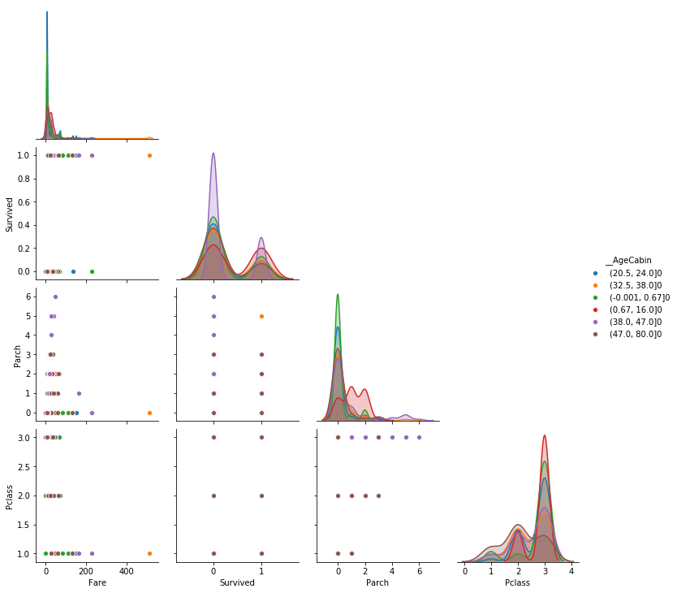


    __Age*Cabin=Fare


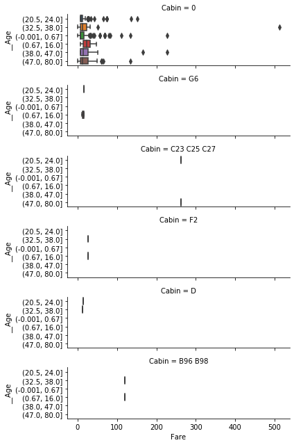


    __Age*Cabin=Survived


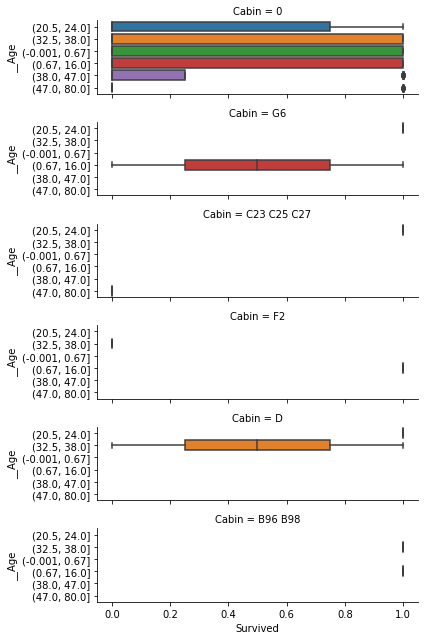


    __Age*Cabin=Parch


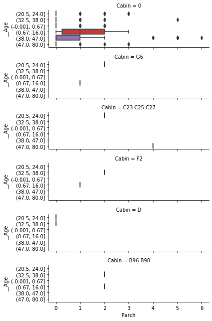


    __Age*Cabin=Pclass


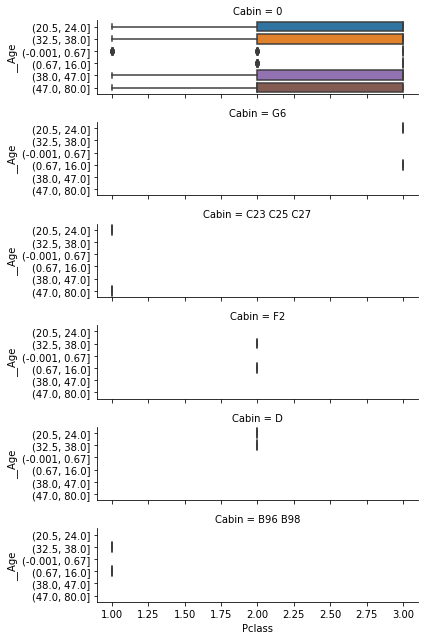


    
     
    


<hr>


<h3 align="center">__Age - Sex</h3>


    
      
    relation  2  :  9
    
    
     PassengerId
    Anova faled to reject => no difference 
    
    
     Fare
    Anova faled to reject => no difference 
    
    
     Survived
    Anova passed


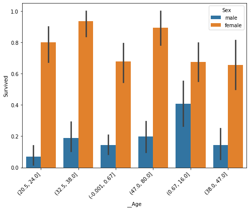


    turkeyHSD
                                      group2  meandiff   p-adj   lower   upper  \
    group1                                                                       
    (20.5, 24.0]male      (32.5, 38.0]female    0.8653  0.0010  0.5778  1.1529   
    (20.5, 24.0]male      (47.0, 80.0]female    0.8227  0.0010  0.5253  1.1200   
    (-0.001, 0.67]male    (32.5, 38.0]female    0.7926  0.0010  0.5343  1.0510   
    (38.0, 47.0]male      (47.0, 80.0]female    0.7500  0.0010  0.4518  1.0482   
    (-0.001, 0.67]male    (47.0, 80.0]female    0.7500  0.0010  0.4808  1.0192   
    (32.5, 38.0]male      (47.0, 80.0]female    0.7032  0.0010  0.4067  0.9997   
    (-0.001, 0.67]male    (20.5, 24.0]female    0.6571  0.0010  0.4233  0.8910   
    (20.5, 24.0]male      (38.0, 47.0]female    0.5861  0.0010  0.3014  0.8707   
    (-0.001, 0.67]male    (0.67, 16.0]female    0.5306  0.0010  0.3137  0.7475   
    (0.67, 16.0]male      (32.5, 38.0]female    0.5273  0.0010  0.2316  0.8230   
    (-0.001, 0.67]male    (38.0, 47.0]female    0.5134  0.0010  0.2583  0.7685   
    (0.67, 16.0]male      (47.0, 80.0]female    0.4847  0.0010  0.1794  0.7899   
    (32.5, 38.0]male      (38.0, 47.0]female    0.4666  0.0010  0.1829  0.7503   
    (0.67, 16.0]male      (20.5, 24.0]female    0.3918  0.0010  0.1173  0.6664   
    (-0.001, 0.67]male      (0.67, 16.0]male    0.2653  0.0039  0.0484  0.4822   
    (0.67, 16.0]female      (0.67, 16.0]male   -0.2653  0.0413 -0.5256 -0.0050   
    (0.67, 16.0]male        (38.0, 47.0]male   -0.2653  0.0291 -0.5174 -0.0133   
    (-0.001, 0.67]female    (0.67, 16.0]male   -0.2711  0.0264 -0.5264 -0.0157   
    (0.67, 16.0]male        (20.5, 24.0]male   -0.3380  0.0010 -0.5890 -0.0870   
    (38.0, 47.0]female      (47.0, 80.0]male   -0.4595  0.0010 -0.7408 -0.1783   
    (0.67, 16.0]female      (47.0, 80.0]male   -0.4767  0.0010 -0.7239 -0.2296   
    (-0.001, 0.67]female    (47.0, 80.0]male   -0.4825  0.0010 -0.7245 -0.2406   
    (0.67, 16.0]female      (32.5, 38.0]male   -0.4838  0.0010 -0.7338 -0.2338   
    (-0.001, 0.67]female    (32.5, 38.0]male   -0.4896  0.0010 -0.7344 -0.2447   
    (38.0, 47.0]female      (38.0, 47.0]male   -0.5134  0.0010 -0.7989 -0.2279   
    (0.67, 16.0]female      (38.0, 47.0]male   -0.5306  0.0010 -0.7827 -0.2786   
    (-0.001, 0.67]female  (-0.001, 0.67]male   -0.5364  0.0010 -0.7473 -0.3254   
    (-0.001, 0.67]female    (38.0, 47.0]male   -0.5364  0.0010 -0.7833 -0.2895   
    (20.5, 24.0]female      (47.0, 80.0]male   -0.6033  0.0010 -0.8654 -0.3411   
    (0.67, 16.0]female      (20.5, 24.0]male   -0.6033  0.0010 -0.8543 -0.3523   
    (-0.001, 0.67]female    (20.5, 24.0]male   -0.6091  0.0010 -0.8549 -0.3632   
    (20.5, 24.0]female      (32.5, 38.0]male   -0.6103  0.0010 -0.8752 -0.3455   
    (20.5, 24.0]female      (38.0, 47.0]male   -0.6571  0.0010 -0.9239 -0.3904   
    (47.0, 80.0]female      (47.0, 80.0]male   -0.6961  0.0010 -0.9903 -0.4020   
    (20.5, 24.0]female      (20.5, 24.0]male   -0.7298  0.0010 -0.9956 -0.4641   
    (32.5, 38.0]female      (47.0, 80.0]male   -0.7388  0.0010 -1.0230 -0.4546   
    (32.5, 38.0]female      (32.5, 38.0]male   -0.7458  0.0010 -1.0325 -0.4592   
    (32.5, 38.0]female      (38.0, 47.0]male   -0.7926  0.0010 -1.0811 -0.5042   
    
                          reject  
    group1                        
    (20.5, 24.0]male        True  
    (20.5, 24.0]male        True  
    (-0.001, 0.67]male      True  
    (38.0, 47.0]male        True  
    (-0.001, 0.67]male      True  
    (32.5, 38.0]male        True  
    (-0.001, 0.67]male      True  
    (20.5, 24.0]male        True  
    (-0.001, 0.67]male      True  
    (0.67, 16.0]male        True  
    (-0.001, 0.67]male      True  
    (0.67, 16.0]male        True  
    (32.5, 38.0]male        True  
    (0.67, 16.0]male        True  
    (-0.001, 0.67]male      True  
    (0.67, 16.0]female      True  
    (0.67, 16.0]male        True  
    (-0.001, 0.67]female    True  
    (0.67, 16.0]male        True  
    (38.0, 47.0]female      True  
    (0.67, 16.0]female      True  
    (-0.001, 0.67]female    True  
    (0.67, 16.0]female      True  
    (-0.001, 0.67]female    True  
    (38.0, 47.0]female      True  
    (0.67, 16.0]female      True  
    (-0.001, 0.67]female    True  
    (-0.001, 0.67]female    True  
    (20.5, 24.0]female      True  
    (0.67, 16.0]female      True  
    (-0.001, 0.67]female    True  
    (20.5, 24.0]female      True  
    (20.5, 24.0]female      True  
    (47.0, 80.0]female      True  
    (20.5, 24.0]female      True  
    (32.5, 38.0]female      True  
    (32.5, 38.0]female      True  
    (32.5, 38.0]female      True  
    
    
     Age
    
    
     SibSp
    Anova passed


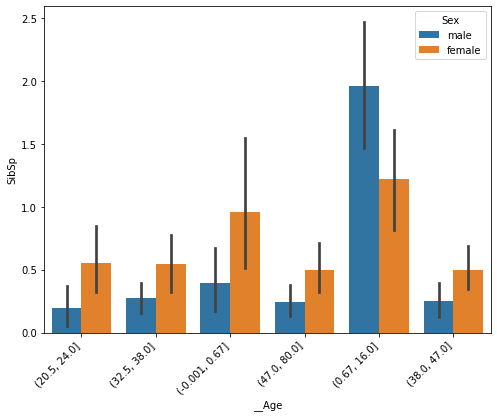


    turkeyHSD
                                      group2  meandiff   p-adj   lower   upper  \
    group1                                                                       
    (-0.001, 0.67]male      (0.67, 16.0]male    1.5624  0.0010  0.9284  2.1963   
    (-0.001, 0.67]female    (0.67, 16.0]male    0.9969  0.0010  0.2507  1.7432   
    (-0.001, 0.67]male    (0.67, 16.0]female    0.8277  0.0013  0.1937  1.4616   
    (-0.001, 0.67]female    (47.0, 80.0]male   -0.7164  0.0439 -1.4234 -0.0093   
    (-0.001, 0.67]female    (20.5, 24.0]male   -0.7693  0.0239 -1.4878 -0.0508   
    (0.67, 16.0]female      (32.5, 38.0]male   -0.9486  0.0014 -1.6793 -0.2180   
    (0.67, 16.0]female      (38.0, 47.0]male   -0.9745  0.0010 -1.7111 -0.2379   
    (0.67, 16.0]female      (47.0, 80.0]male   -0.9786  0.0010 -1.7009 -0.2562   
    (0.67, 16.0]female      (20.5, 24.0]male   -1.0315  0.0010 -1.7651 -0.2979   
    (0.67, 16.0]male      (20.5, 24.0]female   -1.4092  0.0010 -2.2116 -0.6068   
    (0.67, 16.0]male      (32.5, 38.0]female   -1.4108  0.0010 -2.2749 -0.5467   
    (0.67, 16.0]male      (38.0, 47.0]female   -1.4592  0.0010 -2.3150 -0.6034   
    (0.67, 16.0]male      (47.0, 80.0]female   -1.4592  0.0010 -2.3512 -0.5671   
    (0.67, 16.0]male        (32.5, 38.0]male   -1.6833  0.0010 -2.4140 -0.9527   
    (0.67, 16.0]male        (38.0, 47.0]male   -1.7092  0.0010 -2.4458 -0.9726   
    (0.67, 16.0]male        (47.0, 80.0]male   -1.7133  0.0010 -2.4356 -0.9909   
    (0.67, 16.0]male        (20.5, 24.0]male   -1.7662  0.0010 -2.4998 -1.0326   
    
                          reject  
    group1                        
    (-0.001, 0.67]male      True  
    (-0.001, 0.67]female    True  
    (-0.001, 0.67]male      True  
    (-0.001, 0.67]female    True  
    (-0.001, 0.67]female    True  
    (0.67, 16.0]female      True  
    (0.67, 16.0]female      True  
    (0.67, 16.0]female      True  
    (0.67, 16.0]female      True  
    (0.67, 16.0]male        True  
    (0.67, 16.0]male        True  
    (0.67, 16.0]male        True  
    (0.67, 16.0]male        True  
    (0.67, 16.0]male        True  
    (0.67, 16.0]male        True  
    (0.67, 16.0]male        True  
    (0.67, 16.0]male        True  
    
    
     Parch
    Anova passed


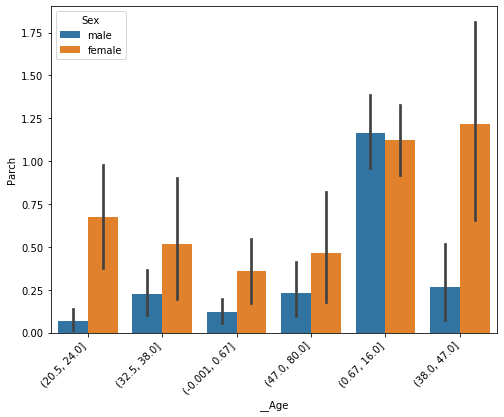


    turkeyHSD
                                      group2  meandiff   p-adj   lower   upper  \
    group1                                                                       
    (20.5, 24.0]male      (38.0, 47.0]female    1.1486  0.0010  0.5791  1.7181   
    (-0.001, 0.67]male    (38.0, 47.0]female    1.0997  0.0010  0.5893  1.6101   
    (-0.001, 0.67]male      (0.67, 16.0]male    1.0442  0.0010  0.6102  1.4783   
    (-0.001, 0.67]male    (0.67, 16.0]female    1.0034  0.0010  0.5693  1.4375   
    (32.5, 38.0]male      (38.0, 47.0]female    0.9946  0.0010  0.4269  1.5624   
    (-0.001, 0.67]female  (38.0, 47.0]female    0.8603  0.0010  0.2831  1.4374   
    (-0.001, 0.67]female    (0.67, 16.0]male    0.8048  0.0010  0.2938  1.3157   
    (-0.001, 0.67]female  (0.67, 16.0]female    0.7640  0.0010  0.2530  1.2749   
    (32.5, 38.0]female    (38.0, 47.0]female    0.7026  0.0212  0.0529  1.3523   
    (-0.001, 0.67]male    (20.5, 24.0]female    0.5560  0.0060  0.0880  1.0239   
    (20.5, 24.0]female      (20.5, 24.0]male   -0.6048  0.0111 -1.1366 -0.0730   
    (0.67, 16.0]female    (32.5, 38.0]female   -0.6063  0.0390 -1.1980 -0.0146   
    (0.67, 16.0]male      (32.5, 38.0]female   -0.6471  0.0185 -1.2388 -0.0555   
    (0.67, 16.0]female    (47.0, 80.0]female   -0.6582  0.0221 -1.2689 -0.0474   
    (0.67, 16.0]male      (47.0, 80.0]female   -0.6990  0.0103 -1.3098 -0.0882   
    (38.0, 47.0]female    (47.0, 80.0]female   -0.7545  0.0120 -1.4216 -0.0873   
    (0.67, 16.0]female      (38.0, 47.0]male   -0.8546  0.0010 -1.3589 -0.3503   
    (0.67, 16.0]female      (47.0, 80.0]male   -0.8929  0.0010 -1.3875 -0.3983   
    (0.67, 16.0]male        (38.0, 47.0]male   -0.8954  0.0010 -1.3997 -0.3911   
    (0.67, 16.0]female      (32.5, 38.0]male   -0.8983  0.0010 -1.3986 -0.3980   
    (0.67, 16.0]male        (47.0, 80.0]male   -0.9338  0.0010 -1.4284 -0.4392   
    (0.67, 16.0]male        (32.5, 38.0]male   -0.9391  0.0010 -1.4394 -0.4389   
    (38.0, 47.0]female      (38.0, 47.0]male   -0.9509  0.0010 -1.5222 -0.3796   
    (38.0, 47.0]female      (47.0, 80.0]male   -0.9892  0.0010 -1.5520 -0.4265   
    (0.67, 16.0]female      (20.5, 24.0]male   -1.0523  0.0010 -1.5545 -0.5500   
    (0.67, 16.0]male        (20.5, 24.0]male   -1.0931  0.0010 -1.5954 -0.5908   
    
                          reject  
    group1                        
    (20.5, 24.0]male        True  
    (-0.001, 0.67]male      True  
    (-0.001, 0.67]male      True  
    (-0.001, 0.67]male      True  
    (32.5, 38.0]male        True  
    (-0.001, 0.67]female    True  
    (-0.001, 0.67]female    True  
    (-0.001, 0.67]female    True  
    (32.5, 38.0]female      True  
    (-0.001, 0.67]male      True  
    (20.5, 24.0]female      True  
    (0.67, 16.0]female      True  
    (0.67, 16.0]male        True  
    (0.67, 16.0]female      True  
    (0.67, 16.0]male        True  
    (38.0, 47.0]female      True  
    (0.67, 16.0]female      True  
    (0.67, 16.0]female      True  
    (0.67, 16.0]male        True  
    (0.67, 16.0]female      True  
    (0.67, 16.0]male        True  
    (0.67, 16.0]male        True  
    (38.0, 47.0]female      True  
    (38.0, 47.0]female      True  
    (0.67, 16.0]female      True  
    (0.67, 16.0]male        True  
    
    
     Pclass
    Anova faled to reject => no difference 
    ['Survived', 'SibSp', 'Parch']


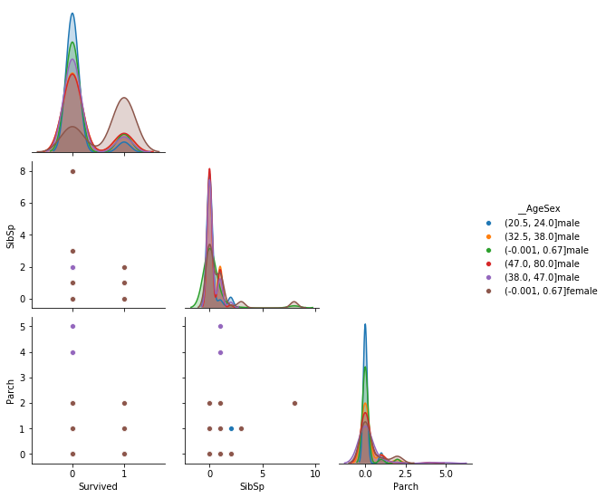


    __Age*Sex=Survived


    __Age*Sex=SibSp


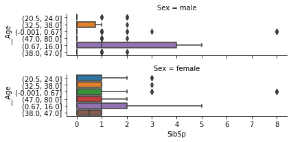


    __Age*Sex=Parch


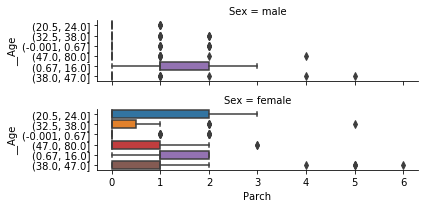


    
     
    


<hr>


<h3 align="center">__Age - Pclass</h3>


    
      
    relation  3  :  9
    
    
     PassengerId
    Anova faled to reject => no difference 
    
    
     Fare
    Anova passed


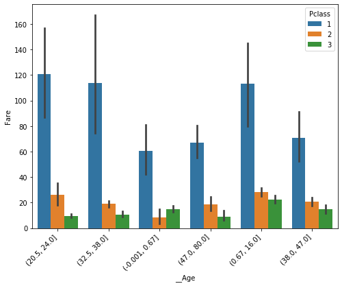


    turkeyHSD
                            group2  meandiff  p-adj     lower     upper  reject
    group1                                                                     
    (-0.001, 0.67]2  (20.5, 24.0]1  112.4376  0.001   57.0137  167.8616    True
    (-0.001, 0.67]3  (20.5, 24.0]1  106.1239  0.001   68.8390  143.4088    True
    (-0.001, 0.67]2  (32.5, 38.0]1  105.3039  0.001   54.9626  155.6452    True
    (-0.001, 0.67]2  (0.67, 16.0]1  104.8726  0.001   39.2941  170.4511    True
    (20.5, 24.0]3    (32.5, 38.0]1  104.2442  0.001   71.2880  137.2003    True
    ...                        ...       ...    ...       ...       ...     ...
    (32.5, 38.0]1    (47.0, 80.0]3 -104.6746  0.001 -152.3291  -57.0201    True
    (20.5, 24.0]1    (38.0, 47.0]3 -106.3246  0.001 -149.0620  -63.5872    True
    (20.5, 24.0]1    (32.5, 38.0]3 -110.1561  0.001 -154.2263  -66.0860    True
    (20.5, 24.0]1    (20.5, 24.0]3 -111.3779  0.001 -151.6727  -71.0830    True
    (20.5, 24.0]1    (47.0, 80.0]3 -111.8083  0.001 -164.8037  -58.8128    True
    
    [74 rows x 6 columns]
    
    
     Survived
    Anova faled to reject => no difference 
    
    
     Age
    
    
     SibSp
    Anova passed


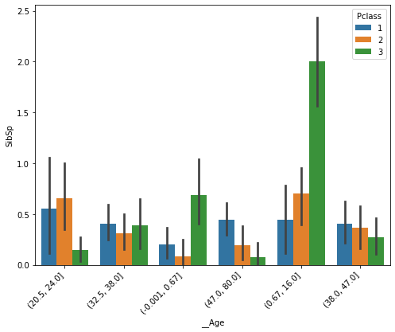


    turkeyHSD
                            group2  meandiff   p-adj   lower   upper  reject
    group1                                                                  
    (-0.001, 0.67]2  (0.67, 16.0]3    1.9167  0.0010  0.6710  3.1624    True
    (-0.001, 0.67]1  (0.67, 16.0]3    1.8000  0.0010  0.9290  2.6710    True
    (0.67, 16.0]1    (0.67, 16.0]3    1.5556  0.0147  0.1440  2.9671    True
    (-0.001, 0.67]3  (0.67, 16.0]3    1.3139  0.0010  0.7259  1.9018    True
    (0.67, 16.0]2    (0.67, 16.0]3    1.3000  0.0011  0.2885  2.3115    True
    (0.67, 16.0]3    (20.5, 24.0]2   -1.3478  0.0010 -2.3068 -0.3889    True
    (0.67, 16.0]3    (20.5, 24.0]1   -1.4444  0.0010 -2.4986 -0.3903    True
    (0.67, 16.0]3    (47.0, 80.0]1   -1.5556  0.0010 -2.2792 -0.8319    True
    (0.67, 16.0]3    (38.0, 47.0]1   -1.5938  0.0010 -2.4456 -0.7419    True
    (0.67, 16.0]3    (32.5, 38.0]1   -1.5938  0.0010 -2.4456 -0.7419    True
    (0.67, 16.0]3    (32.5, 38.0]3   -1.6129  0.0010 -2.4741 -0.7517    True
    (0.67, 16.0]3    (38.0, 47.0]2   -1.6316  0.0010 -2.6635 -0.5997    True
    (0.67, 16.0]3    (32.5, 38.0]2   -1.6923  0.0010 -2.6088 -0.7758    True
    (0.67, 16.0]3    (38.0, 47.0]3   -1.7297  0.0010 -2.5413 -0.9182    True
    (0.67, 16.0]3    (47.0, 80.0]2   -1.8095  0.0010 -2.8021 -0.8169    True
    (0.67, 16.0]3    (20.5, 24.0]3   -1.8571  0.0010 -2.5735 -1.1408    True
    (0.67, 16.0]3    (47.0, 80.0]3   -1.9286  0.0010 -3.0960 -0.7611    True
    
    
     Parch
    Anova passed


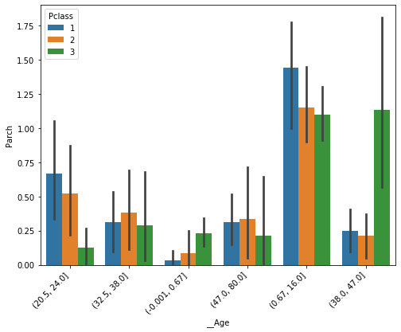


    turkeyHSD
                            group2  meandiff   p-adj   lower   upper  reject
    group1                                                                  
    (-0.001, 0.67]1  (0.67, 16.0]1    1.4111  0.0010  0.3501  2.4722    True
    (-0.001, 0.67]2  (0.67, 16.0]1    1.3611  0.0141  0.1300  2.5922    True
    (-0.001, 0.67]3  (0.67, 16.0]1    1.2109  0.0016  0.2502  2.1716    True
    (-0.001, 0.67]1  (0.67, 16.0]2    1.1167  0.0010  0.3107  1.9226    True
    (-0.001, 0.67]1  (38.0, 47.0]3    1.1018  0.0010  0.4159  1.7877    True
    (-0.001, 0.67]1  (0.67, 16.0]3    1.0681  0.0010  0.4576  1.6787    True
    (-0.001, 0.67]2  (0.67, 16.0]2    1.0667  0.0294  0.0472  2.0861    True
    (-0.001, 0.67]2  (38.0, 47.0]3    1.0518  0.0097  0.1243  1.9793    True
    (-0.001, 0.67]2  (0.67, 16.0]3    1.0181  0.0063  0.1449  1.8913    True
    (20.5, 24.0]3    (38.0, 47.0]3    1.0101  0.0010  0.4187  1.6016    True
    (38.0, 47.0]2    (38.0, 47.0]3    0.9246  0.0057  0.1367  1.7126    True
    (-0.001, 0.67]3  (0.67, 16.0]2    0.9164  0.0010  0.2481  1.5847    True
    (-0.001, 0.67]3  (38.0, 47.0]3    0.9016  0.0010  0.3843  1.4188    True
    (38.0, 47.0]1    (38.0, 47.0]3    0.8851  0.0010  0.2112  1.5591    True
    (-0.001, 0.67]3  (0.67, 16.0]3    0.8679  0.0010  0.4557  1.2800    True
    (32.5, 38.0]3    (38.0, 47.0]3    0.8448  0.0021  0.1650  1.5246    True
    (32.5, 38.0]1    (38.0, 47.0]3    0.8226  0.0029  0.1487  1.4966    True
    (32.5, 38.0]2    (38.0, 47.0]3    0.7505  0.0279  0.0361  1.4650    True
    (0.67, 16.0]3    (32.5, 38.0]2   -0.7168  0.0123 -1.3593 -0.0744    True
    (0.67, 16.0]3    (47.0, 80.0]2   -0.7681  0.0144 -1.4639 -0.0723    True
    (0.67, 16.0]3    (47.0, 80.0]1   -0.7866  0.0010 -1.2939 -0.2794    True
    (0.67, 16.0]3    (32.5, 38.0]1   -0.7889  0.0010 -1.3860 -0.1918    True
    (38.0, 47.0]3    (47.0, 80.0]2   -0.8018  0.0277 -1.5646 -0.0390    True
    (0.67, 16.0]3    (32.5, 38.0]3   -0.8111  0.0010 -1.4148 -0.2075    True
    (38.0, 47.0]3    (47.0, 80.0]1   -0.8203  0.0010 -1.4161 -0.2245    True
    (0.67, 16.0]2    (47.0, 80.0]1   -0.8352  0.0086 -1.5660 -0.1044    True
    (0.67, 16.0]2    (32.5, 38.0]1   -0.8375  0.0273 -1.6333 -0.0417    True
    (0.67, 16.0]3    (38.0, 47.0]1   -0.8514  0.0010 -1.4485 -0.2543    True
    (0.67, 16.0]2    (32.5, 38.0]3   -0.8597  0.0211 -1.6604 -0.0590    True
    (0.67, 16.0]3    (47.0, 80.0]3   -0.8872  0.0185 -1.7055 -0.0688    True
    (0.67, 16.0]3    (38.0, 47.0]2   -0.8909  0.0025 -1.6142 -0.1676    True
    (0.67, 16.0]2    (38.0, 47.0]1   -0.9000  0.0101 -1.6958 -0.1042    True
    (38.0, 47.0]3    (47.0, 80.0]3   -0.9208  0.0277 -1.7969 -0.0448    True
    (0.67, 16.0]2    (38.0, 47.0]2   -0.9395  0.0280 -1.8339 -0.0451    True
    (0.67, 16.0]3    (20.5, 24.0]3   -0.9764  0.0010 -1.4786 -0.4743    True
    (0.67, 16.0]2    (20.5, 24.0]3   -1.0250  0.0010 -1.7522 -0.2978    True
    (0.67, 16.0]1    (47.0, 80.0]1   -1.1296  0.0111 -2.1348 -0.1245    True
    (0.67, 16.0]1    (32.5, 38.0]1   -1.1319  0.0208 -2.1853 -0.0786    True
    (0.67, 16.0]1    (32.5, 38.0]3   -1.1541  0.0168 -2.2112 -0.0970    True
    (0.67, 16.0]1    (38.0, 47.0]1   -1.1944  0.0097 -2.2478 -0.1411    True
    (0.67, 16.0]1    (47.0, 80.0]3   -1.2302  0.0351 -2.4229 -0.0374    True
    (0.67, 16.0]1    (38.0, 47.0]2   -1.2339  0.0167 -2.3636 -0.1042    True
    (0.67, 16.0]1    (20.5, 24.0]3   -1.3194  0.0010 -2.3220 -0.3168    True
    
    
     Pclass
    ['Fare', 'SibSp', 'Parch']


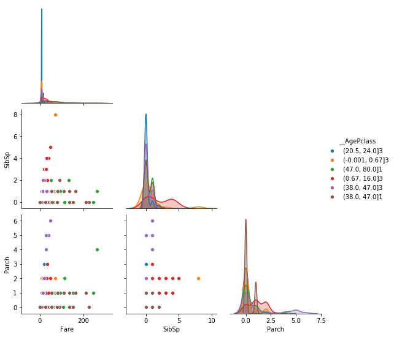


    __Age*Pclass=Fare


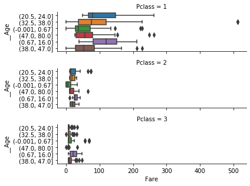


    __Age*Pclass=SibSp


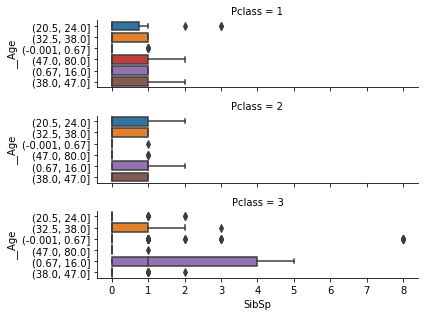


    __Age*Pclass=Parch


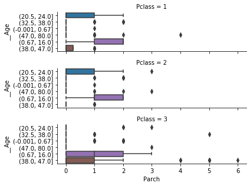


    
     
    


<hr>


<h3 align="center">SibSp - Embarked</h3>


    
      
    relation  4  :  7
    
    
     PassengerId
    Anova faled to reject => no difference 
    
    
     Fare
    Anova passed


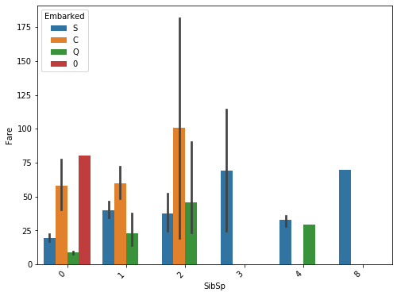


    turkeyHSD
           group2  meandiff   p-adj    lower     upper  reject
    group1                                                    
    0Q         2C   91.9769  0.0010  24.5428  159.4109    True
    0S         2C   80.9907  0.0023  16.3058  145.6756    True
    0Q         3S   60.1851  0.0010  15.8274  104.5427    True
    0Q         1C   50.8049  0.0010  21.0218   80.5879    True
    0S         3S   49.1989  0.0031   9.1440   89.2537    True
    0S         1C   39.8187  0.0010  16.9317   62.7058    True
    0Q         1S   31.3950  0.0013   7.0937   55.6963    True
    0S         1S   20.4088  0.0010   5.3311   35.4866    True
    0C         0S  -38.2081  0.0010 -55.0530  -21.3632    True
    0C         0Q  -49.1943  0.0010 -74.6297  -23.7588    True
    
    
     Survived
    Anova passed


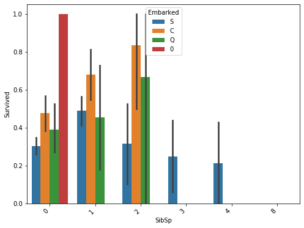


    turkeyHSD
           group2  meandiff   p-adj   lower   upper  reject
    group1                                                 
    0S         1C    0.3756  0.0010  0.1441  0.6071    True
    0S         1S    0.1860  0.0035  0.0335  0.3385    True
    0C         0S   -0.1734  0.0415 -0.3438 -0.0030    True
    1C         8S   -0.6792  0.0257 -1.3194 -0.0391    True
    
    
     Age
    Anova passed


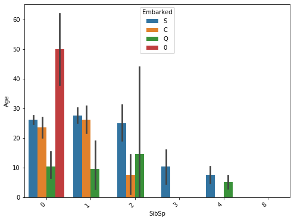


    turkeyHSD
           group2  meandiff   p-adj    lower    upper  reject
    group1                                                   
    1Q         1S   18.0988  0.0348   0.5944  35.6033    True
    0Q         1S   17.1951  0.0010   8.5520  25.8383    True
    0Q         1C   15.8339  0.0010   5.2410  26.4267    True
    0Q         0S   15.8164  0.0010   8.0543  23.5786    True
    0C         0Q  -13.1052  0.0010 -22.1517  -4.0586    True
    0S         3S  -15.8281  0.0143 -30.0743  -1.5819    True
    0C         4S  -15.9829  0.0471 -31.8736  -0.0922    True
    1S         3S  -17.2068  0.0071 -31.9515  -2.4621    True
    0S         4S  -18.6942  0.0031 -33.8904  -3.4980    True
    1C         4S  -18.7116  0.0140 -35.5307  -1.8925    True
    1S         4S  -20.0728  0.0015 -35.7374  -4.4083    True
    0C         8S  -23.5543  0.0208 -45.3783  -1.7303    True
    2S         8S  -25.0526  0.0440 -49.7999  -0.3053    True
    0S         8S  -26.2656  0.0030 -47.5892  -4.9420    True
    1C         8S  -26.2830  0.0070 -48.7920  -3.7740    True
    1S         8S  -27.6443  0.0016 -49.3041  -5.9844    True
    00         4S  -42.4286  0.0486 -84.7391  -0.1181    True
    00         8S  -50.0000  0.0138 -94.8770  -5.1230    True
    
    
     SibSp
    
    
     Parch
    Anova passed


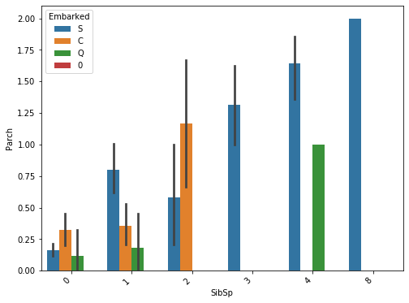


    turkeyHSD
           group2  meandiff   p-adj   lower   upper  reject
    group1                                                 
    00         8S    2.0000  0.0366  0.0573  3.9427    True
    2Q         8S    2.0000  0.0048  0.3280  3.6720    True
    0Q         8S    1.8814  0.0010  0.9127  2.8500    True
    0S         8S    1.8379  0.0010  0.9148  2.7610    True
    1Q         8S    1.8182  0.0010  0.6467  2.9897    True
    0C         8S    1.6789  0.0010  0.7341  2.6237    True
    2Q         4S    1.6429  0.0243  0.1013  3.1844    True
    1C         8S    1.6415  0.0010  0.6671  2.6159    True
    0Q         4S    1.5242  0.0010  0.8039  2.2445    True
    0S         4S    1.4808  0.0010  0.8229  2.1386    True
    1Q         4S    1.4610  0.0010  0.4848  2.4373    True
    2S         8S    1.4211  0.0010  0.3498  2.4924    True
    0C         4S    1.3218  0.0010  0.6339  2.0097    True
    1C         4S    1.2844  0.0010  0.5563  2.0125    True
    1S         8S    1.2000  0.0015  0.2624  2.1376    True
    0Q         3S    1.1939  0.0010  0.5109  1.8768    True
    0S         3S    1.1504  0.0010  0.5337  1.7671    True
    1Q         3S    1.1307  0.0052  0.1817  2.0797    True
    2S         4S    1.0639  0.0024  0.2105  1.9173    True
    0Q         2C    1.0480  0.0454  0.0098  2.0863    True
    0S         2C    1.0046  0.0457  0.0086  2.0005    True
    0C         3S    0.9914  0.0010  0.3427  1.6401    True
    1C         3S    0.9540  0.0010  0.2629  1.6452    True
    1S         4S    0.8429  0.0026  0.1647  1.5210    True
    0Q         1S    0.6814  0.0010  0.3072  1.0555    True
    0S         1S    0.6379  0.0010  0.4058  0.8700    True
    0C         1S    0.4789  0.0010  0.1717  0.7861    True
    1C         1S    0.4415  0.0106  0.0526  0.8304    True
    
    
     Pclass
    Anova passed


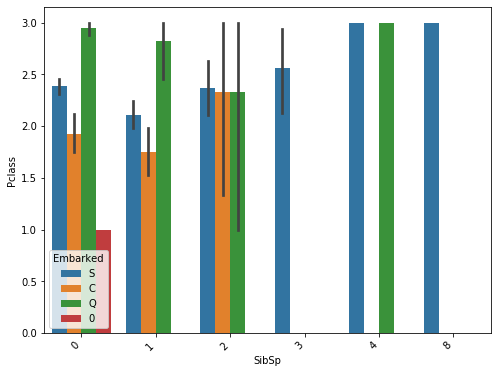


    turkeyHSD
           group2  meandiff   p-adj   lower   upper  reject
    group1                                                 
    00         4S    2.0000  0.0482  0.0069  3.9931    True
    00         0Q    1.9492  0.0371  0.0535  3.8448    True
    1C         8S    1.2453  0.0064  0.1850  2.3056    True
    1C         4S    1.2453  0.0010  0.4530  2.0376    True
    0C         4S    1.0734  0.0010  0.3249  1.8219    True
    0C         8S    1.0734  0.0311  0.0454  2.1014    True
    1C         1Q    1.0635  0.0036  0.1899  1.9370    True
    0C         0Q    1.0225  0.0010  0.5964  1.4487    True
    0C         1Q    0.8916  0.0235  0.0575  1.7257    True
    1S         4S    0.8897  0.0043  0.1518  1.6275    True
    1C         3S    0.8078  0.0221  0.0557  1.5599    True
    0C         0S    0.4570  0.0010  0.1747  0.7392    True
    0S         1S   -0.2732  0.0203 -0.5258 -0.0206    True
    0Q         0S   -0.5656  0.0010 -0.9312 -0.2000    True
    0S         1C   -0.6288  0.0010 -1.0123 -0.2454    True
    0Q         1S   -0.8388  0.0010 -1.2459 -0.4317    True
    0Q         1C   -1.1944  0.0010 -1.6934 -0.6955    True
    ['Fare', 'Survived', 'Age', 'Parch', 'Pclass']


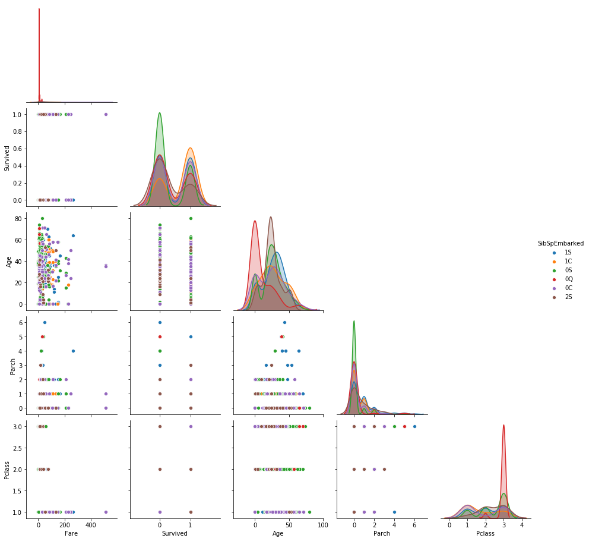


    SibSp*Embarked=Fare


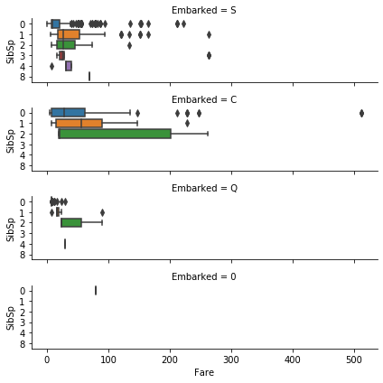


    SibSp*Embarked=Survived


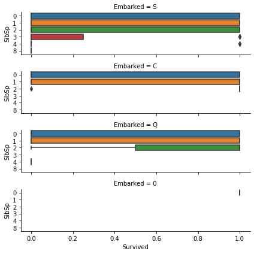


    SibSp*Embarked=Age


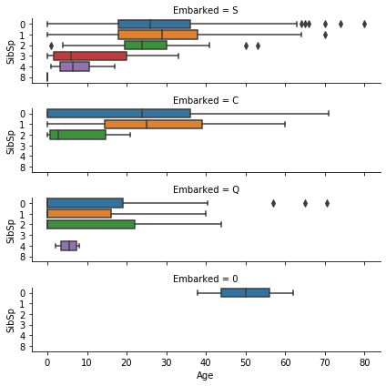


    SibSp*Embarked=Parch


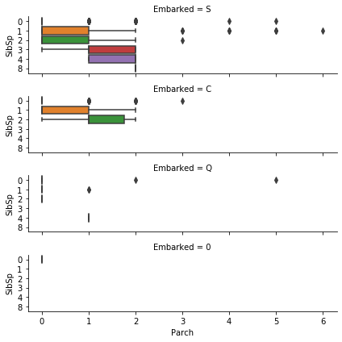


    SibSp*Embarked=Pclass


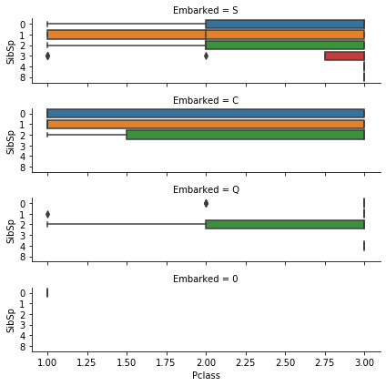


    
     
    


<hr>


<h3 align="center">SibSp - Parch</h3>


    
      
    relation  7  :  7
    
    
     PassengerId
    Anova faled to reject => no difference 
    
    
     Fare
    Anova passed


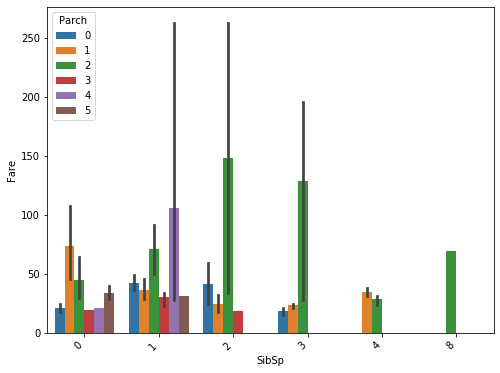


    turkeyHSD
            group2  meandiff   p-adj     lower     upper  reject
    group1                                                      
    0           22  127.1323  0.0010   42.9241  211.3405    True
    21          22  123.4786  0.0049   18.3090  228.6482    True
    11          22  111.9952  0.0010   25.2051  198.7854    True
    0           32  107.4145  0.0010   43.5828  171.2461    True
    20          22  106.9638  0.0080   13.1649  200.7627    True
    10          22  105.7646  0.0018   20.5150  191.0142    True
    31          32  105.0726  0.0051   15.3837  194.7615    True
    21          32  103.7607  0.0063   14.0718  193.4496    True
    2           22  103.1195  0.0068   13.6241  192.6150    True
    11          32   92.2774  0.0010   25.0763  159.4785    True
    20          32   87.2459  0.0073   11.2085  163.2834    True
    10          32   86.0467  0.0010   20.8474  151.2460    True
    2           32   83.4017  0.0045   12.7413  154.0621    True
    0            1   52.2277  0.0010   24.0615   80.3939    True
    0           12   50.3724  0.0010   11.2031   89.5418    True
    0           10   21.3677  0.0010    4.5949   38.1405    True
    1           11  -37.0906  0.0253  -72.2309   -1.9504    True
    32          41  -93.6641  0.0127 -178.2236   -9.1046    True
    32          42  -99.9391  0.0044 -184.4986  -15.3796    True
    22          41 -113.3819  0.0101 -214.2128  -12.5511    True
    22          42 -119.6569  0.0041 -220.4878  -18.8261    True
    22          31 -124.7905  0.0041 -229.9600  -19.6209    True
    
    
     Survived
    Anova passed


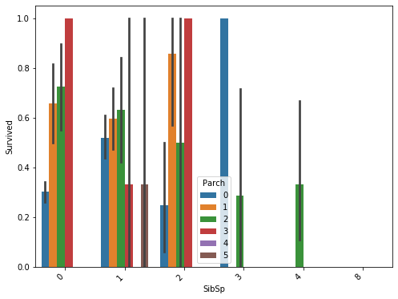


    turkeyHSD
            group2  meandiff   p-adj   lower   upper  reject
    group1                                                  
    0            2    0.4206  0.0010  0.1013  0.7399    True
    0            1    0.3544  0.0013  0.0732  0.6355    True
    0           11    0.2930  0.0014  0.0596  0.5263    True
    0           10    0.2168  0.0010  0.0494  0.3842    True
    1           41   -0.6579  0.0241 -1.2788 -0.0370    True
    2           31   -0.7241  0.0365 -1.4295 -0.0188    True
    2           41   -0.7241  0.0089 -1.3632 -0.0850    True
    2           82   -0.7241  0.0365 -1.4295 -0.0188    True
    21          41   -0.8571  0.0417 -1.7012 -0.0130    True
    
    
     Age
    Anova passed


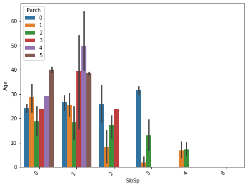


    turkeyHSD
            group2  meandiff   p-adj    lower   upper  reject
    group1                                                   
    0           82  -24.2402  0.0327 -47.6492 -0.8312    True
    10          31  -24.7364  0.0331 -48.6469 -0.8258    True
    11          82  -25.6404  0.0307 -50.2850 -0.9957    True
    10          82  -26.5935  0.0119 -50.5040 -2.6829    True
    1           31  -26.8908  0.0232 -52.2003 -1.5812    True
    1           82  -28.7479  0.0086 -54.0575 -3.4383    True
    14          42  -42.3333  0.0341 -83.3564 -1.3103    True
    14          41  -42.8889  0.0288 -83.9120 -1.8658    True
    14          31  -47.8095  0.0099 -90.2724 -5.3466    True
    14          82  -49.6667  0.0053 -92.1296 -7.2037    True
    
    
     SibSp
    
    
     Parch
    
    
     Pclass
    Anova passed


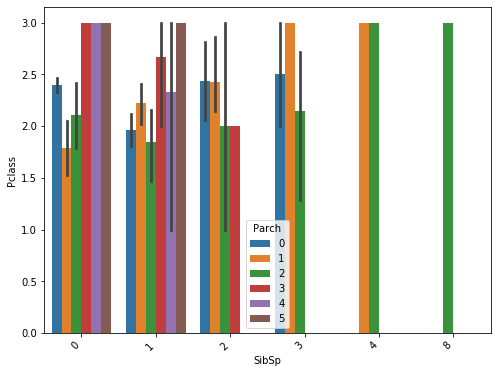


    turkeyHSD
            group2  meandiff   p-adj   lower   upper  reject
    group1                                                  
    1           31    1.2105  0.0444  0.0123  2.4087    True
    1           41    1.2105  0.0106  0.1306  2.2905    True
    1           42    1.2105  0.0106  0.1306  2.2905    True
    1           82    1.2105  0.0444  0.0123  2.4087    True
    10          41    1.0407  0.0331  0.0347  2.0466    True
    10          42    1.0407  0.0331  0.0347  2.0466    True
    0           10   -0.4410  0.0010 -0.7322 -0.1498    True
    0            1   -0.6109  0.0016 -1.0999 -0.1219    True
    ['Fare', 'Survived', 'Age', 'Pclass']


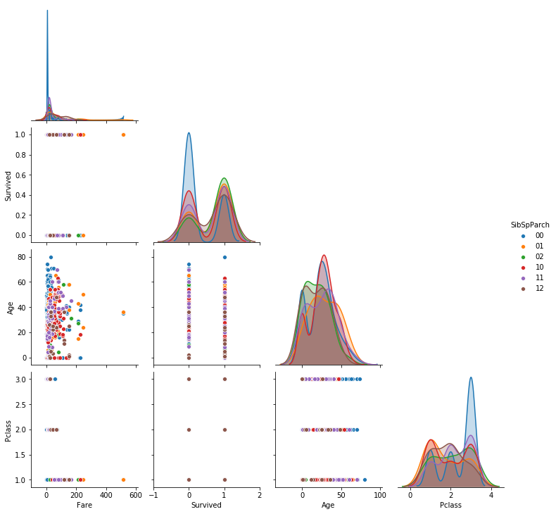


    SibSp*Parch=Fare


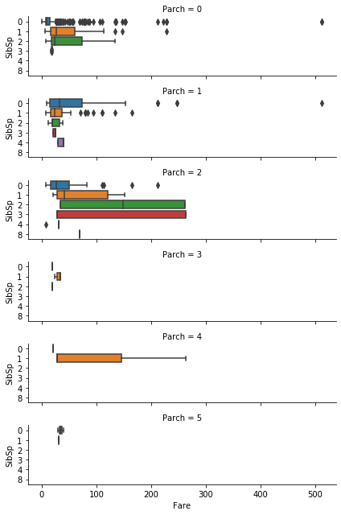


    SibSp*Parch=Survived


    SibSp*Parch=Age


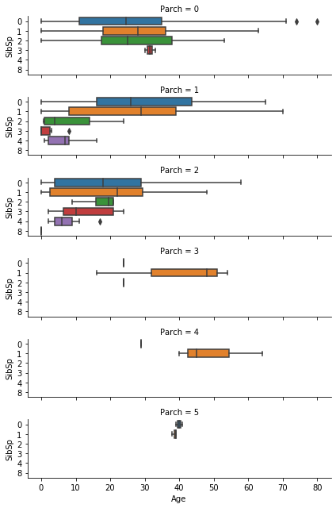


    SibSp*Parch=Pclass


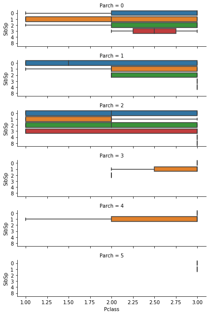


    
     
    


<hr>


<h3 align="center">SibSp - Cabin</h3>


    
      
    relation  103  :  7
    
    
     PassengerId
    Anova faled to reject => no difference 
    
    
     Fare
    Anova passed


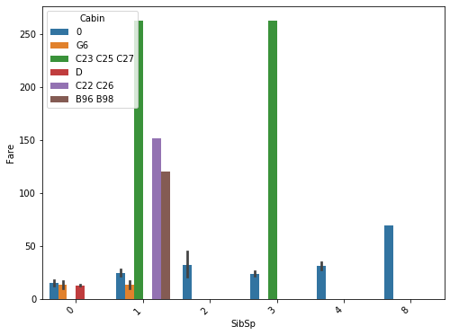


    turkeyHSD
                        group2  meandiff   p-adj     lower     upper  reject
    group1                                                                  
    0D            1C23 C25 C27  249.7778  0.0010  143.7957  355.7598    True
    0D            3C23 C25 C27  249.7778  0.0010  174.8372  324.7184    True
    1G6           3C23 C25 C27  249.4188  0.0010  165.6326  333.2049    True
    0G6           1C23 C25 C27  249.4188  0.0010  137.0078  361.8297    True
    0G6           3C23 C25 C27  249.4188  0.0010  165.6326  333.2049    True
    00            3C23 C25 C27  247.6902  0.0010  194.5346  300.8459    True
    00            1C23 C25 C27  247.6902  0.0010  155.8119  339.5685    True
    30            3C23 C25 C27  238.8814  0.0010  180.0931  297.6697    True
    10            3C23 C25 C27  238.2243  0.0010  184.6685  291.7800    True
    10            1C23 C25 C27  238.2243  0.0010  146.1139  330.3346    True
    20            3C23 C25 C27  230.9602  0.0010  174.4716  287.4488    True
    1B96 B98      3C23 C25 C27  143.0000  0.0010   72.8995  213.1005    True
    1B96 B98      1C23 C25 C27  143.0000  0.0010   40.3833  245.6167    True
    0D                1C22 C26  138.3278  0.0010   63.3872  213.2684    True
    0G6               1C22 C26  137.9688  0.0010   54.1826  221.7549    True
    00                1C22 C26  136.2402  0.0010   83.0846  189.3959    True
    10                1C22 C26  126.7743  0.0010   73.2185  180.3300    True
    1C22 C26      1C23 C25 C27  111.4500  0.0290    5.4680  217.4320    True
    1C22 C26      3C23 C25 C27  111.4500  0.0010   36.5094  186.3906    True
    0D                1B96 B98  106.7778  0.0010   36.6772  176.8783    True
    0G6               1B96 B98  106.4188  0.0010   26.9322  185.9053    True
    00                1B96 B98  104.6902  0.0010   58.6086  150.7718    True
    10                1B96 B98   95.2243  0.0010   48.6817  141.7668    True
    00                      80   54.2402  0.0010   19.2985   89.1820    True
    30                      80   45.4314  0.0276    2.4028   88.4600    True
    10                      80   44.7743  0.0022    9.2268   80.3217    True
    00                      10    9.4660  0.0225    0.6541   18.2779    True
    1C22 C26                80  -82.0000  0.0014 -145.3364  -18.6636    True
    1B96 B98                20  -87.9602  0.0010 -137.8496  -38.0708    True
    1B96 B98                40  -88.1444  0.0010 -138.8795  -37.4094    True
    1B96 B98                30  -95.8814  0.0010 -148.3604  -43.4024    True
    1B96 B98               1G6 -106.4188  0.0010 -185.9053  -26.9322    True
    1C22 C26                20 -119.5102  0.0010 -175.9988  -63.0216    True
    1C22 C26                40 -119.6944  0.0010 -176.9313  -62.4576    True
    1C22 C26                30 -127.4314  0.0010 -186.2197  -68.6431    True
    1C22 C26               1G6 -137.9688  0.0010 -221.7549  -54.1826    True
    1C23 C25 C27            80 -193.4500  0.0010 -291.5703  -95.3297    True
    3C23 C25 C27            80 -193.4500  0.0010 -256.7864 -130.1136    True
    1C23 C25 C27            20 -230.9602  0.0010 -324.8062 -137.1143    True
    1C23 C25 C27            40 -231.1444  0.0010 -325.4427 -136.8462    True
    3C23 C25 C27            40 -231.1444  0.0010 -288.3813 -173.9076    True
    1C23 C25 C27            30 -238.8814  0.0010 -334.1293 -143.6335    True
    1C23 C25 C27           1G6 -249.4188  0.0010 -361.8297 -137.0078    True
    
    
     Survived
    Anova faled to reject => no difference 
    
    
     Age
    Anova faled to reject => no difference 
    
    
     SibSp
    
    
     Parch
    Anova passed


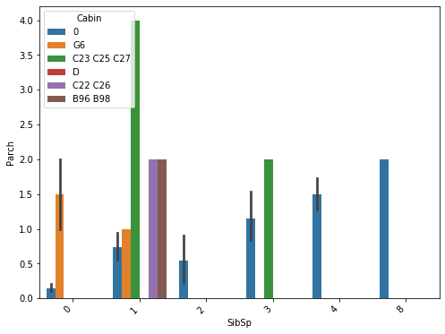


    turkeyHSD
                        group2  meandiff   p-adj   lower   upper  reject
    group1                                                              
    0D            1C23 C25 C27    4.0000  0.0010  1.2087  6.7913    True
    00            1C23 C25 C27    3.8548  0.0010  1.4349  6.2746    True
    10            1C23 C25 C27    3.2643  0.0010  0.8383  5.6903    True
    0D                      80    2.0000  0.0049  0.3319  3.6681    True
    0D            3C23 C25 C27    2.0000  0.0437  0.0262  3.9738    True
    0D                1B96 B98    2.0000  0.0203  0.1537  3.8463    True
    0D                1C22 C26    2.0000  0.0437  0.0262  3.9738    True
    00                1C22 C26    1.8548  0.0010  0.4548  3.2548    True
    00            3C23 C25 C27    1.8548  0.0010  0.4548  3.2548    True
    00                1B96 B98    1.8548  0.0010  0.6411  3.0685    True
    00                      80    1.8548  0.0010  0.9345  2.7751    True
    20                      80    1.4545  0.0010  0.4055  2.5036    True
    00                      40    1.3548  0.0010  0.7745  1.9351    True
    10                1B96 B98    1.2643  0.0361  0.0385  2.4901    True
    10                      80    1.2643  0.0010  0.3281  2.2005    True
    00                      30    1.0086  0.0010  0.3292  1.6881    True
    20                      40    0.9545  0.0028  0.1863  1.7228    True
    10                      40    0.7643  0.0021  0.1590  1.3696    True
    00                      10    0.5905  0.0010  0.3584  0.8226    True
    1B96 B98                20   -1.4545  0.0154 -2.7685 -0.1406    True
    1C23 C25 C27            40   -2.5000  0.0468 -4.9836 -0.0164    True
    1C23 C25 C27            30   -2.8462  0.0111 -5.3548 -0.3376    True
    1C23 C25 C27           1G6   -3.0000  0.0437 -5.9606 -0.0394    True
    1C23 C25 C27            20   -3.4545  0.0010 -5.9262 -0.9829    True
    
    
     Pclass
    Anova passed


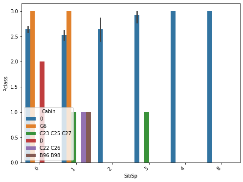


    turkeyHSD
                        group2  meandiff   p-adj   lower   upper  reject
    group1                                                              
    1B96 B98                40    2.0000  0.0010  0.9330  3.0670    True
    1B96 B98               1G6    2.0000  0.0051  0.3284  3.6716    True
    3C23 C25 C27            40    2.0000  0.0010  0.7963  3.2037    True
    1C23 C25 C27            40    2.0000  0.0459  0.0169  3.9831    True
    1C22 C26                80    2.0000  0.0010  0.6680  3.3320    True
    1C22 C26                40    2.0000  0.0010  0.7963  3.2037    True
    1C22 C26               1G6    2.0000  0.0110  0.2380  3.7620    True
    1B96 B98                80    2.0000  0.0010  0.7902  3.2098    True
    3C23 C25 C27            80    2.0000  0.0010  0.6680  3.3320    True
    1B96 B98                30    1.9231  0.0010  0.8194  3.0267    True
    1C22 C26                30    1.9231  0.0010  0.6867  3.1594    True
    1B96 B98                20    1.6364  0.0010  0.5872  2.6856    True
    1C22 C26                20    1.6364  0.0010  0.4484  2.8243    True
    10            3C23 C25 C27   -1.5214  0.0010 -2.6477 -0.3951    True
    10                1C22 C26   -1.5214  0.0010 -2.6477 -0.3951    True
    10                1B96 B98   -1.5214  0.0010 -2.5002 -0.5426    True
    20            3C23 C25 C27   -1.6364  0.0010 -2.8243 -0.4484    True
    00                1C22 C26   -1.6432  0.0010 -2.7610 -0.5253    True
    00            3C23 C25 C27   -1.6432  0.0010 -2.7610 -0.5253    True
    00                1B96 B98   -1.6432  0.0010 -2.6123 -0.6740    True
    30            3C23 C25 C27   -1.9231  0.0010 -3.1594 -0.6867    True
    0G6           3C23 C25 C27   -2.0000  0.0110 -3.7620 -0.2380    True
    0G6               1C22 C26   -2.0000  0.0110 -3.7620 -0.2380    True
    0G6               1B96 B98   -2.0000  0.0051 -3.6716 -0.3284    True
    1G6           3C23 C25 C27   -2.0000  0.0110 -3.7620 -0.2380    True
    ['Fare', 'Parch', 'Pclass']


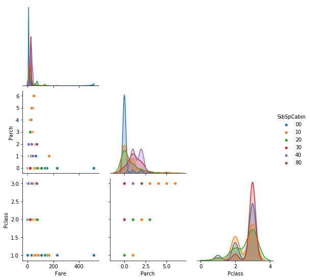


    SibSp*Cabin=Fare


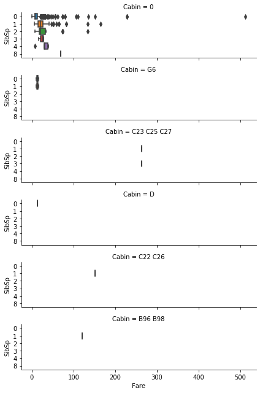


    SibSp*Cabin=Parch


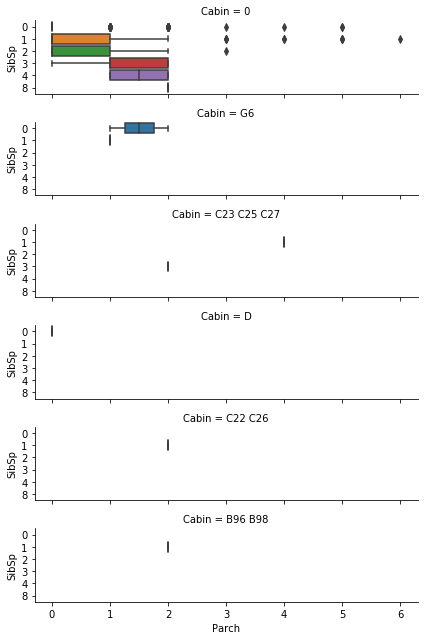


    SibSp*Cabin=Pclass


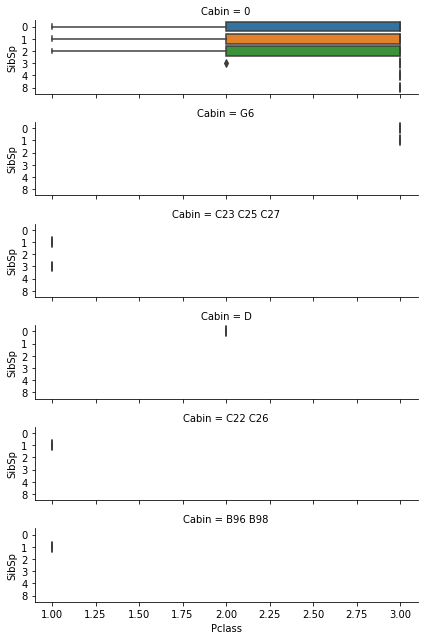


    
     
    


<hr>


<h3 align="center">SibSp - Sex</h3>


    
      
    relation  2  :  7
    
    
     PassengerId
    Anova faled to reject => no difference 
    
    
     Fare
    Anova faled to reject => no difference 
    
    
     Survived
    Anova passed


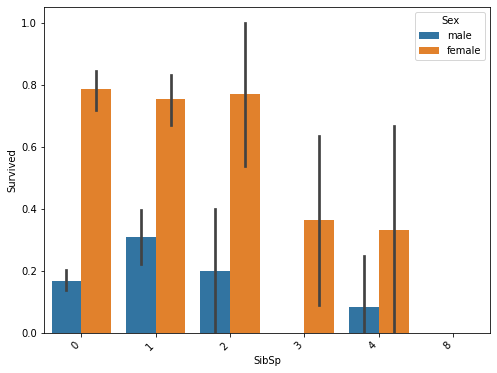


    turkeyHSD
              group2  meandiff   p-adj   lower   upper  reject
    group1                                                    
    0male    2female    0.6010  0.0010  0.2305  0.9716    True
    0male    1female    0.5865  0.0010  0.4439  0.7291    True
    1male    2female    0.4586  0.0063  0.0711  0.8460    True
    0female  3female   -0.4237  0.0349 -0.8330 -0.0145    True
    1female    1male   -0.4440  0.0010 -0.6262 -0.2619    True
    0female    1male   -0.4767  0.0010 -0.6403 -0.3130    True
    1female    2male   -0.5547  0.0010 -0.9179 -0.1916    True
    2female    2male   -0.5692  0.0106 -1.0681 -0.0704    True
    0female    2male   -0.5874  0.0010 -0.9416 -0.2331    True
    0female    0male   -0.6192  0.0010 -0.7373 -0.5010    True
    1female    4male   -0.6714  0.0010 -1.0723 -0.2704    True
    2female    4male   -0.6859  0.0013 -1.2129 -0.1589    True
    0female    4male   -0.7040  0.0010 -1.0969 -0.3111    True
    1female    3male   -0.7547  0.0026 -1.3572 -0.1523    True
    1female    8male   -0.7547  0.0127 -1.4252 -0.0842    True
    2female    3male   -0.7692  0.0152 -1.4620 -0.0765    True
    2female    8male   -0.7692  0.0401 -1.5219 -0.0165    True
    0female    8male   -0.7874  0.0064 -1.4531 -0.1216    True
    0female  8female   -0.7874  0.0380 -1.5539 -0.0208    True
    0female    3male   -0.7874  0.0010 -1.3845 -0.1902    True
    
    
     Age
    Anova faled to reject => no difference 
    
    
     SibSp
    
    
     Parch
    Anova passed


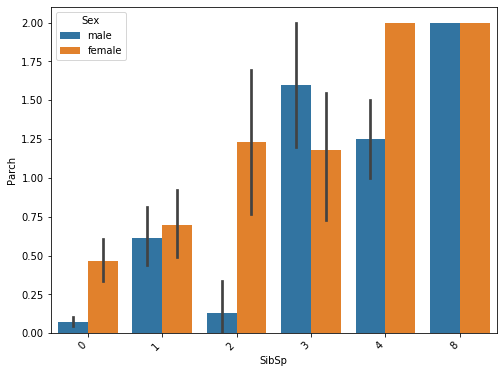


    turkeyHSD
              group2  meandiff   p-adj   lower   upper  reject
    group1                                                    
    0male    8female    1.9263  0.0010  0.5809  3.2716    True
    0male    4female    1.9263  0.0010  0.9717  2.8808    True
    0male      8male    1.9263  0.0010  0.7599  3.0927    True
    2male    8female    1.8667  0.0020  0.3980  3.3353    True
    2male    4female    1.8667  0.0010  0.7450  2.9884    True
    2male      8male    1.8667  0.0010  0.5599  3.1734    True
    0female    8male    1.5345  0.0012  0.3601  2.7088    True
    0female  4female    1.5345  0.0010  0.5703  2.4987    True
    0female  8female    1.5345  0.0114  0.1823  2.8867    True
    0male      3male    1.5263  0.0010  0.4818  2.5707    True
    2male      3male    1.4667  0.0038  0.2675  2.6658    True
    1male      8male    1.3883  0.0072  0.2049  2.5718    True
    1male    8female    1.3883  0.0406  0.0283  2.7484    True
    1male    4female    1.3883  0.0010  0.4131  2.3636    True
    1female  4female    1.3019  0.0010  0.3274  2.2764    True
    1female    8male    1.3019  0.0170  0.1191  2.4847    True
    0male      4male    1.1763  0.0010  0.4967  1.8558    True
    0male    2female    1.1570  0.0010  0.5034  1.8107    True
    0female    3male    1.1345  0.0222  0.0812  2.1878    True
    2male      4male    1.1167  0.0030  0.2173  2.0160    True
    0male    3female    1.1081  0.0010  0.3991  1.8171    True
    2male    3female    1.0485  0.0111  0.1267  1.9703    True
    0female    4male    0.7845  0.0118  0.0914  1.4776    True
    0female  2female    0.7653  0.0100  0.0976  1.4329    True
    0male    1female    0.6244  0.0010  0.3728  0.8760    True
    0male      1male    0.5379  0.0010  0.2834  0.7924    True
    0female    0male   -0.3918  0.0010 -0.6001 -0.1834    True
    2female    2male   -1.0974  0.0028 -1.9774 -0.2175    True
    
    
     Pclass
    Anova faled to reject => no difference 
    ['Survived', 'Parch']


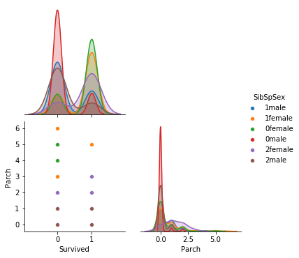


    SibSp*Sex=Survived


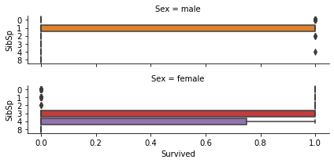


    SibSp*Sex=Parch


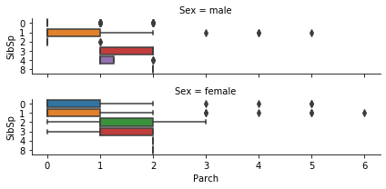


    
     
    


<hr>


<h3 align="center">SibSp - Pclass</h3>


    
      
    relation  3  :  7
    
    
     PassengerId
    Anova faled to reject => no difference 
    
    
     Fare
    Anova passed


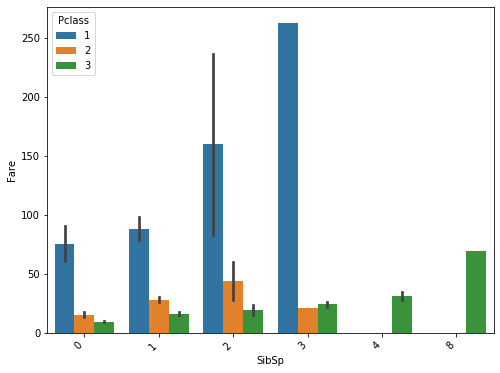


    turkeyHSD
            group2  meandiff   p-adj     lower     upper  reject
    group1                                                      
    3           31  253.1673  0.0010  179.8467  326.4879    True
    2           31  247.4677  0.0010  173.5515  321.3839    True
    13          31  246.3415  0.0010  172.0246  320.6585    True
    23          31  243.4350  0.0010  163.4574  323.4126    True
    12          31  234.6143  0.0010  159.6404  309.5883    True
    22          31  218.5312  0.0010  132.9203  304.1422    True
    1           31  187.7766  0.0010  113.9724  261.5809    True
    11          31  174.5080  0.0010   99.9723  249.0437    True
    3           21  150.1432  0.0010   93.1891  207.0972    True
    2           21  144.4435  0.0010   86.7247  202.1624    True
    13          21  143.3174  0.0010   85.0862  201.5485    True
    12          21  131.5902  0.0010   72.5228  190.6575    True
    21          31  103.0242  0.0135   10.6740  195.3743    True
    1           21   84.7525  0.0010   27.1770  142.3279    True
    3           11   78.6593  0.0010   62.2038   95.1149    True
    2           11   72.9597  0.0010   54.0260   91.8934    True
    11          21   71.4838  0.0034   12.9737  129.9939    True
    3           83   59.7173  0.0028   11.4473  107.9873    True
    2           83   54.0177  0.0166    4.8476  103.1877    True
    13          83   52.8915  0.0252    3.1211  102.6620    True
    3           12   18.5530  0.0443    0.2144   36.8916    True
    1           43  -43.3678  0.0010  -75.0713  -11.6643    True
    1           12  -46.8377  0.0010  -67.0235  -26.6518    True
    1           33  -50.8449  0.0010  -88.9147  -12.7751    True
    1           23  -55.6584  0.0010  -90.0501  -21.2666    True
    11          43  -56.6365  0.0010  -90.0074  -23.2656    True
    1           13  -58.5649  0.0010  -76.1542  -40.9755    True
    1            2  -59.6910  0.0010  -75.5018  -43.8802    True
    11          12  -60.1063  0.0010  -82.8214  -37.3913    True
    11          33  -64.1135  0.0010 -103.5827  -24.6444    True
    1            3  -65.3907  0.0010  -78.1296  -52.6517    True
    11          23  -68.9270  0.0010 -104.8616  -32.9924    True
    11          13  -71.8335  0.0010  -92.2759  -51.3912    True
    21          83  -90.4258  0.0035 -164.4707  -16.3810    True
    21          22 -115.5071  0.0010 -187.5979  -43.4163    True
    21          43 -128.1203  0.0010 -192.0468  -64.1938    True
    21          33 -135.5974  0.0010 -202.9085  -68.2862    True
    21          32 -138.9758  0.0484 -277.5011   -0.4506    True
    21          23 -140.4108  0.0010 -205.7123  -75.1094    True
    31          83 -193.4500  0.0010 -280.7127 -106.1873    True
    31          43 -231.1444  0.0010 -310.0034 -152.2855    True
    31          33 -238.6215  0.0010 -320.2483 -156.9947    True
    31          32 -242.0000  0.0010 -388.0184  -95.9816    True
    
    
     Survived
    Anova faled to reject => no difference 
    
    
     Age
    Anova passed


    turkeyHSD
            group2  meandiff   p-adj    lower    upper  reject
    group1                                                    
    3           11   14.6515  0.0010   7.5500  21.7529    True
    2            3   -9.4060  0.0010 -15.1769  -3.6351    True
    2           13  -10.0973  0.0012 -17.8883  -2.3063    True
    1            3  -12.7166  0.0010 -18.2142  -7.2190    True
    1           13  -13.4079  0.0010 -20.9987  -5.8171    True
    11          13  -15.3428  0.0010 -24.1647  -6.5208    True
    1           23  -17.2175  0.0078 -32.0594  -2.3756    True
    11          23  -19.1524  0.0029 -34.6601  -3.6446    True
    12          43  -20.3081  0.0010 -35.1271  -5.4891    True
    12          33  -21.4470  0.0029 -38.8346  -4.0594    True
    2           43  -21.9514  0.0010 -35.7453  -8.1575    True
    2           33  -23.0902  0.0010 -39.6129  -6.5676    True
    1           43  -25.2620  0.0010 -38.9438 -11.5801    True
    1           33  -26.4009  0.0010 -42.8301  -9.9716    True
    11          43  -27.1968  0.0010 -41.5982 -12.7955    True
    12          83  -27.3636  0.0023 -49.2634  -5.4638    True
    11          33  -28.3357  0.0010 -45.3688 -11.3026    True
    2           83  -29.0069  0.0010 -50.2265  -7.7873    True
    21          43  -30.1444  0.0178 -57.7323  -2.5566    True
    21          33  -31.2833  0.0214 -60.3318  -2.2349    True
    1           83  -32.3175  0.0010 -53.4644 -11.1706    True
    11          83  -34.2524  0.0010 -55.8718 -12.6330    True
    21          83  -37.2000  0.0074 -69.1544  -5.2456    True
    
    
     SibSp
    
    
     Parch
    Anova passed


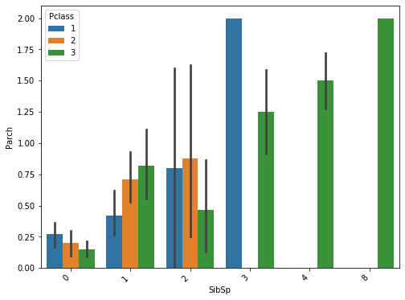


    turkeyHSD
            group2  meandiff   p-adj   lower   upper  reject
    group1                                                  
    3           31    1.8519  0.0010  0.4391  3.2646    True
    3           83    1.8519  0.0010  0.9218  2.7819    True
    2           31    1.8000  0.0019  0.3758  3.2242    True
    2           83    1.8000  0.0010  0.8526  2.7474    True
    1           31    1.7299  0.0037  0.3079  3.1520    True
    1           83    1.7299  0.0010  0.7858  2.6741    True
    11          83    1.5775  0.0010  0.6122  2.5427    True
    11          31    1.5775  0.0166  0.1413  3.0136    True
    23          83    1.5333  0.0010  0.4181  2.6486    True
    3           43    1.3519  0.0010  0.7630  1.9407    True
    2           43    1.3000  0.0010  0.6841  1.9159    True
    12          83    1.2909  0.0010  0.3132  2.2687    True
    1           43    1.2299  0.0010  0.6191  1.8408    True
    13          83    1.1807  0.0030  0.2218  2.1397    True
    3           33    1.1019  0.0010  0.3866  1.8171    True
    11          43    1.0775  0.0010  0.4345  1.7204    True
    2           33    1.0500  0.0010  0.3123  1.7877    True
    23          43    1.0333  0.0039  0.1815  1.8851    True
    1           33    0.9799  0.0010  0.2464  1.7134    True
    11          33    0.8275  0.0188  0.0670  1.5879    True
    12          43    0.7909  0.0049  0.1293  1.4525    True
    13          43    0.6807  0.0220  0.0472  1.3142    True
    3           13    0.6711  0.0010  0.3737  0.9685    True
    2           13    0.6193  0.0010  0.2714  0.9671    True
    3           12    0.5609  0.0010  0.2076  0.9143    True
    1           13    0.5492  0.0010  0.2103  0.8881    True
    2           12    0.5091  0.0015  0.1123  0.9058    True
    1           12    0.4390  0.0115  0.0501  0.8279    True
    11          13    0.3967  0.0464  0.0029  0.7906    True
    
    
     Pclass
    ['Fare', 'Age', 'Parch']


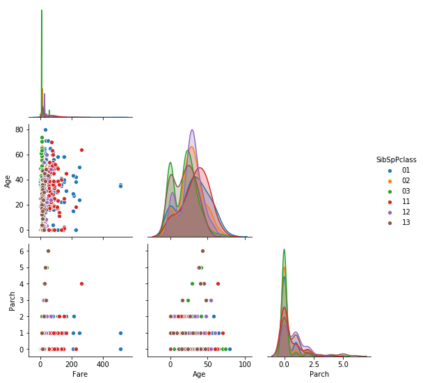


    SibSp*Pclass=Fare


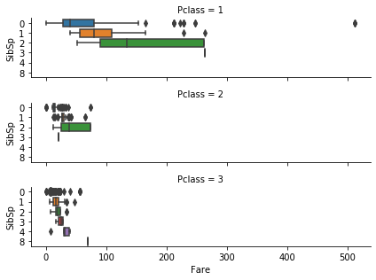


    SibSp*Pclass=Age


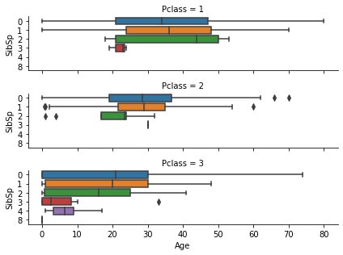


    SibSp*Pclass=Parch


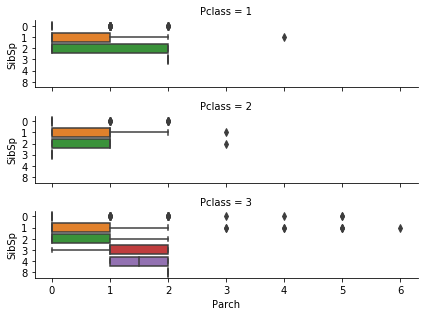


    
     
    


<hr>


<h3 align="center">Embarked - Parch</h3>


    
      
    relation  7  :  4
    
    
     PassengerId
    Anova faled to reject => no difference 
    
    
     Fare
    Anova passed


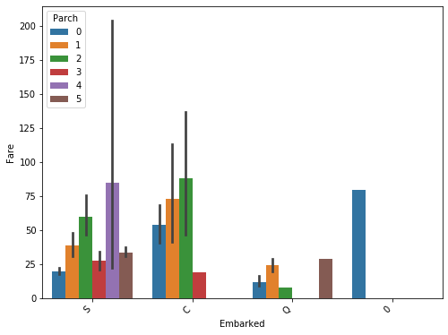


    turkeyHSD
           group2  meandiff   p-adj     lower    upper  reject
    group1                                                    
    Q0         S2   47.8417  0.0010   20.6186  75.0648    True
    S0         S2   39.8968  0.0010   19.0916  60.7021    True
    Q0         S1   26.7212  0.0328    0.9922  52.4502    True
    C0         S0  -33.7929  0.0010  -49.6961 -17.8896    True
    C1         S1  -33.9838  0.0444  -67.5891  -0.3785    True
    C0         Q0  -41.7377  0.0010  -65.4263 -18.0491    True
    C2         S1  -49.7243  0.0176  -95.2683  -4.1803    True
    C1         S0  -52.7602  0.0010  -82.3924 -23.1279    True
    C1         Q0  -60.7050  0.0010  -95.1478 -26.2622    True
    C2         S0  -68.5007  0.0010 -111.1974 -25.8040    True
    C2         Q0  -76.4455  0.0010 -122.6109 -30.2801    True
    
    
     Survived
    Anova passed


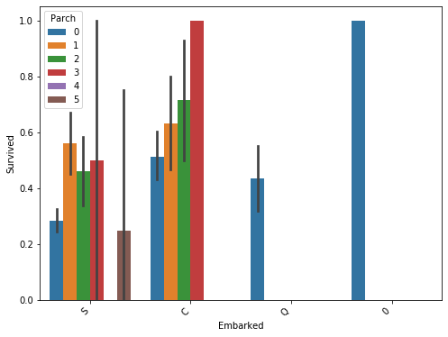


    turkeyHSD
           group2  meandiff  p-adj   lower   upper  reject
    group1                                                
    S0         S1    0.2759  0.001  0.0845  0.4672    True
    C0         S0   -0.2271  0.001 -0.3889 -0.0652    True
    C1         S0   -0.3482  0.008 -0.6497 -0.0467    True
    
    
     Age
    Anova passed


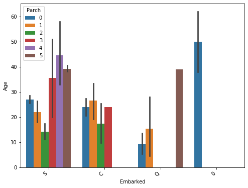


    turkeyHSD
           group2  meandiff   p-adj    lower    upper  reject
    group1                                                   
    Q0         S4   35.0145  0.0044   5.8458  64.1831    True
    S2         S4   30.2423  0.0342   1.0245  59.4601    True
    Q0         S5   29.7645  0.0402   0.5958  58.9331    True
    Q0         S0   17.5135  0.0010  10.2151  24.8118    True
    Q0         S1   12.4474  0.0010   3.1820  21.7129    True
    C0         S2   -9.6691  0.0138 -18.3663  -0.9719    True
    S0         S2  -12.7413  0.0010 -20.2336  -5.2490    True
    C0         Q0  -14.4413  0.0010 -22.9720  -5.9107    True
    C1         Q0  -17.0118  0.0010 -29.4153  -4.6084    True
    
    
     SibSp
    Anova passed


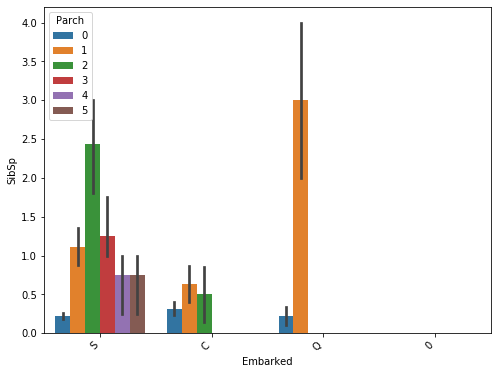


    turkeyHSD
           group2  meandiff   p-adj   lower   upper  reject
    group1                                                 
    00         Q1    3.0000  0.0050  0.4802  5.5198    True
    Q0         Q1    2.7826  0.0010  1.4691  4.0961    True
    C0         Q1    2.6829  0.0010  1.3927  3.9732    True
    C2         Q1    2.5000  0.0010  0.9941  4.0059    True
    00         S2    2.4308  0.0165  0.2152  4.6463    True
    C1         Q1    2.3667  0.0010  0.9865  3.7468    True
    Q0         S2    2.2134  0.0010  1.6799  2.7468    True
    S0         S2    2.2097  0.0010  1.8020  2.6174    True
    C0         S2    2.1137  0.0010  1.6405  2.5869    True
    C2         S2    1.9308  0.0010  1.0215  2.8401    True
    C1         S2    1.7974  0.0010  1.1163  2.4786    True
    S1         S2    1.3210  0.0010  0.8085  1.8335    True
    Q0         S1    0.8924  0.0010  0.3882  1.3965    True
    S0         S1    0.8887  0.0010  0.5201  1.2572    True
    C0         S1    0.7927  0.0010  0.3527  1.2327    True
    S2         S4   -1.6808  0.0265 -3.2706 -0.0909    True
    S2         S5   -1.6808  0.0265 -3.2706 -0.0909    True
    Q1         S1   -1.8902  0.0010 -3.1954 -0.5851    True
    Q1         S4   -2.2500  0.0111 -4.2421 -0.2579    True
    Q1         S5   -2.2500  0.0111 -4.2421 -0.2579    True
    Q1         S0   -2.7789  0.0010 -4.0466 -1.5112    True
    
    
     Parch
    
    
     Pclass
    Anova faled to reject => no difference 
    ['Fare', 'Survived', 'Age', 'SibSp']


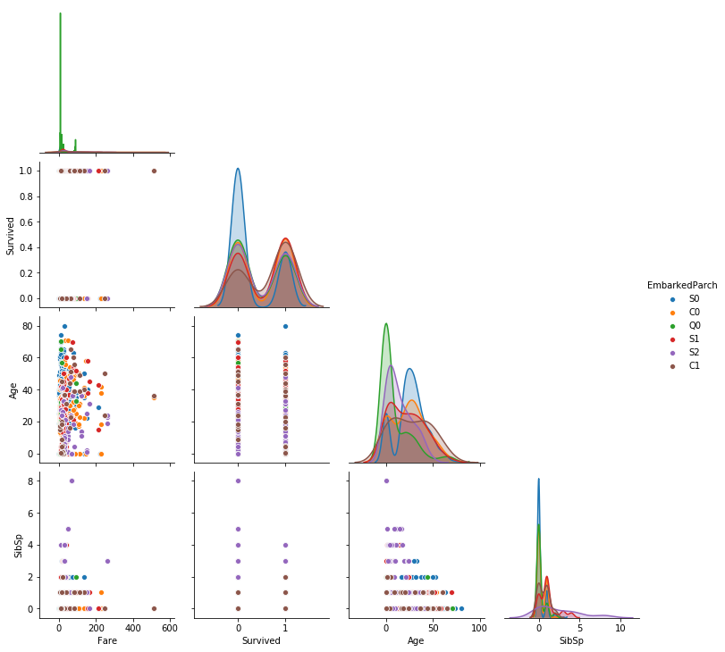


    Embarked*Parch=Fare


    Embarked*Parch=Survived


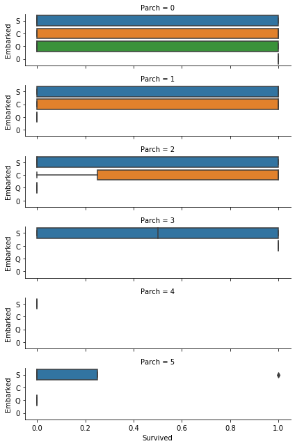


    Embarked*Parch=Age


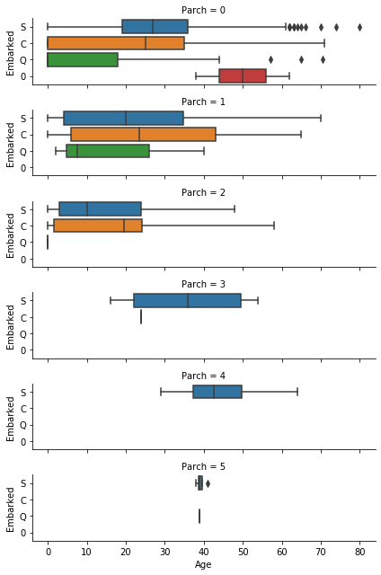


    Embarked*Parch=SibSp


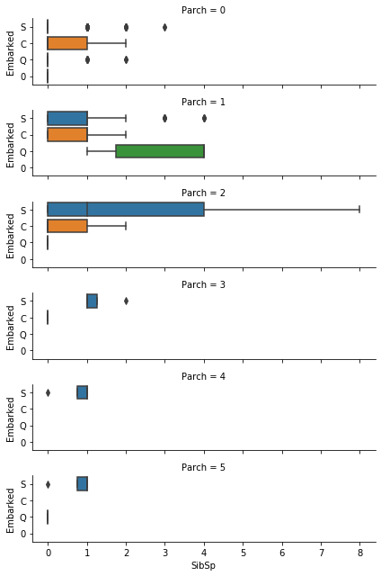


    
     
    


<hr>


<h3 align="center">Embarked - Cabin</h3>


    
      
    relation  90  :  3
    
    
     PassengerId
    Anova faled to reject => no difference 
    
    
     Fare
    Anova passed


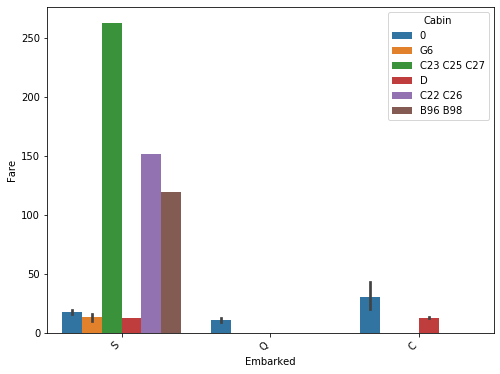


    turkeyHSD
                        group2  meandiff   p-adj     lower     upper  reject
    group1                                                                  
    Q0            SC23 C25 C27  251.7376  0.0010  207.0432  296.4320    True
    CD            SC23 C25 C27  249.6666  0.0010  174.2913  325.0420    True
    S0            SC23 C25 C27  244.9969  0.0010  201.3103  288.6836    True
    C0            SC23 C25 C27  232.0167  0.0010  187.6282  276.4051    True
    SB96 B98      SC23 C25 C27  143.0000  0.0010   81.4563  204.5437    True
    Q0                SC22 C26  140.2876  0.0010   89.0152  191.5600    True
    CD                SC22 C26  138.2167  0.0010   58.7640  217.6693    True
    S0                SC22 C26  133.5469  0.0010   83.1505  183.9433    True
    C0                SC22 C26  120.5667  0.0010   69.5607  171.5726    True
    SC22 C26      SC23 C25 C27  111.4500  0.0010   44.9752  177.9248    True
    Q0                SB96 B98  108.7376  0.0010   64.0432  153.4320    True
    CD                SB96 B98  106.6666  0.0010   31.2913  182.0420    True
    S0                SB96 B98  101.9969  0.0010   58.3103  145.6836    True
    C0                SB96 B98   89.0167  0.0010   44.6282  133.4051    True
    C0                      S0  -12.9803  0.0010  -22.5316   -3.4290    True
    C0                      Q0  -19.7209  0.0010  -33.1481   -6.2938    True
    SB96 B98               SG6 -106.4188  0.0010 -167.9625  -44.8750    True
    SB96 B98                SD -107.0000  0.0189 -204.3092   -9.6908    True
    SC22 C26               SG6 -137.9688  0.0010 -204.4436  -71.4939    True
    SC22 C26                SD -138.5500  0.0010 -239.0505  -38.0495    True
    SC23 C25 C27           SG6 -249.4188  0.0010 -310.9625 -187.8750    True
    SC23 C25 C27            SD -250.0000  0.0010 -347.3092 -152.6908    True
    
    
     Survived
    Anova passed


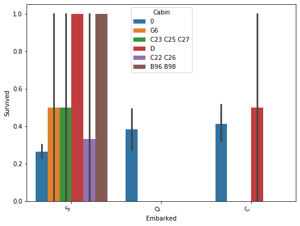


    turkeyHSD
              group2  meandiff  p-adj   lower   upper  reject
    group1                                                   
    S0      SB96 B98     0.734  0.038  0.0211  1.4469    True
    
    
     Age
    Anova faled to reject => no difference 
    
    
     SibSp
    Anova faled to reject => no difference 
    
    
     Parch
    Anova passed


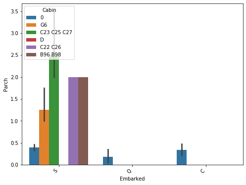


    turkeyHSD
                  group2  meandiff   p-adj   lower   upper  reject
    group1                                                        
    CD      SC23 C25 C27    2.5000  0.0139  0.2857  4.7143    True
    Q0      SC23 C25 C27    2.3219  0.0010  1.0090  3.6349    True
    C0      SC23 C25 C27    2.1566  0.0010  0.8526  3.4605    True
    S0      SC23 C25 C27    2.1039  0.0010  0.8205  3.3872    True
    Q0          SB96 B98    1.8219  0.0010  0.5090  3.1349    True
    Q0          SC22 C26    1.8219  0.0056  0.3157  3.3281    True
    C0          SB96 B98    1.6566  0.0027  0.3526  2.9605    True
    C0          SC22 C26    1.6566  0.0178  0.1582  3.1549    True
    S0          SB96 B98    1.6039  0.0035  0.3205  2.8872    True
    S0          SC22 C26    1.6039  0.0223  0.1234  3.0844    True
    
    
     Pclass
    Anova passed


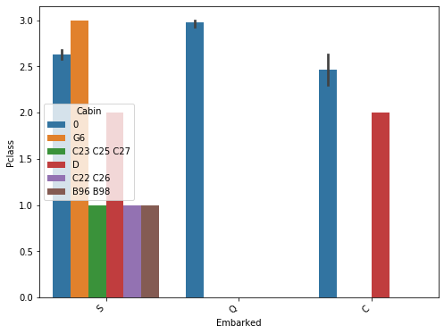


    turkeyHSD
                        group2  meandiff  p-adj   lower   upper  reject
    group1                                                             
    SB96 B98               SG6    2.0000  0.001  0.7428  3.2572    True
    SC22 C26               SG6    2.0000  0.001  0.6421  3.3579    True
    SC23 C25 C27           SG6    2.0000  0.001  0.7428  3.2572    True
    C0                      Q0    0.5080  0.001  0.2337  0.7822    True
    Q0                      S0   -0.3474  0.001 -0.5697 -0.1250    True
    C0                SB96 B98   -1.4646  0.001 -2.3714 -0.5579    True
    C0                SC22 C26   -1.4646  0.001 -2.5066 -0.4227    True
    C0            SC23 C25 C27   -1.4646  0.001 -2.3714 -0.5579    True
    S0                SB96 B98   -1.6252  0.001 -2.5177 -0.7328    True
    S0                SC22 C26   -1.6252  0.001 -2.6547 -0.5958    True
    S0            SC23 C25 C27   -1.6252  0.001 -2.5177 -0.7328    True
    Q0                SB96 B98   -1.9726  0.001 -2.8856 -1.0596    True
    Q0                SC22 C26   -1.9726  0.001 -3.0200 -0.9252    True
    Q0            SC23 C25 C27   -1.9726  0.001 -2.8856 -1.0596    True
    ['Fare', 'Survived', 'Parch', 'Pclass']


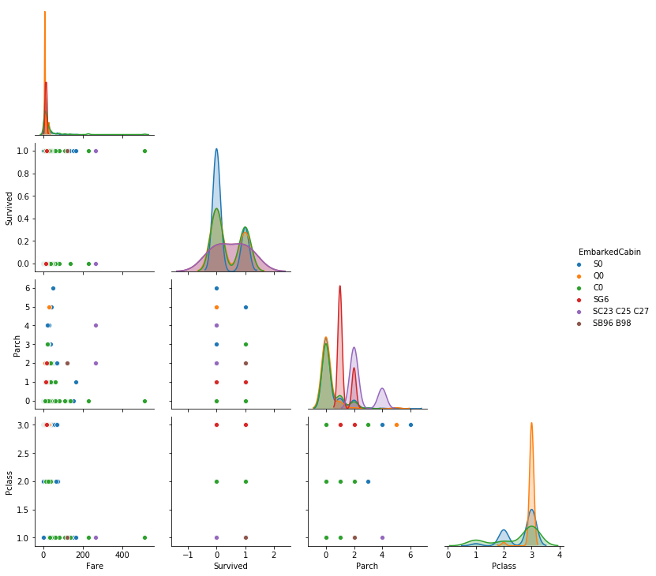


    Embarked*Cabin=Fare


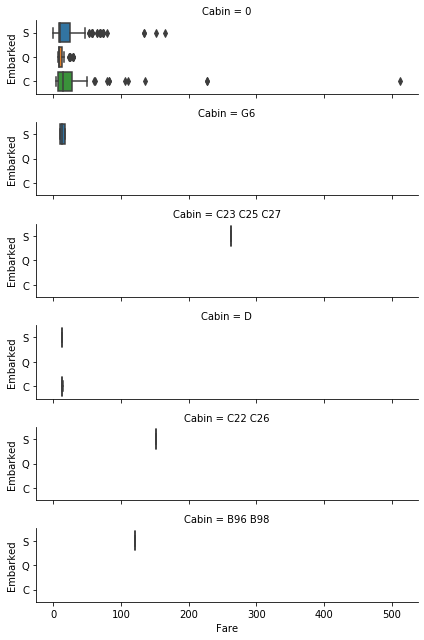


    Embarked*Cabin=Survived


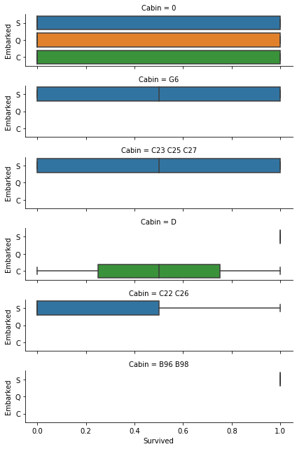


    Embarked*Cabin=Parch


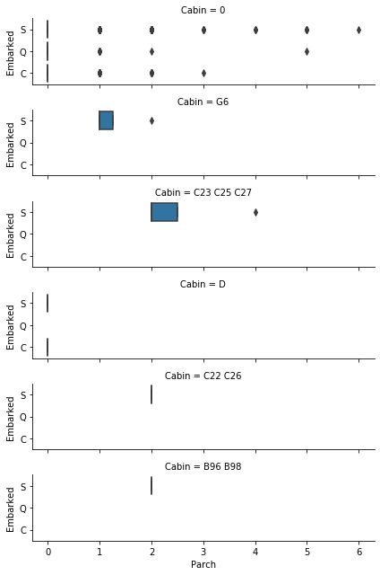


    Embarked*Cabin=Pclass


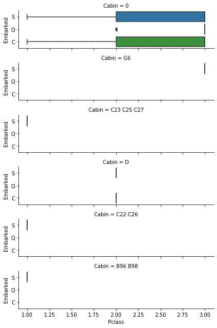


    
     
    


<hr>


<h3 align="center">Embarked - Sex</h3>


    
      
    relation  2  :  4
    
    
     PassengerId
    Anova faled to reject => no difference 
    
    
     Fare
    Anova passed


    turkeyHSD
              group2  meandiff   p-adj    lower    upper  reject
    group1                                                      
    Qfemale  Sfemale   26.1060  0.0353   1.0121  51.1998    True
    Qmale    Sfemale   24.9020  0.0329   1.1433  48.6607    True
    Sfemale    Smale  -17.0289  0.0010 -28.7980  -5.2598    True
    Cmale      Smale  -26.5501  0.0010 -42.2454 -10.8548    True
    Cfemale    Cmale  -26.9077  0.0046 -48.5050  -5.3104    True
    Cmale      Qmale  -34.4232  0.0018 -60.3521  -8.4943    True
    Cmale    Qfemale  -35.6272  0.0022 -62.7847  -8.4696    True
    Cfemale  Sfemale  -36.4289  0.0010 -55.3660 -17.4918    True
    Cfemale    Smale  -53.4578  0.0010 -70.9913 -35.9243    True
    Cfemale    Qmale  -61.3309  0.0010 -88.4120 -34.2497    True
    Cfemale  Qfemale  -62.5348  0.0010 -90.7946 -34.2751    True
    
    
     Survived
    Anova passed


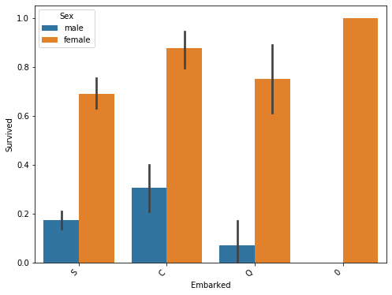


    turkeyHSD
              group2  meandiff   p-adj   lower   upper  reject
    group1                                                    
    Qmale    Sfemale    0.6165  0.0010  0.4119  0.8211    True
    Cmale    Qfemale    0.4447  0.0010  0.2108  0.6786    True
    Cmale    Sfemale    0.3844  0.0010  0.2358  0.5329    True
    Cfemale  Sfemale   -0.1871  0.0129 -0.3501 -0.0240    True
    Cmale      Qmale   -0.2321  0.0356 -0.4554 -0.0088    True
    Sfemale    Smale   -0.5151  0.0010 -0.6164 -0.4137    True
    Cfemale    Cmale   -0.5714  0.0010 -0.7575 -0.3854    True
    Qfemale    Smale   -0.5754  0.0010 -0.7825 -0.3683    True
    Qfemale    Qmale   -0.6768  0.0010 -0.9498 -0.4039    True
    Cfemale    Smale   -0.7021  0.0010 -0.8531 -0.5511    True
    Cfemale    Qmale   -0.8035  0.0010 -1.0368 -0.5703    True
    0female    Qmale   -0.9268  0.0267 -1.7922 -0.0614    True
    
    
     Age
    Anova faled to reject => no difference 
    
    
     SibSp
    Anova passed


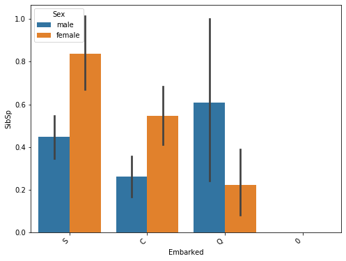


    turkeyHSD
              group2  meandiff   p-adj   lower   upper  reject
    group1                                                    
    Qfemale  Sfemale    0.6152  0.0305  0.0330  1.1974    True
    Cmale    Sfemale    0.5743  0.0010  0.1741  0.9745    True
    Sfemale    Smale   -0.3885  0.0010 -0.6615 -0.1154    True
    
    
     Parch
    Anova passed


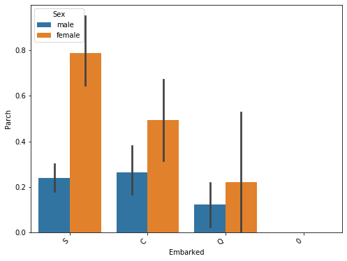


    turkeyHSD
              group2  meandiff   p-adj   lower   upper  reject
    group1                                                    
    Qmale    Sfemale    0.6662  0.0010  0.2746  1.0579    True
    Qfemale  Sfemale    0.5660  0.0011  0.1523  0.9796    True
    Cmale    Sfemale    0.5250  0.0010  0.2407  0.8094    True
    Sfemale    Smale   -0.5478  0.0010 -0.7418 -0.3538    True
    
    
     Pclass
    Anova passed


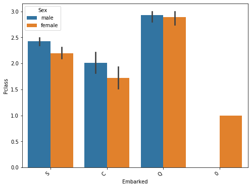


    turkeyHSD
              group2  meandiff   p-adj   lower   upper  reject
    group1                                                    
    0female    Qmale    1.9268  0.0135  0.2396  3.6140    True
    0female  Qfemale    1.8889  0.0175  0.1963  3.5815    True
    Cfemale    Qmale    1.2008  0.0010  0.7461  1.6555    True
    Cfemale  Qfemale    1.1629  0.0010  0.6884  1.6374    True
    Cmale      Qmale    0.9163  0.0010  0.4809  1.3517    True
    Cmale    Qfemale    0.8784  0.0010  0.4224  1.3344    True
    Cfemale    Smale    0.6957  0.0010  0.4013  0.9901    True
    Cfemale  Sfemale    0.4710  0.0010  0.1531  0.7890    True
    Cmale      Smale    0.4112  0.0010  0.1477  0.6748    True
    Sfemale    Smale    0.2247  0.0142  0.0271  0.4223    True
    Qfemale    Smale   -0.4671  0.0117 -0.8710 -0.0633    True
    Qmale      Smale   -0.5051  0.0018 -0.8855 -0.1247    True
    Qfemale  Sfemale   -0.6918  0.0010 -1.1132 -0.2705    True
    Qmale    Sfemale   -0.7298  0.0010 -1.1287 -0.3309    True
    ['Fare', 'Survived', 'SibSp', 'Parch', 'Pclass']


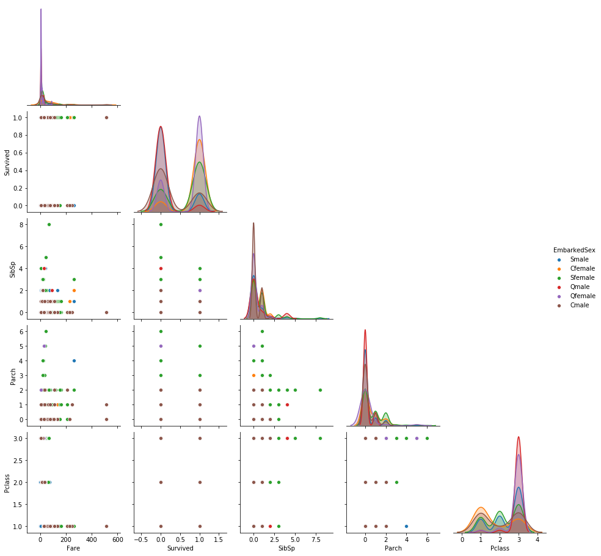


    Embarked*Sex=Fare


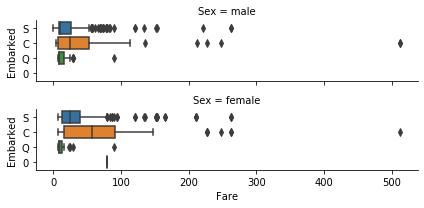


    Embarked*Sex=Survived


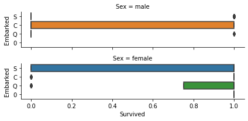


    Embarked*Sex=SibSp


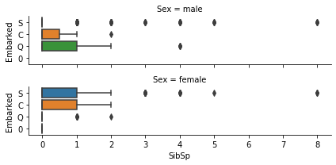


    Embarked*Sex=Parch


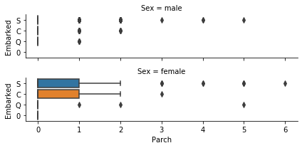


    Embarked*Sex=Pclass


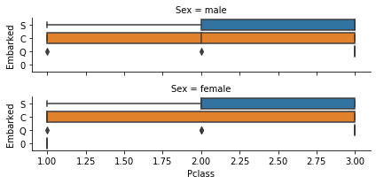


    
     
    


<hr>


<h3 align="center">Embarked - Pclass</h3>


    
      
    relation  3  :  4
    
    
     PassengerId
    Anova faled to reject => no difference 
    
    
     Fare
    Anova passed


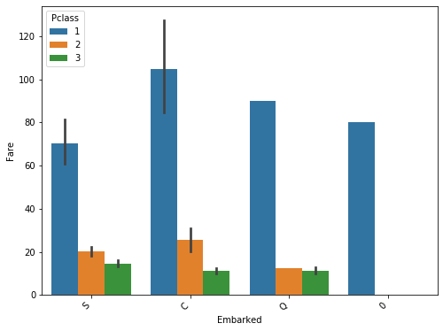


    turkeyHSD
           group2  meandiff   p-adj     lower    upper  reject
    group1                                                    
    Q3         S1   59.1815  0.0010   40.7982  77.5647    True
    C3         S1   59.1508  0.0010   40.2418  78.0598    True
    C2         S1   45.0065  0.0010   12.8241  77.1890    True
    C1         S1  -34.3537  0.0010  -51.8168 -16.8906    True
    S1         S2  -50.0374  0.0010  -64.7669 -35.3080    True
    S1         S3  -55.7208  0.0010  -68.6150 -42.8265    True
    C1         C2  -79.3602  0.0010 -112.4680 -46.2524    True
    C1         S2  -84.3911  0.0010 -101.0456 -67.7366    True
    C1         S3  -90.0744  0.0010 -105.1303 -75.0186    True
    C1         Q2  -92.3685  0.0027 -165.5727 -19.1644    True
    C1         C3  -93.5044  0.0010 -113.9487 -73.0602    True
    C1         Q3  -93.5351  0.0010 -113.4941 -73.5762    True
    
    
     Survived
    Anova passed


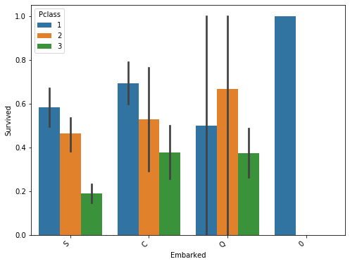


    turkeyHSD
           group2  meandiff   p-adj   lower   upper  reject
    group1                                                 
    C1         S2   -0.2307  0.0060 -0.4233 -0.0381    True
    S2         S3   -0.2736  0.0010 -0.4098 -0.1374    True
    C1         C3   -0.3153  0.0011 -0.5517 -0.0789    True
    C1         Q3   -0.3191  0.0010 -0.5499 -0.0883    True
    S1         S3   -0.3929  0.0010 -0.5420 -0.2438    True
    C1         S3   -0.5043  0.0010 -0.6784 -0.3302    True
    
    
     Age
    Anova passed


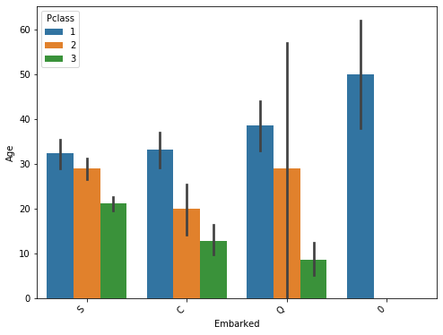


    turkeyHSD
           group2  meandiff   p-adj    lower    upper  reject
    group1                                                   
    Q3         S1   23.7984  0.0010  16.3144  31.2824    True
    Q3         S2   20.2586  0.0010  13.0866  27.4306    True
    C3         S1   19.5591  0.0010  11.8611  27.2571    True
    C3         S2   16.0193  0.0010   8.6242  23.4144    True
    Q3         S3   12.4646  0.0010   5.9045  19.0248    True
    C3         S3    8.2253  0.0052   1.4220  15.0287    True
    S2         S3   -7.7940  0.0010 -12.5881  -2.9998    True
    S1         S3  -11.3338  0.0010 -16.5831  -6.0844    True
    C1         S3  -11.9954  0.0010 -18.1248  -5.8660    True
    C1         C3  -20.2207  0.0010 -28.5438 -11.8977    True
    C1         Q3  -24.4600  0.0010 -32.5855 -16.3346    True
    01         C3  -37.1148  0.0416 -73.5266  -0.7031    True
    01         Q3  -41.3542  0.0121 -77.7213  -4.9870    True
    
    
     SibSp
    Anova passed


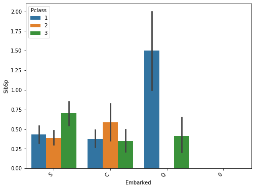


    turkeyHSD
           group2  meandiff   p-adj   lower   upper  reject
    group1                                                 
    01         C1    0.3765  0.9000 -2.1109  2.8638   False
    01         C2    0.5882  0.9000 -2.0109  3.1874   False
    01         C3    0.3485  0.9000 -2.1471  2.8440   False
    01         Q1    1.5000  0.9000 -1.9769  4.9769   False
    01         Q2    0.0000  0.9000 -3.1740  3.1740   False
    01         Q3    0.4167  0.9000 -2.0758  2.9092   False
    01         S1    0.4331  0.9000 -2.0448  2.9109   False
    01         S2    0.3902  0.9000 -2.0833  2.8638   False
    01         S3    0.7054  0.9000 -1.7601  3.1709   False
    C1         C2    0.2118  0.9000 -0.7120  1.1355   False
    C1         C3   -0.0280  0.9000 -0.5984  0.5424   False
    C1         Q1    1.1235  0.9000 -1.3638  3.6109   False
    C1         Q2   -0.3765  0.9000 -2.4190  1.6661   False
    C1         Q3    0.0402  0.9000 -0.5167  0.5971   False
    C1         S1    0.0566  0.9000 -0.4307  0.5439   False
    C1         S2    0.0138  0.9000 -0.4509  0.4785   False
    C1         S3    0.3289  0.2790 -0.0912  0.7490   False
    C2         C3   -0.2398  0.9000 -1.1854  0.7059   False
    C2         Q1    0.9118  0.9000 -1.6874  3.5109   False
    C2         Q2   -0.5882  0.9000 -2.7656  1.5891   False
    C2         Q3   -0.1716  0.9000 -1.1091  0.7660   False
    C2         S1   -0.1552  0.9000 -1.0531  0.7428   False
    C2         S2   -0.1980  0.9000 -1.0839  0.6879   False
    C2         S3    0.1171  0.9000 -0.7462  0.9805   False
    C3         Q1    1.1515  0.9000 -1.3440  3.6471   False
    C3         Q2   -0.3485  0.9000 -2.4010  1.7040   False
    C3         Q3    0.0682  0.9000 -0.5243  0.6607   False
    C3         S1    0.0846  0.9000 -0.4430  0.6122   False
    C3         S2    0.0418  0.9000 -0.4651  0.5486   False
    C3         S3    0.3569  0.3106 -0.1094  0.8232   False
    Q1         Q2   -1.5000  0.8922 -4.6740  1.6740   False
    Q1         Q3   -1.0833  0.9000 -3.5758  1.4092   False
    Q1         S1   -1.0669  0.9000 -3.5448  1.4109   False
    Q1         S2   -1.1098  0.9000 -3.5833  1.3638   False
    Q1         S3   -0.7946  0.9000 -3.2601  1.6709   False
    Q2         Q3    0.4167  0.9000 -1.6321  2.4655   False
    Q2         S1    0.4331  0.9000 -1.5979  2.4641   False
    Q2         S2    0.3902  0.9000 -1.6355  2.4159   False
    Q2         S3    0.7054  0.9000 -1.3105  2.7213   False
    Q3         S1    0.0164  0.9000 -0.4965  0.5293   False
    Q3         S2   -0.0264  0.9000 -0.5180  0.4651   False
    Q3         S3    0.2887  0.5626 -0.1609  0.7383   False
    S1         S2   -0.0428  0.9000 -0.4538  0.3682   False
    S1         S3    0.2723  0.3264 -0.0875  0.6321   False
    S2         S3    0.3151  0.0732 -0.0134  0.6437   False
    
    
     Parch
    Anova faled to reject => no difference 
    
    
     Pclass
    ['Fare', 'Survived', 'Age', 'SibSp']


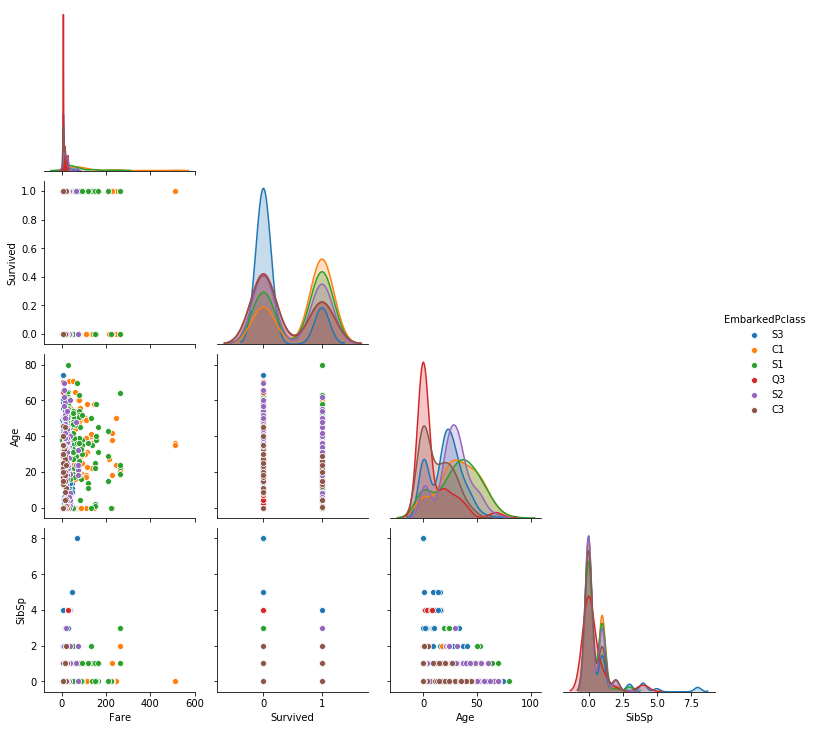


    Embarked*Pclass=Fare


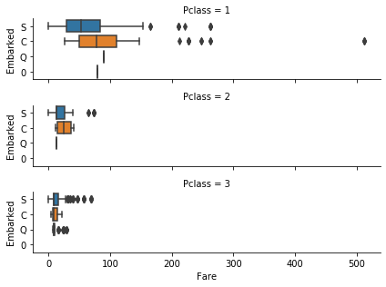


    Embarked*Pclass=Survived


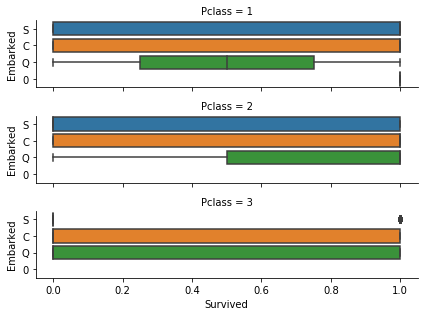


    Embarked*Pclass=Age


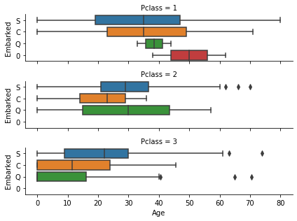


    Embarked*Pclass=SibSp


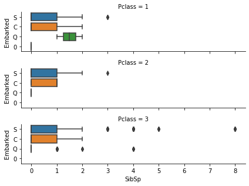


    
     
    


<hr>


<h3 align="center">Parch - Cabin</h3>


    
      
    relation  112  :  7
    
    
     PassengerId
    Anova faled to reject => no difference 
    
    
     Fare
    Anova passed


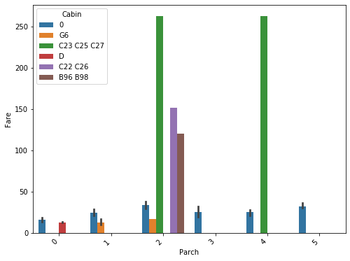


    turkeyHSD
                        group2  meandiff   p-adj     lower     upper  reject
    group1                                                                  
    1G6           4C23 C25 C27  250.4583  0.0010  142.9140  358.0026    True
    1G6           2C23 C25 C27  250.4583  0.0010  174.4130  326.5036    True
    0D            2C23 C25 C27  249.7778  0.0010  173.7325  325.8231    True
    0D            4C23 C25 C27  249.7778  0.0010  142.2335  357.3221    True
    00            2C23 C25 C27  246.5467  0.0010  192.6245  300.4688    True
    00            4C23 C25 C27  246.5467  0.0010  153.3239  339.7694    True
    2G6           4C23 C25 C27  246.3000  0.0010  114.5857  378.0143    True
    10            4C23 C25 C27  238.1613  0.0010  144.4376  331.8850    True
    10            2C23 C25 C27  238.1613  0.0010  183.3777  292.9449    True
    40            4C23 C25 C27  237.3750  0.0010  129.8307  344.9193    True
    30            4C23 C25 C27  237.0483  0.0010  135.0229  339.0738    True
    20            4C23 C25 C27  228.8405  0.0010  134.8910  322.7900    True
    20            2C23 C25 C27  228.8405  0.0010  173.6714  284.0096    True
    2B96 B98      2C23 C25 C27  143.0000  0.0010   71.8661  214.1339    True
    2B96 B98      4C23 C25 C27  143.0000  0.0010   38.8707  247.1293    True
    1G6               2C22 C26  139.0083  0.0010   62.9630  215.0536    True
    0D                2C22 C26  138.3278  0.0010   62.2825  214.3731    True
    00                2C22 C26  135.0967  0.0010   81.1745  189.0188    True
    10                2C22 C26  126.7113  0.0010   71.9277  181.4949    True
    20                2C22 C26  117.3905  0.0010   62.2214  172.5596    True
    2C22 C26      2C23 C25 C27  111.4500  0.0010   35.4047  187.4953    True
    2C22 C26      4C23 C25 C27  111.4500  0.0342    3.9057  218.9943    True
    1G6               2B96 B98  107.4583  0.0010   36.3245  178.5922    True
    0D                2B96 B98  106.7778  0.0010   35.6439  177.9116    True
    00                2B96 B98  103.5467  0.0010   56.8055  150.2878    True
    10                2B96 B98   95.1613  0.0010   47.4289  142.8937    True
    20                2B96 B98   85.8405  0.0010   37.6662  134.0148    True
    00                      20   17.7062  0.0010    4.7318   30.6805    True
    2B96 B98                50  -87.4500  0.0010 -149.9276  -24.9724    True
    2B96 B98                30  -94.0483  0.0010 -156.5259  -31.5707    True
    2B96 B98                40  -94.3750  0.0010 -165.5089  -23.2411    True
    2C22 C26                50 -119.0000  0.0010 -187.0170  -50.9830    True
    2C22 C26                30 -125.5983  0.0010 -193.6153  -57.5814    True
    2C22 C26                40 -125.9250  0.0010 -201.9703  -49.8797    True
    2C22 C26               2G6 -134.8500  0.0024 -242.3943  -27.3057    True
    2C23 C25 C27            50 -230.4500  0.0010 -298.4670 -162.4330    True
    4C23 C25 C27            50 -230.4500  0.0010 -332.4755 -128.4245    True
    2C23 C25 C27            30 -237.0483  0.0010 -305.0653 -169.0314    True
    2C23 C25 C27            40 -237.3750  0.0010 -313.4203 -161.3297    True
    2C23 C25 C27           2G6 -246.3000  0.0010 -353.8443 -138.7557    True
    
    
     Survived
    Anova faled to reject => no difference 
    
    
     Age
    Anova faled to reject => no difference 
    
    
     SibSp
    Anova passed


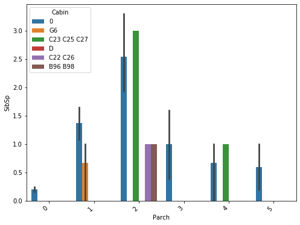


    turkeyHSD
                        group2  meandiff   p-adj   lower   upper  reject
    group1                                                              
    0D            2C23 C25 C27    3.0000  0.0113  0.3518  5.6482    True
    00            2C23 C25 C27    2.7914  0.0010  0.9136  4.6692    True
    0D                      20    2.5439  0.0010  0.6226  4.4651    True
    00                      20    2.3353  0.0010  1.8835  2.7871    True
    10                      20    1.1768  0.0010  0.6131  1.7404    True
    00                      10    1.1585  0.0010  0.7677  1.5494    True
    20                      30   -1.5439  0.0405 -3.0566 -0.0311    True
    20                      50   -1.9439  0.0016 -3.4566 -0.4311    True
    2C23 C25 C27            50   -2.4000  0.0437 -4.7686 -0.0314    True
    
    
     Parch
    
    
     Pclass
    Anova passed


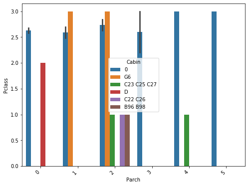


    turkeyHSD
                        group2  meandiff   p-adj   lower   upper  reject
    group1                                                              
    2C23 C25 C27            50    2.0000  0.0010  0.5795  3.4205    True
    2C23 C25 C27            40    2.0000  0.0022  0.4118  3.5882    True
    2C22 C26                50    2.0000  0.0010  0.5795  3.4205    True
    2C22 C26                40    2.0000  0.0022  0.4118  3.5882    True
    2B96 B98                50    2.0000  0.0010  0.6952  3.3048    True
    2B96 B98                40    2.0000  0.0010  0.5144  3.4856    True
    2B96 B98                30    1.6000  0.0035  0.2952  2.9048    True
    2C23 C25 C27            30    1.6000  0.0123  0.1795  3.0205    True
    2C22 C26                30    1.6000  0.0123  0.1795  3.0205    True
    10                2B96 B98   -1.5949  0.0010 -2.5918 -0.5980    True
    10                2C22 C26   -1.5949  0.0010 -2.7391 -0.4508    True
    10            2C23 C25 C27   -1.5949  0.0010 -2.7391 -0.4508    True
    00                2B96 B98   -1.6294  0.0010 -2.6056 -0.6532    True
    00                2C22 C26   -1.6294  0.0010 -2.7556 -0.5033    True
    00            2C23 C25 C27   -1.6294  0.0010 -2.7556 -0.5033    True
    20            2C23 C25 C27   -1.7368  0.0010 -2.8890 -0.5846    True
    20                2B96 B98   -1.7368  0.0010 -2.7430 -0.7307    True
    20                2C22 C26   -1.7368  0.0010 -2.8890 -0.5846    True
    1G6           2C23 C25 C27   -2.0000  0.0022 -3.5882 -0.4118    True
    1G6               2C22 C26   -2.0000  0.0022 -3.5882 -0.4118    True
    1G6               2B96 B98   -2.0000  0.0010 -3.4856 -0.5144    True
    ['Fare', 'SibSp', 'Pclass']


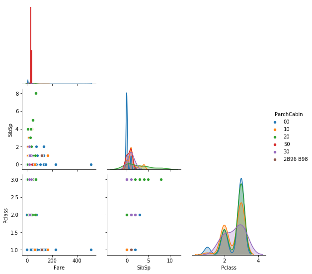


    Parch*Cabin=Fare


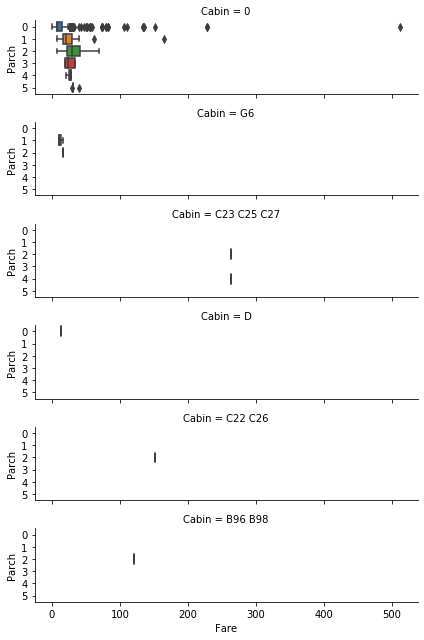


    Parch*Cabin=SibSp


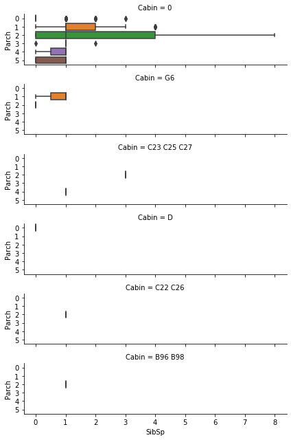


    Parch*Cabin=Pclass


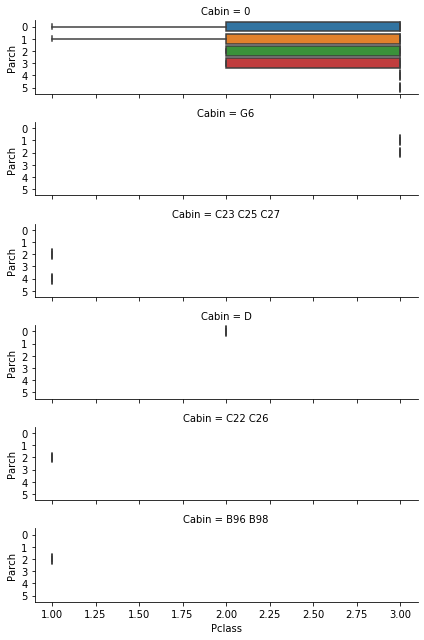


    
     
    


<hr>


<h3 align="center">Parch - Sex</h3>


    
      
    relation  2  :  7
    
    
     PassengerId
    Anova passed


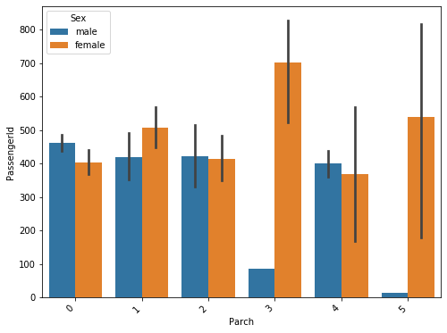


    turkeyHSD
              group2  meandiff   p-adj      lower     upper  reject
    group1                                                         
    0female    0male   59.1488  0.2175   -12.0714  130.3691   False
    0female  1female  105.3857  0.1861   -18.4233  229.1948   False
    0female    1male   17.2794  0.9000  -108.1495  142.7083   False
    0female  2female   10.5201  0.9000  -123.4835  144.5237   False
    0female    2male   18.5497  0.9000  -143.5647  180.6641   False
    ...          ...       ...     ...        ...       ...     ...
    4female  5female  172.5000  0.9000  -553.3431  898.3431   False
    4female    5male -354.0000  0.9000 -1380.4972  672.4972   False
    4male    5female  140.5000  0.9000  -585.3431  866.3431   False
    4male      5male -386.0000  0.9000 -1412.4972  640.4972   False
    5female    5male -526.5000  0.7675 -1463.5594  410.5594   False
    
    [66 rows x 6 columns]
    
    
     Fare
    Anova passed


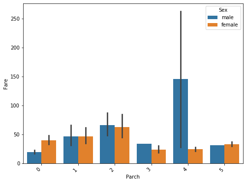


    turkeyHSD
              group2  meandiff   p-adj    lower     upper  reject
    group1                                                       
    0male      4male  125.5709  0.0109  15.3357  235.8061    True
    0male      2male   46.2072  0.0010  17.3842   75.0303    True
    0male    2female   43.3522  0.0010  20.0293   66.6751    True
    0male    1female   27.1082  0.0020   5.8150   48.4014    True
    0male      1male   26.6828  0.0033   5.0654   48.3002    True
    0female    0male  -19.9475  0.0010 -33.1675   -6.7275    True
    
    
     Survived
    Anova passed


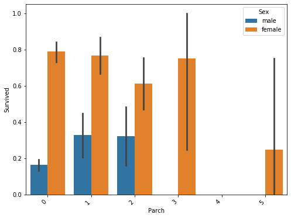


    turkeyHSD
              group2  meandiff   p-adj   lower   upper  reject
    group1                                                    
    0male    1female    0.6014  0.0010  0.4207  0.7821    True
    0male    2female    0.4470  0.0010  0.2490  0.6449    True
    1male    2female    0.2847  0.0151  0.0285  0.5408    True
    1female    1male   -0.4391  0.0010 -0.6822 -0.1960    True
    1female    2male   -0.4441  0.0010 -0.7361 -0.1520    True
    0female    1male   -0.4611  0.0010 -0.6587 -0.2635    True
    0female    2male   -0.4661  0.0010 -0.7215 -0.2107    True
    0female    0male   -0.6234  0.0010 -0.7356 -0.5112    True
    
    
     Age
    Anova faled to reject => no difference 
    
    
     SibSp
    Anova passed


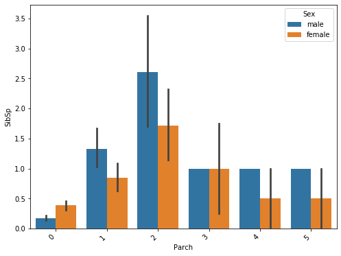


    turkeyHSD
              group2  meandiff   p-adj   lower   upper  reject
    group1                                                    
    0male      2male    2.4352  0.0010  1.8667  3.0038    True
    0female    2male    2.2263  0.0010  1.6327  2.8199    True
    1female    2male    1.7629  0.0010  1.0841  2.4417    True
    0male    2female    1.5366  0.0010  1.0765  1.9967    True
    0female  2female    1.3277  0.0010  0.8370  1.8183    True
    1male      2male    1.2853  0.0010  0.6025  1.9681    True
    0male      1male    1.1499  0.0010  0.7235  1.5763    True
    0female    1male    0.9410  0.0010  0.4817  1.4002    True
    2female    2male    0.8986  0.0019  0.1943  1.6029    True
    1female  2female    0.8643  0.0010  0.2734  1.4552    True
    0male    1female    0.6723  0.0010  0.2523  1.0923    True
    0female  1female    0.4634  0.0400  0.0101  0.9167    True
    2male    5female   -2.1129  0.0014 -3.7433 -0.4825    True
    
    
     Parch
    
    
     Pclass
    Anova faled to reject => no difference 
    ['PassengerId', 'Fare', 'Survived', 'SibSp']


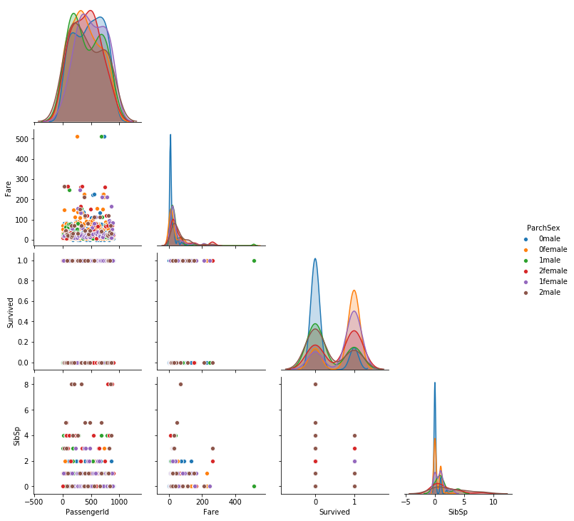


    Parch*Sex=PassengerId


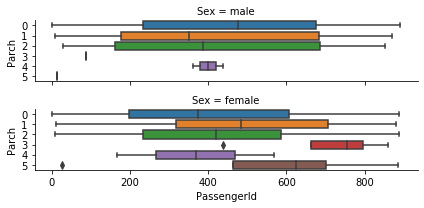


    Parch*Sex=Fare


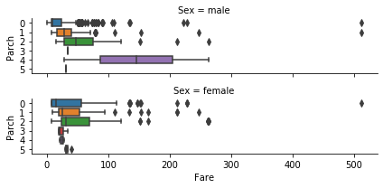


    Parch*Sex=Survived


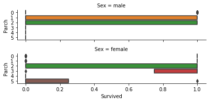


    Parch*Sex=SibSp


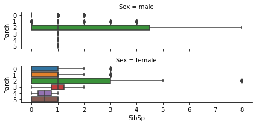


    
     
    


<hr>


<h3 align="center">Parch - Pclass</h3>


    
      
    relation  3  :  7
    
    
     PassengerId
    Anova faled to reject => no difference 
    
    
     Fare
    Anova passed


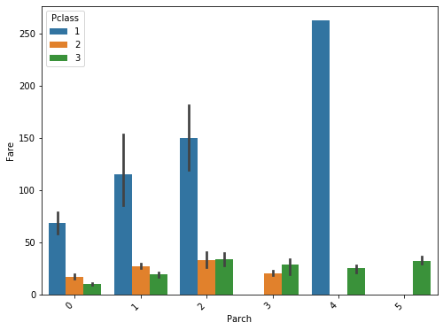


    turkeyHSD
            group2  meandiff   p-adj     lower     upper  reject
    group1                                                      
    3           41  252.9766  0.0010  128.5980  377.3552    True
    2           41  245.5329  0.0010  120.8545  370.2112    True
    13          41  243.5920  0.0010  118.2521  368.9318    True
    32          41  242.1250  0.0010   89.9925  394.2575    True
    12          41  235.3905  0.0010  109.2489  361.5321    True
    33          41  233.6639  0.0010   90.2320  377.0958    True
    22          41  229.5005  0.0010  101.4619  357.5391    True
    23          41  229.1907  0.0010  103.5389  354.8425    True
    1           41  194.3600  0.0010   69.7639  318.9562    True
    11          41  147.8749  0.0067   21.6716  274.0781    True
    3           21  140.3202  0.0010  112.4771  168.1633    True
    2           21  132.8765  0.0010  103.7237  162.0293    True
    13          21  130.9356  0.0010   99.0722  162.7990    True
    12          21  122.7341  0.0010   87.8499  157.6184    True
    3           11  105.1017  0.0010   81.9021  128.3014    True
    2           11   97.6580  0.0010   72.9017  122.4143    True
    1           21   81.7037  0.0010   52.9044  110.5030    True
    1           11   46.4852  0.0010   22.1462   70.8242    True
    11          21   35.2185  0.0484    0.1120   70.3250    True
    3           23   23.7859  0.0052    3.8028   43.7690    True
    1           23  -34.8307  0.0010  -56.1259  -13.5355    True
    1           22  -35.1405  0.0207  -67.6829   -2.5981    True
    1           12  -41.0305  0.0010  -65.0478  -17.0131    True
    1           13  -49.2319  0.0010  -68.6019  -29.8619    True
    1            2  -51.1728  0.0010  -65.6575  -36.6882    True
    1            3  -58.6166  0.0010  -70.2423  -46.9909    True
    11          23  -81.3158  0.0010 -110.5828  -52.0489    True
    11          22  -81.6256  0.0010 -119.8627  -43.3886    True
    11          53  -82.5751  0.0010 -142.4386  -22.7117    True
    11          33  -85.7890  0.0097 -160.8950  -10.6831    True
    11          12  -87.5156  0.0010 -118.8190  -56.2123    True
    11          43  -89.5001  0.0051 -164.6061  -14.3942    True
    11          32  -94.2501  0.0326 -184.8730   -3.6273    True
    11          13  -95.7171  0.0010 -123.6145  -67.8197    True
    21          23 -116.5343  0.0010 -149.6035  -83.4652    True
    21          22 -116.8442  0.0010 -158.0641  -75.6242    True
    21          53 -117.7936  0.0010 -179.6050  -55.9823    True
    21          33 -121.0075  0.0010 -197.6751  -44.3400    True
    21          43 -124.7186  0.0010 -201.3862  -48.0511    True
    21          32 -129.4686  0.0010 -221.3899  -37.5474    True
    41          53 -230.4500  0.0010 -366.5215  -94.3785    True
    41          43 -237.3750  0.0010 -380.8069  -93.9431    True
    
    
     Survived
    Anova passed


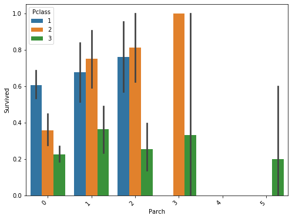


    turkeyHSD
            group2  meandiff   p-adj   lower   upper  reject
    group1                                                  
    3           22    0.5868  0.0010  0.2002  0.9733    True
    3           21    0.5362  0.0010  0.1967  0.8757    True
    3           12    0.5243  0.0010  0.2455  0.8031    True
    2           22    0.4543  0.0108  0.0537  0.8549    True
    3           11    0.4517  0.0010  0.1688  0.7346    True
    13          22    0.4489  0.0314  0.0186  0.8791    True
    2           21    0.4037  0.0106  0.0482  0.7592    True
    13          21    0.3983  0.0384  0.0097  0.7868    True
    2           12    0.3918  0.0010  0.0938  0.6898    True
    2           11    0.3192  0.0268  0.0173  0.6211    True
    1           13   -0.2437  0.0356 -0.4799 -0.0075    True
    1            2   -0.2492  0.0010 -0.4258 -0.0725    True
    1           23   -0.3515  0.0010 -0.6112 -0.0919    True
    1            3   -0.3816  0.0010 -0.5234 -0.2399    True
    12          13   -0.3864  0.0091 -0.7231 -0.0496    True
    11          23   -0.4216  0.0059 -0.7785 -0.0647    True
    12          23   -0.4942  0.0010 -0.8478 -0.1406    True
    21          23   -0.5061  0.0022 -0.9093 -0.1029    True
    22          23   -0.5567  0.0022 -1.0002 -0.1131    True
    
    
     Age
    Anova passed


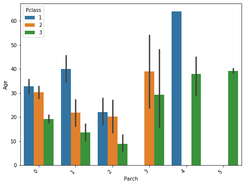


    turkeyHSD
            group2  meandiff   p-adj    lower     upper  reject
    group1                                                     
    23          41   55.0581  0.0409   1.0380  109.0783    True
    23          53   30.2581  0.0046   5.0253   55.4909    True
    13          53   25.5469  0.0388   0.6025   50.4913    True
    3           11   20.6481  0.0010  10.6741   30.6221    True
    3           23  -10.3455  0.0043 -18.9367   -1.7544    True
    1           12  -11.0099  0.0242 -21.3354   -0.6843    True
    2            3  -11.0783  0.0010 -16.4418   -5.7147    True
    12          23  -12.8550  0.0360 -25.3227   -0.3873    True
    1            3  -13.5193  0.0010 -18.5175   -8.5212    True
    2           13  -16.7126  0.0010 -25.2645   -8.1607    True
    11          21  -17.9393  0.0054 -33.0323   -2.8463    True
    11          12  -18.1386  0.0010 -31.5965   -4.6807    True
    1           13  -19.1537  0.0010 -27.4812  -10.8261    True
    11          22  -19.6649  0.0048 -36.1037   -3.2260    True
    2           23  -21.4238  0.0010 -30.7836  -12.0641    True
    1           23  -23.8649  0.0010 -33.0201  -14.7097    True
    11          13  -26.2824  0.0010 -38.2760  -14.2888    True
    11          23  -30.9936  0.0010 -43.5761  -18.4112    True
    
    
     SibSp
    Anova passed


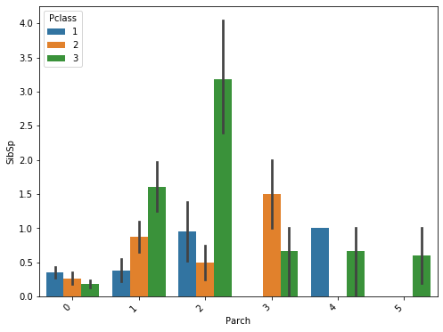


    turkeyHSD
            group2  meandiff   p-adj   lower   upper  reject
    group1                                                  
    3           23    3.0049  0.0010  2.5410  3.4689    True
    2           23    2.9249  0.0010  2.4194  3.4303    True
    1           23    2.8364  0.0010  2.3420  3.3307    True
    11          23    2.7989  0.0010  2.1195  3.4784    True
    22          23    2.6860  0.0010  1.8416  3.5305    True
    12          23    2.3110  0.0010  1.6378  2.9843    True
    21          23    2.2337  0.0010  1.4660  3.0014    True
    13          23    1.5860  0.0010  0.9990  2.1731    True
    3           13    1.4189  0.0010  1.0029  1.8349    True
    2           13    1.3388  0.0010  0.8770  1.8006    True
    1           13    1.2503  0.0010  0.8006  1.7000    True
    11          13    1.2129  0.0010  0.5653  1.8605    True
    3           21    0.7713  0.0050  0.1249  1.4177    True
    12          13    0.7250  0.0112  0.0839  1.3661    True
    3           12    0.6939  0.0010  0.1632  1.2246    True
    2           21    0.6912  0.0400  0.0144  1.3680    True
    2           12    0.6138  0.0202  0.0464  1.1812    True
    13          22   -1.1000  0.0010 -1.9191 -0.2809    True
    23          33   -2.5194  0.0010 -4.2414 -0.7974    True
    23          43   -2.5194  0.0010 -4.2414 -0.7974    True
    23          53   -2.5860  0.0010 -3.9486 -1.2235    True
    
    
     Parch
    
    
     Pclass
    ['Fare', 'Survived', 'Age', 'SibSp']


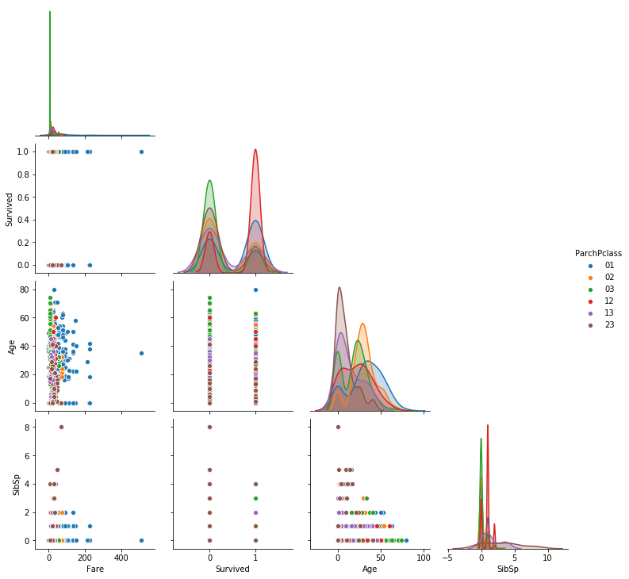


    Parch*Pclass=Fare


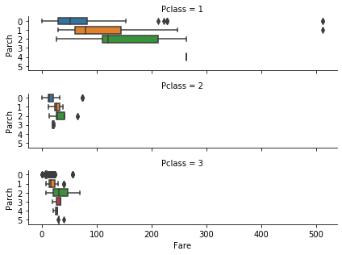


    Parch*Pclass=Survived


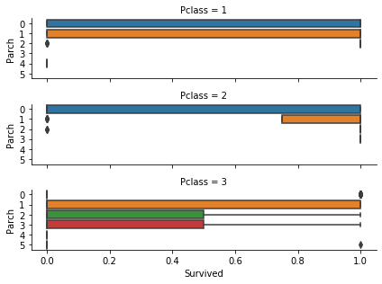


    Parch*Pclass=Age


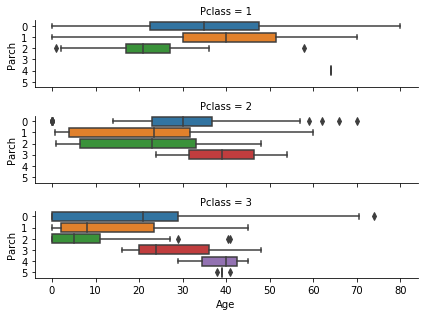


    Parch*Pclass=SibSp


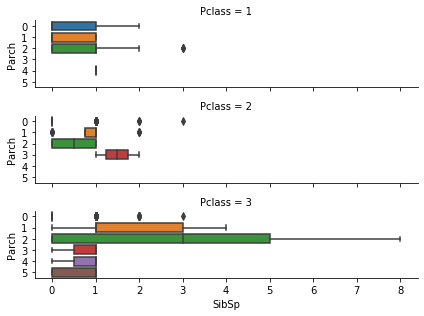


    
     
    


<hr>


<h3 align="center">Cabin - Sex</h3>


    
      
    relation  2  :  97
    
    
     PassengerId
    Anova faled to reject => no difference 
    
    
     Fare
    Anova faled to reject => no difference 
    
    
     Survived
    Anova passed


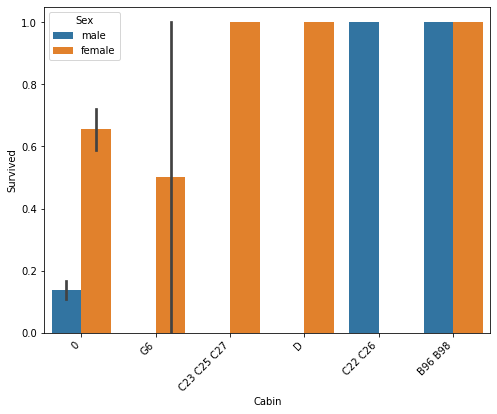


    turkeyHSD
            group2  meandiff  p-adj   lower   upper  reject
    group1                                                 
    0female  0male   -0.5182  0.001 -0.6215 -0.4149    True
    
    
     Age
    Anova faled to reject => no difference 
    
    
     SibSp
    Anova faled to reject => no difference 
    
    
     Parch
    Anova faled to reject => no difference 
    
    
     Pclass
    Anova faled to reject => no difference 
    ['Survived']
    Cabin*Sex=Survived


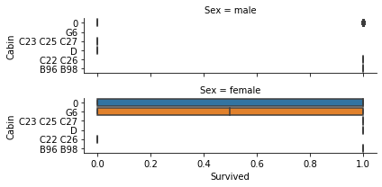


    
     
    


<hr>


<h3 align="center">Cabin - Pclass</h3>


    
      
    relation  3  :  134
    
    
     PassengerId
    Anova faled to reject => no difference 
    
    
     Fare
    Anova faled to reject => no difference 
    
    
     Survived
    Anova faled to reject => no difference 
    
    
     Age
    Anova faled to reject => no difference 
    
    
     SibSp
    Anova faled to reject => no difference 
    
    
     Parch
    Anova faled to reject => no difference 
    
    
     Pclass
    
     
    


<hr>


<h3 align="center">Sex - Pclass</h3>


    
      
    relation  3  :  2
    
    
     PassengerId
    Anova faled to reject => no difference 
    
    
     Fare
    Anova passed


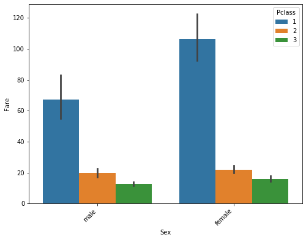


    turkeyHSD
              group2  meandiff  p-adj     lower    upper  reject
    group1                                                      
    female3    male1   51.1073  0.001   37.4329  64.7817    True
    female2    male1   45.2560  0.001   29.0164  61.4956    True
    female1    male1  -38.8997  0.001  -54.1512 -23.6482    True
    male1      male2  -47.4843  0.001  -62.1669 -32.8018    True
    male1      male3  -54.5645  0.001  -66.2614 -42.8676    True
    female1  female2  -84.1557  0.001 -101.2985 -67.0128    True
    female1    male2  -86.3840  0.001 -102.0598 -70.7082    True
    female1  female3  -90.0070  0.001 -104.7427 -75.2712    True
    female1    male3  -93.4642  0.001 -106.3859 -80.5425    True
    
    
     Survived
    Anova passed


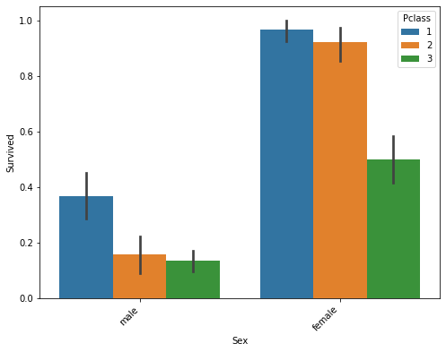


    turkeyHSD
              group2  meandiff  p-adj   lower   upper  reject
    group1                                                   
    male1      male2   -0.2114  0.001 -0.3548 -0.0681    True
    male1      male3   -0.2334  0.001 -0.3476 -0.1192    True
    female3    male2   -0.3426  0.001 -0.4807 -0.2044    True
    female3    male3   -0.3646  0.001 -0.4721 -0.2570    True
    female2  female3   -0.4211  0.001 -0.5749 -0.2672    True
    female1  female3   -0.4681  0.001 -0.6120 -0.3242    True
    female2    male1   -0.5522  0.001 -0.7108 -0.3936    True
    female1    male1   -0.5992  0.001 -0.7482 -0.4503    True
    female2    male2   -0.7636  0.001 -0.9261 -0.6012    True
    female2    male3   -0.7856  0.001 -0.9230 -0.6482    True
    female1    male2   -0.8107  0.001 -0.9638 -0.6576    True
    female1    male3   -0.8326  0.001 -0.9588 -0.7065    True
    
    
     Age
    Anova faled to reject => no difference 
    
    
     SibSp
    Anova faled to reject => no difference 
    
    
     Parch
    Anova passed


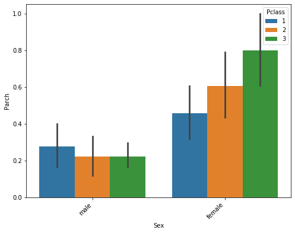


    turkeyHSD
              group2  meandiff   p-adj   lower   upper  reject
    group1                                                    
    female1  female3    0.3412  0.0126  0.0464  0.6360    True
    female2    male1   -0.3266  0.0480 -0.6515 -0.0017    True
    female2    male3   -0.3805  0.0017 -0.6620 -0.0989    True
    female2    male2   -0.3830  0.0134 -0.7159 -0.0502    True
    female3    male1   -0.5199  0.0010 -0.7935 -0.2464    True
    female3    male3   -0.5738  0.0010 -0.7942 -0.3534    True
    female3    male2   -0.5764  0.0010 -0.8594 -0.2934    True
    
    
     Pclass
    ['Fare', 'Survived', 'Parch']


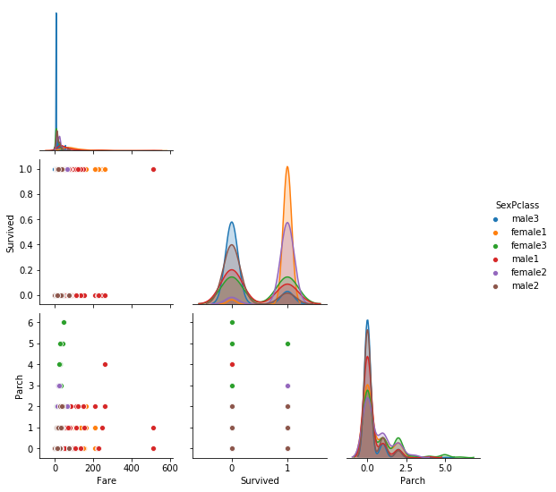


    Sex*Pclass=Fare


    Sex*Pclass=Survived


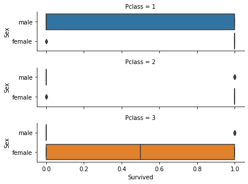


    Sex*Pclass=Parch


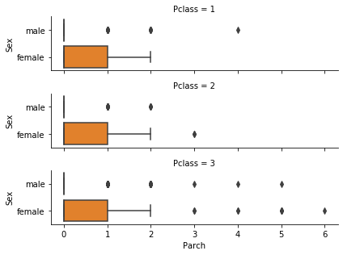

