

<h2 align="center">Shap values</h2>

    
      

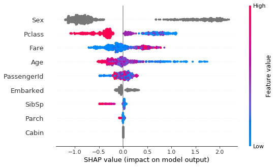

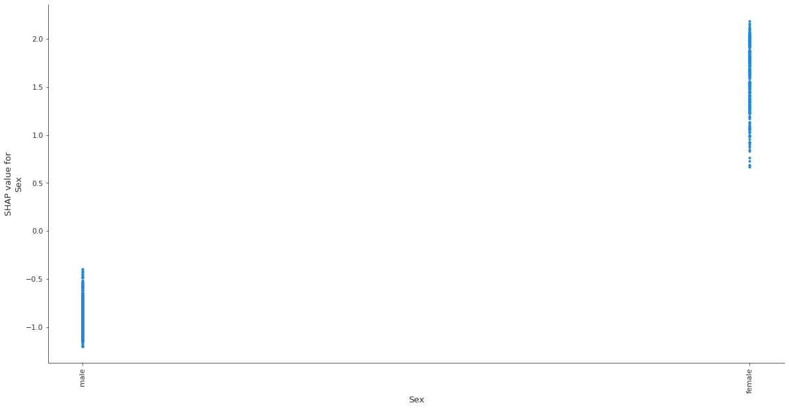

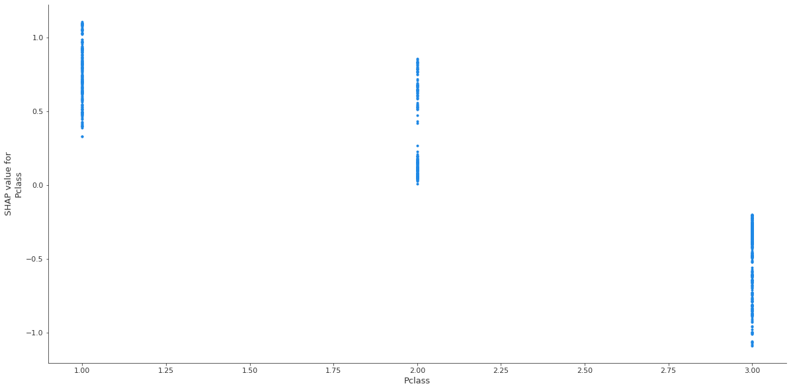

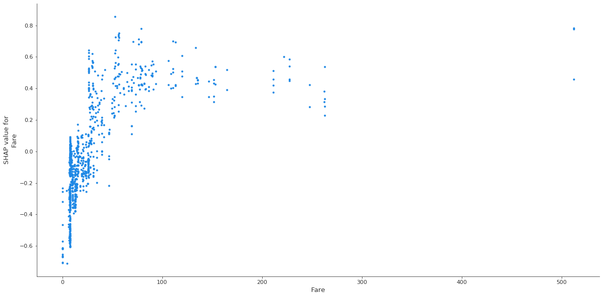

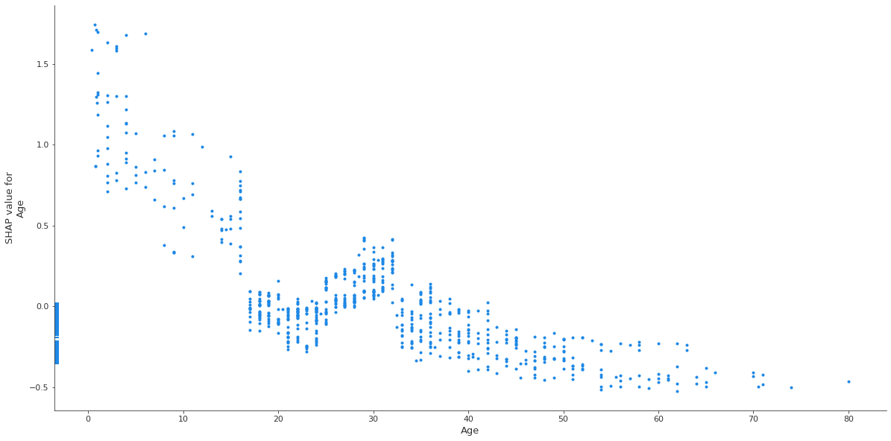

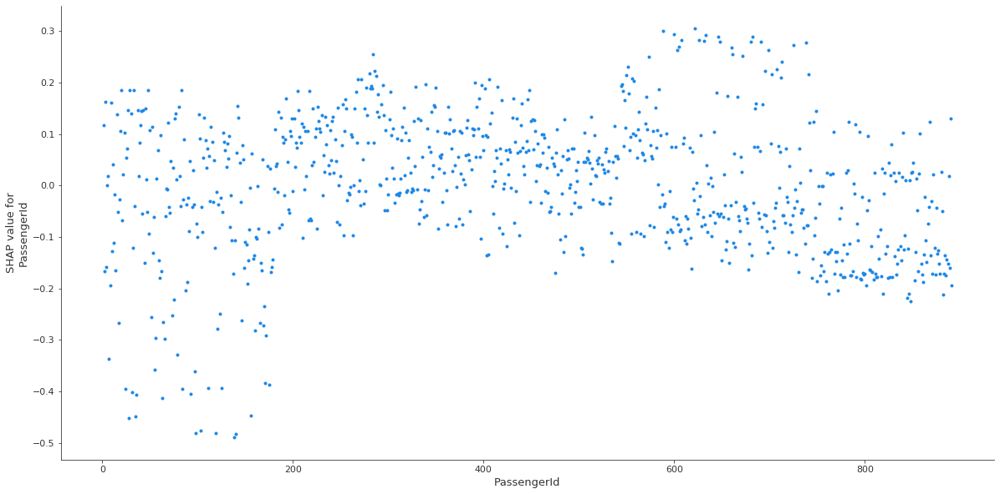

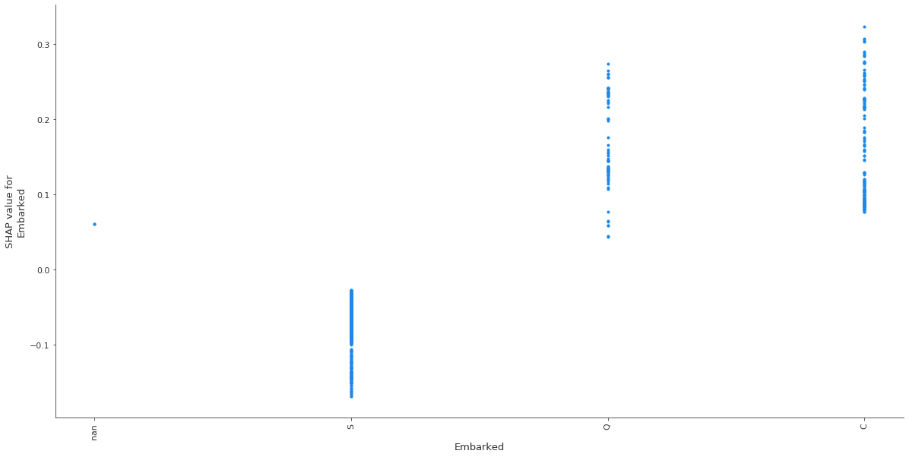

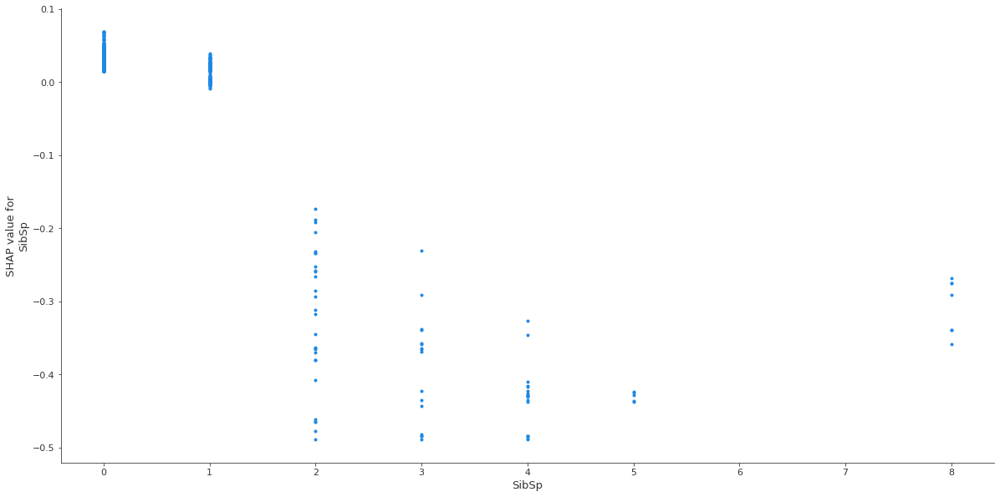

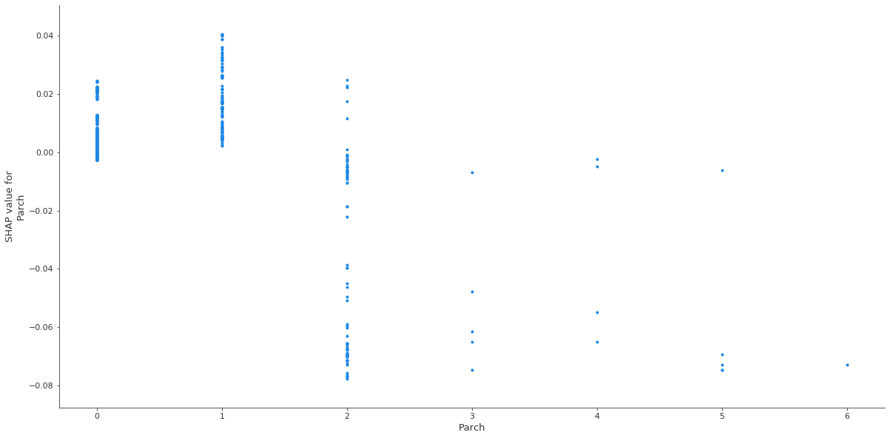

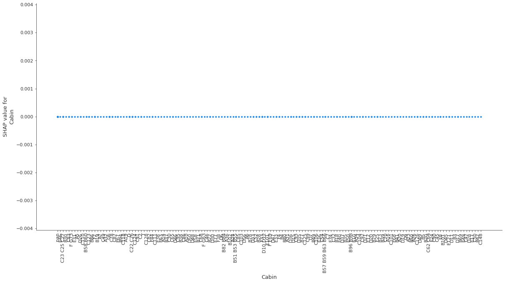

    Index is not datetime - skip
    
     
    

<h2 align="center">Features info</h2>

    
      
    
     

<h3 align="center">Sex</h3>

    
    Frame 1                         Frame 2
    Type :	            Categorical	Type :	            Categorical
    Distinct count :	2	        Distinct count :	2
    Missed %:	        0.000000    Missed %:	        0.000000  

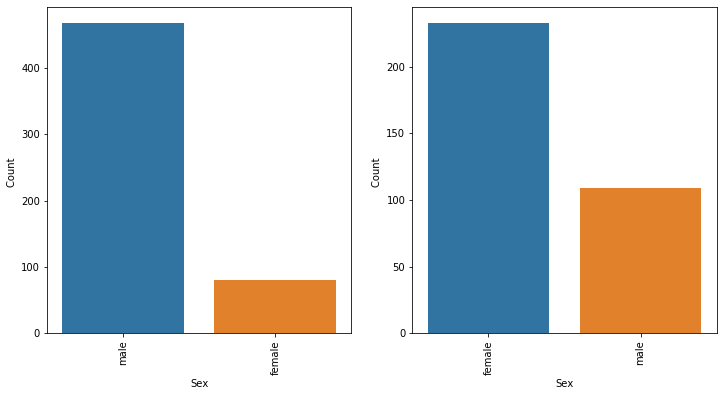

    
     

<h3 align="center">Pclass</h3>

    
     

    Frame 1                         Frame 2
    Type :	            Numeric	    Type :	            Numeric
    Distinct count :	3	        Distinct count :	3
    Missed %:	        0.000000    Missed %:	        0.000000  
    Mean :	            2.531876    Mean :	            1.950292

    
     

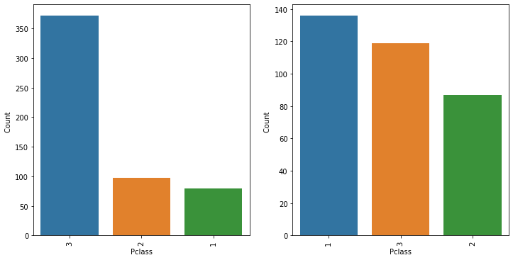

    
     

<h3 align="center">Fare</h3>

    
     

    Frame 1                         Frame 2
    Type :	            Numeric	    Type :	            Numeric
    Distinct count :	177	        Distinct count :	153
    Missed %:	        0.000000    Missed %:	        0.000000  
    Mean :	            22.117887   Mean :	            48.395408

 

    
     

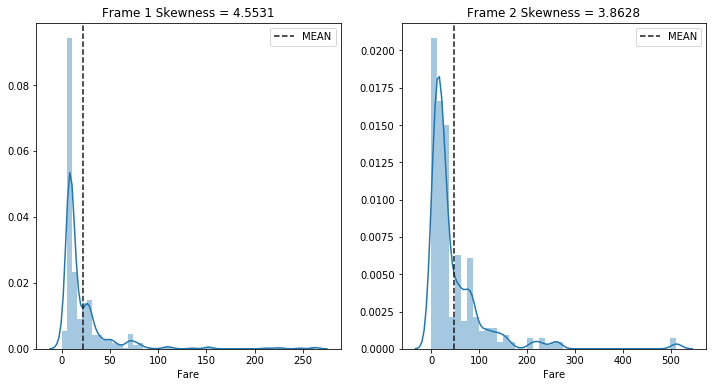

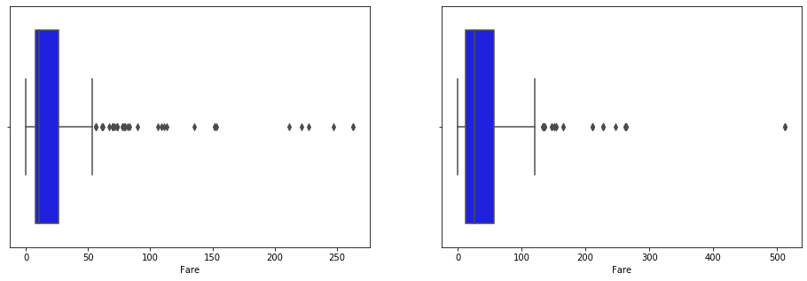

    
     

<h3 align="center">Age</h3>

    
     

    Frame 1                         Frame 2
    Type :	            Numeric	    Type :	            Numeric
    Distinct count :	78	        Distinct count :	66
    Missed %:	        22.768670   Missed %:	        15.204678 
    Mean :	            30.626179   Mean :	            28.343690 

    
     

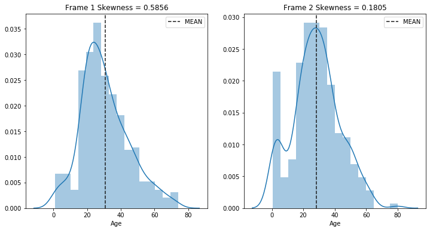

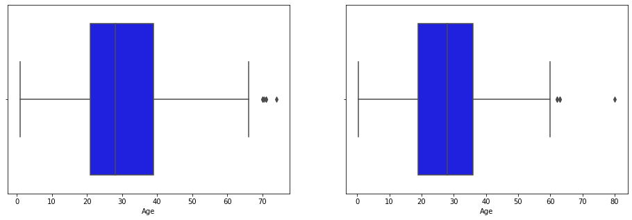

    
     

<h3 align="center">PassengerId</h3>

    
     

    Frame 1                         Frame 2
    Type :	            Numeric	    Type :	            Numeric
    Distinct count :	549	        Distinct count :	342
    Missed %:	        0.000000    Missed %:	        0.000000 
    Mean :	            447.016393  Mean :	            444.368421 

  

    

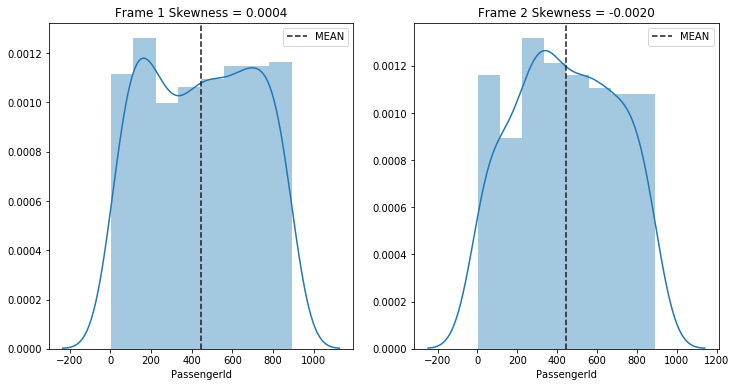

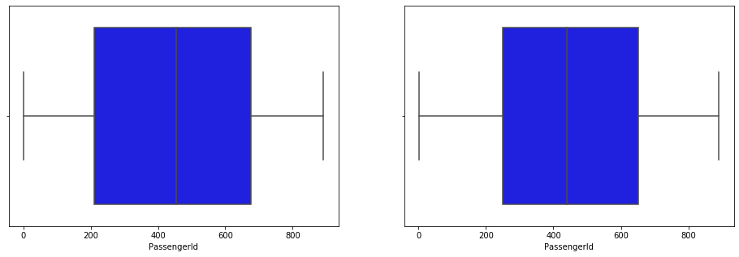

    
     

<h3 align="center">Embarked</h3>

    
     

    Frame 1                         Frame 2
    Type :	            Categorical	Type :	            Categorical
    Distinct count :	3	        Distinct count :	4
    Missed %:	        0.000000    Missed %:	        0.584795 

    
     

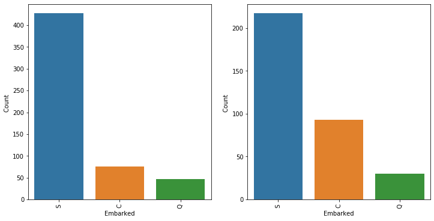

    
     

<h3 align="center">SibSp</h3>

    
     

    Frame 1                         Frame 2
    Type :	            Numeric	    Type :	            Numeric
    Distinct count :	7	        Distinct count :	5
    Missed %:	        0.000000    Missed %:	        0.000000 
    Mean :	            0.553734    Mean :	            0.473684 
   

    
     

    
     

<h3 align="center">Parch</h3>

    
     

    Frame 1                         Frame 2
    Type :	            Numeric	    Type :	            Numeric
    Distinct count :	7	        Distinct count :	5
    Missed %:	        0.000000    Missed %:	        0.000000 
    Mean :	            0.329690    Mean :	            0.464912   

    
     

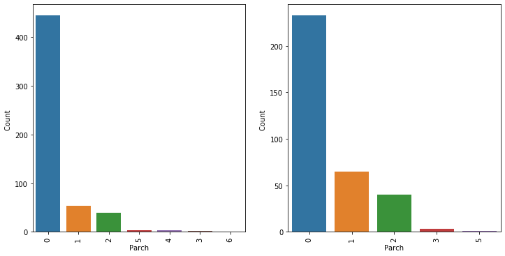

    
     

<h3 align="center">Cabin</h3>

    
     

    Frame 1                          Frame 2
    Type :	            Categorical	Type :	            Categorical
    Distinct count :	63	        Distinct count :	102
    Missed %:	        87.613843   Missed %:	        60.233918    

    
     

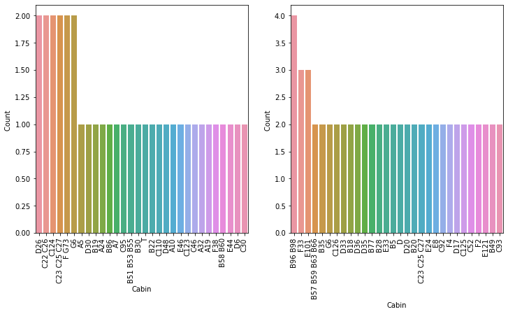

    
     
    

<h2 align="center">Missed values</h2>

    
      

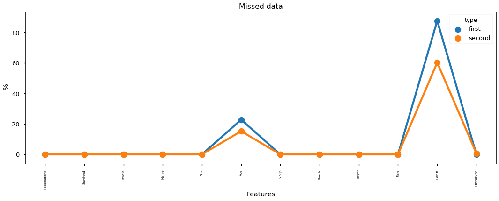

            Frame 1	                    Frame 2
            Missing	% of Total	        Missing	     % of Total
            Cabin  481	 87.600000	    Cabin	    206	60.200000
            Age	125	     22.800000      Age	        52	15.200000
                                        Embarked	2	0.600000       
     
     

<h2 align="center">Pearson correlations</h2>

    
      

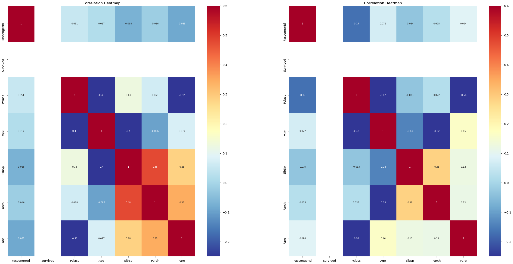

    
     
    

<h2 align="center">Cramers V staticstics</h2>

    
      

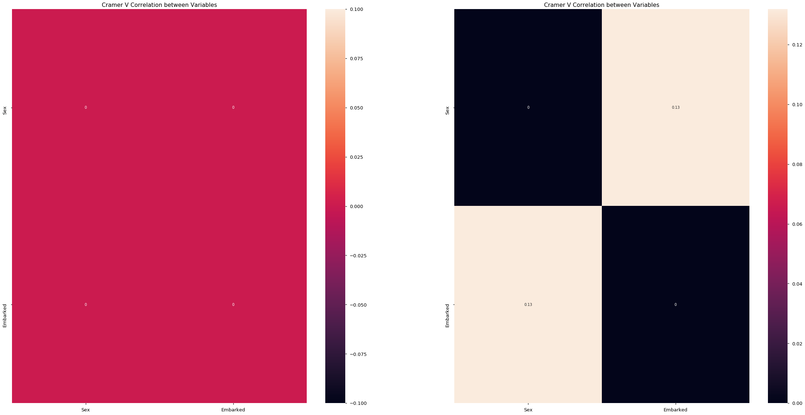

