```python
import oleda
import pandas as pd
df=pd.read_csv('titanic.csv')
oleda.report(df,'Survived')
```
<hr>


<h2 align="center">Missed values</h2>


    
      
              Missing  % of Total
    Cabin         687        77.1
    Age           177        19.9
    Embarked        2         0.2
    
     
    


<hr>


<h2 align="center">Shap values</h2>


    
      


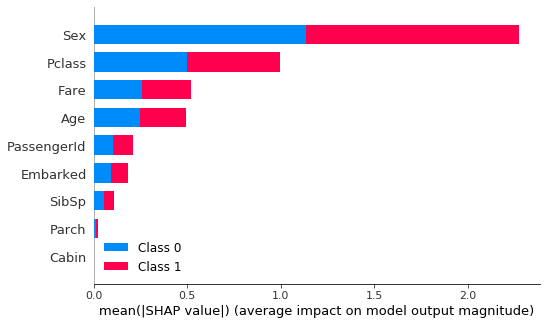


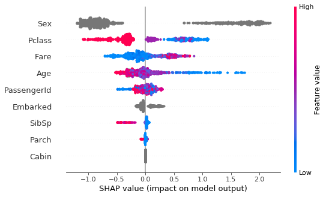


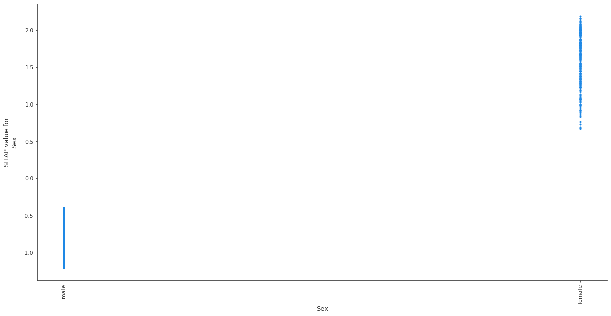


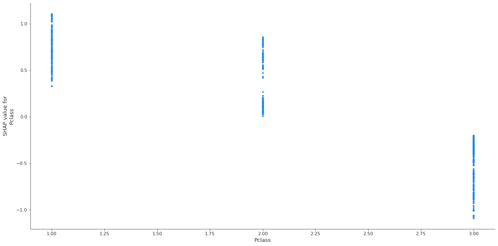


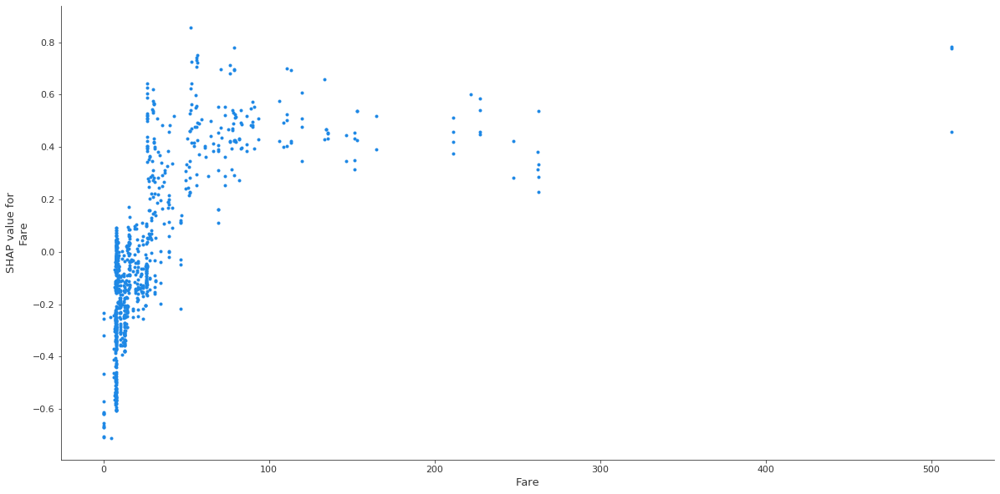


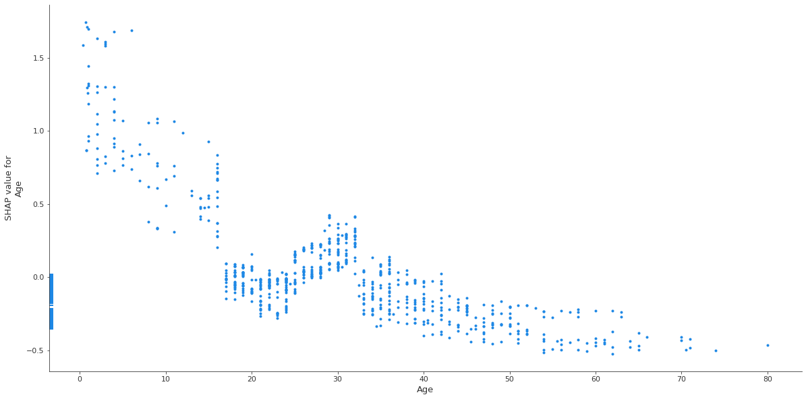


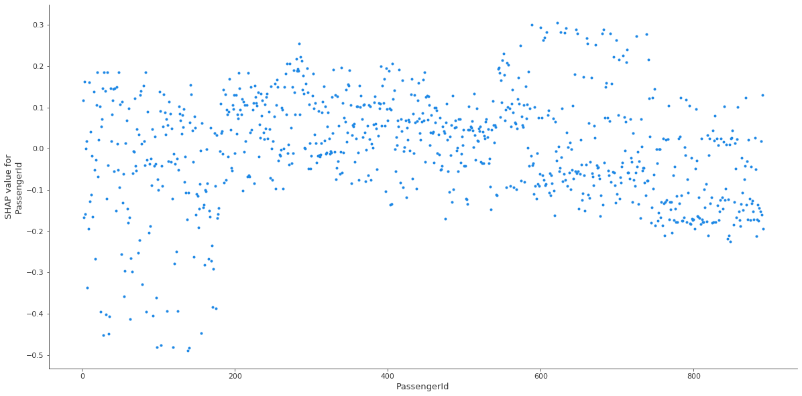


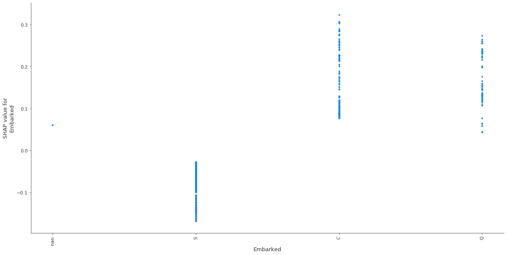


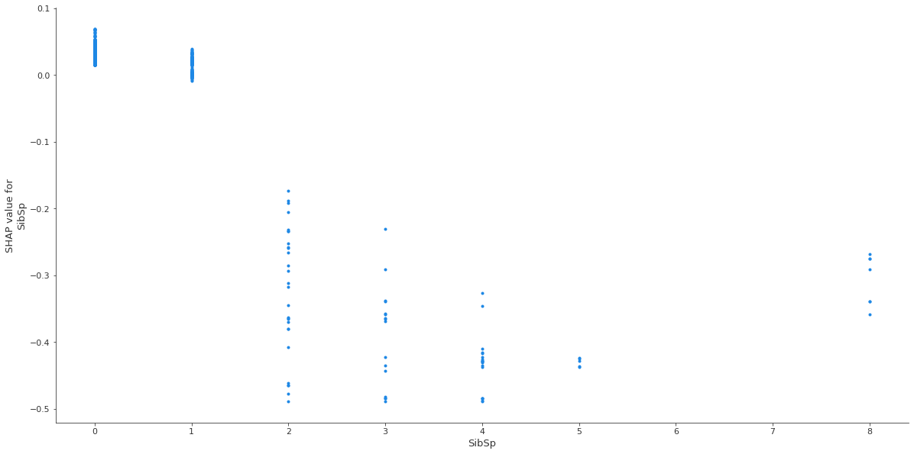


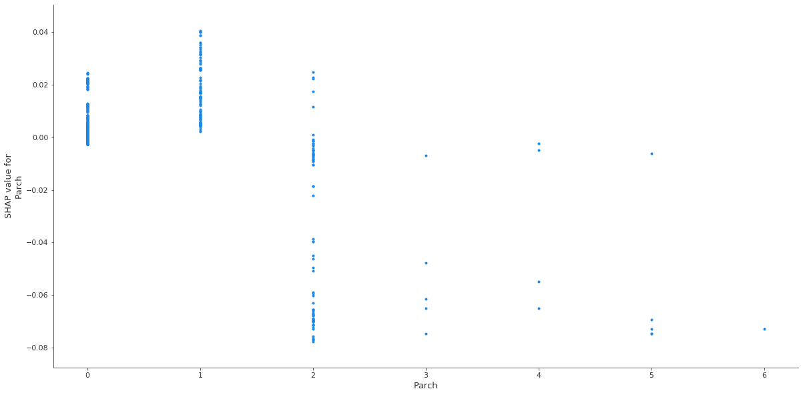


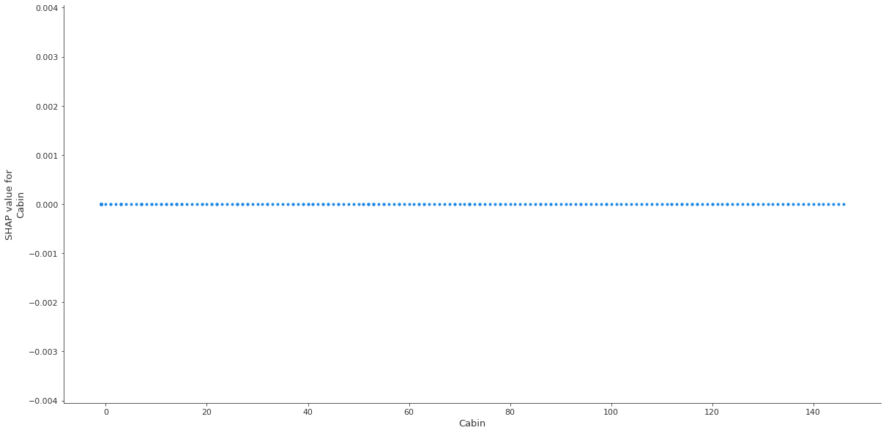


    
     
    


<hr>


<h2 align="center">Features</h2>


    
      
    
     


<hr>


<h3 align="center">Sex</h3>


    
     
                                 
    Type :            Categorical
    Distinct count :            2
    Missed %:                   0
    
     


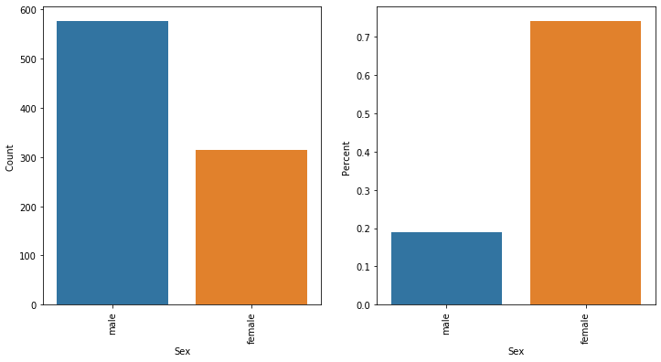


    Anova passed for  ['Survived', 'Pclass', 'Age', 'SibSp', 'Parch', 'Fare']


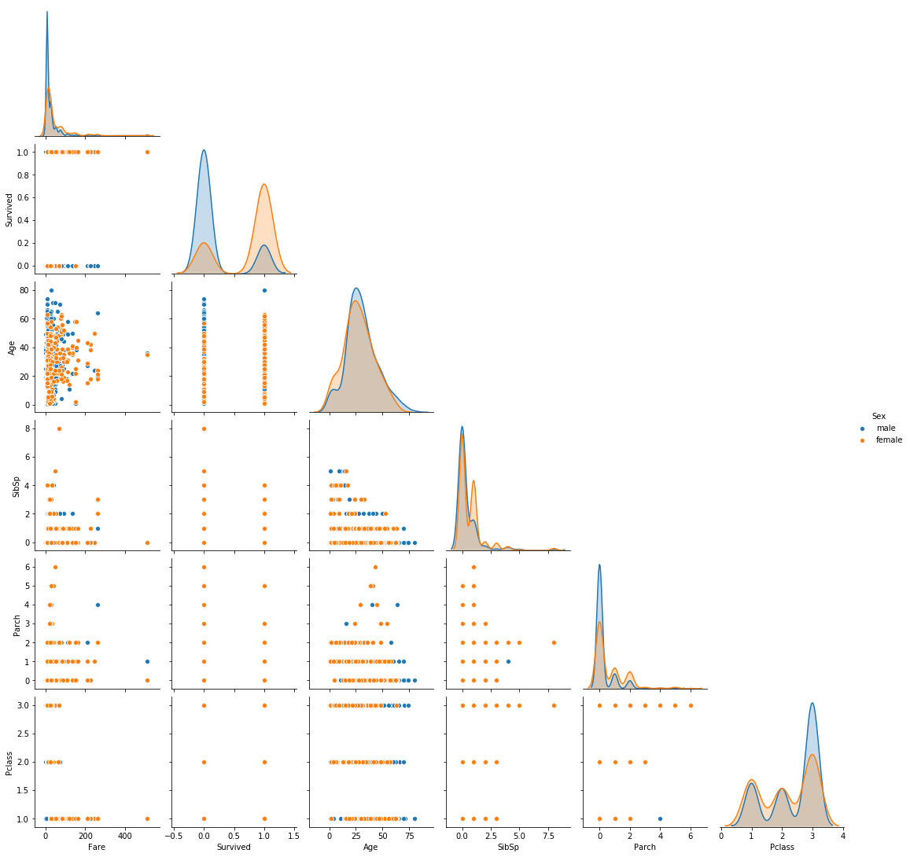


    
     


<hr>


<h3 align="center">Pclass</h3>


    
     
                             
    Type :            Numeric
    Distinct count :        3
    Missed %:               0
    
     


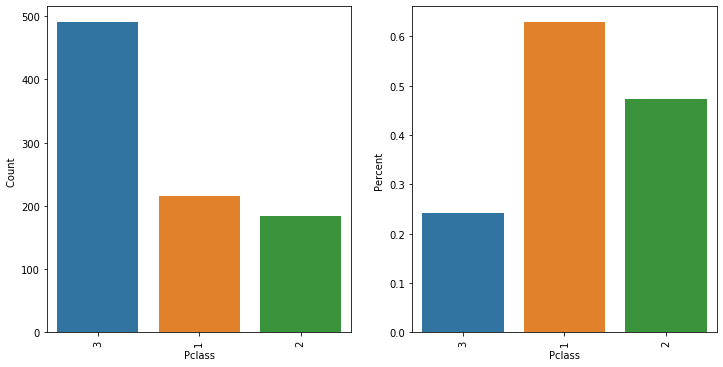


    
     


<hr>


<h3 align="center">Fare</h3>


    
     
                             
    Type :            Numeric
    Distinct count :      248
    Missed %:               0
    
     


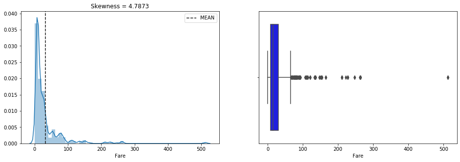


    
     


<hr>


<h3 align="center">Age</h3>


    
     
                             
    Type :            Numeric
    Distinct count :       89
    Missed %:         19.8653
    
     


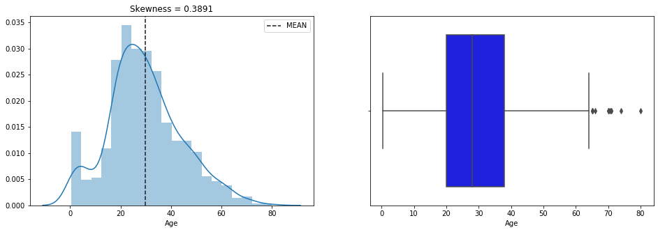


    
     


<hr>


<h3 align="center">PassengerId</h3>


    
     
                             
    Type :            Numeric
    Distinct count :      891
    Missed %:               0
    
     


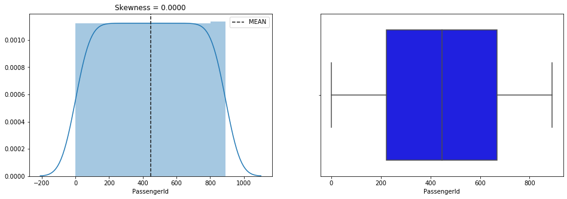


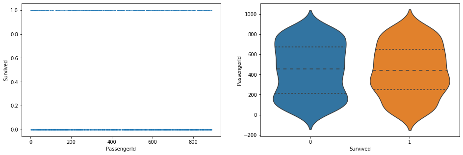


    
     


<hr>


<h3 align="center">Embarked</h3>


    
     
                                 
    Type :            Categorical
    Distinct count :            4
    Missed %:            0.224467
    
     


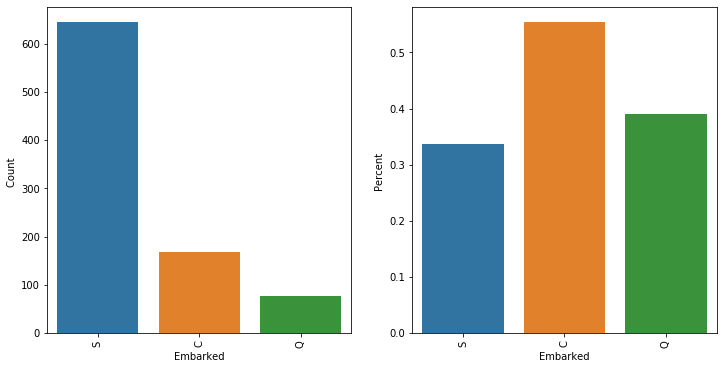


    Anova passed for  ['Survived', 'Pclass', 'Parch', 'Fare']


    
     


<hr>


<h3 align="center">SibSp</h3>


    
     
                             
    Type :            Numeric
    Distinct count :        7
    Missed %:               0
    
     


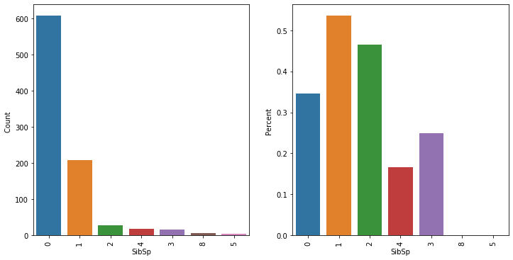


    
     


<hr>


<h3 align="center">Parch</h3>


    
     
                             
    Type :            Numeric
    Distinct count :        7
    Missed %:               0
    
     


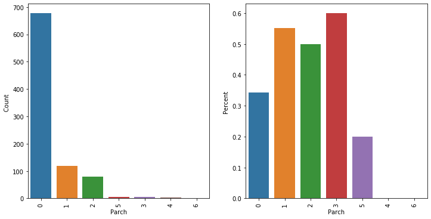


    
     


<hr>


<h3 align="center">Cabin</h3>


    
     
                                 
    Type :            Categorical
    Distinct count :          148
    Missed %:             77.1044
    
     


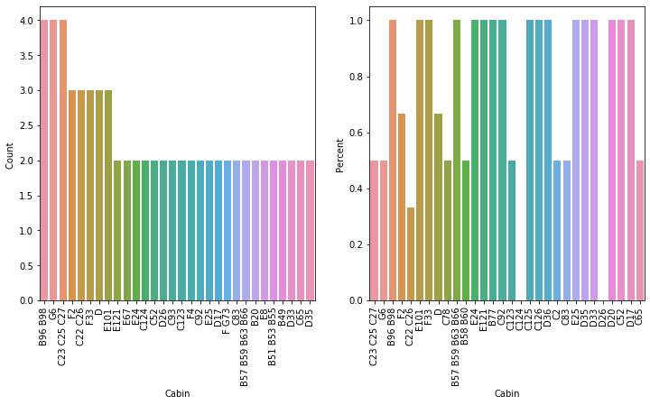


    Anova passed for  ['Pclass', 'SibSp', 'Fare']


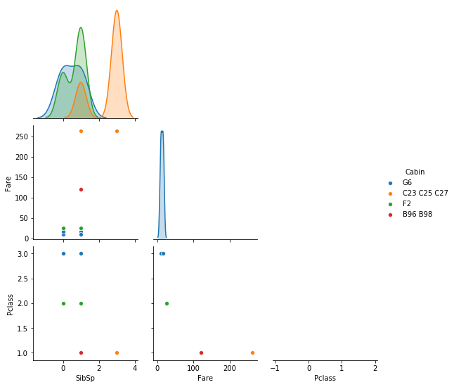


    
     
    


<hr>


<h2 align="center">Pearson correlations</h2>


    
      


    
     
    


<hr>


<h2 align="center">Cramers V staticstics</h2>


    
      


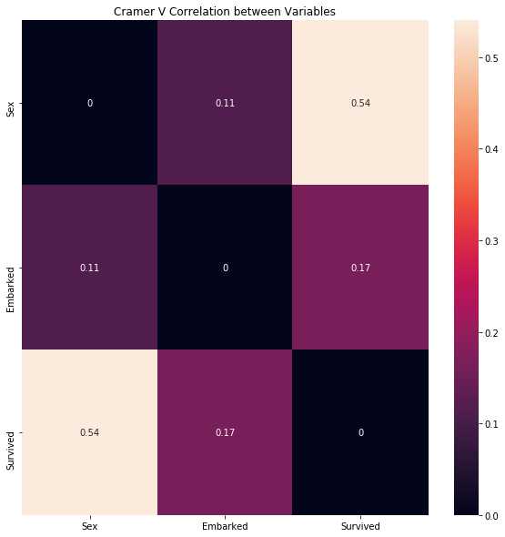


    
     
    


<hr>


<h2 align="center">Top correlated features</h2>


    
      


['Sex', 'Pclass', 'Fare', 'Age', 'PassengerId', 'Embarked', 'SibSp', 'Parch', 'Cabin']


